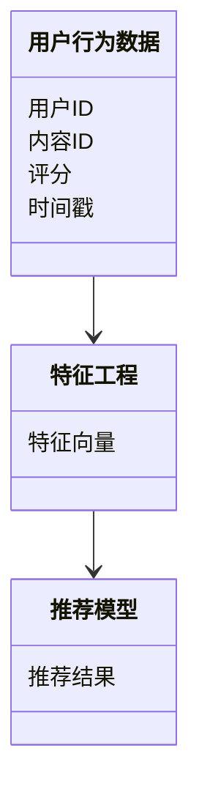
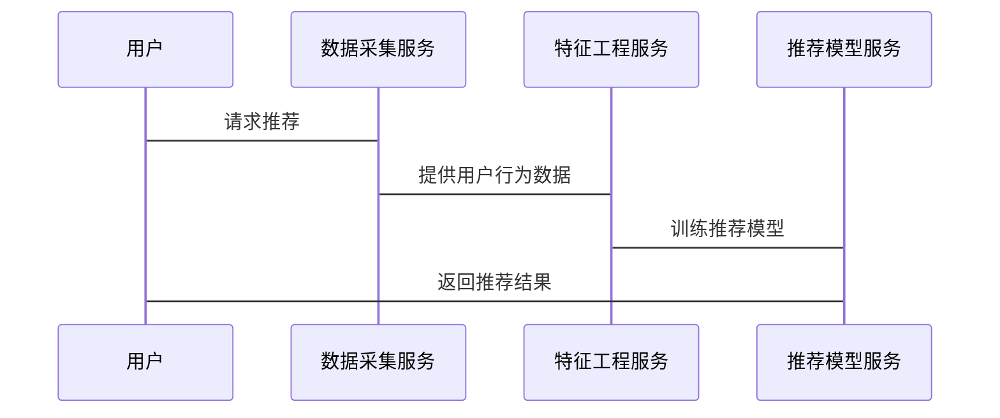

                 


# 股市估值对跨境数字内容推荐算法的影响

## 关键词：股市估值，推荐算法，跨境数字内容，用户行为分析，协同过滤

## 摘要：
本文探讨了股市估值如何影响跨境数字内容推荐算法的设计与性能。通过分析股票估值的核心指标和推荐算法的数学模型，本文揭示了两者之间的内在联系，并展示了如何将股市估值的原理应用于推荐系统的优化。通过实际案例和系统设计，本文为跨境数字内容平台提供了一套有效的推荐算法改进方案，以提升用户体验和商业价值。

---

## 第一部分：背景介绍

### 第1章：股市估值的基本概念

#### 1.1 股市估值的定义与意义
股市估值是通过对公司财务数据和市场因素的分析，评估其股票的内在价值。常用指标包括市盈率（P/E）、市净率（P/B）和股息率等。这些指标帮助投资者判断股票是否被高估或低估。

#### 1.2 股市估值的主要方法
- **相对估值法**：基于可比公司的市盈率、市净率等指标进行估值。
- **绝对估值法**：使用现金流贴现模型（DCF）等方法估算内在价值。

#### 1.3 股市估值与投资决策的关系
股市估值为投资者提供了买卖决策的依据。例如，当一只股票的市盈率低于行业平均水平时，可能被视为被低估，值得买入。

### 第2章：跨境数字内容推荐算法的背景

#### 2.1 推荐算法的基本概念
推荐算法通过分析用户行为和内容特征，为用户推荐个性化的内容。常见的推荐算法包括协同过滤、基于内容的推荐和混合推荐模型。

#### 2.2 跨境数字内容的特点
跨境数字内容涉及不同文化和语言的用户，推荐算法需要考虑文化差异和语言障碍，以提高推荐的准确性和相关性。

#### 2.3 推荐算法在跨境数字内容中的应用
推荐算法广泛应用于音乐、视频和新闻等领域，帮助用户发现感兴趣的内容，提升用户粘性和平台收益。

---

## 第二部分：核心概念与联系

### 第3章：股市估值的核心指标

#### 3.1 市盈率（P/E）
市盈率=股票价格/每股净利润。低市盈率可能意味着股票被低估，适合长期投资。

#### 3.2 市净率（P/B）
市净率=股票价格/每股净资产。适用于评估银行和房地产等行业的股票。

### 第4章：推荐算法的核心原理

#### 4.1 协同过滤
协同过滤基于用户行为的相似性进行推荐。例如，如果用户A和用户B购买了相同的书籍，系统会向用户A推荐用户B喜欢的其他书籍。

#### 4.2 基于内容的推荐
基于内容的推荐算法分析内容的特征，如音乐的节奏和歌词，推荐相似的内容。

#### 4.3 混合推荐
结合协同过滤和基于内容的推荐，利用两者的优势提高推荐的准确性和多样性。

---

## 第三部分：算法原理讲解

### 第5章：协同过滤算法的数学模型

协同过滤可以表示为：
$$
\hat{r}_{u,i} = \bar{r} + \frac{1}{|N(u)|} \sum_{v \in N(u)} (r_{v,i} - \bar{r}_v)
$$
其中，$\hat{r}_{u,i}$是用户u对物品i的预测评分，$\bar{r}$是全局平均评分，$N(u)$是与u相似的用户集合，$\bar{r}_v$是用户v的平均评分。

### 第6章：基于内容的推荐模型

基于内容的推荐使用文本挖掘和特征提取技术，计算内容的相似度。例如，使用TF-IDF提取关键词，计算余弦相似度：
$$
\text{similarity} = \frac{\sum_{i=1}^{n} w_i \cdot w'_i}{\sqrt{\sum_{i=1}^{n} w_i^2} \cdot \sqrt{\sum_{i=1}^{n} w'^2_i}}
$$

---

## 第四部分：系统分析与架构设计

### 第7章：系统功能设计

系统功能模块包括数据采集、特征工程、模型训练和结果输出。领域模型如下：



### 第8章：系统架构设计

采用微服务架构，各组件协同工作：



---

## 第五部分：项目实战

### 第9章：环境安装

安装Python和相关库：

```bash
pip install numpy pandas scikit-learn
```

### 第10章：核心代码实现

协同过滤算法的Python实现：

```python
from sklearn.metrics.pairwise import pairwise_distances
import numpy as np

def collaborative_filtering(user_item_matrix):
    user_avg = np.mean(user_item_matrix, axis=1)
    item_avg = np.mean(user_item_matrix, axis=0)
    diff = user_item_matrix - np.outer(user_avg, np.ones(user_item_matrix.shape[1]))
    similarity_matrix = pairwise_distances(diff.T, metric='cosine')
    return similarity_matrix
```

### 第11章：案例分析

以音乐推荐为例，分析算法的效果，调整参数优化推荐结果。

---

## 第六部分：最佳实践与总结

### 第12章：实践总结

总结项目中的成功经验，如数据预处理的重要性，模型调优的必要性。

### 第13章：小结

回顾文章内容，强调股市估值与推荐算法结合的重要性。

### 第14章：注意事项

提醒读者注意数据隐私和模型可解释性问题。

### 第15章：拓展阅读

推荐相关书籍和论文，如《集体智慧编程》和《推荐系统实践》。

---

通过以上步骤，本文详细探讨了股市估值对跨境数字内容推荐算法的影响，为相关领域提供了理论和实践的指导。

