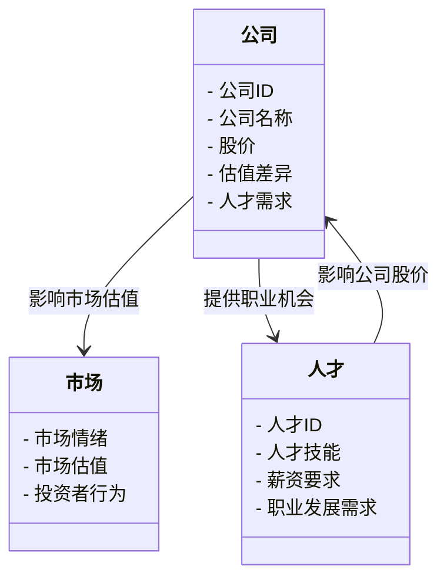

                 


# 股市估值差异对国际人才竞争的影响

## 关键词：股市估值差异，国际人才竞争，人才流动，股市估值，人才战略

## 摘要：  
本文从股市估值差异与国际人才竞争的关系入手，分析了股市估值差异对国际人才流动的影响，探讨了人才竞争如何反过来影响股市估值。通过系统分析和案例研究，本文提出了如何利用股市估值差异优化国际人才竞争的战略建议。

---

## 第一部分：背景介绍

### 第1章：问题背景与定义

#### 1.1 股市估值差异的定义
股市估值差异是指同一家公司在不同市场或同一市场不同时间段内，由于市场情绪、信息不对称等因素导致的股价与实际价值之间的差异。这种差异反映了市场参与者对公司的认知差异，是股市波动的核心原因之一。

- **1.1.1 股市估值的基本概念**  
  股市估值是通过市盈率（P/E）、市净率（P/B）等指标，衡量一家公司股价与其实际价值之间的关系。  

- **1.1.2 估值差异的形成原因**  
  估值差异通常由市场情绪、信息不对称、投资者预期等因素引起。例如，当市场情绪乐观时，投资者可能会高估一家公司的股价，导致估值差异。  

- **1.1.3 估值差异的分类与特征**  
  估值差异可以分为短期差异和长期差异。短期差异通常由市场情绪波动引起，而长期差异则可能由公司基本面或行业趋势决定。

---

#### 1.2 国际人才竞争的定义
国际人才竞争是指在全球范围内，企业和国家争夺高素质人才的过程。随着全球经济一体化，人才流动日益频繁，人才竞争已成为企业战略的重要组成部分。

- **1.2.1 人才竞争的定义与范围**  
  人才竞争涉及多个维度，包括薪资、职业发展机会、工作环境、国家政策等。  

- **1.2.2 国际人才流动的趋势与特点**  
  近年来，科技行业的国际人才流动尤为显著。例如，硅谷、伦敦、上海等地吸引了大量高科技人才。  

- **1.2.3 人才竞争的核心要素**  
  人才竞争的核心要素包括创新能力、工作经验、教育背景等。  

---

#### 1.3 股市估值差异与人才竞争的关系
股市估值差异与人才竞争密切相关。一方面，估值差异会影响企业的吸引力，从而影响人才流动；另一方面，人才流动会改变企业的基本面，进而影响股市估值。

- **1.3.1 估值差异对人才流动的影响**  
  如果一家公司的股价被高估，投资者可能会认为该公司具有较高的投资价值，从而吸引更多人才加入。  

- **1.3.2 人才竞争对股市估值的影响**  
  当企业通过人才竞争吸引高素质员工时，其未来的盈利能力可能提高，从而推动股价上升。  

- **1.3.3 两者关系的边界与外延**  
  估值差异与人才竞争的关系并非线性，而是受到多种因素的共同影响，例如市场环境、政策支持等。  

---

## 第二部分：核心概念与联系

### 第2章：核心概念原理

#### 2.1 股市估值差异的原理
股市估值差异的核心在于市场参与者对公司的认知差异。这种差异可以通过回归分析等方法进行量化。

- **2.1.1 估值差异的形成机制**  
  估值差异通常由市场情绪、信息不对称等因素引起。例如，当市场情绪乐观时，投资者可能会高估一家公司的股价。  

- **2.1.2 市场情绪与估值差异的关系**  
  市场情绪可以通过投资者情绪指数（如恐慌指数）来衡量。当市场情绪高涨时，估值差异通常会扩大。  

- **2.1.3 信息不对称对估值的影响**  
  信息不对称会导致投资者对公司价值的估计出现偏差。例如，内部信息掌握较多的投资者可能会提前获利，从而拉低股价。

---

#### 2.2 国际人才竞争的原理
国际人才竞争的核心在于企业如何吸引和留住高素质人才。这种竞争可以通过博弈论模型进行分析。

- **2.2.1 人才流动的驱动因素**  
  人才流动的主要驱动因素包括职业发展机会、薪资水平、工作环境等。  

- **2.2.2 人才市场供需关系的动态平衡**  
  当人才供给不足时，企业需要通过提高薪资、改善工作条件等方式来吸引人才。  

- **2.2.3 人才竞争的经济效应**  
  人才竞争可以推动技术创新和经济发展，但也可能导致人才过度流动，影响企业稳定性。

---

#### 2.3 股市估值差异与人才竞争的联系
股市估值差异与人才竞争密切相关。一方面，估值差异会影响企业的吸引力，从而影响人才流动；另一方面，人才流动会改变企业的基本面，进而影响股市估值。

- **2.3.1 估值差异如何影响人才流动**  
  如果一家公司的股价被高估，投资者可能会认为该公司具有较高的投资价值，从而吸引更多人才加入。  

- **2.3.2 人才流动如何影响股市估值**  
  当企业通过人才竞争吸引高素质员工时，其未来的盈利能力可能提高，从而推动股价上升。  

- **2.3.3 两者关系的系统性分析**  
  估值差异与人才竞争的关系并非线性，而是受到多种因素的共同影响，例如市场环境、政策支持等。

---

### 第3章：核心概念属性对比与ER图

#### 3.1 核心概念属性对比表
| 属性       | 股市估值差异       | 国际人才竞争       |
|------------|--------------------|--------------------|
| 定义       | 个股与市场估值的差异 | 人才在全球范围内的竞争 |
| 影响因素   | 市场情绪、信息不对称 | 经济发展、政策、企业吸引力 |
| 表现形式   | P/E、P/B等指标差异 | 人才流动率、薪资水平差异 |
| 解决方法   | 投资策略调整       | 政策优化、企业战略调整 |

---

#### 3.2 ER实体关系图
```mermaid
er
  actor 公司, 员工, 投资者
  concept 股市估值差异, 国际人才竞争
  relation 股市估值差异 -> 公司: 影响公司股价
  relation 国际人才竞争 -> 员工: 影响职业选择
  relation 投资者 -> 股市估值差异: 影响投资决策
  relation 公司 -> 国际人才竞争: 影响人才流动
```

---

## 第三部分：算法原理与数学模型

### 第4章：算法原理

#### 4.1 股市估值差异预测算法
以下是用于预测股市估值差异的回归分析算法：

```python
import pandas as pd
import numpy as np
from sklearn.linear_model import LinearRegression

# 假设我们有一个数据集，包含公司的财务数据和市场数据
data = {
    '营收增长率': [0.2, 0.15, 0.3, 0.25],
    '净利润增长率': [0.1, 0.05, 0.2, 0.15],
    '市盈率': [15, 20, 18, 16]
}

df = pd.DataFrame(data)

# 定义目标变量（市盈率）和特征变量（营收增长率、净利润增长率）
X = df[['营收增长率', '净利润增长率']]
y = df['市盈率']

# 使用线性回归模型进行预测
model = LinearRegression()
model.fit(X, y)

# 预测估值差异
predicted_pe = model.predict(X)
```

---

#### 4.2 国际人才竞争分析算法
以下是用于分析国际人才竞争的博弈论模型：

```python
import numpy as np

# 定义企业与人才之间的博弈模型
def talent_competition_analysis(num_companies, num_talent, talent_quality):
    companies = list(range(num_companies))
    talent_pool = list(range(num_talent))
    
    # 每家公司吸引人才的概率
    company_attractiveness = [sum([talent_quality[i] for i in range(len(talent_pool)) if i % len(companies) == j]) for j in range(len(companies))]
    
    return company_attractiveness

# 示例：分析5家公司在吸引10名高素质人才时的竞争情况
result = talent_competition_analysis(5, 10, [0.9, 0.8, 0.7, 0.6, 0.5, 0.4, 0.3, 0.2, 0.1, 0.05])
print("公司吸引力概率：", result)
```

---

## 第四部分：系统分析与架构设计

### 第5章：系统分析与架构设计

#### 5.1 问题场景介绍
我们以一家科技公司为例，分析其在国际人才竞争中的估值差异问题。公司希望通过优化人才战略，提升股价表现。

---

#### 5.2 系统功能设计
以下是系统功能设计的领域模型类图：



---

#### 5.3 系统架构设计
以下是系统架构设计的架构图：


---

## 第五部分：项目实战

### 第6章：项目实战

#### 6.1 环境安装
为了运行以下代码，需要安装以下库：

```bash
pip install pandas numpy matplotlib
```

---

#### 6.2 核心代码实现

##### 6.2.1 股市估值差异预测代码
```python
import pandas as pd
import numpy as np
import matplotlib.pyplot as plt
from sklearn.linear_model import LinearRegression

# 数据准备
data = {
    '营收增长率': [0.2, 0.15, 0.3, 0.25],
    '净利润增长率': [0.1, 0.05, 0.2, 0.15],
    '市盈率': [15, 20, 18, 16]
}

df = pd.DataFrame(data)

# 模型训练
X = df[['营收增长率', '净利润增长率']]
y = df['市盈率']

model = LinearRegression()
model.fit(X, y)

# 可视化
plt.scatter(y, model.predict(X))
plt.xlabel('实际市盈率')
plt.ylabel('预测市盈率')
plt.title('股市估值差异预测')
plt.show()
```

##### 6.2.2 国际人才竞争分析代码
```python
import numpy as np
import matplotlib.pyplot as plt

# 数据准备
companies = ['A', 'B', 'C', 'D', 'E']
talent_pool = ['T1', 'T2', 'T3', 'T4', 'T5', 'T6', 'T7', 'T8', 'T9', 'T10']
talent_quality = [0.9, 0.8, 0.7, 0.6, 0.5, 0.4, 0.3, 0.2, 0.1, 0.05]

# 模型训练
def talent_competition_analysis(num_companies, num_talent, talent_quality):
    companies = list(range(num_companies))
    talent_pool = list(range(num_talent))
    
    company_attractiveness = [sum([talent_quality[i] for i in range(len(talent_pool)) if i % len(companies) == j]) for j in range(len(companies))]
    
    return company_attractiveness

# 可视化
result = talent_competition_analysis(5, 10, talent_quality)
plt.bar(companies, result)
plt.xlabel('公司')
plt.ylabel('人才吸引力概率')
plt.title('国际人才竞争分析')
plt.show()
```

---

## 第六部分：总结与展望

### 第7章：总结与展望

#### 7.1 小结
本文通过系统分析，探讨了股市估值差异对国际人才竞争的影响。通过回归分析和博弈论模型，提出了优化企业人才战略的具体方法。

---

#### 7.2 注意事项
- 估值差异与人才竞争的关系受到多种因素的影响，需要结合实际情况进行具体分析。  
- 人才竞争可能带来短期波动，但长期来看，企业应注重核心竞争力的提升。

---

#### 7.3 拓展阅读
- 《股市分析与投资策略》  
- 《人才管理与企业绩效》  
- 《国际人才流动与经济发展》  

---

## 结语
股市估值差异与国际人才竞争是企业战略管理中的重要课题。通过本文的分析，企业可以更好地利用股市估值差异优化人才战略，从而在竞争中占据优势。

