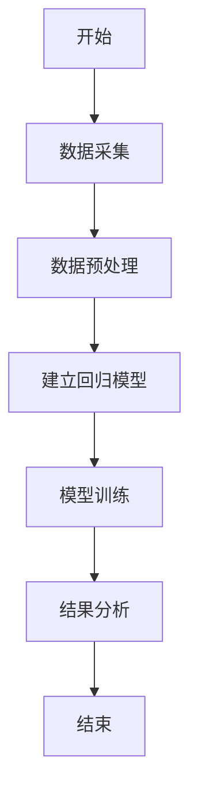
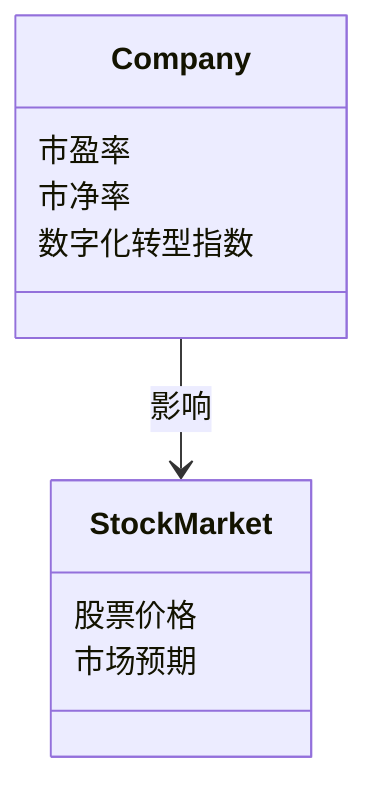
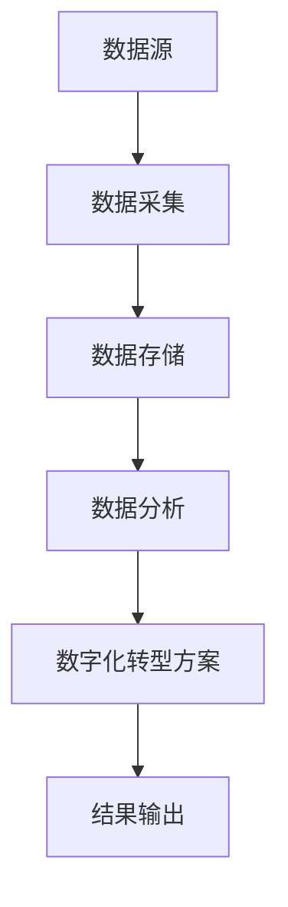

                 


# 股市估值差异对国际文化产业数字化转型的影响

---

## 关键词：
股市估值差异，文化产业，数字化转型，技术影响，文化产业转型

---

## 摘要：
本文探讨了股市估值差异对国际文化产业数字化转型的影响。通过分析股市估值差异的核心概念与文化产业数字化转型之间的关系，结合算法原理和系统架构设计，本文揭示了如何利用股市估值差异推动文化产业的数字化转型，并提供了实际案例和最佳实践。

---

## 第一部分：背景介绍

### 第1章：股市估值差异与文化产业数字化转型的背景

#### 1.1 问题背景
- **1.1.1 股市估值差异的定义与影响**
  股市估值差异指的是同一行业或市场中，不同公司股票的估值存在差异。这种差异通常由市场情绪、公司基本面、行业趋势等多种因素引起。股市估值差异对投资者决策、市场资源配置具有重要影响。

- **1.1.2 文化产业数字化转型的必要性**
  随着信息技术的快速发展，文化产业的传统运营模式面临巨大挑战。数字化转型不仅是文化产业适应市场变化的必然选择，也是提升竞争力的关键路径。

#### 1.2 问题描述
- **1.2.1 股市估值差异的具体表现**
  股市估值差异主要体现在市盈率、市净率等估值指标的差异上。这种差异反映了市场对不同公司未来前景的预期。

- **1.2.2 文化产业数字化转型的核心问题**
  数字化转型的核心问题在于如何利用数字技术提升文化产业的生产效率、用户体验和市场竞争力。

#### 1.3 问题解决
- **1.3.1 如何通过股市估值差异推动文化产业转型**
  通过分析股市估值差异，可以识别具有潜力的文化企业，为其提供资金支持和市场资源，从而推动数字化转型。

- **1.3.2 数字化转型对文化产业的潜在影响**
  数字化转型将改变文化产业的生产模式、商业模式和用户互动方式，提升其在全球市场中的竞争力。

#### 1.4 边界与外延
- **1.4.1 股市估值差异的边界条件**
  股市估值差异分析应考虑市场环境、行业特点和公司基本面等因素。

- **1.4.2 数字化转型的外延范围**
  数字化转型不仅包括技术应用，还涉及组织结构、管理模式的变革。

#### 1.5 概念结构与核心要素
- **1.5.1 核心概念的构成**
  股市估值差异和数字化转型是本文的核心概念。

- **1.5.2 核心要素的详细分析**
  股市估值差异的核心要素包括市盈率、市净率等指标，数字化转型的核心要素包括技术创新、组织变革等。

---

## 第二部分：核心概念与联系

### 第2章：股市估值差异与文化产业数字化转型的核心概念

#### 2.1 核心概念原理
- **2.1.1 股市估值差异的经济学原理**
  股市估值差异是市场参与者对信息解读和风险偏好差异的结果。投资者对同一公司的不同估值反映了市场的不确定性和信息不对称。

- **2.1.2 数字化转型的技术原理**
  数字化转型依赖于大数据、人工智能、区块链等技术的广泛应用，这些技术能够提升文化产业的效率和创新。

#### 2.2 概念属性特征对比
- **2.2.1 对比表格展示**

| 股市估值差异 | 文化产业数字化转型 |
|--------------|---------------------|
| 市盈率       | 技术应用           |
| 市净率       | 数字化工具         |
| 市场预期     | 信息技术           |

- **2.2.2 关键属性的详细说明**
  - 股市估值差异的关键属性：市盈率、市净率、市场预期。
  - 数字化转型的关键属性：技术创新、数字化工具、信息技术。

#### 2.3 ER实体关系图
- **2.3.1 实体关系图展示**

```mermaid
erd
  company --有--> stock_price
  stock_price --属于--> market_segment
  market_segment --涉及--> digital_transformation
```

- **2.3.2 实体间关系的详细分析**
  - 公司与股票价格的关系：公司的基本面影响股票价格。
  - 股票价格与市场细分的关系：不同市场的股票价格差异反映了市场细分。
  - 市场细分与数字化转型的关系：数字化转型影响市场细分中的股票估值。

---

## 第三部分：算法原理讲解

### 第3章：算法原理与数学模型

#### 3.1 算法原理
- **3.1.1 mermaid流程图展示**



- **3.1.2 Python代码实现**

```python
import pandas as pd
from sklearn.linear_model import LinearRegression

# 数据预处理
data = pd.read_csv('cultural_sector.csv')
X = data[['市盈率', '市净率']]
y = data['数字化转型指数']

# 建立回归模型
model = LinearRegression()
model.fit(X, y)

# 模型预测
predictions = model.predict(X)
```

#### 3.2 数学模型与公式
- **3.2.1 回归分析模型**
  $$ y = \beta_0 + \beta_1x_1 + \beta_2x_2 + \epsilon $$
  其中，$y$ 是数字化转型指数，$x_1$ 和 $x_2$ 是市盈率和市净率，$\beta_0$ 是截距，$\beta_1$ 和 $\beta_2$ 是回归系数，$\epsilon$ 是误差项。

---

## 第四部分：系统分析与架构设计

### 第4章：系统分析与架构设计

#### 4.1 问题场景介绍
- **4.1.1 问题背景**
  文化产业在数字化转型过程中面临资金不足和技术支持不足的问题。

- **4.1.2 项目目标**
  通过分析股市估值差异，为文化企业提供资金支持，推动数字化转型。

#### 4.2 系统功能设计
- **4.2.1 领域模型mermaid类图**



- **4.2.2 功能模块的详细说明**
  - 数据采集模块：采集文化产业的股票数据。
  - 数据分析模块：分析股市估值差异。
  - 数字化转型模块：制定数字化转型方案。

#### 4.3 系统架构设计
- **4.3.1 系统架构图展示**



- **4.3.2 架构设计的详细分析**
  - 数据源：包括股票数据和文化产业数据。
  - 数据采集：从多个来源采集数据。
  - 数据存储：存储数据以便后续分析。
  - 数据分析：使用回归分析模型进行分析。
  - 数字化转型方案：根据分析结果制定转型方案。
  - 结果输出：输出分析结果和转型建议。

---

## 第五部分：项目实战

### 第5章：项目实战与代码实现

#### 5.1 环境安装
- **5.1.1 数据分析工具安装**
  - 安装Python、Pandas、Scikit-learn等工具。

- **5.1.2 开发环境配置**
  - 配置Jupyter Notebook或IDE。

#### 5.2 核心代码实现
- **5.2.1 数据处理代码**

```python
import pandas as pd

# 数据加载
data = pd.read_csv('cultural_sector.csv')

# 数据清洗
data.dropna(inplace=True)
data = data[~data['市盈率'].isinf()]
```

- **5.2.2 模型训练代码**

```python
from sklearn.linear_model import LinearRegression

# 建立回归模型
model = LinearRegression()
model.fit(X_train, y_train)

# 模型评估
print('R-squared:', model.score(X_test, y_test))
```

#### 5.3 代码解读与应用分析
- **5.3.1 代码功能分析**
  - 数据处理代码用于清洗数据，去除缺失值和异常值。
  - 模型训练代码用于建立回归模型，评估模型的拟合优度。

- **5.3.2 应用场景举例**
  - 使用模型预测文化产业的数字化转型指数，为投资者提供决策支持。

---

## 第六部分：总结与展望

### 第6章：总结与最佳实践

#### 6.1 小结
- **6.1.1 核心内容回顾**
  本文分析了股市估值差异对文化产业数字化转型的影响，提出了基于回归分析的解决方案，并提供了实际案例和代码实现。

- **6.1.2 主要结论**
  股市估值差异是推动文化产业数字化转型的重要因素，利用数据分析技术可以有效识别潜力企业，推动数字化转型。

---

## 总结：
通过系统的分析和实际案例，本文揭示了股市估值差异对文化产业数字化转型的深远影响，并为未来研究提供了方向和建议。

