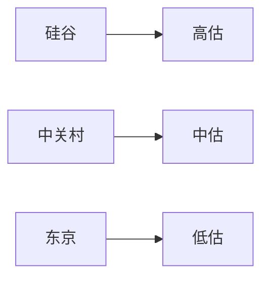

                 

### # 股市估值差异对国际高新技术产业集群的影响

#### 关键词：股市估值差异、国际高新技术产业集群、影响机制、案例分析、政策建议

#### 摘要：  
本文探讨股市估值差异对国际高新技术产业集群的影响，分析其如何通过资金流动、技术创新和区域竞争塑造产业集群的格局。通过案例分析和实证研究，揭示估值差异对产业集群发展的驱动与制约作用，并提出相应的应对策略与政策建议。

---

### 第4章：股市估值差异对产业集群的影响机制

#### 4.1 估值差异与产业集群的关系

##### 4.1.1 估值差异的传导路径
- **资金流动**：高估的市场吸引更多资金流入，推动技术创新和产业扩张。
- **企业行为**：企业通过融资加速研发和扩张，反过来影响市场估值。
- **区域竞争**：估值差异导致资源向高估地区集中，加剧区域间竞争。

##### 4.1.2 产业集群对估值差异的反馈作用
- **技术创新**：产业集群的技术优势可能被市场高估，导致泡沫。
- **区域优势**：区域政策支持可能影响市场对企业的估值。

##### 4.1.3 不同区域的估值差异对比
- 使用Mermaid图展示不同区域的估值差异对比：

#### 4.2 估值差异对产业集群发展的具体影响

##### 4.2.1 资金流动与产业布局
- **资金集中效应**：高估地区吸引大量资金，推动产业集群扩张。
- **资源分配失衡**：低估地区因资金外流，影响产业集群发展。

##### 4.2.2 企业融资能力与技术创新
- **融资能力提升**：高估地区的高融资能力支持技术创新。
- **技术创新与估值的关系**：技术创新可能被高估，导致泡沫。

##### 4.2.3 产业集群的竞争力变化
- **竞争优势强化**：高估地区的产业集群因资金和技术优势更具竞争力。
- **竞争优势削弱**：低估地区因资金不足，竞争力下降。

---

### 第5章：案例分析与实证研究

#### 5.1 典型高新技术产业集群的案例分析

##### 5.1.1 硅谷产业集群
- **背景**：硅谷是全球科技创新中心，聚集了苹果、谷歌等龙头企业。
- **估值差异**：高估现象显著，科技股估值远高于传统产业。
- **分析**：高估推动了技术创新和企业扩张，但也可能导致泡沫。

##### 5.1.2 中关村产业集群
- **背景**：中关村是中国高科技产业中心，以中关村科技园区为核心。
- **估值差异**：相对硅谷，中关村的估值较低，但增速快。
- **分析**：低估可能限制了部分企业的融资能力，但政策支持和技术优势弥补了一部分影响。

##### 5.1.3 东京产业集群
- **背景**：东京的高新技术产业集中在电子信息领域，如索尼、东芝。
- **估值差异**：估值相对稳定，但增速较慢。
- **分析**：稳定估值提供了持续的融资支持，但技术创新速度可能受限。

#### 5.2 实证分析与数据支持

##### 5.2.1 数据来源与研究方法
- 数据来源：选取2010-2020年全球主要高新技术企业的股价数据。
- 研究方法：使用回归分析评估估值差异与产业集群发展的相关性。

##### 5.2.2 估值差异与产业集群发展的相关性分析
- **数学模型**：建立回归模型，分析估值差异对产业集群的影响。

$$
Y = \beta_0 + \beta_1 X + \epsilon
$$

其中：
- $Y$：产业集群发展指数
- $X$：股市估值差异
- $\beta_1$：回归系数
- $\epsilon$：误差项

##### 5.2.3 案例分析的启示
- **硅谷经验**：高估推动了技术创新，但也需要警惕泡沫风险。
- **中关村启示**：政策支持可以弥补估值差异带来的劣势。
- **东京经验**：稳定估值有助于长期发展，但技术创新需加强。

---

### 第6章：应对策略与政策建议

#### 6.1 政府层面的应对策略

##### 6.1.1 完善政策支持体系
- 提供税收优惠、研发补贴等政策支持。
- 加强区域合作，促进资源均衡分配。

##### 6.1.2 优化金融市场环境
- 推动市场机制改革，减少信息不对称。
- 加强监管，防止估值泡沫。

##### 6.1.3 加强区域合作与协调
- 鼓励跨区域合作，促进资源共享。
- 推动区域间估值差异的平衡。

#### 6.2 企业层面的应对策略

##### 6.2.1 提升技术创新能力
- 加大研发投入，提升核心竞争力。
- 优化创新策略，避免被市场高估。

##### 6.2.2 优化资本结构
- 合理利用融资工具，降低估值差异带来的风险。
- 通过并购和合作，增强竞争力。

#### 6.3 投资者的应对策略

##### 6.3.1 重新评估投资策略
- 调整投资组合，分散估值差异风险。
- 关注低估地区的投资机会。

##### 6.3.2 加强市场研究
- 深入分析产业集群的估值差异，寻找投资机会。
- 关注政策变化和市场趋势。

#### 6.4 政策建议

##### 6.4.1 完善市场监管
- 建立更透明的市场信息机制。
- 加强对股市估值差异的监管，防止泡沫破裂。

##### 6.4.2 促进区域均衡发展
- 鼓励资金流向低估地区，促进区域平衡发展。
- 推动技术创新在区域间的均衡分布。

##### 6.4.3 加强国际合作
- 推动国际间的技术交流与合作。
- 建立跨国产业集群，促进全球技术创新。

---

### 第7章：结论与展望

#### 7.1 研究总结
- 股市估值差异显著影响国际高新技术产业集群的发展。
- 高估值推动技术创新，但也可能导致泡沫风险。
- 低估地区的产业集群可以通过政策支持和技术创新弥补劣势。

#### 7.2 未来研究方向
- 进一步研究估值差异的长期影响。
- 探索更多应对策略，促进产业集群的可持续发展。

#### 7.3 结论
- 股市估值差异是一个复杂的问题，需要政府、企业和投资者共同努力，通过优化政策、技术创新和合理投资，促进国际高新技术产业集群的健康发展。

---

### 附录

#### 附录A：数据来源与处理方法
- 数据来源：全球主要高新技术企业的股价数据。
- 处理方法：使用回归分析和案例研究。

#### 附录B：数学模型与公式
- 回归模型：$$Y = \beta_0 + \beta_1 X + \epsilon$$

#### 附录C：图表与图形
- 使用Mermaid图展示产业集群分布和估值差异对比。

---

### 最佳实践 Tips

- **数据驱动决策**：在分析估值差异时，尽量使用真实数据和数学模型，确保结论的科学性。
- **关注政策变化**：政府政策对产业集群和股市估值有重要影响，需密切关注。
- **多元化投资**：投资者应分散投资，避免因估值差异导致的单一风险。

---

通过以上分析，我们可以看到，股市估值差异对国际高新技术产业集群的影响是一个复杂但重要的问题。未来的研究和实践需要综合考虑市场、政策和技术等多方面因素，以促进产业集群的健康发展。

