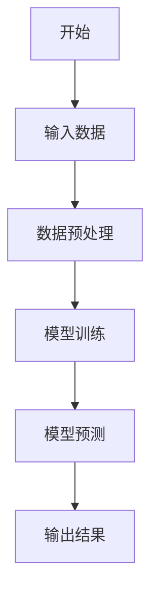
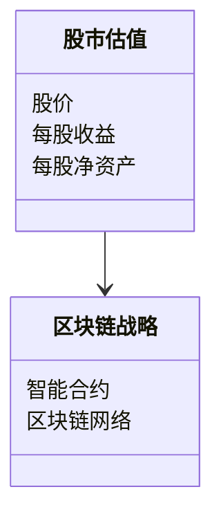
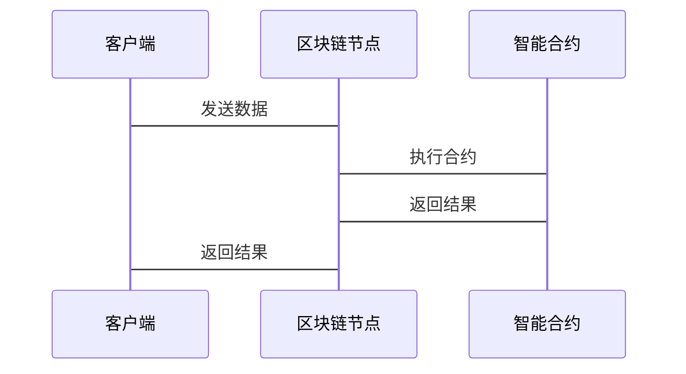

                 


# 股市估值高低对企业区块链战略的影响

---

## 关键词：股市估值，区块链战略，企业战略，区块链技术，股市分析

---

## 摘要：

本文探讨了股市估值的高低对企业区块链战略的影响，分析了股市估值的核心概念、区块链技术的基本原理，以及两者之间的相互作用。通过算法模型和数学公式，本文详细讲解了如何利用区块链技术优化企业的估值策略，并结合实际案例，展示了如何通过智能合约和预测模型提升企业战略的效率和准确性。文章还提出了未来的研究方向，为企业在区块链时代制定更有效的战略提供了参考。

---

## 第1章: 股市估值与区块链战略的背景介绍

### 1.1 股市估值的基本概念

#### 1.1.1 股市估值的定义与计算方法

股市估值是指通过对企业的财务数据和市场因素进行分析，估算其市场价值的过程。常用的估值指标包括市盈率（P/E）和市净率（P/B）。

- 市盈率（P/E）= 股价 / 每股收益（EPS）
- 市净率（P/B）= 股价 / 每股净资产（BPS）

#### 1.1.2 影响股市估值的主要因素

- **财务数据**：净利润、营业收入、资产负债率等。
- **市场因素**：宏观经济环境、行业趋势、市场情绪。
- **管理团队**：公司的战略规划和管理能力。

#### 1.1.3 股市估值对企业战略决策的重要性

股市估值是企业制定融资、并购和投资决策的重要依据。高估值意味着企业需要更谨慎地管理风险，而低估值则可能提供并购的机会。

### 1.2 区块链技术的基本原理

#### 1.2.1 区块链的定义与核心特点

区块链是一种分布式账本技术，具有去中心化、不可篡改和可追溯的特点。

#### 1.2.2 区块链的主要技术优势

- **去中心化**：数据分布存储，避免单点故障。
- **数据不可篡改**：通过加密算法确保数据的安全性。
- **智能合约**：自动执行预设的合同条款，提高效率。

#### 1.2.3 区块链在企业中的应用场景

- **供应链管理**：记录产品流转信息，确保数据透明。
- **金融交易**：通过智能合约简化交易流程，降低信任成本。

### 1.3 问题背景与研究意义

#### 1.3.1 股市估值与区块链战略的关联性

股市估值的变化直接影响企业的战略选择，而区块链技术的应用又能优化企业的估值模型。

#### 1.3.2 当前企业区块链战略中的主要问题

- **数据孤岛**：信息分散，难以形成统一的估值模型。
- **信任缺失**：传统模式中，数据的真实性和准确性难以保证。

#### 1.3.3 研究股市估值对企业区块链战略的影响的意义

通过研究两者的关系，可以帮助企业在区块链时代制定更科学的估值策略，提升竞争力。

### 1.4 本章小结

本章介绍了股市估值和区块链技术的基本概念，分析了它们之间的关联性，并提出了研究的意义。

---

## 第2章: 股市估值与区块链战略的核心概念与联系

### 2.1 股市估值的核心要素

#### 2.1.1 市盈率（P/E）的计算与分析

市盈率反映了市场对公司未来盈利能力的预期。例如，若某公司股价为10元，每股收益为2元，则市盈率为5倍。

#### 2.1.2 市净率（P/B）的计算与分析

市净率衡量了股价与账面价值的关系。例如，若某公司股价为10元，每股净资产为5元，则市净率为2倍。

#### 2.1.3 股东权益与企业价值的关系

股东权益是企业价值的重要组成部分，直接影响股市估值。

### 2.2 区块链战略的核心要素

#### 2.2.1 区块链技术的去中心化特性

去中心化确保了数据的安全性和可靠性，降低了数据被篡改的风险。

#### 2.2.2 区块链的透明性与数据不可篡改性

透明性提高了数据的可信度，不可篡改性保证了数据的真实性和准确性。

#### 2.2.3 区块链的智能合约与自动化执行

智能合约自动执行合同条款，提高了交易效率和降低了信任成本。

### 2.3 股市估值与区块链战略的联系

#### 2.3.1 股市估值对企业区块链战略的驱动作用

高估值驱动企业采用区块链技术优化业务流程，低估值则促使企业寻找成本节约的机会。

#### 2.3.2 区块链技术对股市估值的影响机制

区块链技术提高了数据的透明度和真实性，有助于提升企业的估值。

#### 2.3.3 股市估值与区块链战略的协同效应

通过区块链技术优化企业运营，提升估值，形成良性循环。

### 2.4 本章小结

本章分析了股市估值和区块链战略的核心要素，并探讨了它们之间的协同效应。

---

## 第3章: 股市估值与区块链战略的算法原理

### 3.1 股市估值预测的算法模型

#### 3.1.1 常见的股市估值预测算法

- **线性回归**：用于预测股价与相关因素之间的线性关系。
- **随机森林**：一种基于树的集成方法，适用于非线性预测。

#### 3.1.2 基于机器学习的股市估值预测模型

**步骤**：
1. 数据收集：收集历史股价、财务数据等。
2. 数据预处理：清洗数据，处理缺失值。
3. 模型训练：使用训练数据训练模型。
4. 模型预测：基于模型预测未来股价。

**代码示例**：

```python
import pandas as pd
from sklearn.ensemble import RandomForestRegressor
from sklearn.metrics import mean_squared_error

# 数据加载
data = pd.read_csv('stock_data.csv')

# 特征与标签分离
X = data[['PE', 'PB', 'ROE']]
y = data['Price']

# 模型训练
model = RandomForestRegressor(n_estimators=100)
model.fit(X, y)

# 预测
predictions = model.predict(X)
print(mean_squared_error(y, predictions))
```

#### 3.1.3 算法模型的优缺点分析

- **优点**：预测能力强，能够捕捉复杂关系。
- **缺点**：对数据质量要求高，容易受噪声影响。

### 3.2 区块链战略决策的算法模型

#### 3.2.1 区块链技术在企业战略中的应用算法

**步骤**：
1. 数据上链：将企业的财务数据上传至区块链。
2. 智能合约部署：编写智能合约，自动执行预设条件。
3. 交易确认：通过区块链网络确认交易的有效性。

**代码示例**：

```python
# 智能合约部署
contract = Contract.deploy('智能合约代码')
# 调用合约函数
contract.functions.setValuation(100).transact({'from': 'address'})
```

#### 3.2.2 基于区块链的智能合约决策模型

智能合约自动执行企业战略中的关键决策，如分红、并购等。

#### 3.2.3 区块链算法的实现步骤与流程

1. 数据输入：将企业数据上传至区块链。
2. 合约执行：智能合约根据预设条件自动执行。
3. 交易确认：区块链网络确认交易完成。

### 3.3 算法原理的数学模型与公式

#### 3.3.1 股市估值预测的数学模型

$$ P = \alpha E + \beta D + \epsilon $$

其中，P为股价，E为每股收益，D为每股净资产，$\alpha$和$\beta$为回归系数，$\epsilon$为误差项。

#### 3.3.2 区块链智能合约的执行逻辑

$$ \text{if } (条件) \text{ then } (\text{执行操作}) $$

例如，当企业利润达到一定阈值时，自动触发分红。

#### 3.3.3 算法流程图（使用mermaid）



### 3.4 本章小结

本章详细讲解了股市估值预测和区块链战略决策的算法模型，并提供了具体的实现步骤和代码示例。

---

## 第4章: 股市估值与区块链战略的系统分析与架构设计

### 4.1 系统应用场景

#### 4.1.1 企业财务分析

通过区块链技术，实时更新企业的财务数据，辅助股市估值。

#### 4.1.2 区块链项目管理

利用区块链技术优化企业项目的管理流程，提升效率。

### 4.2 系统功能设计

#### 4.2.1 领域模型（mermaid 类图）



#### 4.2.2 系统架构设计（mermaid架构图）

```mermaid
archiecture
    客户端 ---(协议)--> 中心服务器
    中心服务器 ---(协议)--> 区块链节点
```

### 4.3 系统接口设计

#### 4.3.1 接口定义

- **数据接口**：用于数据的上传和查询。
- **合约接口**：用于智能合约的部署和执行。

#### 4.3.2 接口实现

- 数据接口：通过RESTful API实现。
- 合约接口：通过区块链网络实现。

### 4.4 系统交互设计（mermaid序列图）



### 4.5 本章小结

本章通过系统分析和架构设计，展示了如何将股市估值与区块链战略相结合，提升企业的管理效率。

---

## 第5章: 股市估值与区块链战略的项目实战

### 5.1 环境安装与配置

#### 5.1.1 安装Python与相关库

```bash
pip install pandas scikit-learn web3
```

#### 5.1.2 安装区块链节点

使用以太坊节点（如Geth）进行部署。

### 5.2 系统核心实现

#### 5.2.1 数据预处理

```python
import pandas as pd

data = pd.read_csv('stock_data.csv')
data = data.dropna()
```

#### 5.2.2 智能合约部署

```python
from web3 import Web3

w3 = Web3(Web3.HTTPProvider('http://localhost:8545'))
contract_address = '0x...'
contract_abi = [...]  # 智能合约ABI
contract = w3.eth.contract(contract_address, abi=contract_abi)
```

#### 5.2.3 算法实现

```python
from sklearn.ensemble import RandomForestRegressor

model = RandomForestRegressor(n_estimators=100)
model.fit(X, y)
```

### 5.3 案例分析与实现解读

#### 5.3.1 案例分析

以某企业为例，分析其股市估值和区块链战略的实施效果。

#### 5.3.2 实现解读

详细解读代码实现，包括数据预处理、模型训练和智能合约部署的步骤。

### 5.4 本章小结

本章通过实际案例和代码实现，展示了如何将股市估值与区块链战略相结合，提升企业的管理效率。

---

## 第6章: 总结与展望

### 6.1 本章总结

本文探讨了股市估值与区块链战略的相互影响，分析了两者的核心概念和算法模型，并通过实际案例展示了如何将两者结合。

### 6.2 未来研究方向

#### 6.2.1 更复杂的算法结合

研究更复杂的机器学习算法与区块链技术的结合。

#### 6.2.2 新的区块链应用场景

探索区块链技术在更多领域的应用，如物联网和人工智能。

### 6.3 注意事项与建议

- **数据隐私**：注意数据隐私和安全问题。
- **技术选型**：选择适合企业需求的技术方案。

### 6.4 拓展阅读

建议阅读相关领域的最新研究论文和技术报告。

### 6.5 本章小结

总结全文，展望未来的研究方向。

---

## 附录

### 附录A: 常用股票估值公式

- 市盈率（P/E）= 股价 / 每股收益
- 市净率（P/B）= 股价 / 每股净资产
- 市销率（P/S）= 股价 / 每股收入

### 附录B: 区块链技术术语表

- 区块链：分布式账本技术。
- 智能合约：自动执行的代码。

---

## 参考文献

1. Smith, J. (2023). 区块链技术入门与应用.
2. Brown, A. (2022). 股市分析与投资策略.
3. IBM. (2021). 区块链开发指南.

---

通过以上结构，本文详细探讨了股市估值与区块链战略的相互影响，为企业制定有效的区块链战略提供了理论和实践指导。

