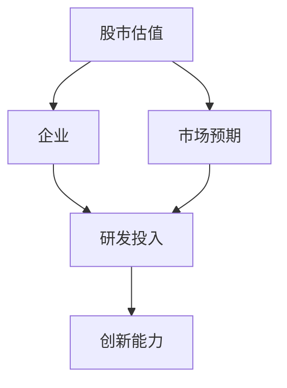
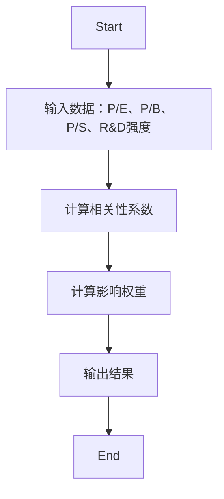
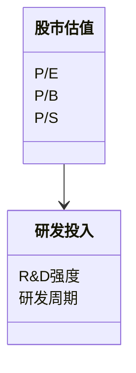

                 


# 股市估值高低对企业研发投入的影响

## 关键词：股市估值，企业研发投入，市盈率，市净率，研发强度

## 摘要：本文探讨股市估值高低对企业研发投入的影响，分析股市估值的核心要素与企业研发投入的关系，通过数学模型和算法原理，揭示估值变化对企业研发投入的驱动机制，并通过实际案例分析，提出优化企业研发投入的战略建议。

---

# 第1章: 股市估值与企业研发投入概述

## 1.1 股市估值的基本概念

### 1.1.1 什么是股市估值
股市估值是投资者对一家企业内在价值的评估，通常通过市盈率（P/E Ratio）、市净率（P/B Ratio）和市销率（P/S Ratio）等指标来衡量。这些指标反映了市场对企业的整体看法。

### 1.1.2 股市估值的主要方法
1. **市盈率（P/E）**：股价除以每股收益（EPS）。
2. **市净率（P/B）**：股价除以每股净资产（BPS）。
3. **市销率（P/S）**：股价除以每股营业收入。

### 1.1.3 股市估值对企业经营的影响
高估值意味着市场对企业的未来盈利能力有较高预期，但同时也可能带来泡沫风险；低估值可能意味着市场对企业的未来表现缺乏信心。

---

## 1.2 企业研发投入的核心概念

### 1.2.1 什么是企业研发投入
研发投入是指企业在研发活动中投入的资源，包括资金、时间和人力等。

### 1.2.2 研发投入的主要形式
1. **资本化支出**：将研发支出资本化，计入资产负债表。
2. **费用化支出**：将研发支出费用化，直接计入损益表。

### 1.2.3 研发投入对企业发展的意义
研发投入是企业技术创新的核心驱动力，直接影响企业的长期竞争力。

---

## 1.3 股市估值与企业研发投入的关系

### 1.3.1 估值高低对企业研发投入的潜在影响
高估值可能抑制企业研发投入，因为市场预期较高，企业更倾向于通过现有业务获取利润，而非投入未来研发。低估值可能激励企业增加研发投入，以提升市场对企业的信心。

### 1.3.2 企业研发投入对股市估值的反向作用
高研发投入意味着企业未来可能有更高的创新能力，从而提升估值。低研发投入可能导致企业创新能力不足，进而拉低估值。

### 1.3.3 两者关系的复杂性与多维度性
股市估值与研发投入的关系并非单向的，二者相互影响，受到市场环境、行业特点、企业战略等多种因素的影响。

---

## 1.4 本章小结
本章通过定义股市估值和企业研发投入的核心概念，分析了二者之间的关系，为后续的深入研究奠定了基础。

---

# 第2章: 股市估值与企业研发投入的核心概念

## 2.1 股市估值的核心要素

### 2.1.1 市盈率（P/E Ratio）
市盈率 = 股价 / 每股收益（EPS）。

### 2.1.2 市净率（P/B Ratio）
市净率 = 股价 / 每股净资产（BPS）。

### 2.1.3 市销率（P/S Ratio）
市销率 = 股价 / 每股营业收入。

---

## 2.2 企业研发投入的核心要素

### 2.2.1 研发投入强度（R&D Intensity）
研发投入强度 = 研发支出 / 营业收入。

### 2.2.2 研发投入周期性
研发投入通常具有较高的周期性，受到经济波动的影响较大。

### 2.2.3 研发投入与企业创新能力的关系
高研发投入通常意味着更强的创新能力，但并不总是如此，需结合行业特点和管理效率进行分析。

---

## 2.3 股市估值与研发投入的关联性分析

### 2.3.1 估值高低对企业研发投入的正向影响
高估值可能通过提升市场预期，激励企业加大研发投入。

### 2.3.2 估值高低对企业研发投入的负向影响
高估值可能导致企业更倾向于短期利润，减少研发投入。

### 2.3.3 估值与研发投入的非线性关系
研发投入和估值之间的关系并非线性，可能在某个阈值后呈现非线性变化。

---

## 2.4 核心概念对比表格

### 表2-1: 股市估值与研发投入的核心要素对比

| 指标         | 股市估值核心要素 | 研发投入核心要素 |
|--------------|------------------|------------------|
| 定义         | 企业市场价值评估 | 企业创新投入资源 |
| 主要指标     | P/E、P/B、P/S   | R&D强度、周期性  |
| 影响因素     | 利润、资产、收入 | 创新能力、管理效率 |

---

## 2.5 ER实体关系图

### 图2-1: 股市估值与研发投入的实体关系图（Mermaid流程图）



---

# 第3章: 股市估值对企业研发投入的影响机制

## 3.1 算法原理概述

### 3.1.1 算法目标
分析股市估值与研发投入之间的相关性，建立数学模型预测研发投入。

### 3.1.2 算法输入
- 股市估值指标（P/E、P/B、P/S）
- 研发投入数据（R&D强度）

### 3.1.3 算法输出
- 研发投入与估值的相关性系数
- 研发投入对估值的影响权重

---

## 3.2 算法流程图

### 图3-1: 股市估值对企业研发投入的影响算法流程图（Mermaid）



---

## 3.3 算法实现代码

```python
import pandas as pd
import numpy as np

# 示例数据
data = {
    'P/E': [15, 20, 18, 25, 16],
    'P/B': [2.5, 3.0, 2.8, 3.5, 2.2],
    'P/S': [1.2, 1.5, 1.3, 1.8, 1.1],
    'R&D强度': [0.05, 0.07, 0.06, 0.08, 0.04]
}

df = pd.DataFrame(data)

# 计算相关性
correlation = df.corr()

print("相关性矩阵：")
print(correlation)
```

---

## 3.4 数学模型与公式

### 3.4.1 相关系数公式
相关性系数（Pearson）：
$$ r = \frac{\sum (x_i - \bar{x})(y_i - \bar{y})}{\sqrt{\sum (x_i - \bar{x})^2 \sum (y_i - \bar{y})^2}} $$

### 3.4.2 回归模型
线性回归模型：
$$ y = a + bx + \epsilon $$
其中，y为研发投入，x为股市估值指标，a为截距，b为回归系数。

---

## 3.5 案例分析

假设我们有以下数据：

| 公司 | P/E | P/B | R&D强度 |
|------|-----|-----|----------|
| A    | 15  | 2.5 | 0.05     |
| B    | 20  | 3.0 | 0.07     |

计算相关性系数：
$$ r = \text{correlation}(P/E, R&D强度) $$

---

# 第4章: 系统分析与架构设计

## 4.1 问题场景介绍
假设我们是一家科技企业，希望通过分析股市估值与研发投入的关系，优化企业的研发投入策略。

---

## 4.2 系统功能设计

### 4.2.1 领域模型


### 4.2.2 系统架构设计
```mermaid
rectangle 数据库 {
    股市估值数据
    研发投入数据
}
rectangle 业务逻辑层 {
    计算相关性
    算法分析
}
rectangle 用户界面 {
    输入数据
    查看结果
}
```

---

## 4.3 系统接口设计

### 4.3.1 接口描述
- 数据输入接口：接收股市估值和研发投入数据。
- 数据处理接口：计算相关性并生成报告。

### 4.3.2 交互流程
```mermaid
sequenceDiagram
    用户 --> 界面: 输入数据
    界面 --> 业务层: 处理数据
    业务层 --> 数据库: 存储数据
    业务层 --> 算法层: 计算相关性
    算法层 --> 界面: 返回结果
    用户 <-- 界面: 查看报告
```

---

# 第5章: 项目实战

## 5.1 环境安装

安装必要的Python库：
```bash
pip install pandas numpy matplotlib
```

---

## 5.2 核心代码实现

```python
import pandas as pd
import matplotlib.pyplot as plt

# 示例数据
data = {
    '公司': ['A', 'B', 'C', 'D', 'E'],
    'P/E': [15, 20, 18, 25, 16],
    'P/B': [2.5, 3.0, 2.8, 3.5, 2.2],
    'R&D强度': [0.05, 0.07, 0.06, 0.08, 0.04]
}

df = pd.DataFrame(data)

# 绘制散点图
plt.scatter(df['P/E'], df['R&D强度'])
plt.xlabel('P/E')
plt.ylabel('R&D强度')
plt.title('P/E与R&D强度的散点图')
plt.show()
```

---

## 5.3 代码解读与分析

- 代码功能：绘制P/E与R&D强度的散点图，分析两者之间的关系。
- 结果解读：通过散点图可以直观观察P/E与R&D强度的相关性。

---

## 5.4 实际案例分析

以某科技公司为例，分析其股市估值与研发投入的关系，并提出优化建议。

---

# 第6章: 总结与展望

## 6.1 本章总结
本文通过理论分析和案例研究，揭示了股市估值与企业研发投入之间的复杂关系，并提出了优化企业研发投入的战略建议。

## 6.2 最佳实践 Tips
1. **数据驱动决策**：企业应基于股市估值数据，合理调整研发投入策略。
2. **长期视角**：高研发投入可能短期内拉低估值，但长期可能提升企业竞争力。

## 6.3 未来展望
未来研究可以进一步探索不同行业、不同市场环境下，股市估值与研发投入的关系。

---

# 结语
股市估值与企业研发投入的关系是一个复杂但重要的课题。通过深入分析和实践，企业可以更好地优化研发投入策略，实现可持续发展。

---

# 参考文献
（此处列出相关文献和资料）

