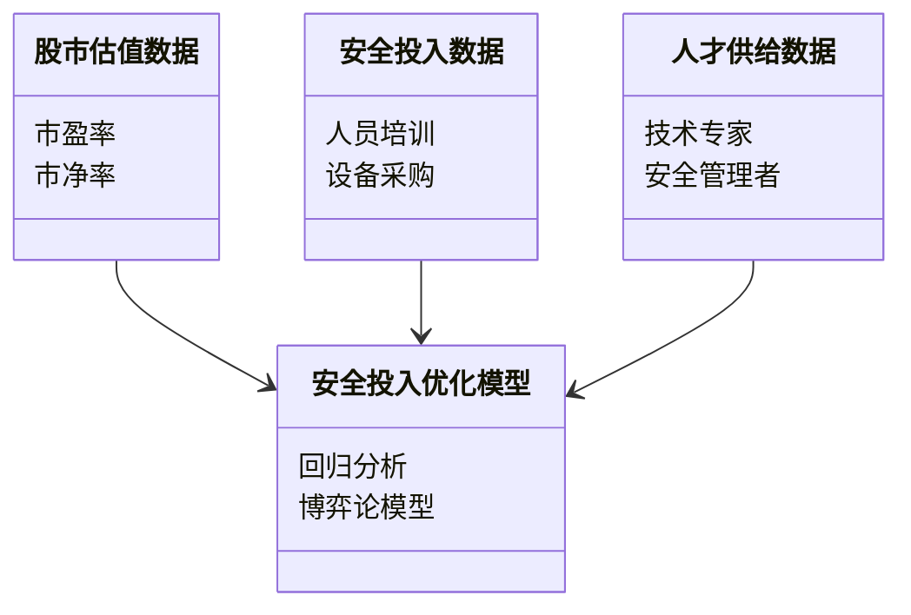
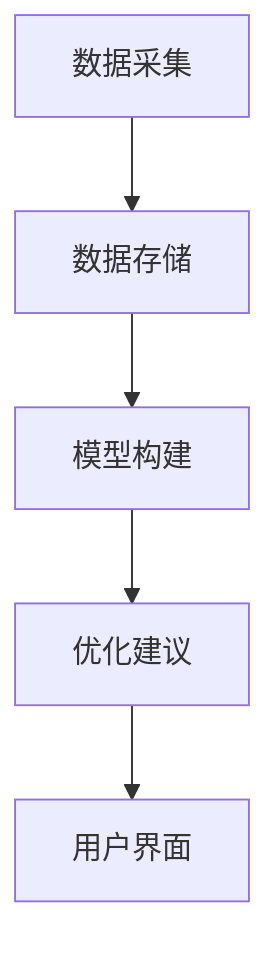

                 


# 股市估值高低对企业网络安全人才培养的影响

> **关键词**：股市估值、网络安全、人才培养、企业安全投入、投资回报  
> 
> **摘要**：股市估值是衡量企业价值的重要指标，而网络安全人才是保障企业安全的核心资源。本文通过分析股市估值与企业安全投入的关系，探讨股市估值对企业网络安全人才培养的影响，提出优化企业安全投入和人才培养效率的解决方案。

---

## 第一部分: 背景介绍

### 第1章: 股市估值与网络安全人才培养的背景

#### 1.1 问题背景

##### 1.1.1 股市估值的基本概念
股市估值是衡量企业市场价值的重要指标，通常通过市盈率（P/E）、市净率（P/B）等指标来评估企业的投资价值。股市估值越高，市场对企业未来发展的预期越乐观，企业也更倾向于进行大规模的安全投入。

##### 1.1.2 网络安全人才的核心地位
网络安全人才是企业抵御网络攻击的核心力量。随着数字化转型的加速，网络安全威胁日益复杂，企业对高素质网络安全人才的需求急剧增加。然而，网络安全人才的供给速度却远不及需求的增长。

##### 1.1.3 股市估值与企业安全投入的关系
企业的安全投入直接影响其网络安全能力，而股市估值则反映了市场对企业未来盈利能力的预期。当股市估值较高时，企业有更多的资金用于安全投入；而当股市估值较低时，企业可能缩减安全投入，影响网络安全人才的培养。

---

#### 1.2 问题描述

##### 1.2.1 股市估值对企业安全投入的影响
股市估值高的企业通常有更多的资金用于安全投入，能够吸引和培养更多的网络安全人才。而股市估值低的企业可能在安全投入上捉襟见肘，导致人才流失。

##### 1.2.2 网络安全人才培养的现状与挑战
当前，网络安全人才的供给与需求之间存在巨大缺口。企业需要通过高薪和优质的职业发展路径来吸引和留住人才，但股市估值的波动可能影响企业的安全投入能力。

##### 1.2.3 企业安全投入与人才供给的矛盾
企业安全投入不足可能导致人才流失，而人才流失又会进一步削弱企业的安全能力，形成恶性循环。股市估值的变化加剧了这一矛盾。

---

#### 1.3 问题解决

##### 1.3.1 通过股市估值优化企业安全投入
企业应根据股市估值合理调整安全投入，确保在市场低迷时仍能维持一定的安全投入水平。

##### 1.3.2 提高网络安全人才培养效率
通过与高校合作、提供培训课程等方式，企业可以快速培养和引进网络安全人才。

##### 1.3.3 构建企业安全投入与人才培养的平衡机制
企业需要在股市估值波动中找到安全投入与人才培养的平衡点，确保网络安全能力的持续提升。

---

#### 1.4 边界与外延

##### 1.4.1 股市估值的边界条件
股市估值受宏观经济、行业趋势和企业业绩等多种因素影响，企业需要综合考虑这些因素来制定安全投入策略。

##### 1.4.2 网络安全人才的外延范围
网络安全人才不仅包括技术专家，还包括安全策略制定者、安全管理者等。

##### 1.4.3 企业安全投入的边界与外延
企业安全投入不仅包括硬件和软件的投入，还包括人才培训、安全意识教育等软性投入。

---

#### 1.5 概念结构与核心要素

##### 1.5.1 股市估值的核心要素
- 市盈率（P/E）
- 市净率（P/B）
- 股东权益收益率（ROE）

##### 1.5.2 网络安全人才的核心要素
- 技术能力
- 经验
- 资质认证

##### 1.5.3 企业安全投入的核心要素
- 人员培训
- 设备采购
- 安全策略制定

---

## 第2章: 核心概念与联系

### 2.1 核心概念原理

##### 2.1.1 股市估值的原理
股市估值是市场对企业未来盈利能力的预期，反映企业在市场中的价值。

##### 2.1.2 网络安全人才的培养原理
通过系统化的教育和培训，企业可以培养出具备专业技能的网络安全人才。

##### 2.1.3 企业安全投入的分配原理
企业应根据自身情况合理分配安全投入，确保关键领域的优先投入。

---

### 2.2 概念属性特征对比

| **属性**       | **股市估值**                  | **网络安全人才**             |
|-----------------|-------------------------------|-----------------------------|
| 核心作用         | 反映企业市场价值               | 提供网络安全保障               |
| 影响因素         | 市场情绪、宏观经济、企业业绩     | 技术需求、政策支持、教育水平   |
| 变化周期         | 短期波动、长期趋势             | 长期培养、逐步积累             |

---

### 2.3 ER实体关系图

```mermaid
er
actor 股市估值, 网络安全人才, 企业安全投入
```

---

## 第3章: 算法原理讲解

### 3.1 股市估值与安全投入的回归分析

#### 3.1.1 回归模型
通过回归分析，我们可以量化股市估值对安全投入的影响。例如：

$$ R_i = \alpha + \beta P_i + \epsilon_i $$

其中，\( R_i \) 表示第 \( i \) 个企业的安全投入，\( P_i \) 表示股市估值，\( \alpha \) 为截距，\( \beta \) 为回归系数，\( \epsilon_i \) 为误差项。

#### 3.1.2 例子
假设 β 系数为 0.5，表示股市估值每增加 1%，安全投入增加 0.5%。

---

### 3.2 网络安全人才供给的博弈论模型

#### 3.2.1 博弈模型
企业与人才之间存在博弈关系，企业通过提高安全投入来吸引人才，而人才则根据企业的安全投入选择就业。

#### 3.2.2 实际案例
当股市估值高时，企业愿意提供更高的薪资和培训资源，吸引更多的网络安全人才。

---

### 3.3 数学模型与公式

#### 3.3.1 股市估值对安全投入的影响模型
$$ R_i = \alpha + \beta P_i + \epsilon_i $$

#### 3.3.2 安全投入对人才供给的影响模型
$$ T_i = \gamma R_i + \delta P_i + \epsilon_i $$

其中，\( T_i \) 表示第 \( i \) 个企业的人才供给，\( \gamma \) 为安全投入对人才供给的影响系数，\( \delta \) 为股市估值对人才供给的影响系数。

---

## 第4章: 系统分析与架构设计方案

### 4.1 问题场景介绍

#### 4.1.1 问题描述
企业希望通过优化安全投入来提高网络安全能力，但受到股市估值波动的影响。

#### 4.1.2 项目介绍
构建一个基于股市估值的企业安全投入优化模型，帮助企业在不同市场环境下合理分配安全投入。

---

### 4.2 系统功能设计

#### 4.2.1 功能模块
- 数据采集模块：采集企业的股市估值、安全投入和人才供给数据。
- 模型构建模块：基于回归分析和博弈论模型，构建安全投入优化模型。
- 优化建议模块：根据模型结果，为企业提供安全投入优化建议。

#### 4.2.2 领域模型（类图）



---

### 4.3 系统架构设计

#### 4.3.1 系统架构图



---

### 4.4 系统接口设计

#### 4.4.1 接口描述
- 数据采集接口：从股市和企业系统中获取数据。
- 模型接口：调用回归分析和博弈论模型进行计算。
- 用户界面接口：显示优化建议。

---

## 第5章: 项目实战

### 5.1 环境安装

#### 5.1.1 环境要求
- Python 3.8+
- Pandas、Scikit-learn 等数据分析库
- Mermaid 绘图工具

---

### 5.2 核心实现

#### 5.2.1 数据处理
```python
import pandas as pd

# 读取数据
data = pd.read_csv('security_investment.csv')

# 数据清洗
data = data.dropna()
```

#### 5.2.2 模型实现
```python
from sklearn.linear_model import LinearRegression

# 构建回归模型
model = LinearRegression()
model.fit(X, y)
```

---

### 5.3 案例分析

#### 5.3.1 实际案例
某企业通过模型优化安全投入，提高了网络安全能力，同时吸引了更多人才。

---

## 第6章: 最佳实践

### 6.1 小结

股市估值对企业安全投入和网络安全人才培养有重要影响。企业应根据股市估值合理调整安全投入，同时加强人才培养。

---

### 6.2 注意事项

- 安全投入应根据企业实际情况灵活调整。
- 人才培养需要长期投入，不能急于求成。

---

### 6.3 未来展望

随着人工智能和大数据技术的发展，企业可以通过更精准的模型优化安全投入和人才培养。

---

## 第7章: 总结

股市估值是影响企业安全投入的重要因素，而网络安全人才是企业安全的核心。通过合理分配安全投入，企业可以在不同市场环境下优化人才培养，确保网络安全能力的持续提升。

