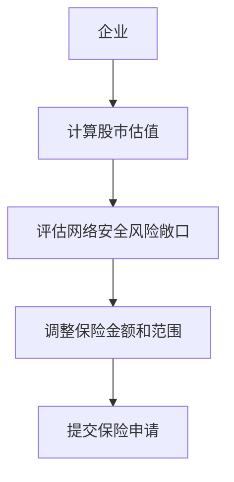
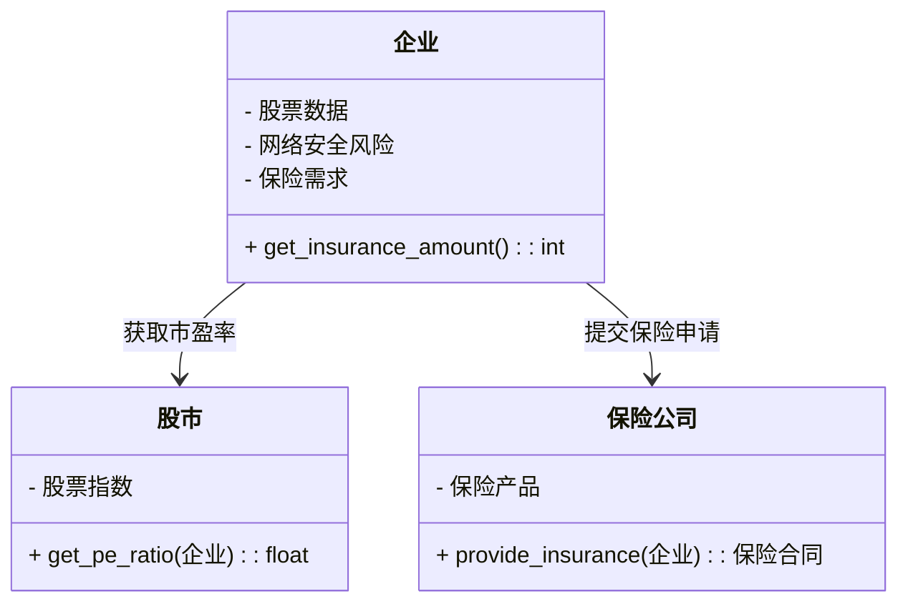
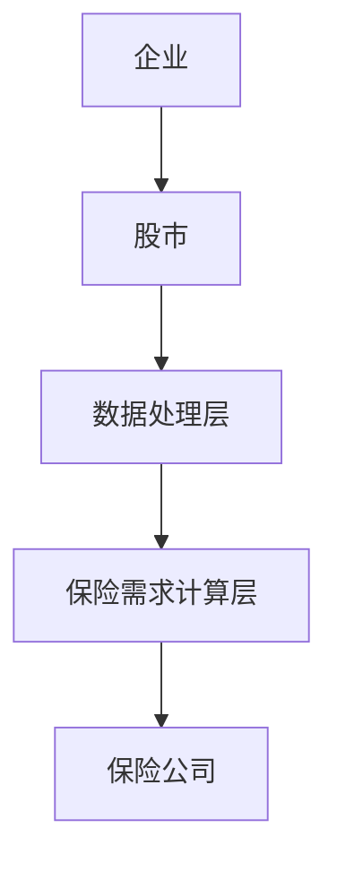

                 


# 股市估值高低对企业网络安全保险策略的影响

## 关键词：
股市估值, 网络安全保险, 风险管理, 企业策略, 保险模型

## 摘要：
股市估值的高低直接影响企业的财务状况和经营决策，进而影响企业对网络安全保险的需求和策略。本文从股市估值的基本概念出发，分析其与网络安全保险策略的关系，探讨如何根据股市估值的变化调整保险策略，以降低企业的财务风险。文章通过理论分析、模型构建和案例研究，为企业制定网络安全保险策略提供有价值的参考。

---

## 第1章: 股市估值与网络安全保险策略的背景

### 1.1 核心概念介绍

#### 1.1.1 股市估值的基本概念
股市估值是衡量企业市场价值的重要指标，通常通过市盈率（P/E）、市净率（P/B）等指标计算。市盈率反映了市场对企业未来盈利能力的预期，市净率则反映了市场对企业资产价值的评估。股市估值的高低直接影响企业的融资能力、投资决策和风险管理策略。

#### 1.1.2 网络安全保险策略的核心要素
网络安全保险是企业为应对网络攻击、数据泄露等风险而购买的保险产品。保险策略的核心要素包括保险金额、覆盖范围、赔付比例和理赔条件。企业需要根据自身的风险承受能力和财务状况，制定合理的保险策略。

### 1.2 问题背景与问题描述

#### 1.2.1 股市估值对企业的影响
股市估值的高低反映了市场对企业未来盈利能力的信心。高估值意味着市场对企业前景看好，企业更容易获得融资，但也可能面临更大的市场压力。低估值则可能意味着市场对企业前景的不确定性，企业需要更加谨慎地管理财务风险。

#### 1.2.2 网络安全风险对企业的影响
网络安全风险是企业面临的主要风险之一。网络攻击可能导致企业数据泄露、财务损失和声誉损害。随着数字化转型的推进，企业的网络安全风险敞口不断扩大，对保险的需求也相应增加。

### 1.3 问题解决与边界定义

#### 1.3.1 股市估值与网络安全保险策略的关系
股市估值的高低影响企业对网络安全保险的需求。高估值企业通常有更多的资金和更高的风险承受能力，倾向于购买更高保额的保险产品。低估值企业则可能优先选择保费较低、覆盖范围有限的保险产品。

#### 1.3.2 问题的边界与外延
本文主要研究股市估值对企业网络安全保险策略的影响，重点关注企业层面的决策。研究范围包括企业的财务状况、市场环境和网络安全风险管理策略。本文不涉及个人投资者的保险需求，也不考虑宏观经济政策的直接影响。

---

## 第2章: 股市估值与网络安全保险策略的核心概念

### 2.1 核心概念原理

#### 2.1.1 股市估值的计算与影响因素
股市估值的计算方法包括市盈率、市净率和市销率等。市盈率=股价/每股收益，市净率=股价/每股净资产，市销率=股价/每股收入。影响股市估值的主要因素包括企业的盈利能力、行业地位、宏观经济环境和市场情绪。

#### 2.1.2 网络安全保险策略的制定逻辑
网络安全保险策略的制定基于企业的风险评估和财务状况。企业需要评估自身的网络安全风险敞口，包括潜在的财务损失、声誉损失和法律风险。根据评估结果，企业选择适合的保险产品和保险金额。

### 2.2 核心概念属性特征对比

#### 2.2.1 股市估值与网络安全保险策略的属性对比
| 属性 | 股市估值 | 网络安全保险策略 |
|------|----------|-------------------|
| 计量方式 | 市盈率、市净率等 | 保险金额、覆盖范围等 |
| 变化频率 | 短期波动较大 | 根据风险变化逐步调整 |
| 主要影响因素 | 宏观经济、行业趋势 | 网络安全风险、企业财务状况 |

### 2.3 ER实体关系图

```mermaid
er
  actor 企业
  actor 保险公司
  actor 股市
  entity 股票
  entity 网络安全风险
  entity 保险合同

  股市 --> 股票: 上市
  企业 --> 股票: 持股
  企业 --> 网络安全风险: 面临
  企业 --> 保险合同: 订购
  保险公司 --> 保险合同: 提供
```

---

## 第3章: 股市估值与网络安全保险策略的算法原理

### 3.1 算法原理讲解

#### 3.1.1 股市估值对企业保险需求的影响
当股市估值高时，企业可能面临更大的财务风险，因此需要更高的保险金额。当股市估值低时，企业可能优先选择保费较低的保险产品。

#### 3.1.2 保险需求的动态调整算法
企业可以根据股市估值的变化，动态调整保险需求。具体步骤如下：
1. 计算当前股市估值（如市盈率）。
2. 评估企业网络安全风险敞口。
3. 根据股市估值和风险敞口，调整保险金额和保险范围。

### 3.2 算法流程图



### 3.3 Python核心代码实现

```python
import pandas as pd

# 假设股票数据已存储在data.csv中
data = pd.read_csv('data.csv')

# 计算市盈率
data['PE'] = data['股价'] / data['每股收益']

# 根据市盈率和网络安全风险敞口调整保险金额
data['保险金额'] = data['PE'].apply(lambda x: 100000 if x > 20 else 50000)

# 输出结果
print(data[['公司名称', 'PE', '保险金额']])
```

### 3.4 数学模型与公式

#### 3.4.1 股市估值与保险需求的关系模型
$$保险金额 = \max(100000, 50000 \times (1 + \frac{PE}{20}))$$

其中，PE为市盈率。

#### 3.4.2 案例分析
假设某企业的市盈率为25，根据上述公式：
$$保险金额 = 100000$$

---

## 第4章: 网络安全保险策略的系统分析与架构设计

### 4.1 问题场景介绍
企业需要根据股市估值的变化，动态调整网络安全保险策略，以降低财务风险。

### 4.2 系统功能设计

#### 4.2.1 领域模型类图



#### 4.2.2 系统架构设计



---

## 第5章: 项目实战

### 5.1 环境安装
安装Python和Pandas库：
```bash
pip install pandas
```

### 5.2 系统核心实现源代码

```python
import pandas as pd

# 读取股票数据
data = pd.read_csv('data.csv')

# 计算市盈率
data['PE'] = data['股价'] / data['每股收益']

# 根据市盈率调整保险金额
data['保险金额'] = data['PE'].apply(lambda x: 100000 if x > 20 else 50000)

# 输出结果
print(data[['公司名称', 'PE', '保险金额']])
```

### 5.3 实际案例分析

#### 5.3.1 案例背景
某高科技企业当前市盈率为30，网络安全风险敞口较高。

#### 5.3.2 案例分析
根据上述模型：
$$保险金额 = 100000$$

企业选择购买网络安全保险，保额为100000元，覆盖范围包括数据泄露和网络攻击。

### 5.4 项目小结
通过本案例，我们可以看到股市估值的变化直接影响企业的保险需求。企业需要根据自身的财务状况和风险敞口，动态调整保险策略。

---

## 第6章: 最佳实践与总结

### 6.1 最佳实践

#### 6.1.1 定期监控股市估值
企业应定期监控股市估值的变化，及时调整保险策略。

#### 6.1.2 与保险公司合作
企业应与保险公司保持密切合作，及时了解市场动态和保险产品信息。

### 6.2 总结
股市估值的高低直接影响企业的网络安全保险需求。企业需要根据股市估值的变化，动态调整保险策略，以降低财务风险。本文通过理论分析、模型构建和案例研究，为企业制定网络安全保险策略提供了有价值的参考。

### 6.3 未来研究方向
未来研究可以进一步探讨动态调整模型，结合更多因素（如宏观经济政策、行业趋势）对企业保险策略的影响。

---

以上是《股市估值高低对企业网络安全保险策略的影响》的技术博客文章大纲。通过系统的分析和详细的案例研究，本文为企业在不同市场环境下制定网络安全保险策略提供了实践指导。

