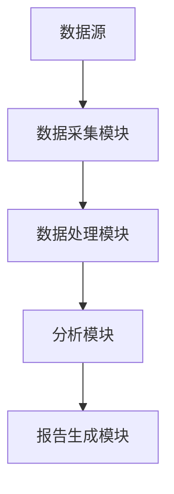

                 


# 股市估值高低对企业量子计算人才招聘的影响

## 关键词：股市估值, 量子计算, 人才招聘, 股市波动, 企业策略

## 摘要：本文探讨股市估值的高低对企业在量子计算领域人才招聘的影响。通过分析高估值和低估值企业的招聘策略，建立数学模型，并结合实际案例，揭示股市估值波动如何影响人才招聘。文章最后提出优化招聘策略的建议。

---

# 第一部分: 引言

## 第1章: 问题背景与研究意义

### 1.1 股市估值的基本概念
- **定义**：股市估值是通过市盈率（P/E）和市净率（P/B）等指标衡量企业市值与实际价值的比值。
- **重要性**：高估值意味着市场对企业的未来增长充满信心，而低估值则可能意味着被低估或存在风险。

### 1.2 量子计算人才招聘的核心要素
- **专业技能**：量子计算需要深厚的技术背景，包括量子力学、计算机科学和数学。
- **行业需求**：随着量子计算技术的快速发展，企业对相关人才的需求激增。
- **人才竞争**：人才稀缺导致企业需要制定有效的招聘策略。

### 1.3 股市估值与量子计算人才招聘的关系
- **高估值企业**：资金充足，能够提供更高的薪酬和资源，吸引顶尖人才。
- **低估值企业**：受限于资金，可能难以吸引和留住优秀人才。
- **波动影响**：股市波动可能导致企业招聘策略的频繁调整，影响人才招聘的稳定性。

## 1.4 研究意义
- **理论价值**：揭示股市估值对企业人才战略的影响，丰富相关理论研究。
- **实践价值**：为企业制定人才招聘策略提供参考，特别是在量子计算领域。

---

# 第二部分: 核心概念与联系

## 第2章: 股市估值与量子计算人才招聘的核心概念

### 2.1 股市估值的核心指标
- **市盈率（P/E）**：衡量企业股价相对于每股收益的比率。
- **市净率（P/B）**：衡量企业股价相对于每股净资产的比率。
- **EV/EBITDA**：企业价值与税息折旧及摊销前利润的比率。

### 2.2 量子计算人才招聘的关键因素
- **技术能力**：包括量子算法、量子编程和量子系统设计。
- **行业经验**：熟悉量子计算应用场景的经验。
- **教育背景**：通常来自顶尖大学的物理、计算机或数学专业。

### 2.3 股市估值与人才招聘的联系
- **高估值企业的优势**：更高的薪酬预算，更优的福利，更有吸引力的工作环境。
- **低估值企业的劣势**：预算有限，难以与高估值企业竞争人才。
- **短期波动的影响**：股市短期波动可能导致企业招聘预算的调整，影响招聘计划。

## 第3章: 股市估值波动对企业人才招聘的影响

### 3.1 股市波动对企业招聘预算的影响
- **高波动带来的不确定性**：股市波动可能导致企业盈利预期变化，影响招聘预算。
- **短期调整**：企业可能根据当前估值调整招聘策略，如暂停招聘或缩减规模。

### 3.2 量子计算人才的流动性分析
- **人才流动的影响因素**：高估值企业吸引人才流入，低估值企业面临人才流失。
- **市场供需关系**：人才稀缺导致高流动率，企业需要持续优化招聘策略。

### 3.3 企业应对策略
- **高估值企业的策略**：维持稳定的招聘计划，利用资金优势吸引人才。
- **低估值企业的策略**：优化内部培养，利用非财务因素吸引人才，如职业发展机会、创新环境。

---

# 第三部分: 数学模型与算法分析

## 第4章: 股市估值对量子计算人才招聘的数学模型

### 4.1 模型建立
- **变量定义**：
  - 自变量：股市估值指标（P/E、P/B）。
  - 因变量：人才招聘数量、招聘成本。
- **假设**：股市估值与人才招聘数量和成本呈相关关系。

### 4.2 回归分析
- **线性回归模型**：
  $$ y = \beta_0 + \beta_1 x + \epsilon $$
  其中，y为招聘数量，x为股市估值指标，$\epsilon$为误差项。
- **结果解读**：β系数表示股市估值每变化一个单位，招聘数量的变化。

### 4.3 时间序列分析
- **ARIMA模型**：
  用于分析股市估值的时间序列数据，预测未来趋势，指导人才招聘计划。

### 4.4 聚类分析
- **K-means聚类**：
  根据企业的股市估值将企业分为高、中、低估值三类，分析不同估值类别在人才招聘方面的差异。

## 第5章: 算法实现与案例分析

### 5.1 数据收集
- 数据来源：公开的股市数据和企业招聘数据。
- 数据预处理：清洗、标准化。

### 5.2 回归分析实现
```python
import pandas as pd
import statsmodels.api as sm

data = pd.DataFrame({
    'PE': [15, 20, 25, 18, 30],
    'Hiring': [5, 7, 6, 4, 8]
})

X = data['PE']
y = data['Hiring']
X = sm.add_constant(X)
model = sm.OLS(y, X).fit()
print(model.summary())
```

### 5.3 案例分析
- **案例1**：高估值科技企业的招聘策略。
- **案例2**：低估值企业的内部培养策略。

---

# 第四部分: 系统架构与设计

## 第6章: 量子计算人才招聘的系统架构设计

### 6.1 系统需求分析
- **目标**：开发一个基于股市估值的量子计算人才招聘分析系统。
- **功能需求**：数据采集、分析、预测、报告生成。

### 6.2 系统架构图（Mermaid）


### 6.3 数据流设计
- 数据从股市数据库和招聘平台采集，经过清洗和转换，输入到分析模块，生成报告。

### 6.4 系统实现
- **数据采集**：使用API接口获取实时股市数据。
- **数据处理**：使用Python的Pandas库进行数据清洗和转换。
- **分析模块**：基于机器学习算法进行预测和分析。

---

# 第五部分: 项目实战与应用

## 第7章: 项目实施与案例分析

### 7.1 项目环境搭建
- **工具安装**：安装Python、Pandas、Scikit-learn等库。

### 7.2 核心代码实现
```python
import pandas as pd
from sklearn.linear_model import LinearRegression

data = pd.DataFrame({
    'PE': [15, 20, 25, 18, 30],
    'Hiring': [5, 7, 6, 4, 8]
})

model = LinearRegression()
model.fit(data[['PE']], data['Hiring'])
print('Coefficient:', model.coef_)
print('Intercept:', model.intercept_)
```

### 7.3 案例分析
- 分析一家高估值科技企业的招聘策略，展示如何通过数学模型优化招聘计划。

### 7.4 结果解读
- 解释回归结果的实际意义，指导企业调整招聘策略。

---

# 第六部分: 总结与展望

## 第8章: 研究总结

### 8.1 核心发现
- 股市估值显著影响量子计算人才的招聘数量和成本。
- 高估值企业更具竞争力，而低估值企业需要优化内部培养机制。

### 8.2 研究局限
- 数据样本有限，未来需要更大规模的数据分析。
- 模型假设简化，实际市场情况可能更复杂。

## 第9章: 未来展望

### 9.1 研究方向
- 结合更多变量（如企业声誉、地理位置）进行更全面的分析。
- 研究不同行业的差异性影响。

### 9.2 实践建议
- 企业应根据股市估值灵活调整招聘策略。
- 政府和行业协会应促进人才流动，提供更多的培训资源。

---

# 结论

股市估值的高低对企业量子计算人才招聘的影响是一个复杂但重要的问题。通过本文的分析，我们可以看到，高估值企业具有显著的招聘优势，而低估值企业需要通过其他策略弥补不足。未来的研究可以进一步深入，为企业提供更精准的招聘指导。

--- 

# 参考文献

（此处列出相关的学术论文、书籍和在线资源。）

