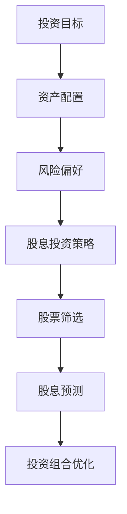

                 

# 股息投资策略：在动荡市场中获得稳定收入

---

## 关键词：
- 股息投资
- 稳定收入
- 股票市场
- 股息率
- 股息增长模型

---

## 摘要：
股息投资是一种通过投资高股息率股票来获得稳定收入的投资策略。在动荡的市场环境中，股息投资因其稳定的现金流和防御性特征，成为投资者追求稳健收益的重要手段。本文将从股息投资的核心概念、数学模型、系统设计到实际案例分析，全面解析股息投资的策略和方法，帮助投资者在复杂多变的市场中实现稳定收入。

---

## 目录
1. [股息投资的核心概念](#股息投资的核心概念)
2. [股息投资的数学模型](#股息投资的数学模型)
3. [股息投资的系统分析与架构设计](#股息投资的系统分析与架构设计)
4. [股息投资的项目实战](#股息投资的项目实战)
5. [股息投资的总结与最佳实践](#股息投资的总结与最佳实践)

---

## 第一部分：股息投资的核心概念

### 第1章：股息投资的核心概念

#### 1.1 股息投资的背景与重要性
- **1.1.1 股票市场的基本概念**
  - 股票市场的定义与功能
  - 股票的分类与特征
  - 股票市场的波动性与风险

- **1.1.2 股息投资的定义与特点**
  - 股息投资的定义
  - 股息投资的特点：稳定性、防御性、长期性
  - 股息投资与资本增值投资的区别

- **1.1.3 股息投资在动荡市场中的优势**
  - 股市下跌时的防御性
  - 稳定的现金流收入
  - 长期复利效应

#### 1.2 股息投资的核心要素
- **1.2.1 股息率的计算与分析**
  - 股息率的定义
  - 股息率的计算公式
  - 影响股息率的因素：股价、股息支付能力、行业特性

- **1.2.2 股息增长的驱动因素**
  - 股息增长的定义
  - 影响股息增长的因素：盈利能力、分红政策、行业地位
  - 股息增长模型的分类：恒定增长模型、可变增长模型

- **1.2.3 股东权益与股息分配政策**
  - 股东权益的定义
  - 股息分配政策的影响：留存收益、分红比率
  - 高分红公司的特征与风险

#### 1.3 股息投资与其他投资策略的对比
- **1.3.1 股息投资与资本增值投资的区别**
  - 资本增值投资的核心：股价上涨
  - 股息投资的核心：现金流收入
  - 两者的优劣势对比

- **1.3.2 股息投资与债券投资的优劣势分析**
  - 债券的固定收益特性
  - 股票的波动性与收益性
  - 股息投资的风险与收益平衡

- **1.3.3 股息投资与指数投资的结合**
  - 指数投资的分散化优势
  - 股息投资的筛选逻辑
  - 组合投资的稳定性与收益性

#### 1.4 本章小结
- 本章总结了股息投资的核心概念，包括股息率、股息增长模型、股息投资与其他策略的对比，为后续分析奠定了基础。

---

## 第二部分：股息投资的数学模型

### 第2章：股息投资的数学模型

#### 2.1 股息贴现模型（DDM）原理
- **2.1.1 DDM的基本假设**
  - 股票的内在价值由股息决定
  - 股息以固定增长率增长
  - 贴现率代表投资者要求的最低回报率

- **2.1.2 DDM的数学公式推导**
  - 股息贴现模型公式：
  $$
  P = \frac{D_1}{r - g}
  $$
  其中，\(P\) 为股票的公允价值，\(D_1\) 为第一期股息，\(r\) 为贴现率，\(g\) 为股息增长率。

  - 公式的应用条件与假设检验
  - 如何选择合适的贴现率和增长率

- **2.1.3 DDM模型的优劣势分析**
  - 优点：简单易用，能够反映股息的价值
  - 缺点：假设股息增长率恒定，忽略实际市场波动

#### 2.2 股息增长模型的应用
- **2.2.1 恒定增长模型的假设**
  - 股息以固定速率增长
  - 适用于成熟企业的股息分配

- **2.2.2 可变增长模型的适用场景**
  - 股息增长率变化的公司
  - 分段增长模型的应用

- **2.2.3 DDM模型在实际投资中的局限性**
  - 市场波动对模型假设的挑战
  - 公司基本面变化对模型的影响

#### 2.3 股息率与风险的平衡分析
- **2.3.1 股息率的计算公式**
  $$
  \text{股息率} = \frac{\text{每股股息}}{\text{股价}} \times 100\%
  $$

- **2.3.2 风险调整后的股息率模型**
  - 高股息率股票的风险：低增长、高杠杆
  - 低股息率股票的风险：高增长、高波动

- **2.3.3 股息率与债券收益率的对比分析**
  - 债券收益率的确定性
  - 股票股息率的波动性
  - 两者的风险收益平衡

#### 2.4 本章小结
- 本章通过股息贴现模型和股息增长模型，分析了股息投资的数学基础，帮助投资者理解如何通过股息率和股息增长率来评估股票的价值。

---

## 第三部分：股息投资的系统分析与架构设计

### 第3章：股息投资的系统分析

#### 3.1 股息投资的系统架构
- **3.1.1 投资目标与风险偏好分析**
  - 投资目标的设定
  - 风险偏好的分类：保守型、稳健型、进取型

- **3.1.2 股息投资的资产配置策略**
  - 股票在资产配置中的比例
  - 行业分布与公司选择

- **3.1.3 投资组合的构建与优化**
  - 投资组合的构建逻辑
  - 如何优化股息投资组合的风险收益比

#### 3.2 股息投资的系统功能设计
- **3.2.1 股票筛选模块**
  - 筛选标准：高股息率、稳定分红历史
  - 行业选择：公用事业、金融、消费等高分红行业

- **3.2.2 股息预测模块**
  - 股息预测的方法：历史数据分析、财务指标预测
  - 股息增长模型的应用

- **3.2.3 风险评估模块**
  - 风险因子的分析：市场风险、流动性风险、信用风险
  - 投资组合的风险指标：波动率、夏普比率

#### 3.3 股息投资的系统架构图

#### 3.4 系统接口设计与交互流程
- **3.4.1 用户输入模块**
  - 用户输入投资目标和风险偏好
  - 系统根据输入生成股息投资策略

- **3.4.2 数据处理模块**
  - 数据来源：财务报表、股价数据、行业信息
  - 数据清洗与特征提取

- **3.4.3 结果展示模块**
  - 股票筛选结果
  - 投资组合建议
  - 风险评估报告

#### 3.5 本章小结
- 本章通过系统架构设计，展示了股息投资的整体框架，从目标设定到策略实施，为投资者提供了一套系统化的解决方案。

---

## 第四部分：股息投资的项目实战

### 第4章：股息投资的项目实战

#### 4.1 项目背景与目标
- 项目背景：在动荡市场中寻找稳定收益
- 项目目标：筛选高股息率股票，构建股息投资组合

#### 4.2 数据收集与处理
- 数据来源：股票市场数据、财务报表、行业分析报告
- 数据清洗：处理缺失值、异常值
- 特征提取：股息率、股息增长、ROE、负债率等

#### 4.3 股票筛选与分析
- 筛选标准：
  - 股息率 > 5%
  - 连续5年分红
  - 负债率 < 60%
- 股票筛选结果：
  - 示例股票：AAPL、PG、KO等

#### 4.4 投资组合优化
- 组合构建逻辑：
  - 行业分散：涵盖公用事业、金融、消费等多个行业
  - 股票分散：避免过度集中
  - 风险控制：投资组合波动率低于市场平均水平

#### 4.5 实际案例分析
- 案例分析：
  - 公用事业公司：稳定的高股息率
  - 消费公司：高增长的股息率
- 投资组合表现：
  - 过去5年的收益与波动率
  - 与市场指数的对比

#### 4.6 本章小结
- 本章通过实际案例，展示了股息投资策略在项目中的应用，证明了其在动荡市场中的稳定性和收益性。

---

## 第五部分：股息投资的总结与最佳实践

### 第5章：股息投资的总结与最佳实践

#### 5.1 投资心态与纪律
- 长期投资的重要性
- 稳定性与收益性的平衡
- 避免追涨杀跌的心理误区

#### 5.2 长期投资与复利效应
- 复利的力量
- 如何通过持续投资实现财富增长
- 股息再投资的策略

#### 5.3 应对市场波动的策略
- 稳定股息收入的防御性
- 投资组合的动态调整
- 利用市场波动的机会

#### 5.4 小结与注意事项
- 小结：股息投资的优势与局限性
- 注意事项：避免过度依赖股息率、关注公司基本面
- 拓展阅读：股息投资的经典书籍与文献

---

## 总结
股息投资是一种适合追求稳定收益的投资者的策略。通过本文的系统分析与实战案例，读者可以掌握股息投资的核心概念、数学模型和系统设计，从而在动荡的市场中实现稳定收入。股息投资不仅需要扎实的理论基础，还需要实际操作中的纪律性和耐心，只有这样才能在长期的投资过程中获得稳健的回报。

