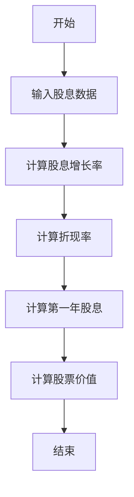
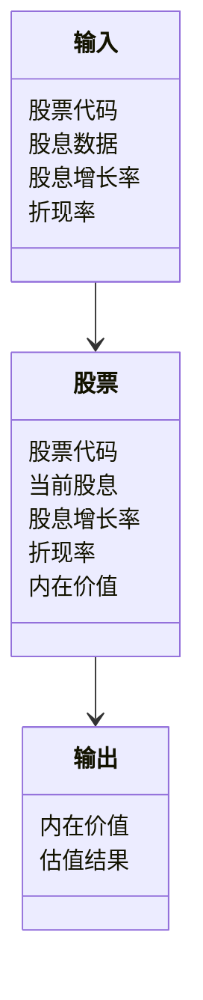
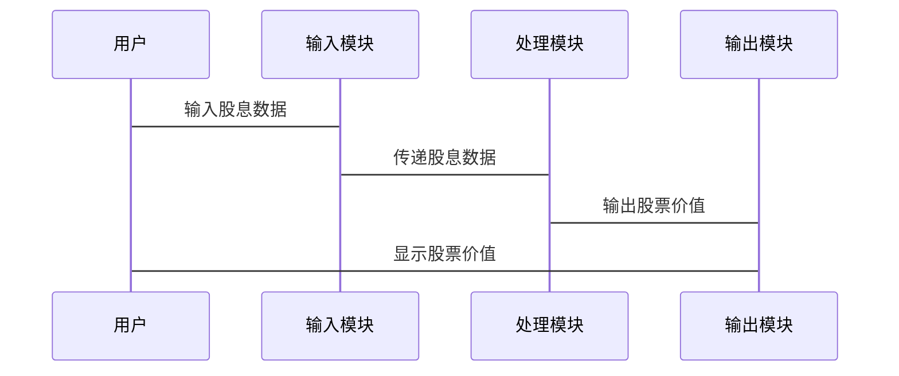

                 


# 股息贴现模型：基于未来现金流的股票估值

## 关键词：股息贴现模型，股票估值，现金流贴现，股息增长率，投资分析

## 摘要：股息贴现模型（Dividend Discount Model, DDM）是一种用于评估股票内在价值的方法，基于对公司未来股息的折现。本文将详细介绍股息贴现模型的理论基础、数学公式、算法实现、系统架构设计以及实际案例分析，帮助读者掌握如何利用股息贴现模型进行股票估值。

---

# 第一部分: 股息贴现模型的背景与概念

## 第1章: 股息贴现模型的背景与概念

### 1.1 股息贴现模型的定义

股息贴现模型（DDM）是一种用于评估股票内在价值的方法，其核心思想是将公司未来派发的股息折现，以确定股票的公允价值。这种方法假设股票的价值等于未来股息的现值之和。

#### 1.1.1 股息的概念与作用

股息是公司分配给股东的利润部分，通常以现金或股票形式发放。股息是股东投资回报的重要组成部分，也是公司财务健康状况的体现。通过分析股息，投资者可以评估公司的盈利能力和分红能力。

#### 1.1.2 股息贴现模型的定义

股息贴现模型（DDM）基于以下假设：股票的价值等于未来所有股息的现值之和。公式如下：
$$ V = \sum_{t=1}^{\infty} \frac{D_t}{(1+r)^t} $$
其中，$D_t$ 是第 $t$ 年的股息，$r$ 是折现率。

#### 1.1.3 股息贴现模型的核心假设

- 股息可以持续稳定地增长。
- 投资者要求的回报率（$r$）是恒定的。
- 公司未来股息的现金流可以预测。

### 1.2 股票估值的基本原理

股票估值是通过对公司未来现金流的贴现来确定其内在价值的过程。股息贴现模型是其中一种常用的方法，特别适用于那些主要通过股息向股东分配利润的公司。

#### 1.2.1 股票价值的决定因素

- 公司的盈利能力。
- 股息支付率。
- 股息增长率。
- 市场风险和折现率。

#### 1.2.2 现金流贴现法的基本概念

现金流贴现法（DCF）是将公司未来现金流折现到现值，以确定其内在价值的方法。股息贴现模型是DCF的一种特殊情况，仅考虑股息的现金流。

#### 1.2.3 股息贴现模型的适用场景

- 公司股息稳定且可预测。
- 公司主要通过股息回报股东。
- 公司没有大量的再投资需求。

### 1.3 股息贴现模型与传统估值方法的对比

#### 1.3.1 市盈率法的局限性

市盈率法基于市盈率与股价的关系，无法反映公司的实际盈利能力。例如，高市盈率可能意味着高成长性，但也可能意味着高风险。

#### 1.3.2 市净率法的局限性

市净率法基于市净率与股价的关系，适用于评估资产-heavy的公司，但无法全面反映公司的盈利能力。

#### 1.3.3 股息贴现模型的优势

股息贴现模型直接考虑了股息的未来现金流，能够更准确地反映公司的内在价值。此外，DDM还能够帮助投资者识别被低估或高估的股票。

---

## 第2章: 股息贴现模型的核心公式与数学模型

### 2.1 股息贴现模型的基本公式

#### 2.1.1 股票的内在价值公式

股息贴现模型的公式可以简化为：
$$ V = \frac{D_1}{r - g} $$
其中，$D_1$ 是第一年的股息，$r$ 是折现率，$g$ 是股息增长率。

#### 2.1.2 股息增长率模型的公式

股息增长率模型假设股息以恒定的增长率 $g$ 增长，适用于股息稳定增长的公司。

$$ V = \frac{D_0 \times (1+g)}{r - g} $$
其中，$D_0$ 是当前股息，$g$ 是股息增长率，$r$ 是折现率。

### 2.2 股息贴现模型的数学推导

#### 2.2.1 现值公式推导

股息贴现模型的现值公式可以通过无限级数求和推导得出：
$$ V = \sum_{t=1}^{\infty} \frac{D_t}{(1+r)^t} $$

假设股息以恒定增长率 $g$ 增长：
$$ D_t = D_1 \times (1+g)^{t-1} $$

代入公式：
$$ V = \sum_{t=1}^{\infty} \frac{D_1 \times (1+g)^{t-1}}{(1+r)^t} $$
$$ V = \frac{D_1}{r - g} $$

#### 2.2.2 股息贴现模型的数学模型

股息贴现模型的数学模型可以表示为：
$$ V = \frac{D_1}{r - g} $$

其中，$D_1$ 是第一年的股息，$r$ 是折现率，$g$ 是股息增长率。

### 2.3 股息贴现模型的数学模型对比

#### 2.3.1 不变增长模型与可变增长模型的对比

不变增长模型（Gordon Growth Model）假设股息增长率 $g$ 为常数，适用于股息稳定增长的公司。公式为：
$$ V = \frac{D_1}{r - g} $$

可变增长模型允许股息增长率随时间变化，适用于股息增长率逐步变化的公司。公式较为复杂，通常需要分阶段计算。

#### 2.3.2 股息贴现模型与现金流贴现模型的对比

股息贴现模型是现金流贴现模型（DCF）的一种特殊情况，仅考虑股息的现金流。而DCF模型可以考虑更广泛的现金流，如营业收入、自由现金流等。

---

## 第3章: 股息贴现模型的算法与实现

### 3.1 股息贴现模型的算法流程

#### 3.1.1 算法步骤

1. **确定股息增长率 $g$**：根据公司历史股息增长率或行业平均水平确定。
2. **确定折现率 $r$**：通常取市场平均收益率或无风险收益率加风险溢价。
3. **计算第一年股息 $D_1$**：$D_1 = D_0 \times (1+g)$。
4. **计算股票内在价值 $V$**：$V = \frac{D_1}{r - g}$。
5. **与市场价格比较**：如果市场价格低于 $V$，则股票被低估，值得买入；反之，股票被高估，应卖出。

#### 3.1.2 算法流程图



### 3.2 股息贴现模型的Python实现

#### 3.2.1 Python代码实现

```python
def dividend_discount_model(dividend_current, growth_rate, discount_rate):
    # 计算第一年股息
    dividend_next_year = dividend_current * (1 + growth_rate)
    # 计算股票内在价值
    value = dividend_next_year / (discount_rate - growth_rate)
    return value

# 示例：假设当前股息为2元，股息增长率5%，折现率10%
current_dividend = 2
growth_rate = 0.05
discount_rate = 0.10

value = dividend_discount_model(current_dividend, growth_rate, discount_rate)
print(f"股票内在价值：{value:.2f}元")
```

#### 3.2.2 代码解读与分析

1. **函数定义**：`dividend_discount_model` 函数接受当前股息、股息增长率和折现率作为输入参数。
2. **计算第一年股息**：$D_1 = D_0 \times (1+g)$。
3. **计算股票价值**：使用公式 $V = \frac{D_1}{r - g}$。
4. **示例计算**：假设当前股息为2元，股息增长率为5%，折现率为10%，计算股票内在价值。

#### 3.2.3 算法实现的注意事项

- 股息增长率 $g$ 的选择至关重要，通常基于历史股息增长率或行业平均水平。
- 折现率 $r$ 通常取市场平均收益率，如无风险收益率加风险溢价。
- 股票内在价值的计算结果仅供参考，实际投资需结合其他因素。

---

## 第4章: 股息贴现模型的系统分析与架构设计

### 4.1 系统功能设计

#### 4.1.1 领域模型



#### 4.1.2 系统架构图

```mermaid
container 股票估值系统 {
    component 输入模块 {
        输入股息数据
        输入股息增长率
        输入折现率
    }
    component 处理模块 {
        计算第一年股息
        计算股票价值
    }
    component 输出模块 {
        显示股票价值
        显示估值结果
    }
}
```

#### 4.1.3 接口设计

- 输入接口：接受股息数据、股息增长率和折现率。
- 输出接口：显示股票内在价值和估值结果。

#### 4.1.4 交互流程图



---

## 第5章: 股息贴现模型的项目实战

### 5.1 环境安装

#### 5.1.1 安装Python

安装Python 3.x 版本，确保环境满足后续代码运行需求。

#### 5.1.2 安装依赖库

安装必要的库，如 `pandas` 和 `numpy`，用于数据处理和计算。

#### 5.1.3 环境配置

配置开发环境，如PyCharm或Jupyter Notebook。

### 5.2 核心实现

#### 5.2.1 股票估值代码实现

```python
import pandas as pd
import numpy as np

def calculate_intrinsic_value(dividends, growth_rate, discount_rate):
    # 计算第一年股息
    dividend_next_year = dividends[-1] * (1 + growth_rate)
    # 计算股票内在价值
    value = dividend_next_year / (discount_rate - growth_rate)
    return value

# 示例数据
data = {'年份': [2020, 2021, 2022], '股息': [1, 1.05, 1.10]}
df = pd.DataFrame(data)
growth_rate = 0.05
discount_rate = 0.10

value = calculate_intrinsic_value(df['股息'], growth_rate, discount_rate)
print(f"股票内在价值：{value:.2f}元")
```

#### 5.2.2 代码应用解读

- 数据处理：使用Pandas读取历史股息数据，计算股息增长率。
- 股票估值：基于股息贴现模型计算股票内在价值。
- 结果分析：将计算出的内在价值与市场价格进行比较，判断股票是否被低估或高估。

### 5.3 案例分析

#### 5.3.1 案例背景

假设某公司过去三年的股息分别为1元、1.05元和1.10元，预计未来股息将以5%的年增长率增长，市场平均收益率为10%。

#### 5.3.2 计算过程

1. 计算股息增长率：
   $$ g = \frac{1.10 - 1.05}{1.05} = 0.05 = 5\% $$
2. 计算第一年股息：
   $$ D_1 = 1.10 \times (1 + 0.05) = 1.155 $$
3. 计算股票内在价值：
   $$ V = \frac{1.155}{0.10 - 0.05} = 23.10 $$

#### 5.3.3 结果分析

如果该股票的市场价格为20元，则其内在价值为23.10元，表明股票被低估，值得买入。

### 5.4 项目小结

通过实际案例分析，我们可以看到股息贴现模型在股票估值中的实际应用。准确预测股息增长率和合理选择折现率是模型应用的关键。

---

## 第6章: 股息贴现模型的最佳实践与小结

### 6.1 最佳实践

#### 6.1.1 合理选择股息增长率

股息增长率应基于公司历史股息增长率或行业平均水平，避免过高或过低的假设。

#### 6.1.2 选择合适的折现率

折现率通常取市场平均收益率，考虑无风险收益率和风险溢价。

#### 6.1.3 结合其他估值方法

股息贴现模型适用于股息稳定的公司，与其他估值方法（如DCF模型）结合使用，可以更全面地评估股票价值。

### 6.2 小结

股息贴现模型是一种简单而有效的股票估值方法，通过预测未来股息的现值之和来确定股票的内在价值。正确应用股息贴现模型需要准确预测股息增长率和合理选择折现率，同时结合其他估值方法，可以提高估值的准确性和可靠性。

### 6.3 注意事项

- 股息贴现模型适用于股息稳定的公司，不适用于股息不稳定或快速增长的公司。
- 模型假设股息增长率恒定，实际中可能需要分阶段计算。
- 模型忽略了公司的再投资需求，无法评估公司的成长性。

### 6.4 拓展阅读

- 股息贴现模型的改进方法，如两阶段股息贴现模型。
- 现金流贴现模型（DCF）的详细应用。
- 如何结合股息贴现模型和其他指标进行综合估值。

---

通过以上步骤，我们可以系统地了解和掌握股息贴现模型的理论基础、数学公式、算法实现和实际应用。希望本文能够为读者提供有价值的参考，帮助他们在投资分析中更好地应用股息贴现模型。

