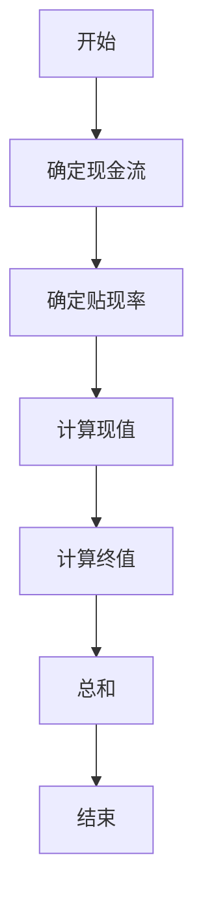
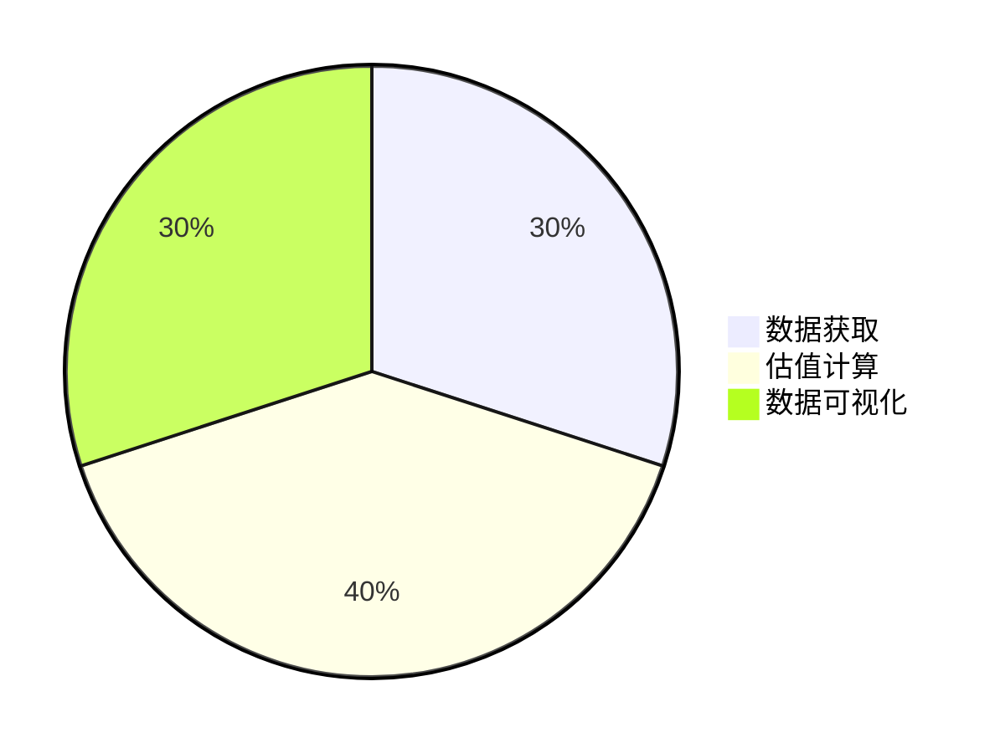
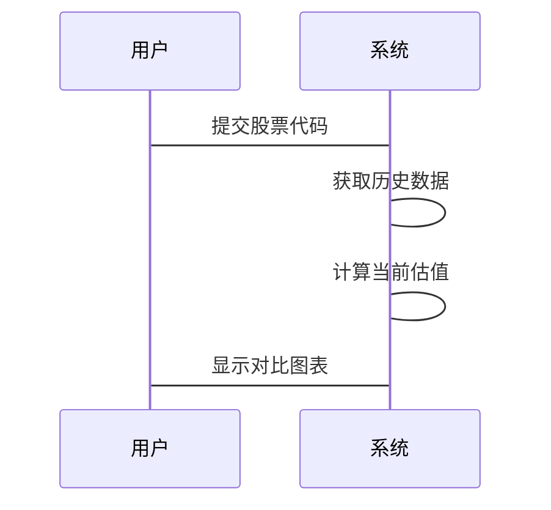

                 


# 股票市场估值：历史高点与当前水平的比较

## 关键词：
股票估值，历史高点，当前水平，DCF模型，市盈率，市净率，投资决策

## 摘要：
本文详细探讨股票市场估值的核心概念、算法原理、系统架构设计以及项目实战。通过分析历史高点与当前估值水平的差异，结合数学模型和Python代码，帮助读者理解股票估值的复杂性和实际应用。文章结构包括背景介绍、核心概念、算法流程图、系统架构图、代码实现和案例分析，旨在为投资者和数据科学家提供深入的指导。

---

## 第一部分：股票市场估值概述

### 第1章：股票市场估值的背景与重要性

#### 1.1 股票市场的基本概念
股票市场是投资者交易公司股份的场所，参与者包括个人投资者、机构投资者、券商和交易所。股票市场的功能包括资金募集、价格发现和风险分散。

#### 1.2 股票估值的重要性
准确的估值是投资决策的关键。高估可能导致亏损，低估则可能错过收益。估值误差对投资回报有重大影响，尤其是在长期投资中。

#### 1.3 历史高点与当前水平的比较背景
历史高点通常是在市场繁荣时期达到的峰值，而当前水平可能处于调整或增长阶段。比较两者有助于识别市场趋势和潜在投资机会。

---

## 第二部分：股票估值的核心概念与方法

### 第2章：股票估值的核心指标

#### 2.1 常见估值指标
- **市盈率（P/E）**：股价与每股收益的比率，衡量市场对公司盈利能力的评价。
- **市净率（P/B）**：股价与每股净资产的比率，适用于评估资产密集型行业。
- **股息率（Dividend Yield）**：股息与股价的比率，反映投资的收益能力。

#### 2.2 估值指标的优缺点对比
| 指标 | 优点 | 缺点 |
|------|------|------|
| P/E | 易于计算 | 受会计政策影响 |
| P/B | 考虑资产价值 | 不适于成长型企业 |
| 股息率 | 稳定收益 | 受股息政策影响 |

#### 2.3 综合估值模型
综合考虑多个指标，如使用加权平均法，根据行业特点调整权重，以减少单一指标的局限性。

---

## 第三部分：股票估值的算法原理

### 第3章：股票估值的数学模型

#### 3.1 常用估值模型
- **现金流折现模型（DCF）**：通过预测未来现金流，计算其现值以确定股票价值。
- **市盈率模型**：基于可比公司的P/E比率进行估值。
- **市净率模型**：基于可比公司的P/B比率进行估值。

#### 3.2 DCF模型的详细解析
DCF模型公式：
$$DCF = \sum_{t=1}^{n} \frac{CF_t}{(1 + r)^t} + \frac{TV}{(1 + r)^n}$$

其中，$CF_t$为第t年的现金流，$r$为折现率，$TV$为终值。

#### 3.3 算法流程图


---

## 第四部分：系统分析与架构设计

### 第4章：股票估值系统的

#### 4.1 项目介绍
开发一个股票估值系统，集成多种估值模型，提供历史数据对比和实时估值功能。

#### 4.2 系统功能设计
- **数据获取模块**：从API获取股票数据。
- **估值计算模块**：应用DCF模型、P/E和P/B模型。
- **数据可视化模块**：生成图表对比历史与当前估值。

#### 4.3 系统架构图


#### 4.4 系统接口设计
- **API接口**：提供股票代码和日期，返回估值结果。
- **前端接口**：用户输入股票代码，显示估值图表。

#### 4.5 系统交互流程图


---

## 第五部分：项目实战

### 第5章：股票估值系统的实现

#### 5.1 环境安装
安装Python、Pandas、Matplotlib和金融数据分析库。

#### 5.2 核心代码实现
```python
import pandas as pd
import matplotlib.pyplot as plt

def calculateDCF(cf, r, tv):
    dcf = sum(cf / (1 + r)**t for t in range(len(cf))) + tv / (1 + r)**len(cf)
    return dcf

# 示例数据
cf = [100, 150, 200, 250]
r = 0.1
tv = 500
print(calculateDCF(cf, r, tv))
```

#### 5.3 案例分析
以苹果公司为例，使用DCF模型计算其估值，并与当前股价对比，分析高估或低估情况。

---

## 第六部分：总结与展望

### 第6章：总结与展望

#### 6.1 最佳实践
- 结合多种估值指标，避免单一指标的局限性。
- 定期更新模型参数，适应市场变化。

#### 6.2 小结
股票估值是投资决策的关键，了解历史高点与当前水平的差异，有助于制定合理的投资策略。

#### 6.3 注意事项
- 数据来源的可靠性。
- 模型假设的合理性。
- 市场波动对估值的影响。

#### 6.4 拓展阅读
推荐相关书籍和论文，深入学习股票估值的高级方法。

---

通过本文的详细讲解，读者可以系统地理解股票估值的核心概念、算法原理和实际应用。结合代码实现和案例分析，能够更好地应对股票市场中的估值挑战。

