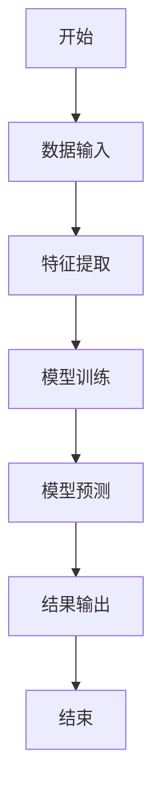
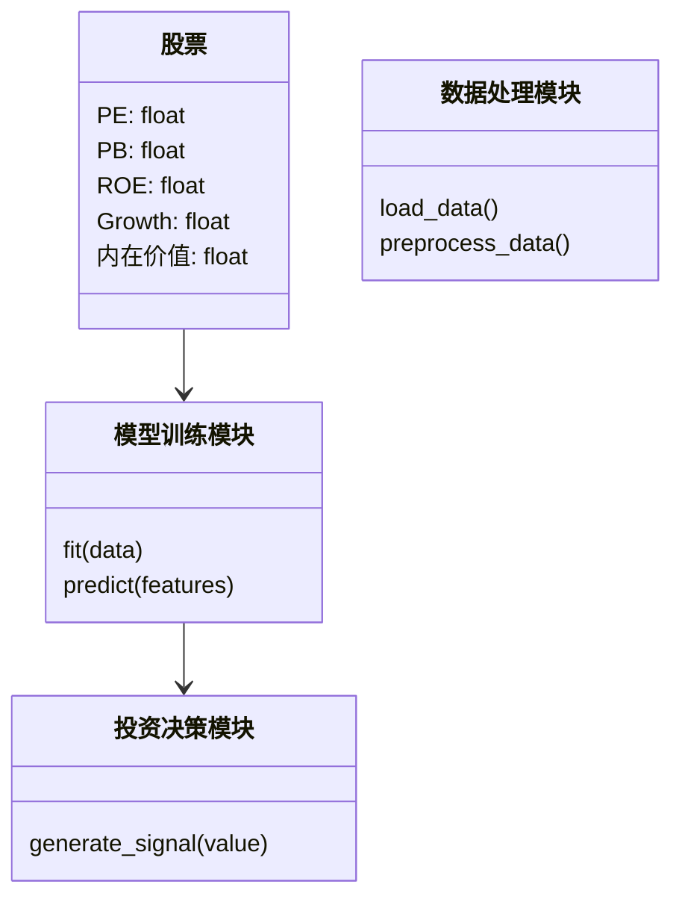
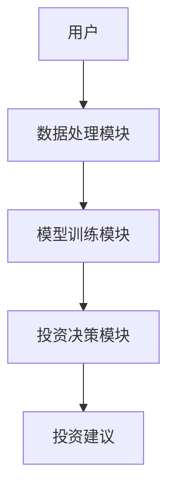

                 


# 肯尼斯·费雷尔的价值投资量化模型

> **关键词**: 价值投资、量化模型、肯尼斯·费雷尔、投资策略、数学模型、金融分析

> **摘要**:  
> 本文深入探讨了肯尼斯·费雷尔的价值投资量化模型，从背景、原理到实现进行了全面分析。通过对比传统价值投资与量化模型，结合数学公式和系统架构设计，详细讲解了该模型的核心思想、算法原理及实际应用。文章最后通过项目实战展示了模型的实现过程，并提出了改进建议和未来研究方向。

---

# 第一部分: 价值投资量化模型的背景与核心概念

## 第1章: 价值投资与量化模型概述

### 1.1 价值投资的基本概念

#### 1.1.1 价值投资的定义与核心思想
- **价值投资**是一种以基本面分析为基础的投资策略，旨在通过识别市场价格低于其内在价值的资产进行投资。
- 核心思想：寻找市场低估的资产，长期持有，等待市场回归其真实价值。

#### 1.1.2 量化投资的定义与特点
- **量化投资**：通过数学模型和算法，利用计算机技术进行投资决策。
- 特点：高效、低延迟、基于数据驱动的决策。

#### 1.1.3 价值投资与量化模型的结合
- 将价值投资的核心思想与量化模型相结合，利用数据驱动的方式筛选低估资产。

### 1.2 肯尼斯·费雷尔的价值投资理论

#### 1.2.1 肯尼斯·费雷尔的学术背景与贡献
- 费雷尔是金融领域的权威专家，专注于价值投资与量化模型的结合。
- 提出了一套基于基本面分析的量化投资模型，为现代投资理论提供了新的视角。

#### 1.2.2 费雷尔模型的核心思想
- **核心思想**：通过量化方法评估资产的内在价值，识别市场价格低于内在价值的资产。
- **关键假设**：市场短期波动，但长期会回归基本面。

#### 1.2.3 费雷尔模型在现代投资中的应用
- 广泛应用于机构投资、量化交易和智能投顾等领域。

### 1.3 价值投资量化模型的应用背景

#### 1.3.1 传统价值投资的局限性
- **低效性**：人工分析耗时耗力，难以处理海量数据。
- **主观性**：依赖分析师的判断，存在主观偏差。

#### 1.3.2 量化模型在投资决策中的优势
- **高效性**：快速处理海量数据，提供实时决策支持。
- **客观性**：基于数学模型，减少人为情绪干扰。

#### 1.3.3 当前市场环境下的量化投资趋势
- 数据量激增、算法优化、计算能力提升为量化投资提供了技术基础。
- 量化模型在高频交易、智能投顾中的应用越来越广泛。

---

## 第2章: 价值投资量化模型的核心概念与联系

### 2.1 核心概念原理

#### 2.1.1 股票估值的核心要素
- **市盈率（PE）**：市价与每股收益的比率。
- **市净率（PB）**：市价与每股净资产的比率。
- **股息率**：股息与股价的比率。

#### 2.1.2 费雷尔模型的数学表达
- 费雷尔模型通过多因子模型评估股票的内在价值：
  $$ V = a \cdot PE + b \cdot PB + c \cdot ROE + d \cdot Growth $$
  其中，$a, b, c, d$为权重，$PE$为市盈率，$PB$为市净率，$ROE$为净资产收益率，$Growth$为收入增长率。

#### 2.1.3 模型的输入变量与输出结果
- **输入变量**：股票的财务数据（如PE、PB、ROE等）和市场数据（如市场指数、波动率）。
- **输出结果**：股票的内在价值评分和投资建议。

### 2.2 核心概念对比分析

#### 2.2.1 传统价值投资与量化模型的对比
| 特性             | 传统价值投资                 | 量化模型                   |
|------------------|------------------------------|----------------------------|
| 数据来源         | 主要依赖财务报表和行业分析     | 包括市场数据、历史数据等    |
| 决策过程         | 主观判断为主                 | 数据驱动，量化决策          |
| 处理效率         | 较低，依赖人工分析             | 高效，计算机自动处理         |

#### 2.2.2 不同量化模型的优缺点分析
| 模型             | 优点                          | 缺点                          |
|------------------|-------------------------------|-----------------------------|
| CAPM             | 理论基础坚实，考虑系统性风险    | 忽略非系统性风险，简化假设    |
| 多因子模型       | 考虑多个因子，结果更稳健       | 参数选择复杂，可能过拟合      |
| 费雷尔模型       | 结合基本面与市场数据，结果实用   | 对数据质量和模型假设敏感      |

#### 2.2.3 费雷尔模型与其他模型的对比
- **与CAPM模型对比**：费雷尔模型更注重基本面分析，而CAPM更关注市场风险。
- **与多因子模型对比**：费雷尔模型在因子选择上更偏向于价值投资的核心指标。

### 2.3 ER实体关系图架构

```mermaid
graph TD
    A[股票] --> B[市盈率(PE)]
    A --> C[市净率(PB)]
    A --> D[净资产收益率(ROE)]
    A --> E[收入增长率(Growth)]
    B --> F[内在价值评分]
    C --> F
    D --> F
    E --> F
    F --> G[投资建议]
```

---

# 第二部分: 价值投资量化模型的算法原理

## 第3章: 费雷尔模型的算法原理

### 3.1 算法原理概述

#### 3.1.1 模型的基本假设
- 股票的内在价值可以通过基本面指标加权计算。
- 市场价格短期波动，但长期会回归内在价值。

#### 3.1.2 数据预处理与特征选择
- 数据清洗：处理缺失值、异常值。
- 特征选择：选取PE、PB、ROE、Growth等核心指标。

#### 3.1.3 模型的训练与优化
- 使用历史数据训练模型，调整权重，优化参数。

### 3.2 算法流程图



### 3.3 算法实现代码

```python
import pandas as pd
import numpy as np

# 示例数据加载
data = pd.read_csv('stock_data.csv')

# 特征选择
features = data[['PE', 'PB', 'ROE', 'Growth']]

# 标准化处理
from sklearn.preprocessing import StandardScaler
scaler = StandardScaler()
features_scaled = scaler.fit_transform(features)

# 模型训练
from sklearn.linear_model import LinearRegression
model = LinearRegression()
model.fit(features_scaled, data['Value'])

# 模型预测
predictions = model.predict(features_scaled)
```

### 3.4 数学模型的详细讲解

#### 3.4.1 费雷尔模型的数学公式
- 内在价值计算公式：
  $$ V = a \cdot PE + b \cdot PB + c \cdot ROE + d \cdot Growth $$
- 模型权重确定方法：
  - 使用回归分析确定各因子的权重。
  - 根据因子的重要性进行调整。

#### 3.4.2 示例计算
- 假设某股票的PE=15，PB=2，ROE=10%，Growth=5%。
- 假设权重为$a=0.4$, $b=0.3$, $c=0.2$, $d=0.1$。
- 计算内在价值：
  $$ V = 0.4 \times 15 + 0.3 \times 2 + 0.2 \times 10 + 0.1 \times 5 = 6 + 0.6 + 2 + 0.5 = 9.1 $$

---

## 第4章: 系统分析与架构设计方案

### 4.1 系统功能设计

#### 4.1.1 领域模型类图



### 4.2 系统架构设计

#### 4.2.1 系统架构图



---

## 第5章: 项目实战

### 5.1 环境安装

```bash
pip install pandas numpy scikit-learn
```

### 5.2 核心实现代码

```python
import pandas as pd
from sklearn.linear_model import LinearRegression
from sklearn.preprocessing import StandardScaler

# 数据加载
data = pd.read_csv('stock_data.csv')

# 特征选择
features = data[['PE', 'PB', 'ROE', 'Growth']]

# 标准化处理
scaler = StandardScaler()
features_scaled = scaler.fit_transform(features)

# 模型训练
model = LinearRegression()
model.fit(features_scaled, data['Value'])

# 预测结果
predictions = model.predict(features_scaled)
```

### 5.3 案例分析

#### 5.3.1 数据分析与回测
- 使用历史数据回测模型的预测能力。
- 计算模型的准确率、召回率等评价指标。

#### 5.3.2 结果解读与优化
- 根据回测结果调整模型参数。
- 引入更多的因子或优化权重分配。

---

## 第6章: 总结与展望

### 6.1 总结
- 本文详细介绍了肯尼斯·费雷尔的价值投资量化模型，从理论到实现进行了全面分析。
- 费雷尔模型结合了基本面分析与量化方法，具有高效性和客观性。

### 6.2 注意事项
- 模型的有效性依赖于高质量的数据和合理的参数设置。
- 需要结合市场环境和实际需求进行调整。

### 6.3 拓展阅读
- 推荐阅读《量化投资：基于Python的算法投资实战》。
- 关注学术期刊中的相关研究论文。

---

通过本文的分析，读者可以系统地理解肯尼斯·费雷尔的价值投资量化模型，并将其应用于实际投资中。

