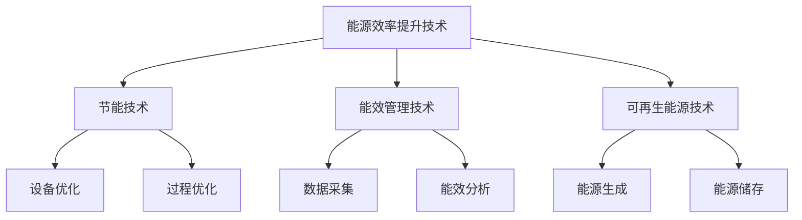
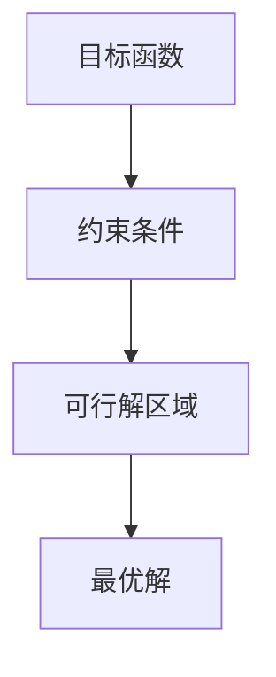
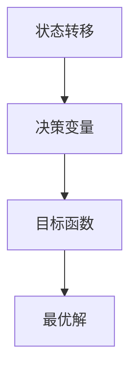
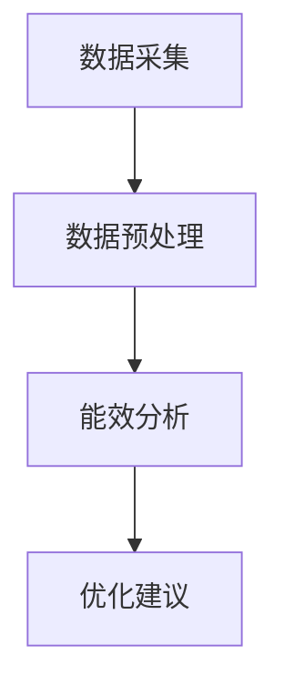
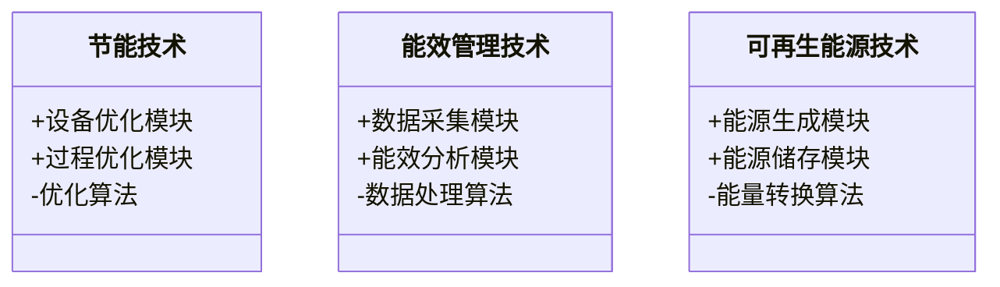
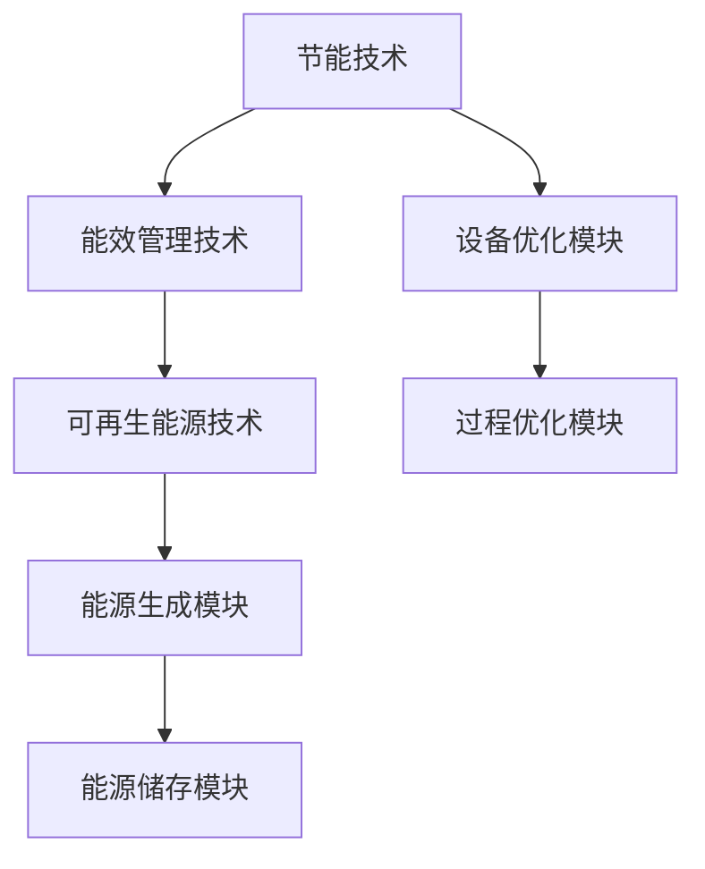

                 


# 《能源效率提升技术的投资价值评估》

---

## 关键词：
能源效率，投资价值，技术分析，节能优化，能效管理，可再生能源，算法原理

---

## 摘要：
本文系统分析能源效率提升技术的投资价值，涵盖技术背景、核心概念、算法原理、系统设计和实际案例。通过对比各类技术，评估其经济收益与环境效益，为投资者提供科学决策依据。

---

## 第1章: 能源效率提升技术的背景与现状

### 1.1 能源效率提升的重要性
#### 1.1.1 全球能源消耗现状与挑战
能源消耗持续增长，化石能源短缺和环境污染问题日益严重，能源效率提升是应对挑战的关键。

#### 1.1.2 能源效率提升对可持续发展的意义
减少能源浪费，降低碳排放，推动绿色经济，促进可持续发展。

#### 1.1.3 当前能源效率技术的瓶颈与突破点
现有技术效率有限，需突破技术创新和成本瓶颈。

---

### 1.2 能源效率提升技术的定义与分类
#### 1.2.1 能源效率的定义与衡量标准
能源效率是指输出的有用能量与输入的总能量之比，衡量标准包括设备效率和系统效率。

#### 1.2.2 能源效率提升技术的主要分类
1. **节能技术**：优化设备和工艺，减少能量浪费。
2. **能效管理技术**：通过智能系统优化能源使用。
3. **可再生能源技术**：利用可再生能源减少化石能源依赖。

#### 1.2.3 各类技术的优缺点对比
| 技术类型       | 优点                     | 缺点                     |
|----------------|--------------------------|--------------------------|
| 节能技术       | 成本低，易实施             | 效果有限，依赖技术支持     |
| 能效管理技术     | 高效，智能化               | 初始投资高，依赖数据质量     |
| 可再生能源技术   | 环保，可持续               | 不稳定性，存储成本高         |

---

### 1.3 能源效率提升技术的现状与趋势
#### 1.3.1 全球能源效率技术的发展现状
全球范围内的节能技术逐渐成熟，能效管理技术快速发展，可再生能源技术应用广泛。

#### 1.3.2 各国能源效率提升政策与法规
政府出台多项政策，例如补贴、税收优惠和强制性标准，推动能源效率提升。

#### 1.3.3 未来能源效率技术的发展趋势
智能化、数字化和绿色化将是未来发展的主要方向。

---

## 第2章: 能源效率提升技术的核心概念与联系

### 2.1 核心概念原理
#### 2.1.1 能源效率提升的原理与机制
通过优化能源使用和减少浪费，提升能源使用效率。

#### 2.1.2 各类技术的实现方式与数学模型
- 节能技术：设备优化，目标函数为 $C_{\text{min}} = \sum c_i x_i$，约束条件为 $x_i \leq 1$。
- 能效管理技术：数据采集与分析，目标函数为 $E_{\text{max}} = \sum \alpha_i x_i$，约束条件为 $x_i \leq 1$。
- 可再生能源技术：能量转换与储存，目标函数为 $P_{\text{max}} = \sum p_i x_i$，约束条件为 $x_i \leq 1$。

#### 2.1.3 技术之间的协同效应与相互作用
各类技术协同工作，形成完整的能源管理体系。

---

### 2.2 核心概念属性特征对比
| 技术类型       | 属性特征                       |
|----------------|--------------------------------|
| 节能技术       | 成本低，易于实施，依赖设备优化   |
| 能效管理技术     | 智能化，依赖数据采集与分析       |
| 可再生能源技术   | 环保，可持续，依赖能源转换效率     |

---

### 2.3 ER实体关系图架构


---

## 第3章: 能源效率提升技术的算法原理

### 3.1 节能优化算法
#### 3.1.1 线性规划算法


#### 3.1.2 动态规划算法


---

### 3.2 能效管理算法
#### 3.2.1 数据采集与分析算法


---

### 3.3 可再生能源优化算法
#### 3.3.1 光伏发电优化算法
```python
# 光伏发电优化算法
import numpy as np

def solar_optimization(panel_angle, light_intensity):
    max_efficiency = 0
    optimal_angle = 0
    for angle in panel_angle:
        efficiency = light_intensity * np.sin(angle * np.pi / 180)
        if efficiency > max_efficiency:
            max_efficiency = efficiency
            optimal_angle = angle
    return optimal_angle, max_efficiency
```

---

## 第4章: 能源效率提升技术的系统分析与架构设计

### 4.1 系统功能设计


---

### 4.2 系统架构设计


---

## 第5章: 能源效率提升技术的项目实战

### 5.1 实际案例分析
#### 5.1.1 某企业能效提升项目
- **目标**：降低能源消耗，提升生产效率。
- **技术选择**：采用能效管理技术和节能技术。
- **实施效果**：能源消耗降低15%，投资回报周期为2年。

---

## 第6章: 最佳实践与总结

### 6.1 投资价值评估关键点
1. **技术成熟度**：技术越成熟，投资风险越低。
2. **经济效益**：投资回报周期短，经济价值显著。
3. **环境效益**：减少碳排放，符合可持续发展理念。

### 6.2 小结
能源效率提升技术具有重要的投资价值，技术发展迅速，应用前景广阔。

### 6.3 注意事项
- 技术选择需结合实际场景。
- 初期投资较大，需合理规划。

### 6.4 拓展阅读
建议阅读相关领域的学术论文和技术报告，深入了解各类技术的最新进展。

---

## 结语：
能源效率提升技术的投资价值显著，未来将成为推动全球可持续发展的重要力量。

