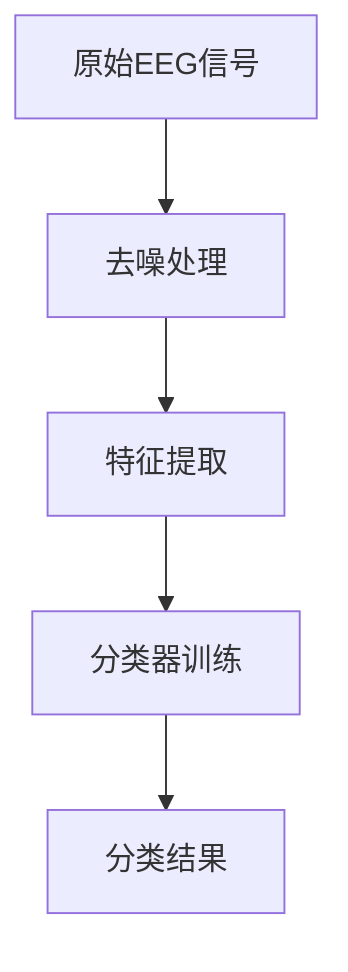
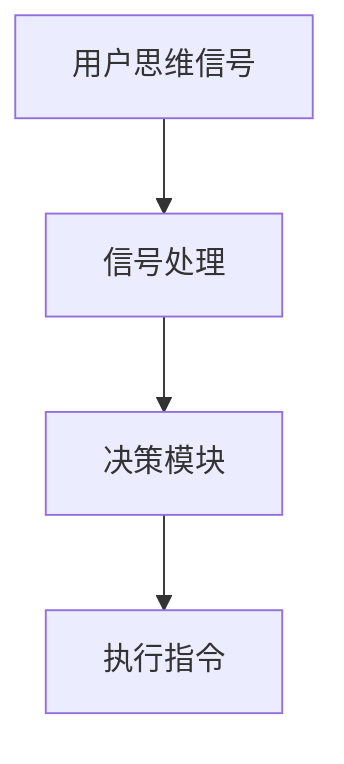
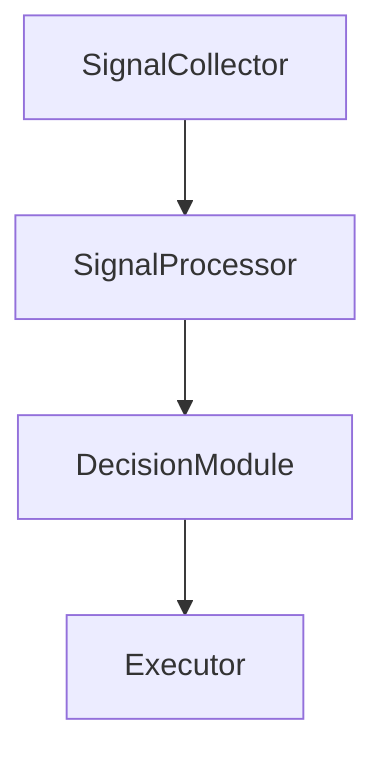

                 


# 脑机接口+AI：直接用思维控制的AI Agent

## 关键词：
- 脑机接口（BCI）
- 人工智能（AI）
- AI代理
- 思维控制
- 神经信号处理
- 强化学习

## 摘要：
脑机接口（BCI）与人工智能（AI）的结合为人类与AI代理之间的交互开辟了新的可能性。通过直接解析人类的神经信号，AI代理能够实时响应用户的思维指令，从而实现更高效的人机协作。本文将详细探讨脑机接口的工作原理、AI代理的核心机制，以及两者结合的实际应用。通过分析信号处理算法、系统架构设计和项目实战，本文为读者提供一个全面理解脑机接口+AI系统的框架。

---

# 第1章 脑机接口与AI代理的背景介绍

## 1.1 脑机接口的基本概念
### 1.1.1 脑机接口的定义与核心概念
脑机接口（Brain-Computer Interface，BCI）是一种能够直接读取和解析人类大脑神经信号的技术，旨在将人的思维转化为计算机可识别的指令。其核心概念包括：
- **神经信号采集**：通过传感器采集大脑产生的电信号（如EEG、EMG等）。
- **信号处理**：对采集到的信号进行降噪、特征提取和分类。
- **指令生成**：将处理后的信号转化为具体的控制指令。

### 1.1.2 AI代理的基本概念与特点
AI代理（AI Agent）是一种智能体，能够感知环境、自主决策并执行任务。其特点包括：
- **自主性**：能够在没有外部干预的情况下独立运行。
- **反应性**：能够实时感知环境变化并做出响应。
- **学习能力**：通过机器学习算法不断优化决策策略。

### 1.1.3 脑机接口与AI代理的结合背景
随着技术的发展，脑机接口与AI代理的结合成为可能。通过将AI代理接入脑机接口系统，用户可以直接通过思维控制AI代理执行任务，这在医疗康复、人机协作等领域具有重要应用价值。

---

## 1.2 脑机接口的工作原理
### 1.2.1 神经信号的采集与处理
神经信号的采集通常通过 EEG（脑电图）传感器完成，采集的信号需要经过预处理，包括：
- **去噪**：去除噪声，提取有用的信号。
- **特征提取**：提取信号中的特征（如波形、频率等）。
- **分类**：通过机器学习算法对信号进行分类，生成控制指令。

### 1.2.2 脑电信号的特征提取
常用的特征提取方法包括：
- **时域特征**：均值、标准差、峰峰值等。
- **频域特征**：功率谱密度、频带能量等。
- **时频域特征**：小波变换分析。

### 1.2.3 脑机接口的分类与应用
脑机接口可以分为侵入式和非侵入式两类，应用领域包括：
- 医疗康复：帮助瘫痪患者控制假肢。
- 游戏娱乐：通过思维控制游戏中的角色。
- 人机协作：实现高效的协作任务。

---

## 1.3 AI代理的核心机制
### 1.3.1 AI代理的基本架构
AI代理通常包括感知模块、决策模块和执行模块：
- **感知模块**：接收外部环境信息。
- **决策模块**：基于感知信息做出决策。
- **执行模块**：执行决策指令。

### 1.3.2 AI代理的决策机制
常用的决策机制包括：
- **规则驱动**：基于预定义的规则进行决策。
- **学习驱动**：基于机器学习模型进行预测和决策。
- **混合驱动**：结合规则和学习的混合策略。

### 1.3.3 AI代理与人类的交互方式
- **直接控制**：用户通过思维指令直接控制AI代理。
- **间接控制**：通过脑机接口间接影响AI代理的决策。

---

## 1.4 脑机接口与AI代理的结合意义
### 1.4.1 提升人机交互的效率
通过直接解析用户的思维信号，AI代理能够更快速地响应用户的指令。

### 1.4.2 扩展人类认知能力
AI代理可以帮助人类处理复杂的任务，扩展人类的认知能力。

### 1.4.3 脑机接口+AI的未来潜力
随着技术的进步，脑机接口与AI的结合将在医疗、教育、娱乐等领域发挥更大的作用。

---

## 1.5 脑机接口与AI代理的结合示例
一个简单的脑机接口+AI系统可以用于控制机器人执行特定任务。例如，用户通过思维指令告诉AI代理移动到某个位置，AI代理通过解析用户的神经信号生成相应的控制指令。

---

# 第2章 脑机接口信号处理的算法原理

## 2.1 脑机接口信号处理的核心算法
### 2.1.1 基于EEG信号的特征提取算法
常用的特征提取算法包括：
- **主成分分析（PCA）**：降维技术，用于提取信号的主要特征。
- **小波变换**：用于时频域特征的提取。

### 2.1.2 基于机器学习的分类算法
常用的分类算法包括：
- **支持向量机（SVM）**：适用于小样本数据的分类。
- **随机森林**：适用于特征较多的情况。
- **深度学习模型（如CNN）**：适用于复杂的特征提取任务。

### 2.1.3 基于深度学习的信号处理模型
深度学习模型在EEG信号处理中的应用包括：
- **卷积神经网络（CNN）**：用于特征提取和分类。
- **递归神经网络（RNN）**：用于时序信号的处理。

---

## 2.2 AI代理决策机制的算法原理
### 2.2.1 强化学习在AI代理中的应用
强化学习是一种通过奖励机制优化决策策略的方法，常用的算法包括：
- **Q-Learning**：基于状态-动作-奖励的模型。
- **Deep Q-Network（DQN）**：结合深度学习的强化学习算法。

### 2.2.2 基于神经网络的决策模型
神经网络在AI代理决策中的应用包括：
- **全连接网络**：用于分类任务。
- **卷积神经网络**：用于图像识别任务。

### 2.2.3 联合优化算法的设计
脑机接口与AI代理的联合优化算法需要同时优化信号处理和决策模块，常用的方法包括：
- **端到端训练**：将信号处理和决策模块作为一个整体进行训练。
- **分步优化**：分别优化信号处理和决策模块，再进行联合训练。

---

## 2.3 算法实现的数学模型与公式
### 2.3.1 EEG信号处理的数学模型
假设我们有一个EEG信号序列$X = \{x_1, x_2, ..., x_n\}$，通过PCA降维得到主成分$Y = \{y_1, y_2, ..., y_m\}$，其中$m < n$。

### 2.3.2 基于LSTM的序列建模公式
LSTM的结构包括输入门、遗忘门和输出门，其更新公式为：
$$
i_t = \sigma(W_i x_t + U_i h_{t-1} + b_i)
$$
$$
f_t = \sigma(W_f x_t + U_f h_{t-1} + b_f)
$$
$$
o_t = \sigma(W_o x_t + U_o h_{t-1} + b_o)
$$
$$
h_t = i_t \cdot \tilde{h}_t + f_t \cdot h_{t-1}
$$
其中，$i_t$、$f_t$、$o_t$分别为输入门、遗忘门和输出门，$\tilde{h}_t$为候选隐藏层状态。

### 2.3.3 强化学习的数学表达式
强化学习的目标是最大化累积奖励，其目标函数为：
$$
J = \mathbb{E}[\sum_{t=0}^{\infty} \gamma^t r_t]
$$
其中，$\gamma$为折扣因子，$r_t$为第$t$步的奖励。

---

## 2.4 算法实现的流程图
### 2.4.1 EEG信号处理流程图（mermaid）


### 2.4.2 AI代理决策流程图（mermaid）


---

# 第3章 脑机接口与AI代理的系统架构设计

## 3.1 系统整体架构设计
### 3.1.1 系统模块划分
- **信号采集模块**：负责采集神经信号。
- **信号处理模块**：负责信号的预处理和特征提取。
- **决策模块**：负责基于特征的决策。
- **执行模块**：负责执行决策指令。

### 3.1.2 系统功能模块的交互关系


### 3.1.3 系统架构的可扩展性设计
系统架构设计需要考虑模块的独立性和可扩展性，例如通过接口标准化和模块化设计。

---

## 3.2 系统功能设计
### 3.2.1 脑机接口数据采集模块
数据采集模块包括硬件设备（如EEG传感器）和采集软件。

### 3.2.2 AI代理决策模块
决策模块基于机器学习模型进行决策。

### 3.2.3 用户反馈与优化模块
用户反馈用于优化系统性能。

---

## 3.3 系统架构的详细设计
### 3.3.1 分层架构设计
- **数据采集层**：负责信号采集。
- **数据处理层**：负责信号处理和特征提取。
- **决策层**：负责决策和指令生成。
- **执行层**：负责执行指令。

### 3.3.2 模块间的接口设计
- **信号采集模块接口**：提供采集到的信号数据。
- **信号处理模块接口**：提供处理后的特征数据。
- **决策模块接口**：提供决策指令。

### 3.3.3 系统的容错与纠错机制
包括异常检测、错误恢复等机制。

---

## 3.4 系统架构的mermaid图
### 3.4.1 系统模块关系图


### 3.4.2 数据流设计图


---

# 第4章 脑机接口与AI代理的项目实战

## 4.1 项目环境搭建
### 4.1.1 硬件设备的安装与配置
需要EEG传感器和相关硬件。

### 4.1.2 软件环境的安装与配置
安装Python、深度学习框架（如TensorFlow、PyTorch）等。

### 4.1.3 开发工具的安装与配置
安装Jupyter Notebook、PyCharm等开发工具。

---

## 4.2 系统核心实现
### 4.2.1 脑机接口数据采集代码实现
```python
import numpy as np
from scipy.signal import butterworth

def preprocess_eeg(signal):
    # 去噪处理
    filtered_signal = butterworth(signal, cutoff=50, order=2)
    return filtered_signal
```

### 4.2.2 AI代理决策模块代码实现
```python
from sklearn.svm import SVC

def train_classifier(features, labels):
    clf = SVC()
    clf.fit(features, labels)
    return clf
```

### 4.2.3 代码应用解读与分析
代码实现了信号预处理和分类器训练，其中预处理模块去除了噪声，分类器模块基于SVM进行分类。

---

## 4.3 实际案例分析和详细讲解剖析
以一个简单的案例为例，用户通过思维指令控制AI代理移动到指定位置。系统首先采集用户的EEG信号，经过预处理和特征提取后，分类器生成控制指令，AI代理执行指令。

---

## 4.4 项目小结
通过项目实战，我们验证了脑机接口与AI代理结合的可行性，并展示了其实现过程。

---

# 第5章 最佳实践、小结、注意事项与拓展阅读

## 5.1 最佳实践
- **数据质量**：确保采集到的神经信号质量。
- **模型优化**：不断优化信号处理和决策算法。
- **用户体验**：注重用户的使用体验。

## 5.2 小结
脑机接口与AI代理的结合为人类与AI的交互提供了新的可能。通过本文的介绍，我们了解了脑机接口的工作原理、AI代理的核心机制，以及两者结合的实现方法。

## 5.3 注意事项
- **数据隐私**：注意保护用户的神经信号数据。
- **系统稳定性**：确保系统的稳定性和可靠性。
- **伦理问题**：关注脑机接口与AI结合的伦理问题。

## 5.4 拓展阅读
- **相关书籍**：《脑机接口入门与实践》
- **学术论文**：推荐几篇关于脑机接口与AI结合的经典论文。

---

# 总结

脑机接口与AI的结合是一个充满潜力的领域，通过不断的技术进步和创新，我们相信未来的AI代理将更加智能化，能够更好地服务于人类社会。

