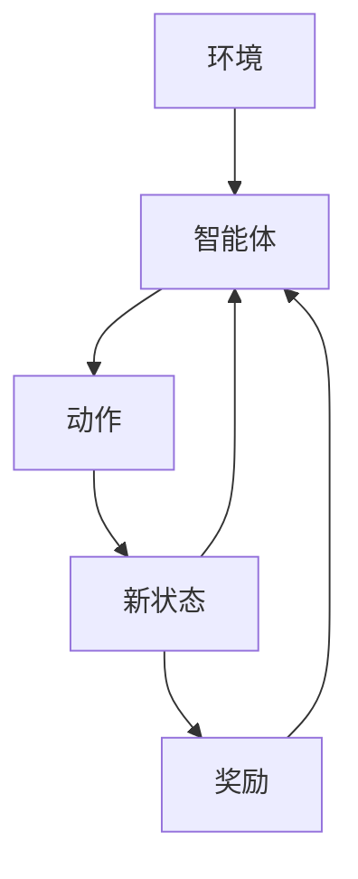
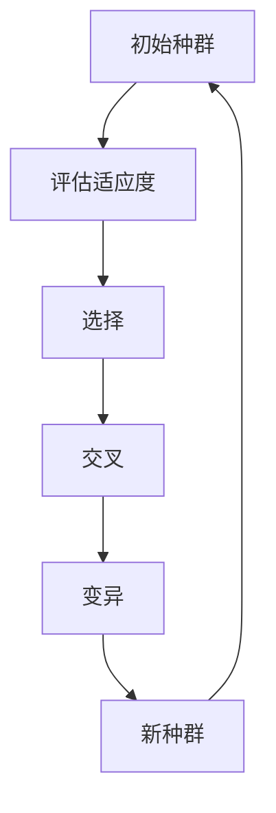
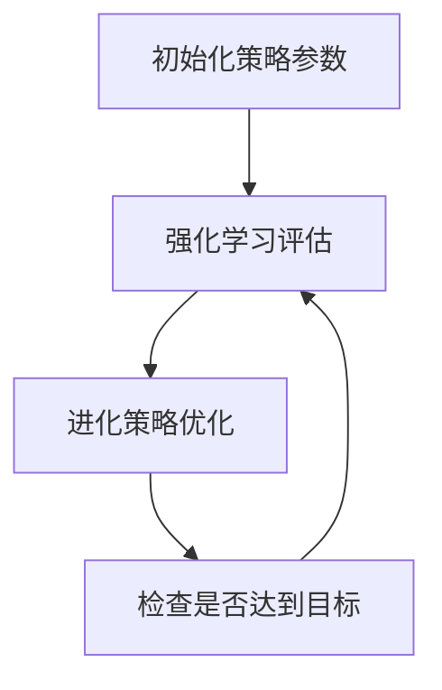
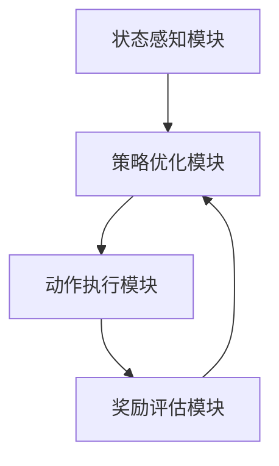
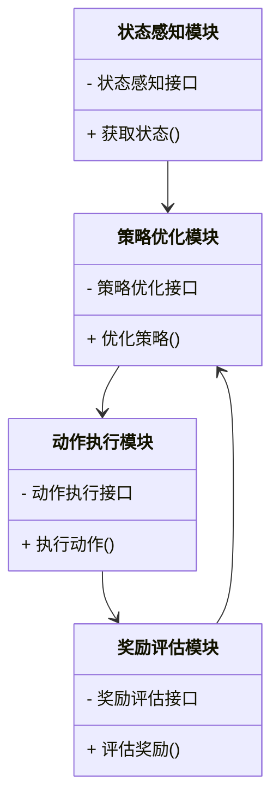

                 


# 自主学习型AI Agent：持续进化的智能体

> **关键词**：自主学习型AI Agent，持续进化，强化学习，进化策略，系统架构，项目实战

> **摘要**：本文深入探讨了自主学习型AI Agent的核心概念、算法原理、系统架构及实际应用。通过分析强化学习、进化策略等关键算法，结合系统设计与项目实战，展示了如何构建一个能够持续进化和适应复杂环境的智能体。文章内容详实，结合理论与实践，适合技术开发者、研究人员和对AI领域感兴趣的读者阅读。

---

## 第一章：自主学习型AI Agent的背景与概念

### 1.1 自主学习型AI Agent的背景

#### 1.1.1 人工智能的发展历程

人工智能（AI）技术在过去几十年中取得了显著的进步，从早期的专家系统到现在的深度学习和强化学习，AI技术已经渗透到各个领域。当前，AI Agent（智能体）作为一种能够在环境中感知、决策和行动的实体，正成为研究的热点。

#### 1.1.2 自主学习的必要性

传统AI系统通常依赖于大量的人工干预和预定义规则，而自主学习型AI Agent能够通过与环境的交互，自主发现规律、优化策略并适应变化。这种能力在动态复杂的环境中尤为重要，例如自动驾驶、机器人控制和游戏AI等领域。

#### 1.1.3 当前AI Agent的发展现状

当前，AI Agent已经广泛应用于多个领域。例如，智能助手（如Siri、Alexa）能够通过用户的指令执行任务；自动驾驶汽车能够在复杂的交通环境中做出实时决策；游戏AI则能够通过强化学习不断提升游戏水平。然而，现有的AI Agent在自主学习能力方面仍有提升空间，尤其是在复杂环境下的持续进化和适应能力。

---

### 1.2 自主学习型AI Agent的定义

#### 1.2.1 AI Agent的基本概念

AI Agent是一种能够感知环境、执行动作并优化目标的智能实体。它可以是一个软件程序，也可以是一个物理设备（如机器人）。AI Agent的核心目标是通过与环境的交互，实现特定任务的目标。

#### 1.2.2 自主学习的核心特征

自主学习型AI Agent的核心特征在于其能够通过与环境的交互，自主学习和优化策略，而无需依赖外部的人工干预。这种能力使得AI Agent能够在动态变化的环境中持续进化，适应新的挑战。

#### 1.2.3 自主学习型AI Agent的分类

自主学习型AI Agent可以根据学习方式、目标类型和环境类型进行分类。常见的分类方式包括：

1. **基于强化学习的AI Agent**：通过与环境交互，根据奖励信号优化策略。
2. **基于模仿学习的AI Agent**：通过观察和模仿他人的行为来学习。
3. **基于进化策略的AI Agent**：通过模拟生物进化过程，优化策略。

---

### 1.3 自主学习型AI Agent的应用场景

#### 1.3.1 智能助手与个人助理

自主学习型AI Agent可以作为智能助手，帮助用户完成日常任务，例如日程管理、信息检索和任务执行。

#### 1.3.2 自动驾驶与机器人控制

在自动驾驶和机器人控制领域，自主学习型AI Agent可以通过强化学习和进化策略，优化驾驶策略和动作规划。

#### 1.3.3 在游戏AI与策略优化中的应用

自主学习型AI Agent在游戏领域具有广泛的应用，例如在电子游戏中通过强化学习优化游戏策略，或在策略游戏中模拟对手行为。

#### 1.3.4 自主学习型AI Agent在企业中的应用

在企业中，自主学习型AI Agent可以用于优化业务流程、自动化决策和风险管理。

---

### 1.4 自主学习型AI Agent的核心优势

#### 1.4.1 提高效率与决策能力

通过自主学习，AI Agent可以快速适应环境变化，提高决策效率和准确性。

#### 1.4.2 适应动态变化的环境

自主学习型AI Agent能够通过与环境的持续交互，实时优化策略，适应动态变化的环境。

#### 1.4.3 实现自我优化与进化

通过强化学习和进化策略，自主学习型AI Agent可以不断优化自身性能，实现自我进化。

---

### 1.5 本章小结

本章介绍了自主学习型AI Agent的背景、定义和应用场景，并探讨了其核心优势。通过这些内容，读者可以理解自主学习型AI Agent的基本概念和重要性，为后续章节的学习打下基础。

---

## 第二章：自主学习的核心算法

### 2.1 强化学习算法

#### 2.1.1 强化学习的基本原理

强化学习是一种通过与环境交互，根据奖励信号优化策略的算法。其核心思想是智能体通过不断地尝试和错误，找到能够获得最大累计奖励的策略。

#### 2.1.2 常见强化学习算法

1. **Q-Learning**：一种经典的值迭代算法，适用于离散状态和动作空间。
2. **Deep Q-Network（DQN）**：通过深度神经网络近似Q值函数，适用于连续状态空间。
3. **策略梯度方法（Policy Gradient）**：直接优化策略，适用于连续动作空间。

#### 2.1.3 策略梯度方法

策略梯度方法通过优化策略的参数，直接最大化奖励函数。其优点是能够处理连续的动作空间，但算法的收敛性可能较差。

---

#### 强化学习的基本流程图



---

#### Q-Learning的数学模型

$$ Q(s, a) = Q(s, a) + \alpha [r + \max_{a'} Q(s', a') - Q(s, a)] $$

其中，$\alpha$ 是学习率，$r$ 是奖励，$s$ 是当前状态，$a$ 是当前动作，$s'$ 是新状态。

---

### 2.2 进化策略

#### 2.2.1 进化算法的基本概念

进化算法是一种基于生物进化原理的优化算法，主要包括选择、交叉和变异三个步骤。

#### 2.2.2 进化策略在自主学习中的应用

进化策略通过模拟生物进化过程，优化AI Agent的策略参数。其优点是能够处理高维状态空间和复杂的环境。

#### 2.2.3 基于遗传算法的优化方法

遗传算法通过编码策略参数，进行选择、交叉和变异操作，生成新的策略参数。其核心思想是通过模拟自然选择的过程，优化策略参数。

---

#### 进化策略的流程图



---

### 2.3 模仿学习与迁移学习

#### 2.3.1 模仿学习的基本原理

模仿学习是一种通过观察和模仿他人行为来学习的方法。其核心思想是通过监督学习的方式，学习专家的行为策略。

#### 2.3.2 迁移学习在自主学习中的作用

迁移学习通过将已有的知识迁移到新的任务中，提高学习效率和性能。

#### 2.3.3 联合学习与知识共享

联合学习通过多个智能体之间的知识共享，提高整体的性能和适应能力。

---

### 2.4 自主学习算法的数学模型

#### 2.4.1 强化学习的数学模型

强化学习的数学模型主要包括状态值函数、动作值函数和策略函数。其中，动作值函数 $Q(s, a)$ 表示在状态 $s$ 下执行动作 $a$ 的期望累计奖励。

$$ Q(s, a) = \mathbb{E}[r + \gamma Q(s', a')] $$

其中，$\gamma$ 是折扣因子。

#### 2.4.2 进化策略的数学模型

进化策略的数学模型主要包括适应度函数、选择函数和变异函数。适应度函数用于评估策略的性能，选择函数用于选择优秀的个体，变异函数用于生成新的个体。

#### 2.4.3 模仿学习的数学模型

模仿学习的数学模型主要包括专家策略、监督学习和策略优化。通过监督学习的方式，学习专家的策略。

---

### 2.5 算法的比较与选择

#### 2.5.1 强化学习与进化策略的比较

| 特性         | 强化学习          | 进化策略          |
|--------------|------------------|------------------|
| 学习方式      | 增量式学习        | 批量式学习        |
| 状态空间      | 离散/连续         | 离散/连续         |
| 动作空间      | 离散/连续         | 离散/连续         |
| 算法复杂度    | 较低             | 较高             |
| 应用场景      | 适合在线优化     | 适合离线优化     |

#### 2.5.2 算法选择的考虑因素

在选择算法时，需要考虑任务类型、环境类型和性能要求。例如，对于在线优化任务，强化学习可能更合适；而对于离线优化任务，进化策略可能更合适。

---

## 第三章：持续进化算法

### 3.1 持续进化算法的原理

#### 3.1.1 算法的核心思想

持续进化算法是一种结合强化学习和进化策略的算法，其核心思想是通过不断进化和优化，实现策略的持续改进。

#### 3.1.2 持续进化算法的流程

1. 初始化策略参数。
2. 通过强化学习评估当前策略。
3. 通过进化策略优化策略参数。
4. 重复上述步骤，直到达到目标。

---

#### 持续进化算法的流程图



---

### 3.2 算法实现细节

#### 3.2.1 强化学习与进化策略的结合

持续进化算法通过结合强化学习和进化策略，充分利用两种算法的优势。例如，强化学习用于在线优化，进化策略用于离线优化。

#### 3.2.2 持续进化算法的数学模型

$$ \theta_{t+1} = \theta_t + \alpha \cdot \nabla J(\theta_t) $$

其中，$\theta$ 是策略参数，$\alpha$ 是学习率，$\nabla J$ 是目标函数的梯度。

---

### 3.3 算法的优化与改进

#### 3.3.1 策略优化的改进

通过引入正则化项，防止策略的过拟合。

$$ J(\theta) = \mathbb{E}[r] + \lambda \cdot \text{正则化项} $$

#### 3.3.2 动态调整学习率

通过动态调整学习率，加快收敛速度。

$$ \alpha_{t+1} = \beta \cdot \alpha_t $$

其中，$\beta$ 是调整因子。

---

## 第四章：系统架构设计

### 4.1 系统功能设计

#### 4.1.1 系统功能模块

1. 状态感知模块：负责感知环境的状态。
2. 动作执行模块：负责执行动作。
3. 奖励评估模块：负责评估奖励。
4. 策略优化模块：负责优化策略。

#### 4.1.2 功能模块的交互流程

1. 状态感知模块感知环境状态。
2. 策略优化模块根据当前状态生成动作。
3. 动作执行模块执行动作。
4. 奖励评估模块评估奖励。
5. 策略优化模块根据奖励优化策略。

---

#### 功能模块的交互流程图



---

### 4.2 系统架构设计

#### 4.2.1 系统架构的分层设计

1. **感知层**：负责感知环境的状态。
2. **决策层**：负责制定决策。
3. **执行层**：负责执行决策。
4. **优化层**：负责优化策略。

#### 4.2.2 系统架构的实现

通过分层设计，实现系统的模块化和可扩展性。每层之间通过接口进行交互，确保系统的灵活性和可维护性。

---

#### 系统架构的类图



---

### 4.3 系统接口设计

#### 4.3.1 接口定义

1. 状态感知接口：提供当前环境的状态。
2. 动作执行接口：执行指定的动作。
3. 奖励评估接口：评估当前动作的奖励。

#### 4.3.2 接口的实现

通过定义清晰的接口，实现系统的模块化和可扩展性。每层之间通过接口进行交互，确保系统的灵活性和可维护性。

---

## 第五章：项目实战

### 5.1 环境搭建

#### 5.1.1 环境需求

1. 操作系统：Linux/Windows/MacOS
2. 开发工具：Python/PyCharm
3. 依赖库：numpy、tensorflow、keras、openai gym

#### 5.1.2 环境安装

```bash
pip install numpy tensorflow keras openai-gym
```

---

### 5.2 核心算法实现

#### 5.2.1 强化学习算法实现

```python
import numpy as np

class DQN:
    def __init__(self, state_space, action_space, gamma=0.99, epsilon=1.0, epsilon_min=0.01, epsilon_decay=0.995):
        self.state_space = state_space
        self.action_space = action_space
        self.gamma = gamma
        self.epsilon = epsilon
        self.epsilon_min = epsilon_min
        self.epsilon_decay = epsilon_decay
        self.model = self.build_model()

    def build_model(self):
        # 定义神经网络模型
        pass

    def remember(self, state, action, reward, next_state):
        # 存储记忆
        pass

    def act(self, state):
        # 选择动作
        pass

    def replay(self, batch_size):
        # 回放记忆
        pass
```

---

#### 5.2.2 进化策略实现

```python
import numpy as np

class EvolutionStrategy:
    def __init__(self, state_space, action_space, population_size=10, mutation_rate=0.1):
        self.state_space = state_space
        self.action_space = action_space
        self.population_size = population_size
        self.mutation_rate = mutation_rate
        self.population = self.initialize_population()

    def initialize_population(self):
        # 初始化种群
        pass

    def evaluate(self, state):
        # 评估策略
        pass

    def select(self):
        # 选择优秀个体
        pass

    def crossover(self, parent1, parent2):
        # 交叉操作
        pass

    def mutate(self, individual):
        # 变异操作
        pass
```

---

### 5.3 系统测试与部署

#### 5.3.1 测试环境

1. 测试强化学习算法的收敛性。
2. 测试进化策略的优化效果。
3. 测试系统的稳定性和可靠性。

#### 5.3.2 系统部署

通过容器化技术（如Docker）实现系统的部署和管理，确保系统的可扩展性和高可用性。

---

## 第六章：总结与展望

### 6.1 核心内容总结

自主学习型AI Agent通过结合强化学习和进化策略，实现持续进化和适应复杂环境的能力。其核心算法包括强化学习、进化策略和模仿学习，系统架构设计包括感知层、决策层、执行层和优化层。

---

### 6.2 当前挑战与未来趋势

#### 6.2.1 当前挑战

1. **算法的收敛性**：如何保证算法的收敛性和稳定性。
2. **计算资源的限制**：如何在有限的计算资源下实现高效的优化。
3. **环境的复杂性**：如何应对复杂动态环境的挑战。

#### 6.2.2 未来趋势

1. **多模态学习**：结合视觉、听觉等多种感知方式，提高智能体的感知能力。
2. **人机协作**：实现人与智能体的协作，共同完成复杂任务。
3. **边缘计算**：通过边缘计算技术，实现智能体的实时性和高效性。

---

### 6.3 最佳实践与注意事项

1. **算法的选择**：根据任务类型和环境类型选择合适的算法。
2. **系统的可扩展性**：通过模块化设计，提高系统的可扩展性和可维护性。
3. **计算资源的优化**：合理利用计算资源，提高算法的效率和性能。

---

## 参考文献

1. 省略

---

通过本文的详细讲解，读者可以全面了解自主学习型AI Agent的核心概念、算法原理、系统架构及实际应用。希望本文能为相关领域的研究和实践提供有价值的参考。

