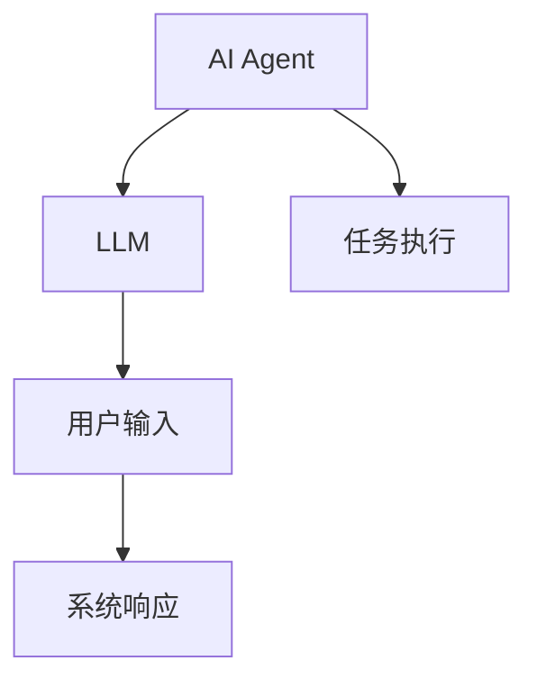
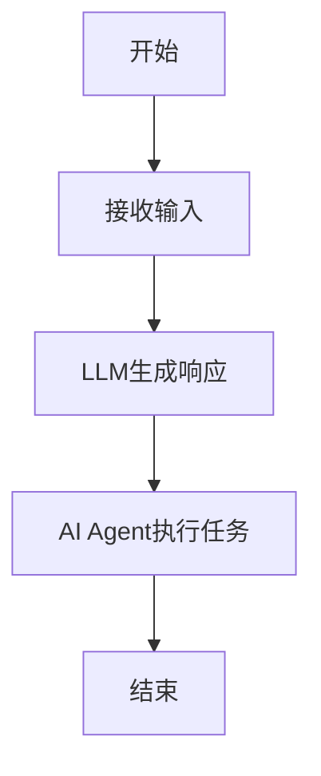
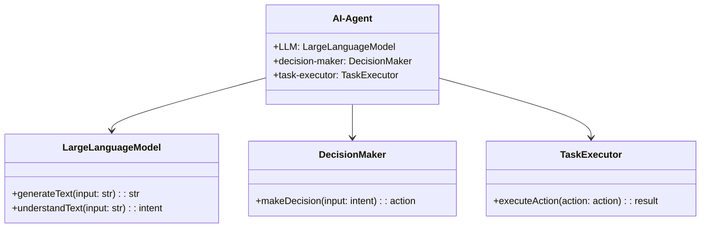
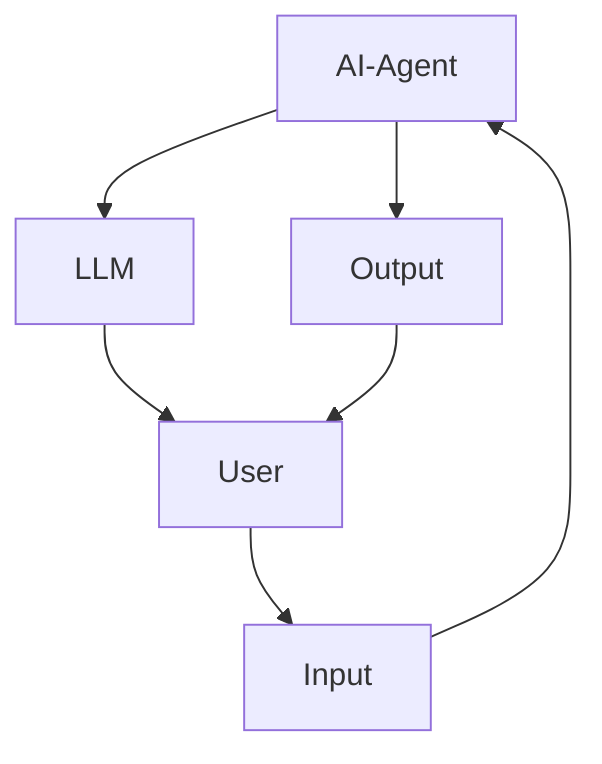
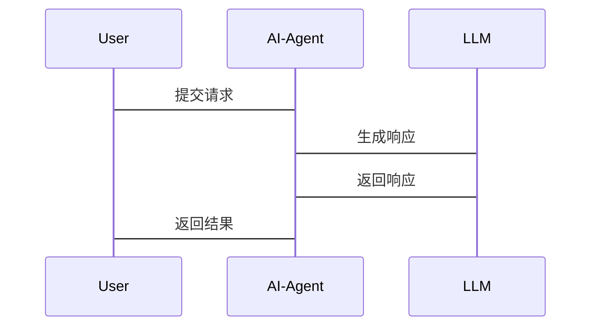

                 


# 自动化AI Agent开发平台：LLM辅助的智能系统构建

> **关键词**：自动化AI Agent，LLM，智能系统，开发平台，文本生成，决策算法

> **摘要**：本文详细探讨了基于大语言模型（LLM）的自动化AI Agent开发平台的构建方法，从核心概念、算法原理到系统架构、项目实战，全面解析如何利用LLM辅助构建智能系统。文章内容涵盖背景介绍、核心概念、算法原理、系统架构设计、项目实战、应用案例、优化与扩展及未来趋势，为读者提供全面的技术指导。

---

## 第一章：自动化AI Agent与LLM辅助开发概述

### 1.1 AI Agent的基本概念

AI Agent，即人工智能代理，是一种能够感知环境并采取行动以实现目标的智能实体。其核心特点包括自主性、反应性、目标导向性和社交能力。AI Agent能够根据输入的信息做出决策，并执行相应的任务。

#### 1.1.1 自主性
AI Agent在运行过程中无需外部干预，能够自主完成任务。例如，一个智能助手可以自动处理用户的请求，而无需人工干预。

#### 1.1.2 反应性
AI Agent能够实时感知环境变化并做出反应。例如，当检测到用户输入情绪低落时，系统会调整响应策略。

#### 1.1.3 目标导向性
AI Agent的所有行动都围绕着实现特定目标展开。例如，一个推荐系统的目标是为用户提供最相关的商品推荐。

#### 1.1.4 社交能力
AI Agent能够与人类或其他系统进行交互，理解并生成自然语言文本。

### 1.2 LLM在AI Agent开发中的作用

大语言模型（LLM）通过其强大的文本生成和理解能力，为AI Agent的构建提供了重要支持。LLM能够处理复杂的语言任务，如文本生成、问答系统和对话生成。

#### 1.2.1 文本生成
LLM能够生成高质量的自然语言文本，例如撰写邮件、编写代码注释或生成对话回复。

#### 1.2.2 问题解答
通过LLM的支持，AI Agent能够回答用户的问题，提供解决方案。

#### 1.2.3 任务执行
LLM可以帮助AI Agent理解用户意图，并生成执行任务所需的指令。

---

## 第二章：自动化AI Agent的核心概念与联系

### 2.1 核心概念原理

#### 2.1.1 AI Agent的感知与决策机制
AI Agent通过感知环境信息，利用决策算法选择最优行动方案。例如，基于用户输入生成响应。

#### 2.1.2 LLM的文本生成与理解能力
LLM能够理解和生成自然语言文本，支持AI Agent与用户进行有效交互。

#### 2.1.3 两者结合的协同工作原理
AI Agent通过LLM生成文本，结合自身的决策逻辑，完成任务执行。

### 2.2 核心概念属性对比

| **属性**       | **AI Agent**          | **LLM**             |
|----------------|----------------------|--------------------|
| **功能**       | 执行任务             | 生成文本           |
| **输入**       | 结构化数据           | 自然语言文本       |
| **输出**       | 结构化指令           | 自然语言文本       |
| **目标**       | 实现特定目标         | 生成相关文本       |
| **学习方式**   | 监督学习             | 对抗学习/强化学习  |

### 2.3 ER实体关系图



---

## 第三章：自动化AI Agent的算法原理

### 3.1 算法原理概述

#### 3.1.1 基于LLM的文本生成算法
文本生成算法通过概率模型生成最可能的文本序列。例如，GPT模型通过预测下一个词的概率分布来生成文本。

#### 3.1.2 基于AI Agent的决策树算法
决策树算法通过构建树状结构，帮助AI Agent在多个选项中选择最优路径。例如，基于用户输入生成决策树。

#### 3.1.3 两者的结合算法
AI Agent结合LLM生成文本后，通过决策树选择最优行动方案。

### 3.2 算法流程图



### 3.3 数学模型与公式

#### 3.3.1 LLM的概率生成模型
$$ P(y|x) = \frac{1}{Z} \exp(\theta \cdot y) $$

其中，\( x \) 是输入，\( y \) 是输出，\( \theta \) 是参数，\( Z \) 是归一化常数。

#### 3.3.2 AI Agent的决策树模型
$$ D(x) = \argmax_{y} \sum_{i=1}^{n} w_i x_i $$

其中，\( D(x) \) 是决策函数，\( w_i \) 是权重，\( x_i \) 是输入特征。

### 3.4 举例说明

#### 3.4.1 LLM生成自然语言文本
用户输入：“帮我写一封邮件。” LLM生成：“您好，感谢您的来信。我们会尽快处理您的请求。”

#### 3.4.2 AI Agent基于LLM生成结果进行任务执行
AI Agent接收到用户的请求后，通过LLM生成回复，并根据回复内容执行相应的任务。

---

## 第四章：系统架构设计

### 4.1 系统功能设计

#### 4.1.1 领域模型



#### 4.1.2 系统架构图



#### 4.1.3 接口设计
系统接口包括：
- 用户输入接口：接收用户的自然语言输入。
- 系统输出接口：返回生成的文本或执行结果。

#### 4.1.4 交互图



---

## 第五章：项目实战

### 5.1 环境安装

安装必要的库：
```bash
pip install transformers
pip install torch
pip install mermaid
```

### 5.2 系统核心实现源代码

#### 5.2.1 LLM接口实现
```python
from transformers import GPT2LMHeadModel, GPT2Tokenizer

class LLMInterface:
    def __init__(self):
        self.model = GPT2LMHeadModel.from_pretrained('gpt2')
        self.tokenizer = GPT2Tokenizer.from_pretrained('gpt2')

    def generate_text(self, input_str, max_length=50):
        inputs = self.tokenizer.encode(input_str, return_tensors='pt')
        outputs = self.model.generate(inputs, max_length=max_length, do_sample=True)
        return self.tokenizer.decode(outputs[0], skip_special_tokens=True)
```

#### 5.2.2 AI Agent实现
```python
class AI_Agent:
    def __init__(self, llm):
        self.llm = llm

    def process_request(self, input_str):
        generated_text = self.llm.generate_text(input_str)
        # 假设生成的文本用于任务执行
        return generated_text
```

### 5.3 代码应用解读与分析

AI Agent通过调用LLM的生成文本功能，完成用户的请求处理。例如，用户输入“帮我写一封邮件”，AI Agent调用LLM生成邮件正文。

### 5.4 案例分析

案例：用户请求“预订酒店”。
1. 用户输入：“我需要预订一家五星级酒店，位于市中心。”
2. AI Agent调用LLM生成回复：“好的，请提供具体日期和预算范围。”
3. 用户提供详细信息后，AI Agent生成最终的预订确认邮件。

### 5.5 项目小结

通过项目实战，我们展示了如何利用LLM构建AI Agent，并实现了基本的功能模块。代码示例为读者提供了实际操作的参考。

---

## 第六章：应用案例与扩展

### 6.1 应用案例

#### 6.1.1 在线客服
AI Agent通过LLM生成回复，为用户提供实时客服支持。

#### 6.1.2 智能助手
AI Agent帮助用户完成日常任务，如日程管理、信息查询等。

### 6.2 扩展方向

#### 6.2.1 多模态支持
结合视觉信息，增强AI Agent的能力。

#### 6.2.2 边缘计算
将AI Agent部署在边缘设备上，减少延迟。

---

## 第七章：优化与扩展

### 7.1 性能优化

#### 7.1.1 模型优化
通过剪枝、蒸馏等技术，降低模型的计算复杂度。

#### 7.1.2 系统优化
优化系统架构，提升响应速度。

### 7.2 功能扩展

#### 7.2.1 多语言支持
支持多种语言的文本生成和理解。

#### 7.2.2 自适应学习
根据用户反馈，动态调整模型参数。

---

## 第八章：未来趋势与挑战

### 8.1 未来趋势

#### 8.1.1 更强大的LLM
随着模型规模的扩大，LLM的能力将不断提升。

#### 8.1.2 多模态AI Agent
结合视觉、听觉等多种感知方式，提升AI Agent的智能水平。

### 8.2 挑战

#### 8.2.1 计算资源
大规模模型的训练和推理需要大量计算资源。

#### 8.2.2 数据隐私
处理用户数据时，需要确保数据隐私和安全。

---

## 第九章：总结与展望

### 9.1 总结

本文详细探讨了基于LLM的自动化AI Agent开发平台的构建方法，从核心概念到系统架构，再到项目实战，为读者提供了全面的技术指导。

### 9.2 展望

未来，随着AI技术的不断发展，自动化AI Agent将变得更加智能化和多样化。我们需要持续关注技术进步，不断提升系统的性能和用户体验。

---

**感谢您的阅读！如果需要进一步的技术支持或深入探讨，请随时联系我。**

