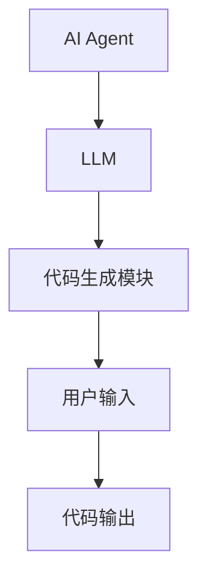
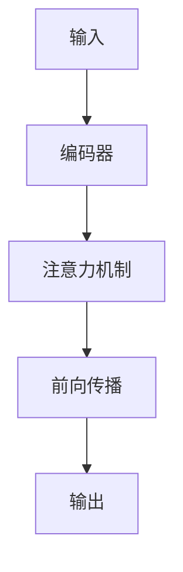
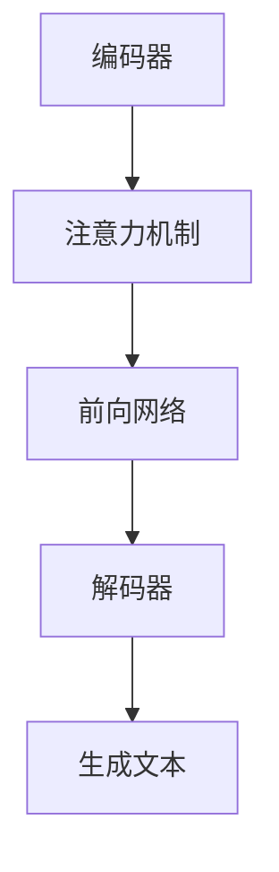
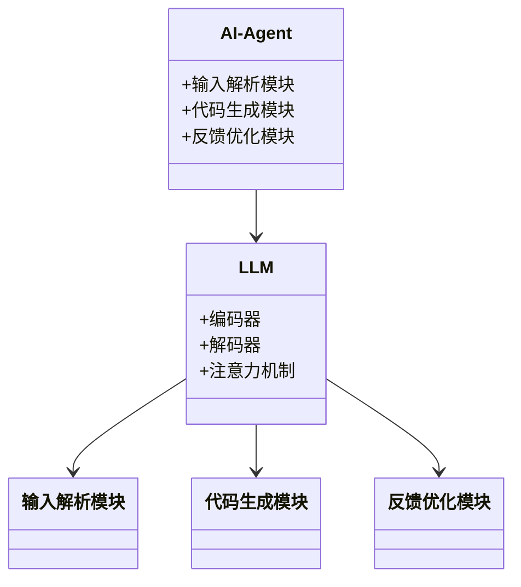
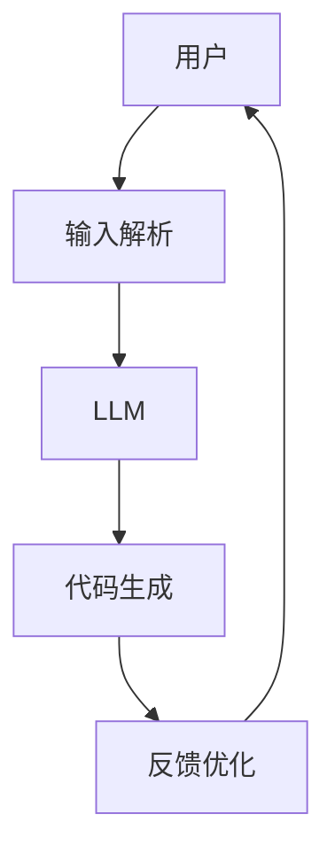
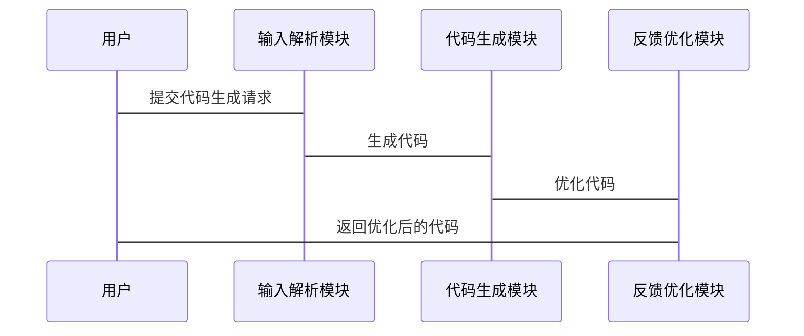

                 


# 自动化AI Agent开发：LLM辅助的代码生成

> 关键词：LLM, AI Agent, 代码生成, 自然语言处理, Transformer模型, 系统架构

> 摘要：本文深入探讨了如何利用大语言模型（LLM）辅助自动化AI Agent的代码生成过程。通过分析LLM的核心机制、代码生成的原理、系统架构设计以及实际项目案例，展示了如何结合自然语言处理技术，提升代码生成的效率与质量。本文还提供了详细的算法原理、系统设计和项目实现步骤，帮助读者全面理解并掌握这一前沿技术。

---

## 第1章：AI Agent与LLM概述

### 1.1 AI Agent的基本概念

#### 1.1.1 AI Agent的定义与特点
AI Agent（人工智能代理）是一种能够感知环境、执行任务并做出决策的智能实体。它可以是一个软件程序、一个机器人，甚至是嵌入在设备中的算法。AI Agent的核心特点包括：
1. **自主性**：能够在没有人工干预的情况下独立运行。
2. **反应性**：能够根据环境的变化实时调整行为。
3. **目标导向**：具备明确的目标，并通过行为选择来实现目标。
4. **学习能力**：能够通过数据和经验不断优化自身的性能。

#### 1.1.2 LLM的定义与特点
大语言模型（LLM，Large Language Model）是一种基于深度学习的自然语言处理模型，能够理解和生成人类语言。其特点包括：
1. **大规模训练数据**：通常使用互联网上的海量文本数据进行训练。
2. **上下文理解**：能够理解文本的上下文关系，生成连贯的回答。
3. **多任务能力**：通过不同的提示（prompt）可以完成多种任务，如翻译、问答、代码生成等。
4. **可微调性**：通过微调（fine-tuning）可以在特定领域内优化性能。

### 1.2 自动化AI Agent开发的背景与意义

#### 1.2.1 问题背景与问题描述
在传统软件开发过程中，代码生成通常依赖于人工编写或基于模板的自动化工具。然而，这种方法存在以下问题：
1. **效率低下**：人工编写代码耗时且容易出错。
2. **灵活性不足**：模板化工具难以应对复杂多变的需求。
3. **智能化水平低**：缺乏对上下文的理解，难以生成高质量的代码。

通过引入LLM，可以将自然语言处理的能力与代码生成结合，显著提升代码生成的效率和质量。

#### 1.2.2 问题解决方法与边界
LLM辅助的代码生成通过以下方式解决问题：
1. **自然语言理解**：通过LLM理解用户的意图，生成符合需求的代码。
2. **动态调整**：根据实时反馈优化代码生成策略。
3. **多语言支持**：支持多种编程语言和代码风格。

#### 1.2.3 核心概念与组成要素
AI Agent与LLM的结合形成了一个完整的系统，其核心组成要素包括：
1. **输入解析模块**：解析用户的输入需求。
2. **代码生成模块**：基于LLM生成代码。
3. **反馈优化模块**：根据反馈优化生成代码的质量。
4. **执行监控模块**：监控代码执行过程，确保任务完成。

---

## 第2章：LLM与代码生成的关系

### 2.1 LLM的内部机制

#### 2.1.1 模型结构与训练原理
LLM通常基于Transformer模型，其核心结构包括编码器（Encoder）和解码器（Decoder）。编码器负责将输入的自然语言转化为向量表示，解码器则根据编码器的输出生成对应的自然语言文本。

#### 2.1.2 注意力机制
注意力机制（Attention）是Transformer模型的核心，用于计算输入序列中每个词的重要性。公式如下：
$$\text{Attention}(Q, K, V) = \text{softmax}\left(\frac{QK^T}{\sqrt{d_k}}\right)V$$

其中：
- $Q$：查询向量
- $K$：键向量
- $V$：值向量
- $d_k$：键的维度

### 2.2 代码生成的原理

#### 2.2.1 自然语言处理与代码生成的结合
代码生成的关键在于将自然语言需求转化为计算机可执行的代码。LLM通过以下步骤实现这一目标：
1. **输入解析**：将自然语言需求转化为代码生成的指令。
2. **代码生成**：基于LLM生成代码。
3. **结果优化**：根据反馈优化代码质量。

### 2.3 核心概念对比表格

| **核心概念** | **LLM辅助代码生成** | **传统代码生成** |
|--------------|---------------------|------------------|
| **灵活性**   | 高                  | 低                |
| **智能化**   | 高                  | 低                |
| **效率**     | 高                  | 低                |
| **适应性**   | 高                  | 低                |

### 2.4 ER实体关系图



---

## 第3章：LLM的算法原理

### 3.1 大模型的训练与推理流程



### 3.2 基于Transformer的架构



### 3.3 概率生成机制

代码生成基于概率模型，公式如下：
$$P(y|x) = \prod_{i=1}^{n} P(y_i | x, y_{<i})$$

---

## 第4章：AI Agent的系统架构

### 4.1 系统功能模块划分



### 4.2 系统架构设计



### 4.3 接口与交互设计



---

## 第5章：项目实战

### 5.1 环境配置

```bash
pip install transformers
pip install torch
pip install mermaid
```

### 5.2 核心实现代码

```python
from transformers import AutoTokenizer, AutoModelForCausalLM

tokenizer = AutoTokenizer.from_pretrained("gpt2")
model = AutoModelForCausalLM.from_pretrained("gpt2")

def generate_code(prompt):
    inputs = tokenizer.encode(prompt, return_tensors="pt")
    outputs = model.generate(inputs, max_length=100, temperature=0.7)
    return tokenizer.decode(outputs[0], skip_special_tokens=True)

prompt = "编写一个计算斐波那契数列的函数"
print(generate_code(prompt))
```

### 5.3 案例分析与优化

通过上述代码，LLM能够生成计算斐波那契数列的函数。优化点包括：
1. **温度参数调整**：通过调整temperature参数，控制生成代码的多样性。
2. **上下文窗口优化**：优化模型对上下文的理解能力。
3. **后处理策略**：增加代码格式检查和语法纠错功能。

---

## 第6章：总结与展望

### 6.1 最佳实践

1. **模型调优**：根据具体任务需求，对LLM进行微调。
2. **代码优化**：结合领域知识，优化生成代码的质量。
3. **安全性保障**：确保代码生成过程中的安全性和稳定性。

### 6.2 未来展望

随着大语言模型的不断发展，代码生成的智能化水平将不断提升。未来的研究方向包括：
1. **多模态代码生成**：结合图像、语音等多种模态信息，生成更丰富的代码形式。
2. **自适应优化**：模型能够根据实时反馈动态调整生成策略。
3. **可解释性增强**：提高代码生成的可解释性和透明度。

---

通过本文的详细讲解，读者可以全面理解LLM辅助的代码生成技术，并将其应用于实际的AI Agent开发中。希望本文能为相关领域的研究和实践提供有价值的参考。

