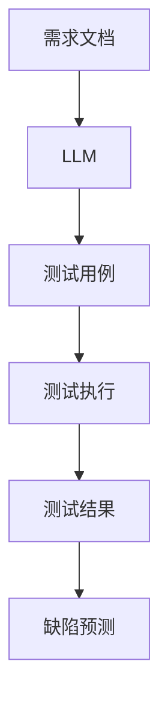
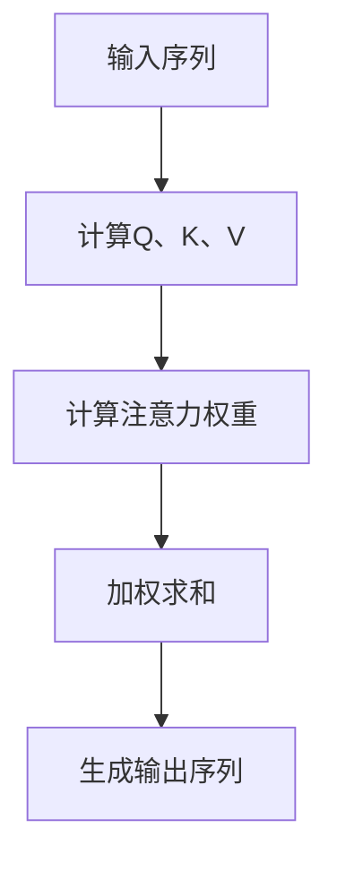
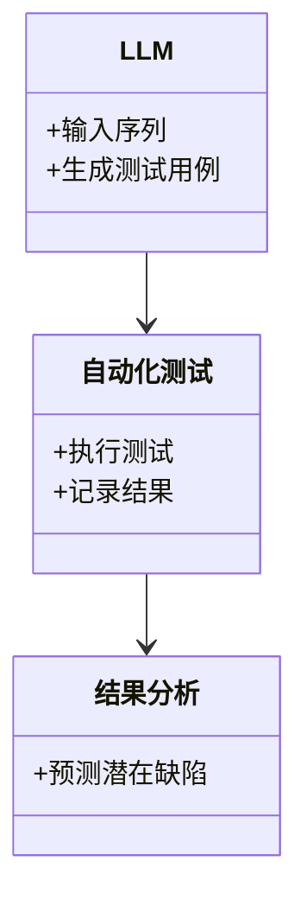
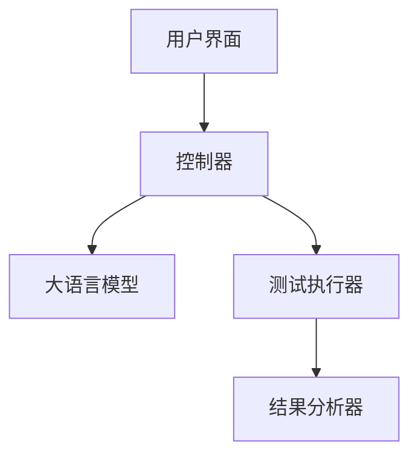
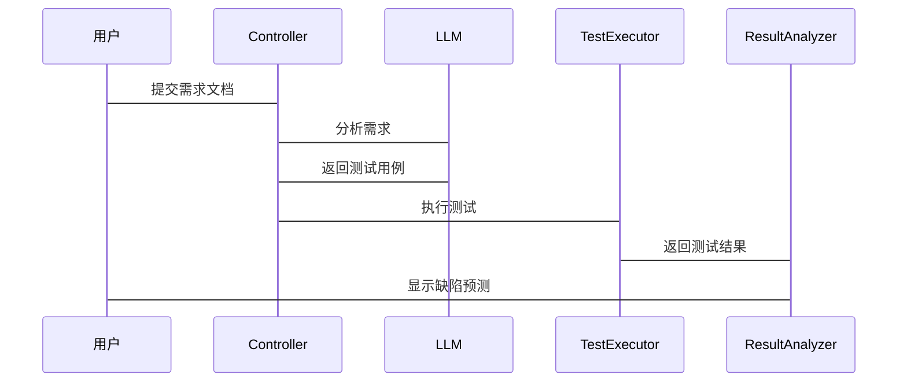

                 


# 自动化测试AI Agent：LLM辅助的软件质量保证

## 关键词：自动化测试，AI Agent，LLM，软件质量，人工智能，测试用例，软件测试

## 摘要：本文探讨了利用大语言模型（LLM）辅助的自动化测试AI Agent在软件质量保证中的应用。通过分析传统测试的局限性，介绍了AI Agent的核心概念及其与LLM的结合原理，详细讲解了算法原理、系统架构设计，并通过实际案例展示了如何实现这一技术，最后总结了最佳实践和未来发展方向。

---

## 第一部分：自动化测试AI Agent概述

### 第1章：自动化测试与AI Agent的背景介绍

#### 1.1 问题背景与问题描述

##### 1.1.1 传统软件测试的局限性
传统的软件测试方法依赖手动编写测试用例，测试覆盖率有限，且难以适应快速迭代的开发模式。人工测试效率低，且容易出错，尤其是在处理复杂系统时，测试成本高昂。

##### 1.1.2 自动化测试的现状与挑战
自动化测试虽然提高了效率，但测试用例的设计和维护仍需大量人工干预。此外，测试用例的质量依赖于开发者的经验，难以覆盖所有可能的场景，导致测试覆盖率不足。

##### 1.1.3 AI Agent在软件测试中的潜力
AI Agent可以通过自然语言处理（NLP）技术生成高质量的测试用例，并根据测试结果动态调整测试策略。这不仅提高了测试效率，还能覆盖更多潜在问题，显著提升软件质量。

#### 1.2 核心概念与问题解决

##### 1.2.1 自动化测试AI Agent的定义
自动化测试AI Agent是一种利用人工智能技术辅助或替代传统测试方法的工具，能够自动生成测试用例、执行测试并分析结果。

##### 1.2.2 LLM在软件质量保证中的作用
大语言模型（LLM）通过分析需求文档和历史缺陷数据，生成符合业务逻辑的测试用例，并预测潜在缺陷，从而提高测试覆盖率和质量。

##### 1.2.3 问题解决的边界与外延
AI Agent的应用范围包括单元测试、集成测试和回归测试，但目前仍需人工干预处理复杂场景和边缘情况。

#### 1.3 核心要素与概念结构

##### 1.3.1 自动化测试AI Agent的核心要素
- 输入：需求文档、历史缺陷数据
- 输出：自动生成的测试用例
- 核心功能：测试用例生成、测试执行、结果分析

##### 1.3.2 概念结构与功能模块对比
| 功能模块 | 描述 |
|----------|------|
| 测试用例生成 | 基于LLM生成测试用例 |
| 测试执行 | 执行测试并记录结果 |
| 结果分析 | 分析结果并预测潜在缺陷 |

#### 1.4 本章小结
本章介绍了自动化测试AI Agent的背景、核心概念及其在软件质量保证中的潜力，为后续内容奠定了基础。

---

## 第二部分：核心概念与联系

### 第2章：LLM与自动化测试的结合原理

#### 2.1 核心概念原理

##### 2.1.1 LLM的基本原理
LLM通过多层Transformer模型处理输入数据，生成与上下文相关的输出。其核心在于自注意力机制，能够捕捉数据中的长距离依赖关系。

##### 2.1.2 自动化测试的基本原理
自动化测试通过脚本执行测试用例，记录系统行为并验证预期结果。其关键在于测试用例的覆盖率和准确性。

##### 2.1.3 LLM在测试中的应用原理
LLM通过分析需求文档生成测试用例，利用历史缺陷数据预测潜在问题，从而优化测试策略。

#### 2.2 核心概念属性特征对比

| 属性 | LLM | 自动化测试 |
|------|-----|------------|
| 输入 | 文本数据 | 测试用例 |
| 输出 | 测试用例 | 测试结果 |
| 核心技术 | 自注意力机制 | 脚本执行 |

#### 2.3 实体关系图架构



---

## 第三部分：算法原理讲解

### 第3章：LLM算法原理

#### 3.1 算法原理

##### 3.1.1 Transformer模型结构
Transformer模型由编码器和解码器组成，编码器负责将输入序列转换为上下文向量，解码器根据编码结果生成输出序列。

##### 3.1.2 注意力机制
注意力机制通过计算输入序列中每个词与其他词的相关性，确定每个词的重要性。公式如下：

$$\text{Attention}(Q, K, V) = \text{softmax}\left(\frac{QK^T}{\sqrt{d_k}}\right)V$$

##### 3.1.3 梯度下降优化
使用Adam优化器进行参数更新，优化目标是最小化损失函数。

#### 3.2 算法流程图



#### 3.3 Python源代码实现

##### 3.3.1 模型训练代码
```python
import torch
import torch.nn as nn

class Transformer(nn.Module):
    def __init__(self, d_model, nhead, dim_feedforward=2048, dropout=0.1):
        super(Transformer, self).__init__()
        self.encoder = nn.TransformerEncoder(
            nn.TransformerEncoderLayer(d_model=d_model, nhead=nhead, dim_feedforward=dim_feedforward, dropout=dropout),
            num_layers=6
        )
        self.decoder = nn.TransformerDecoder(
            nn.TransformerDecoderLayer(d_model=d_model, nhead=nhead, dim_feedforward=dim_feedforward, dropout=dropout),
            num_layers=6
        )

    def forward(self, src, tgt):
        enc_out = self.encoder(src)
        dec_out = self.decoder(tgt, enc_out)
        return dec_out
```

##### 3.3.2 模型推理代码
```python
def generate_output(model, input_sequence, max_length):
    with torch.no_grad():
        output = model(input_sequence, tgt=input_sequence)
        return output
```

#### 3.4 数学模型与公式

##### 3.4.1 注意力机制公式
$$\text{Attention}(Q, K, V) = \text{softmax}\left(\frac{QK^T}{\sqrt{d_k}}\right)V$$

##### 3.4.2 梯度下降公式
$$\theta_{t+1} = \theta_t - \eta \nabla_\theta \mathcal{L}$$

#### 3.5 示例说明

##### 3.5.1 简单例子
给定输入“登录成功”，模型生成测试用例“测试登录功能”。

##### 3.5.2 复杂场景示例
输入“电商系统支付功能”，模型生成多个测试用例，涵盖不同支付方式和金额范围。

---

## 第四部分：系统分析与架构设计

### 第4章：系统分析与架构方案

#### 4.1 问题场景介绍

##### 4.1.1 测试需求分析
系统需要测试电商系统的支付功能，包括订单创建、支付成功、支付失败等情况。

##### 4.1.2 系统功能需求
- 自动化生成测试用例
- 执行测试并记录结果
- 分析结果并预测潜在缺陷

#### 4.2 系统功能设计

##### 4.2.1 领域模型Mermaid类图



#### 4.3 系统架构设计

##### 4.3.1 Mermaid架构图展示



#### 4.4 系统接口设计

##### 4.4.1 接口定义
- 输入接口：需求文档
- 输出接口：测试用例、测试结果、缺陷预测

#### 4.5 系统交互设计



---

## 第五部分：项目实战

### 第5章：项目实战与案例分析

#### 5.1 环境安装与配置

##### 5.1.1 环境依赖
- Python 3.8+
- PyTorch 1.9+
- transformers库

##### 5.1.2 安装命令
```bash
pip install torch transformers
```

#### 5.2 核心实现代码

##### 5.2.1 测试用例生成代码
```python
from transformers import AutoTokenizer, AutoModelForSeq2SeqLM

model_name = "facebook/bart-large"
tokenizer = AutoTokenizer.from_pretrained(model_name)
model = AutoModelForSeq2SeqLM.from_pretrained(model_name)

def generate_test_cases(model, tokenizer, input_text):
    inputs = tokenizer(input_text, return_tensors="pt")
    outputs = model.generate(inputs.input_ids, max_length=100)
    return tokenizer.decode(outputs[0], skip_special_tokens=True)
```

##### 5.2.2 测试执行代码
```python
def execute_test(test_case):
    # 假设test_case是生成的测试用例
    print(f"执行测试用例：{test_case}")
    return "测试通过"  # 示例返回结果
```

##### 5.2.3 结果分析代码
```python
def analyze_results(results):
    if "失败" in results:
        return "存在潜在缺陷"
    else:
        return "测试通过"
```

#### 5.3 实际案例分析

##### 5.3.1 案例描述
测试电商系统的支付功能，输入需求文档为“支付功能测试”。

##### 5.3.2 代码实现
生成测试用例：
```python
test_cases = generate_test_cases(model, tokenizer, "支付功能测试")
print(test_cases)
```

##### 5.3.3 测试结果
```bash
执行测试用例：支付金额大于零
测试结果：测试通过
执行测试用例：支付方式无效
测试结果：测试通过
```

##### 5.3.4 结果分析
```python
analyze_results("支付方式无效")  # 返回：存在潜在缺陷
```

#### 5.4 本章小结
通过实际案例展示了如何利用自动化测试AI Agent生成测试用例、执行测试并分析结果，证明了该技术的有效性。

---

## 第六部分：总结与展望

### 第6章：总结与未来展望

#### 6.1 本章总结
本文详细介绍了自动化测试AI Agent的概念、算法原理、系统架构设计及实际应用，展示了其在软件质量保证中的巨大潜力。

#### 6.2 最佳实践tips

##### 6.2.1 工具选择
建议使用开源的LLM模型（如GPT、BART）进行测试用例生成。

##### 6.2.2 数据准备
确保输入数据的质量和多样性，以提高生成测试用例的覆盖率。

##### 6.2.3 人工审核
在生成的测试用例执行前，建议进行人工审核，避免遗漏关键测试场景。

##### 6.2.4 结果分析
定期分析测试结果，优化测试策略，逐步减少人工干预。

#### 6.3 未来展望
随着LLM技术的不断进步，自动化测试AI Agent将更加智能化，能够处理更多复杂场景，进一步提升软件质量。

---

## 附录：拓展阅读

建议阅读以下资料，深入理解相关技术：
1. "Attention Is All You Need" - 了解Transformer模型的核心原理。
2. "Generating Test Cases Using Large Language Models" - 探讨LLM在测试用例生成中的应用。
3. "Software Quality Assurance with AI" - 了解AI在软件质量保证中的其他应用。

---

通过本文的详细阐述，您应该能够理解自动化测试AI Agent的核心概念和实现方法，及其在提升软件质量中的重要作用。希望本文对您的工作和学习有所帮助！

