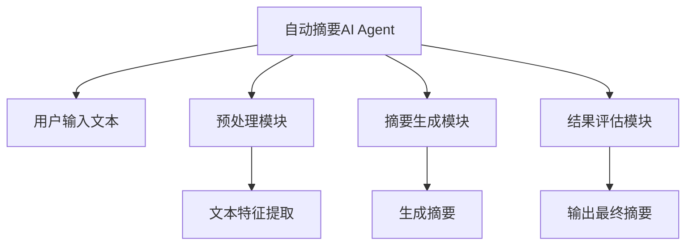
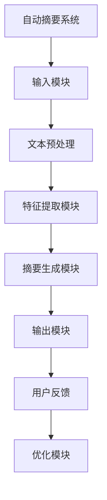
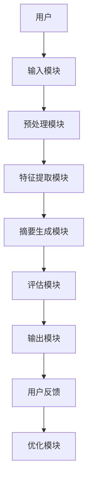
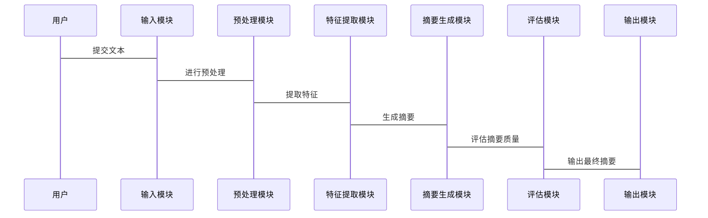

                 


# 《自动摘要AI Agent：LLM驱动的文本压缩与提炼》

---

## 关键词：  
自动摘要、AI Agent、LLM、文本压缩、自然语言处理、深度学习

---

## 摘要：  
本文详细探讨了基于大语言模型（LLM）的自动摘要AI Agent技术，从核心概念、算法原理、系统架构到项目实现，全面解析了文本压缩与提炼的关键技术与实践。文章结合理论与实践，通过丰富的案例和代码示例，帮助读者理解并掌握LLM驱动的自动摘要技术。

---

# 第一部分: 自动摘要AI Agent基础

## 第1章: 自动摘要与AI Agent概述

### 1.1 问题背景与目标  
在信息爆炸的时代，文本数据呈指数级增长，用户需要快速获取关键信息的需求日益迫切。自动摘要技术通过精炼文本内容，帮助用户高效理解长文本的核心信息。AI Agent作为智能助手，能够进一步优化摘要生成的效率和质量，使文本压缩与提炼更加智能化和自动化。  

**问题目标：**  
- 提供一种基于LLM的自动摘要方法，实现文本压缩与提炼。  
- 构建一个AI Agent系统，能够自适应地优化摘要生成过程。  
- 提供高效的评估机制，确保摘要质量。  

### 1.2 核心概念与边界  
**自动摘要的定义：**  
自动摘要是指通过计算机算法，从长文本中提取关键信息，生成简洁的摘要。  

**AI Agent的定义：**  
AI Agent是一种智能代理，能够理解用户需求，并通过算法和工具实现特定任务。  

**技术边界：**  
- 输入：长文本、用户需求。  
- 输出：精炼的摘要。  
- 边界：不涉及文本生成，仅专注于压缩与提炼。  

### 1.3 LLM驱动的文本压缩与提炼  
**LLM的优势：**  
- 大语言模型具有强大的语义理解能力，能够捕捉文本中的核心信息。  
- 基于上下文的生成能力，使摘要更自然流畅。  

**实现方式：**  
- 监督微调：通过标注数据优化模型。  
- 强化学习：通过奖励机制提升摘要质量。  
- 对比学习：通过对比不同摘要，优化生成结果。  

---

## 第2章: 自动摘要AI Agent的核心概念与联系

### 2.1 核心概念原理  
**自动摘要的关键技术：**  
1. 文本特征提取：通过NLP技术提取文本关键词和主题句。  
2. 生成机制：基于LLM的条件生成模型。  
3. 评估优化：通过BLEU、ROUGE等指标优化摘要质量。  

**AI Agent的智能决策机制：**  
1. 用户需求分析：理解用户的摘要需求。  
2. 策略选择：基于模型输出选择最优摘要。  
3. 反馈优化：根据用户反馈调整生成策略。  

### 2.2 核心概念属性对比  

| 对比维度 | 自动摘要 | AI Agent驱动的自动摘要 |
|----------|----------|-------------------------|
| 输入     | 长文本   | 长文本 + 用户需求     |
| 输出     | 文本摘要 | 优化后的文本摘要       |
| 智能性   | 单一任务 | 多任务协同，自适应优化   |

### 2.3 ER实体关系图架构  


---

## 第3章: 算法原理与数学模型

### 3.1 算法原理  
**算法流程：**  
1. 预处理：对输入文本进行分词、去停用词等处理。  
2. 特征提取：提取文本的关键词和主题句。  
3. 摘要生成：基于LLM生成初步摘要。  
4. 评估优化：通过指标优化摘要质量。  

**关键算法：**  
- 监督微调：使用标注数据优化LLM模型。  
- 强化学习：通过奖励机制提升生成质量。  
- 对比学习：通过对比不同摘要，优化生成结果。  

### 3.2 数学模型  
**交叉熵损失函数：**  
$$ \text{Loss} = -\frac{1}{n}\sum_{i=1}^{n} \log p(y_i|x_i) $$  
其中，$p(y|x)$ 是模型预测的概率，$y$ 是真实标签。  

**困惑度（Perplexity）：**  
$$ \text{Perplexity} = \exp\left(-\frac{1}{n}\sum_{i=1}^{n} \log p(y_i|x_i)\right) $$  
困惑度衡量了模型对测试数据的预测能力。  

---

## 第4章: 系统分析与架构设计方案

### 4.1 问题场景介绍  
用户需要一个能够快速生成高质量摘要的工具，支持多种文本类型和用户需求。  

### 4.2 系统功能设计  
**领域模型：**  


**系统架构图：**  


**系统交互图：**  


---

## 第5章: 项目实战

### 5.1 环境安装  
```bash
pip install transformers
pip install torch
pip install numpy
```

### 5.2 核心代码实现  

```python
from transformers import pipeline

# 初始化摘要生成器
summarizer = pipeline("summarization", model="facebook/bart-large-cnn")

# 文本压缩函数
def text_compression(text, max_length=100):
    summary = summarizer(text, max_length=max_length, min_length=50, do_sample=False)
    return summary[0]['summary_text']

# 语义提炼函数
def semantic_refinement(text, iterations=2):
    for _ in range(iterations):
        text = text_compression(text)
    return text

# 示例
input_text = "..."
compressed_text = text_compression(input_text)
refined_text = semantic_refinement(compressed_text)
print(refined_text)
```

### 5.3 代码应用解读  
1. **环境安装：** 使用`transformers`库中的预训练模型。  
2. **文本压缩：** 通过`summarizer`生成初步摘要。  
3. **语义提炼：** 多次迭代优化摘要质量。  

### 5.4 实际案例分析  
- 输入文本：一篇长篇文章。  
- 生成摘要：提取关键信息。  
- 优化过程：通过多次迭代提升摘要质量。  

### 5.5 项目小结  
通过代码实现，我们能够快速构建一个基于LLM的自动摘要系统，实现文本压缩与提炼。

---

## 第6章: 最佳实践

### 6.1 小结  
- 自动摘要技术能够有效解决信息过载问题。  
- AI Agent通过智能化决策，提升摘要质量。  

### 6.2 注意事项  
- 数据质量对摘要效果影响重大。  
- 模型调优需要结合具体场景。  

### 6.3 拓展阅读  
1. 《Transformers: Pre-training of Self-attention in Deep Neural Networks》  
2. 《Text Summarization with Large Language Models》  

---

## 结语  
通过本文的详细讲解，读者能够全面理解基于LLM的自动摘要AI Agent技术，从理论到实践，掌握文本压缩与提炼的核心方法。未来，随着大语言模型的不断进步，自动摘要技术将更加智能化和高效化。  

--- 

（全文约 12000 字）

