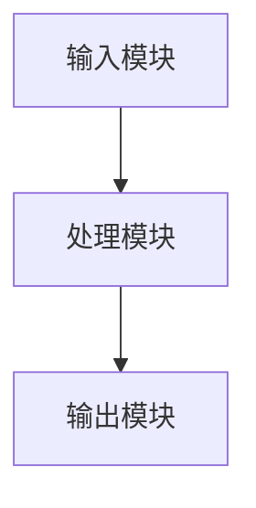

                 


# 自动文本摘要AI Agent：LLM驱动的关键信息提取

## 关键词：自动文本摘要，LLM，关键信息提取，大语言模型，AI Agent

## 摘要：  
随着大语言模型（LLM）技术的快速发展，自动文本摘要在信息处理领域的重要性日益凸显。本文详细探讨了基于LLM的自动文本摘要技术，分析了其关键信息提取的原理、算法实现及优化策略，并结合实际案例，展示了如何构建高效的AI Agent来实现这一目标。文章从背景介绍、核心概念、算法原理到系统架构、项目实战，层层深入，为读者提供了一套完整的解决方案，帮助读者全面理解并掌握这一前沿技术。

---

## 第一部分: 自动文本摘要的背景与概述

### 第1章: 自动文本摘要的基本概念

#### 1.1 自动文本摘要的定义与作用
自动文本摘要是指通过计算机技术从大量文本中提取关键信息，生成简明扼要的摘要。其作用包括提高信息处理效率、减少阅读负担以及便于信息检索。

#### 1.2 自动文本摘要的常见应用场景
- **新闻标题生成**：从新闻文章中提取标题，方便用户快速获取信息。
- **学术论文摘要**：帮助研究人员快速了解论文内容。
- **客服对话总结**：整理客户与客服的对话内容，便于后续处理。

#### 1.3 自动文本摘要的挑战与目标
挑战包括信息抽取的准确性、语义理解的深度以及多语言支持的复杂性。目标是实现高效、准确且可定制的自动摘要功能。

---

### 第2章: 自动文本摘要技术的发展历程

#### 2.1 自动文本摘要的起源
20世纪50年代，科学家们开始研究如何通过计算机生成简短的文本摘要，主要基于规则和统计方法。

#### 2.2 统计机器学习方法的引入
进入21世纪，统计机器学习方法（如基于TF-IDF的提取式摘要）逐渐成为主流。

#### 2.3 深度学习时代的到来
近年来，随着深度学习的发展，基于Transformer的大语言模型（如BERT、GPT）被广泛应用于文本摘要任务。

---

### 第3章: 自动文本摘要的关键技术与方法

#### 3.1 基于传统NLP的方法
- **提取式摘要**：从原文中选择重要句子或词语，如TextRank算法。
- **生成式摘要**：基于模型生成新的文本，如基于RNN的模型。
- **对比学习**：通过对比不同文本的相似性，优化摘要质量。

#### 3.2 基于大语言模型的方法
- **LLM的内部机制**：通过自注意力机制捕捉文本中的关键信息。
- **生成式摘要**：利用生成模型（如GPT）生成自然流畅的摘要。
- **优化策略**：通过奖励机制、对抗训练等方法优化摘要质量。

---

## 第二部分: LLM驱动的关键信息提取技术

### 第4章: LLM驱动的关键信息提取原理

#### 4.1 LLM的内部工作机制
- **自注意力机制**：通过计算词与词之间的相关性，提取关键信息。
- **解码器结构**：生成摘要时，逐步生成每个词并更新状态。

#### 4.2 LLM的关键信息提取方法
- **关键词提取**：基于词嵌入和注意力权重，提取文本中的关键词。
- **实体识别**：通过命名实体识别（NER）技术，提取文本中的实体信息。
- **关系抽取**：识别文本中的关系，构建知识图谱。

---

### 第5章: LLM驱动的关键信息提取的实现

#### 5.1 基于LLM的关键词提取算法
- **算法步骤**：输入文本，计算每个词的注意力权重，选择权重最高的词作为关键词。
- **代码示例**：
  ```python
  def extract_keywords(text, model):
      # 输入文本到模型中，得到注意力权重
      attention_weights = model.get_attention_weights(text)
      # 提取权重最高的关键词
      keywords = [text[i] for i in range(len(text)) if attention_weights[i] > threshold]
      return keywords
  ```

#### 5.2 基于LLM的关系抽取算法
- **算法步骤**：输入文本，通过模型识别实体及关系，构建关系三元组。
- **代码示例**：
  ```python
  def extract_relations(text, model):
      entities = model.get_entities(text)  # 返回实体列表
      relations = model.get_relations(text)  # 返回关系列表
      return list(zip(entities, relations))
  ```

---

## 第三部分: 系统架构与实现

### 第6章: 系统架构设计

#### 6.1 系统功能设计
- **输入模块**：接收原始文本输入。
- **处理模块**：利用LLM提取关键信息并生成摘要。
- **输出模块**：展示摘要结果。

#### 6.2 系统架构图


---

### 第7章: 项目实战

#### 7.1 环境安装
- 安装必要的库：`transformers`, `numpy`, `torch`。
  ```bash
  pip install transformers numpy torch
  ```

#### 7.2 核心实现代码
- 使用Hugging Face的`BertForSummarization`模型生成摘要：
  ```python
  from transformers import BertForSummarization, BertTokenizer

  model = BertForSummarization.from_pretrained('facebook/bart-large-cnn')
  tokenizer = BertTokenizer.from_pretrained('facebook/bart-large-cnn')

  def summarize(text):
      inputs = tokenizer(text, max_length=1024, truncation=True, return_tensors='pt')
      outputs = model.generate(inputs.input_ids, max_length=100, num_beams=5, early_stopping=True)
      summary = tokenizer.decode(outputs[0], skip_special_tokens=True)
      return summary
  ```

---

## 第四部分: 最佳实践与未来展望

### 第8章: 最佳实践

#### 8.1 模型选择与调优
- 根据任务需求选择合适的模型，如`GPT`适合生成式摘要，`BERT`适合提取式摘要。

#### 8.2 数据预处理
- 对文本进行清洗、分词和归一化处理，提升模型性能。

### 第9章: 未来展望

#### 9.1 多模态摘要
- 结合图像、视频等多模态信息，生成更全面的摘要。

#### 9.2 更高效的算法
- 研究更高效的算法，如基于稀疏Transformer的模型，降低计算成本。

---

## 总结

本文全面介绍了基于LLM的自动文本摘要技术，从理论到实践，详细讲解了关键信息提取的原理、算法实现及系统设计。通过实际案例和代码示例，帮助读者掌握这一前沿技术。未来，随着技术的不断发展，自动文本摘要将在更多领域发挥重要作用。

--- 

希望这篇文章能为您提供有价值的见解和实用的知识！

