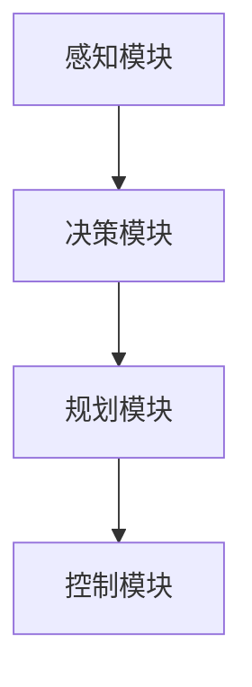
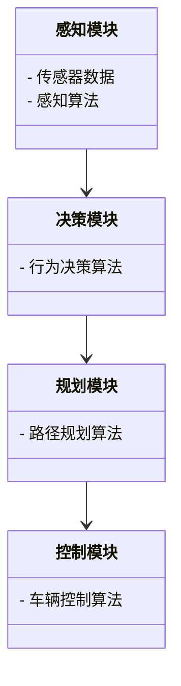
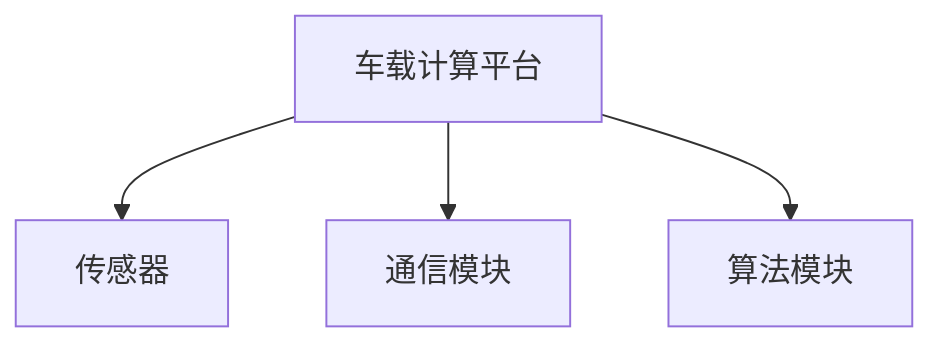

                 


# 自动驾驶技术发展与相关产业链投资

---

## 关键词：
自动驾驶技术，自动驾驶产业链，自动驾驶投资，自动驾驶算法，自动驾驶系统，自动驾驶传感器

---

## 摘要：
自动驾驶技术是当前全球科技发展的热点领域，涉及人工智能、传感器技术、车辆工程、通信网络等多学科的交叉融合。本文从技术发展、产业链分析、投资策略等角度，全面解析自动驾驶领域的现状、未来趋势及投资机会。文章首先介绍自动驾驶技术的基本概念、发展历程与关键技术，然后分析自动驾驶产业链的构成与各环节的投资价值，最后结合实际案例探讨自动驾驶技术的投资策略与未来展望。

---

## 第一部分：自动驾驶技术发展概述

### 第1章：自动驾驶技术的基本概念与背景

#### 1.1 自动驾驶的定义与分类

##### 1.1.1 自动驾驶的定义
自动驾驶（Autonomous Driving）是指通过先进的传感器、计算平台、算法和通信技术，使得车辆能够在不需要人类干预的情况下，完成从起点到终点的行驶任务。根据国际标准化组织（ISO）的定义，自动驾驶分为L0到L5的六个等级。

##### 1.1.2 自动驾驶的分类与分级
自动驾驶的分级主要依据ISO 21448标准：
- **L0**：无自动化功能，完全由驾驶员操作。
- **L1**：部分辅助驾驶功能，如自适应巡航控制（ACC）。
- **L2**：部分自动驾驶，车辆同时具备纵向和横向控制能力，但驾驶员仍需随时准备接管。
- **L3**：有条件自动驾驶，车辆可以在特定条件下独立完成驾驶任务，但需要驾驶员在请求时接管。
- **L4**：高度自动驾驶，车辆可以在大多数情况下独立完成驾驶任务，但仅限于特定区域或环境。
- **L5**：完全自动驾驶，车辆在所有情况下均可独立完成驾驶任务。

##### 1.1.3 自动驾驶的核心技术要素
自动驾驶的核心技术包括：
1. **传感器技术**：用于感知环境，如激光雷达（LiDAR）、摄像头、毫米波雷达（MMR）、超声波传感器等。
2. **车载计算平台**：用于处理感知数据、运行算法，如高性能GPU、TPU等。
3. **自动驾驶算法**：包括感知算法、路径规划算法、行为决策算法等。
4. **通信与网络技术**：用于车辆与车辆、车辆与基础设施之间的通信，如5G、V2X（车路协同）。

#### 1.2 自动驾驶技术的发展历程

##### 1.2.1 自动驾驶技术的起源
自动驾驶技术的起源可以追溯到20世纪初，早期的研究主要集中在机械控制和电子控制技术上。

##### 1.2.2 自动驾驶技术的演进阶段
自动驾驶技术的发展经历了以下几个阶段：
1. **早期探索阶段**（20世纪初至20世纪末）：主要以机械和电子控制技术为主，缺乏人工智能技术的支持。
2. **人工智能技术引入阶段**（21世纪初）：随着计算机视觉、机器学习等技术的发展，自动驾驶技术开始引入人工智能算法。
3. **快速发展阶段**（2010年至今）：以Waymo、特斯拉等为代表的科技公司开始大规模投入研发，自动驾驶技术进入快速发展阶段。

##### 1.2.3 当前自动驾驶技术的发展现状
当前，全球范围内自动驾驶技术已经进入L2到L4级别的应用阶段。L2级别的辅助驾驶功能（如自适应巡航控制、车道保持辅助）已经广泛应用于量产车型。L3级别的有条件自动驾驶技术正在逐步商业化，而L4及以上级别的完全自动驾驶技术仍在研发和测试阶段。

#### 1.3 自动驾驶技术的关键技术

##### 1.3.1 传感器技术
传感器是自动驾驶系统的核心部件，负责采集车辆周围环境的数据。常用的传感器包括：
- **激光雷达（LiDAR）**：用于精确测量车辆周围物体的距离和形状。
- **摄像头**：用于识别交通标志、车道线、行人等。
- **毫米波雷达（MMR）**：用于检测车辆周围障碍物的距离和速度。
- **超声波传感器**：用于短距离障碍物检测。

##### 1.3.2 车载计算平台
车载计算平台是自动驾驶系统的“大脑”，负责处理来自传感器的数据并运行自动驾驶算法。当前主流的车载计算平台包括：
- **NVIDIA的Drive系列**：基于GPU的计算平台，广泛应用于自动驾驶研发。
- **Intel的Mobileye系列**：专注于自动驾驶芯片和算法。
- **德州仪器（TI）的TDA系列**：专注于低功耗、高性能的车载处理器。

##### 1.3.3 自动驾驶算法
自动驾驶算法是实现自动驾驶的核心技术，主要包括以下几类：
1. **感知算法**：用于识别车辆周围环境，如目标检测、语义分割等。
2. **路径规划算法**：用于规划车辆的行驶路径，如A*算法、RRT*算法等。
3. **行为决策算法**：用于做出驾驶决策，如基于规则的决策算法、基于深度学习的决策算法。

##### 1.3.4 通信与网络技术
通信与网络技术是实现车车通信、车路协同的关键技术。当前主要的通信技术包括：
- **5G通信技术**：提供高速、低延迟的通信能力，支持V2X（车路协同）。
- **V2X技术**：车辆与基础设施、车辆与车辆之间的通信技术，用于实现交通信息共享和协同驾驶。

---

### 第2章：自动驾驶技术的核心算法与数学模型

#### 2.1 自动驾驶算法概述

##### 2.1.1 感知算法
感知算法用于识别车辆周围环境中的物体、道路、行人等。常用的感知算法包括：
1. **基于规则的感知算法**：通过预定义的规则（如车道线检测、障碍物检测）进行环境识别。
2. **基于深度学习的感知算法**：通过卷积神经网络（CNN）等深度学习模型进行目标检测、语义分割等。

##### 2.1.2 规划与决策算法
规划与决策算法用于规划车辆的行驶路径并做出驾驶决策。常用的算法包括：
1. **基于规则的规划算法**：通过预定义的规则（如跟车间隔、车道保持）进行路径规划。
2. **基于深度学习的规划算法**：通过强化学习（Reinforcement Learning）等技术进行路径规划和决策。

##### 2.1.3 控制算法
控制算法用于将规划路径转化为车辆的实际动作（如转向、加速、制动）。常用的控制算法包括：
1. **PID控制算法**：用于实现车辆的横向和纵向控制。
2. **模型预测控制算法**（MPC）：基于车辆动力学模型进行预测和控制。

#### 2.2 自动驾驶的数学模型

##### 2.2.1 传感器模型
传感器模型用于描述传感器的测量原理和特性。例如，激光雷达的测量模型可以通过几何光学模型进行描述。

##### 2.2.2 环境模型
环境模型用于描述车辆周围环境的状态和变化。例如，道路模型可以基于几何模型和交通流模型进行描述。

##### 2.2.3 车辆动力学模型
车辆动力学模型用于描述车辆的运动状态和受力情况。例如，车辆的运动可以用以下公式描述：
$$
F = ma
$$
其中，\(F\) 是力，\(m\) 是质量，\(a\) 是加速度。

#### 2.3 自动驾驶算法的实现

##### 2.3.1 感知算法的实现
感知算法的实现通常基于深度学习技术，例如使用YOLO、Faster R-CNN等目标检测算法。

##### 2.3.2 规划与决策算法的实现
规划与决策算法的实现通常基于强化学习技术，例如使用DQN（Deep Q-Network）等算法。

##### 2.3.3 控制算法的实现
控制算法的实现通常基于模型预测控制（MPC）技术，例如使用非线性模型预测控制算法。

---

## 第二部分：自动驾驶产业链分析

### 第3章：自动驾驶产业链的构成与分析

#### 3.1 自动驾驶产业链的上游

##### 3.1.1 传感器供应商
传感器供应商包括激光雷达供应商（如Velodyne、Luminar）、摄像头供应商（如英伟达、索尼）、毫米波雷达供应商（如博世、大陆集团）。

##### 3.1.2 芯片与计算平台供应商
芯片与计算平台供应商包括NVIDIA（Nvida GPU）、Intel（Mobileye芯片）、德州仪器（TDA芯片）。

##### 3.1.3 软件算法供应商
软件算法供应商包括Waymo、Mobileye、Aptiv等。

#### 3.2 自动驾驶产业链的中游

##### 3.2.1 系统集成商
系统集成商包括Aptiv、德尔福、博世等公司。

##### 3.2.2 自动驾驶解决方案提供商
自动驾驶解决方案提供商包括Waymo、Tesla、小鹏汽车、蔚来汽车等。

#### 3.3 自动驾驶产业链的下游

##### 3.3.1 整车制造商
整车制造商包括Tesla、小鹏汽车、蔚来汽车、通用汽车、福特汽车等。

##### 3.3.2 出行服务提供商
出行服务提供商包括滴滴出行、Uber、百度Apollo等。

### 第4章：自动驾驶产业链的关键环节与投资机会

#### 4.1 传感器技术

##### 4.1.1 激光雷达
激光雷达是自动驾驶系统的核心传感器之一，当前市场主要被国际厂商垄断，如Velodyne、Luminar等。未来，随着技术进步和成本下降，激光雷达市场将快速增长。

##### 4.1.2 摄像头
摄像头是自动驾驶系统的重要传感器，广泛应用于视觉感知算法。当前市场主要被索尼、三星、安森美等公司垄断。

##### 4.1.3 毫米波雷达
毫米波雷达是自动驾驶系统的重要传感器，广泛应用于车辆的自适应巡航控制（ACC）、自动紧急制动（AEB）等功能。当前市场主要被博世、大陆集团、英飞凌等公司垄断。

#### 4.2 车载计算平台

##### 4.2.1 芯片技术
芯片技术是自动驾驶系统的核心技术之一，当前市场主要被NVIDIA、Intel、德州仪器等公司垄断。未来，随着自动驾驶技术的普及，车载芯片市场将快速增长。

##### 4.2.2 车载操作系统
车载操作系统是自动驾驶系统的“中枢神经系统”，当前市场主要被QNX、Linux、Android等操作系统占据。未来，随着自动驾驶技术的普及，车载操作系统市场将快速增长。

##### 4.2.3 云计算与边缘计算
云计算与边缘计算是自动驾驶系统的重要技术，广泛应用于数据存储、模型训练、实时计算等领域。当前市场主要被亚马逊（AWS）、谷歌（GCP）、微软（Azure）等公司垄断。

#### 4.3 自动驾驶算法

##### 4.3.1 深度学习算法
深度学习算法是自动驾驶系统的核心技术之一，广泛应用于目标检测、语义分割、行为决策等领域。当前市场主要被NVIDIA、Google、Facebook等公司垄断。

##### 4.3.2 路径规划算法
路径规划算法是自动驾驶系统的核心技术之一，广泛应用于车辆的路径规划、决策控制等领域。当前市场主要被Waymo、Tesla、Mobileye等公司垄断。

##### 4.3.3 行为决策算法
行为决策算法是自动驾驶系统的核心技术之一，广泛应用于车辆的驾驶决策、路径优化等领域。当前市场主要被Waymo、Tesla、Mobileye等公司垄断。

### 第5章：自动驾驶产业投资机会与风险分析

#### 5.1 自动驾驶技术的投资机会

##### 5.1.1 技术研发与创新
自动驾驶技术的研发与创新是推动行业发展的核心动力。投资者可以关注以下几类技术：
1. **传感器技术**：如激光雷达、摄像头、毫米波雷达等。
2. **车载计算平台**：如高性能GPU、TPU等。
3. **自动驾驶算法**：如深度学习算法、路径规划算法、行为决策算法等。

##### 5.1.2 产业链整合与并购
自动驾驶产业链的整合与并购是行业发展的另一个重要方向。投资者可以关注以下几类并购：
1. **传感器供应商**：如激光雷达、摄像头、毫米波雷达等。
2. **芯片与计算平台供应商**：如NVIDIA、Intel、德州仪器等。
3. **软件算法供应商**：如Waymo、Mobileye、Aptiv等。

#### 5.2 自动驾驶技术的风险分析

##### 5.2.1 技术风险
自动驾驶技术的实现依赖于多种技术的融合，包括传感器技术、车载计算平台、自动驾驶算法等。任何一项技术的失败都可能导致整个系统的失败。

##### 5.2.2 市场风险
自动驾驶市场的竞争非常激烈，整车制造商、科技公司、 startups等都在积极布局自动驾驶技术。市场竞争的加剧可能导致技术壁垒的降低和利润率的下降。

##### 5.2.3 政策风险
自动驾驶技术的推广和应用需要政策的支持和规范。当前，全球范围内自动驾驶政策法规尚不完善，政策的不确定性可能对行业的发展产生重大影响。

---

## 第三部分：自动驾驶系统架构与技术实现

### 第6章：自动驾驶系统架构与技术实现

#### 6.1 系统功能设计

##### 6.1.1 系统功能模块
自动驾驶系统的功能模块包括：
- **感知模块**：负责环境感知。
- **决策模块**：负责驾驶决策。
- **规划模块**：负责路径规划。
- **控制模块**：负责车辆控制。

##### 6.1.2 功能模块之间的关系
功能模块之间的关系可以用以下方框图表示：



#### 6.2 系统架构设计

##### 6.2.1 分层架构设计
自动驾驶系统的分层架构设计可以用以下类图表示：



##### 6.2.2 平台架构设计
自动驾驶系统的平台架构设计可以用以下架构图表示：



#### 6.3 系统接口设计

##### 6.3.1 传感器接口
传感器接口的设计需要考虑传感器的类型、通信协议、数据格式等因素。例如，激光雷达的数据接口可以采用标准的PCD格式，摄像头的数据接口可以采用标准的RAW格式。

##### 6.3.2 算法接口
算法接口的设计需要考虑算法的输入、输出、调用方式等因素。例如，目标检测算法的接口可以采用YOLO格式，路径规划算法的接口可以采用ROS（Robot Operating System）格式。

#### 6.4 系统交互设计

##### 6.4.1 感知与决策交互
感知模块与决策模块之间的交互可以用以下序列图表示：

```mermaid
sequenceDiagram
参与者 感知模块
参与者 决策模块
感知模块 ->> 决策模块: 传递环境数据
决策模块 ->> 感知模块: 发出控制指令
```

##### 6.4.2 规划与控制交互
规划模块与控制模块之间的交互可以用以下序列图表示：

```mermaid
sequenceDiagram
参与者 规划模块
参与者 控制模块
规划模块 ->> 控制模块: 传递路径数据
控制模块 ->> 规划模块: 发出反馈信息
```

---

## 第四部分：自动驾驶技术投资案例分析

### 第7章：自动驾驶技术投资案例分析

#### 7.1 投资策略与实际案例

##### 7.1.1 投资策略
自动驾驶技术的投资策略需要结合技术、市场、政策等多方面因素进行综合考虑。例如：
1. **技术驱动型投资**：关注技术领先的公司，如Waymo、NVIDIA等。
2. **市场驱动型投资**：关注市场需求大的公司，如Tesla、小鹏汽车等。
3. **政策驱动型投资**：关注政策支持的公司，如百度Apollo、滴滴出行等。

##### 7.1.2 投资案例
以下是几个典型的自动驾驶技术投资案例：
1. **Waymo**：Waymo是由Google母公司Alphabet于2009年成立的自动驾驶公司，目前已经是全球领先的自动驾驶技术提供商。Waymo的估值已经超过1000亿美元。
2. **Tesla**：Tesla是全球最大的电动汽车制造商，也是自动驾驶技术的领导者之一。Tesla的市值已经超过1万亿美元。
3. **小鹏汽车**：小鹏汽车是中国领先的智能电动汽车制造商，也是自动驾驶技术的重要玩家。小鹏汽车的估值已经超过1000亿美元。

#### 7.2 投资回报与风险评估

##### 7.2.1 投资回报
自动驾驶技术的投资回报主要体现在以下几个方面：
1. **技术进步**：自动驾驶技术的商业化应用将带来巨大的经济和社会效益。
2. **市场需求**：随着自动驾驶技术的普及，市场需求将快速增长。
3. **政策支持**：政府对自动驾驶技术的支持和鼓励也将带来政策红利。

##### 7.2.2 投资风险
自动驾驶技术的投资风险主要体现在以下几个方面：
1. **技术风险**：自动驾驶技术的实现依赖于多种技术的融合，任何一项技术的失败都可能导致整个系统的失败。
2. **市场竞争风险**：自动驾驶市场的竞争非常激烈，整车制造商、科技公司、 startups等都在积极布局自动驾驶技术。
3. **政策风险**：自动驾驶技术的推广和应用需要政策的支持和规范。当前，全球范围内自动驾驶政策法规尚不完善，政策的不确定性可能对行业的发展产生重大影响。

---

## 第五部分：结论与展望

### 第8章：自动驾驶技术的未来展望

#### 8.1 自动驾驶技术的未来发展趋势

##### 8.1.1 技术融合与创新
自动驾驶技术的未来发展趋势将是技术的融合与创新。例如，随着人工智能技术的不断发展，自动驾驶算法将更加智能化和高效化。

##### 8.1.2 产业链的整合与协同
自动驾驶产业链的未来发展趋势将是产业链的整合与协同。例如，随着自动驾驶技术的普及，传感器、芯片、算法等各环节的协同将更加紧密。

##### 8.1.3 市场的扩张与全球化
自动驾驶市场的未来发展趋势将是市场的扩张与全球化。例如，随着全球范围内自动驾驶技术的推广，市场将逐步从区域性市场向全球性市场扩展。

#### 8.2 自动驾驶技术的未来投资机会

##### 8.2.1 新技术与新应用
自动驾驶技术的未来投资机会将集中在新技术与新应用上。例如，随着人工智能技术的不断发展，新的算法、新的传感器、新的计算平台等将不断涌现。

##### 8.2.2 产业链的整合与并购
自动驾驶产业链的未来投资机会将集中在产业链的整合与并购上。例如，随着自动驾驶技术的普及，产业链上下游的整合与并购将更加频繁。

##### 8.2.3 全球化与国际化
自动驾驶技术的未来投资机会将集中在全球化的布局上。例如，随着全球范围内自动驾驶技术的推广，投资者可以关注国际市场上的自动驾驶技术公司。

---

## 附录：自动驾驶技术投资工具与参考文献

### 附录A：自动驾驶技术投资工具

#### A.1 技术指标
自动驾驶技术的投资需要关注以下几个技术指标：
1. **传感器性能**：如激光雷达的测距精度、摄像头的分辨率等。
2. **算法性能**：如感知算法的准确率、规划算法的响应时间等。
3. **计算平台性能**：如GPU的计算能力、TPU的处理速度等。

#### A.2 投资工具
自动驾驶技术的投资工具包括：
1. **股权投资**：投资自动驾驶技术公司。
2. **债权投资**：投资自动驾驶技术项目。
3. **并购投资**：并购自动驾驶技术公司。

### 附录B：自动驾驶技术参考文献

#### B.1 国内参考文献
1. 《自动驾驶技术发展报告》，中国人工智能产业发展联盟，2023年。
2. 《自动驾驶产业链分析》，赛迪顾问，2022年。
3. 《自动驾驶技术投资策略》，安信证券，2021年。

#### B.2 国际参考文献
1. 《Autonomous Driving Technology Report》，Bain & Company，2023年。
2. 《Autonomous Vehicle Industry Analysis》，麦肯锡咨询，2022年。
3. 《Autonomous Driving Investment Strategies》，高盛集团，2021年。

---

## 结语

自动驾驶技术是当前全球科技发展的热点领域，涉及人工智能、传感器技术、车辆工程、通信网络等多学科的交叉融合。本文从技术发展、产业链分析、投资策略等角度，全面解析了自动驾驶领域的现状、未来趋势及投资机会。希望本文能够为投资者提供有价值的参考和启示。

