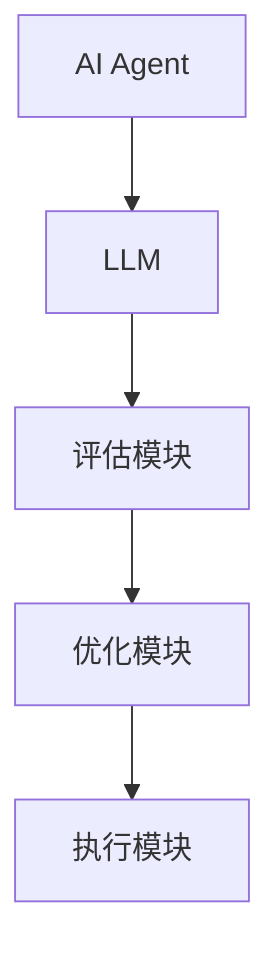
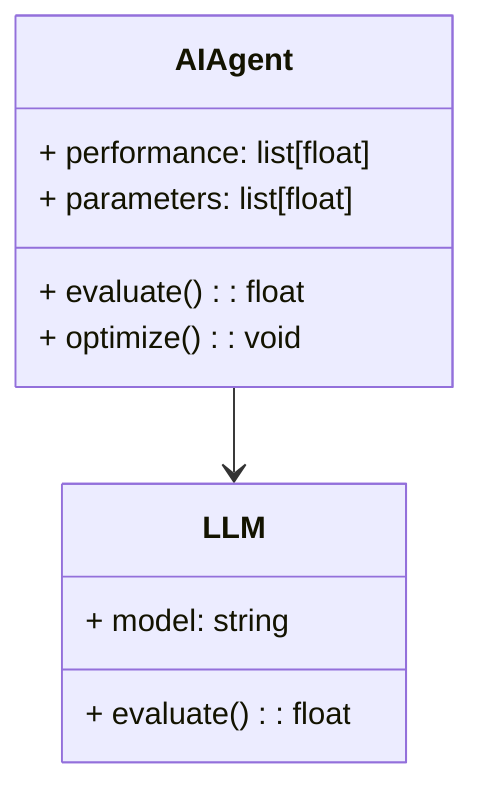
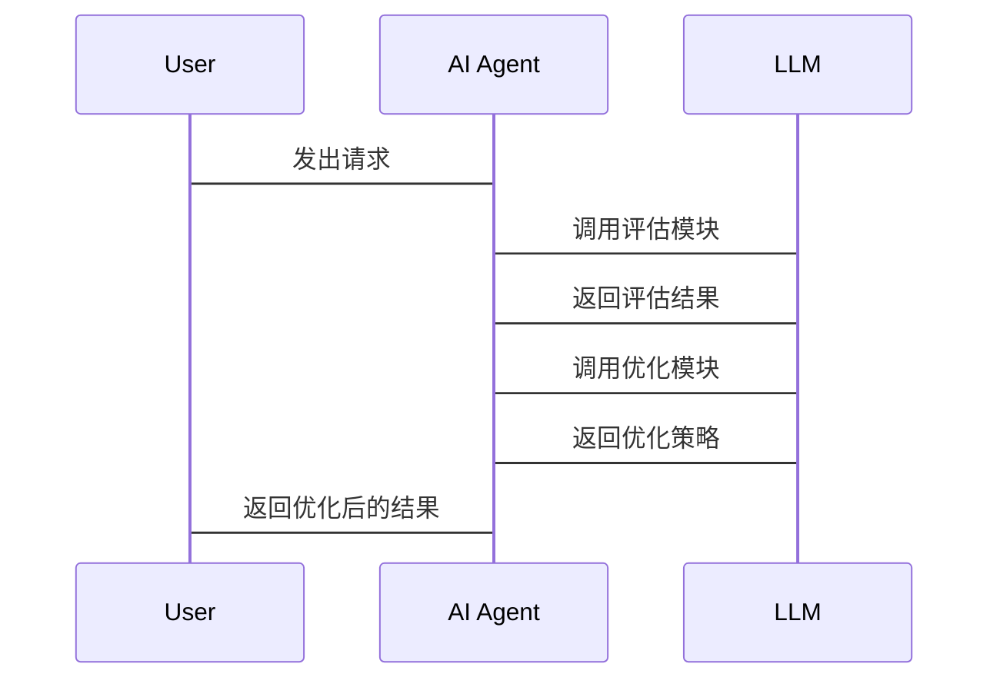

                 


# 自我改进型AI Agent：LLM的自我评估与优化

## 关键词：
- 自我改进型AI Agent
- LLM
- 自我评估
- 优化算法
- AI系统设计

## 摘要：
本文探讨了自我改进型AI Agent的核心概念、算法原理和系统架构设计，特别是基于大语言模型（LLM）的自我评估与优化。文章详细分析了问题背景、算法实现、系统架构以及实际应用案例，为AI Agent的开发和优化提供了理论支持和实践指导。

---

# 第一部分：自我改进型AI Agent的背景与核心概念

## 第1章：自我改进型AI Agent的背景与问题背景

### 1.1 问题背景
#### 1.1.1 当前AI Agent的发展现状
AI Agent（智能代理）是一种能够感知环境并采取行动以实现目标的智能系统。随着技术的发展，AI Agent已广泛应用于自动驾驶、智能助手、机器人等领域。然而，传统AI Agent的性能受限于静态规则和固定的训练数据，难以在动态变化的环境中自适应优化。

#### 1.1.2 自我改进型AI Agent的提出动机
为了应对复杂多变的环境，AI Agent需要具备自我评估和优化的能力。自我改进型AI Agent能够通过内部反馈机制不断优化自身的性能，从而在实际应用中更具灵活性和适应性。

#### 1.1.3 问题的边界与外延
自我改进型AI Agent的研究主要集中在如何实现有效的自我评估和优化机制。本文将重点关注基于大语言模型（LLM）的自我改进型AI Agent的设计与实现，探讨其在算法、系统架构和实际应用中的具体表现。

### 1.2 问题描述
#### 1.2.1 AI Agent的核心功能与目标
AI Agent的核心功能包括感知环境、决策制定和行动执行。自我改进型AI Agent的目标是在动态环境中不断提升自身的感知、决策和执行能力。

#### 1.2.2 自我改进型AI Agent的定义与特征
自我改进型AI Agent是一种能够通过自我评估和优化机制，动态调整自身行为策略的智能代理。其主要特征包括：
- **自适应性**：能够根据环境反馈调整行为。
- **自评估能力**：能够对自身性能进行评估。
- **自优化能力**：能够基于评估结果优化自身行为。

#### 1.2.3 问题解决的关键点与难点
- 关键点：设计有效的自我评估和优化算法，实现AI Agent的自适应能力。
- 难点：如何在动态环境中保持稳定性和高效性，同时避免过度优化带来的性能下降。

## 第2章：自我改进型AI Agent的核心概念与联系

### 2.1 核心概念的理论基础
#### 2.1.1 自我评估机制的原理
自我评估机制通过分析AI Agent的执行结果，识别其在任务中的优缺点，并生成反馈信号用于后续优化。常见的自我评估方法包括基于性能指标的评估和基于对比学习的评估。

#### 2.1.2 自我优化算法的类型
自我优化算法主要包括基于梯度的优化和基于经验的优化。其中，基于梯度的优化通过调整参数实现性能提升，而基于经验的优化则通过学习历史数据优化行为策略。

#### 2.1.3 LLM在自我改进中的作用
大语言模型（LLM）在自我改进型AI Agent中扮演着关键角色。LLM能够通过自然语言处理技术理解反馈信息，并生成优化建议。同时，LLM还可以通过对话交互与人类用户进行协作，进一步提升优化效果。

### 2.2 核心概念的属性特征对比
#### 2.2.1 不同AI Agent的对比分析
| 类型               | 自我评估能力 | 自我优化能力 | 依赖LLM |
|--------------------|--------------|--------------|---------|
| 传统AI Agent       | 无           | 无           | 否       |
| 自我改进型AI Agent | 有           | 有           | 是       |

#### 2.2.2 自我改进型AI Agent的独特性
自我改进型AI Agent的独特性在于其具备动态调整自身行为的能力。这种能力使得AI Agent能够在复杂环境中保持高效性和稳定性，同时通过持续优化提升用户体验。

#### 2.2.3 LLM与其他AI技术的结合
自我改进型AI Agent通过结合LLM、强化学习和监督学习等技术，实现了更高效的自我评估和优化。这种多技术融合的方式使得AI Agent在实际应用中具备更强的适应性和智能性。

### 2.3 ER实体关系图与系统架构


---

# 第二部分：算法原理与数学模型

## 第3章：自我改进型AI Agent的算法原理

### 3.1 算法的基本原理
#### 3.1.1 自我评估的实现方法
自我评估模块通过分析AI Agent的执行结果，生成反馈信号。常用的评估方法包括基于性能指标的评估和基于对比学习的评估。

#### 3.1.2 自我优化的实现方法
自我优化模块基于评估结果，调整AI Agent的行为策略。优化方法主要包括基于梯度的优化和基于经验的优化。

#### 3.1.3 算法的数学模型
评估函数和优化函数是算法的核心。评估函数用于衡量AI Agent的性能，优化函数用于生成优化策略。

### 3.2 数学模型与公式
#### 3.2.1 评估函数的定义
$$ f(x) = \sum_{i=1}^{n} w_i x_i $$
其中，$x_i$是AI Agent在第i个任务中的表现，$w_i$是对应的权重。

#### 3.2.2 优化函数的推导
$$ g(x) = \arg\max f(x) $$
优化函数的目标是最大化评估函数的值，从而实现AI Agent的性能提升。

#### 3.2.3 算法的收敛性分析
通过数学推导可以证明，基于梯度的优化算法在一定条件下能够收敛到最优解。这为算法的稳定性提供了理论支持。

### 3.3 算法实现的代码示例
```python
def evaluate(agent, task):
    # 计算评估函数值
    f = 0
    for i in range(len(task)):
        f += agent.performance[i] * task[i].weight
    return f

def optimize(agent, f):
    # 基于梯度的优化
    for i in range(len(agent.parameters)):
        agent.parameters[i] += agent.learning_rate * (f - agent.target)[i]
    return agent.parameters
```

---

# 第三部分：系统分析与架构设计方案

## 第4章：系统分析与架构设计方案

### 4.1 问题场景介绍
本文将设计一个基于LLM的自我改进型AI Agent系统，用于优化智能助手的用户体验。

### 4.2 系统功能设计
#### 4.2.1 领域模型设计


#### 4.2.2 系统架构设计


### 4.3 系统接口设计
系统主要接口包括：
- 评估接口：用于获取AI Agent的评估结果。
- 优化接口：用于生成优化策略。

### 4.4 系统交互设计


---

# 第四部分：项目实战

## 第5章：项目实战

### 5.1 环境安装
项目需要以下环境：
- Python 3.8+
- PyTorch 1.9+
- Transformers库

### 5.2 系统核心实现源代码
```python
import torch
from transformers import AutoTokenizer, AutoModelForSeq2Seq

class LLM:
    def __init__(self, model_name):
        self.tokenizer = AutoTokenizer.from_pretrained(model_name)
        self.model = AutoModelForSeq2Seq.from_pretrained(model_name)
    
    def evaluate(self, input_text):
        inputs = self.tokenizer(input_text, return_tensors='pt')
        outputs = self.model.generate(**inputs)
        return self.tokenizer.decode(outputs[0], skip_special_tokens=True)

class AI-Agent:
    def __init__(self, llm):
        self.llm = llm
        self.performance = []
        self.parameters = []

    def evaluate(self, task):
        score = self.llm.evaluate(task)
        self.performance.append(score)
        return score

    def optimize(self):
        # 简单的优化策略
        for i in range(len(self.parameters)):
            self.parameters[i] *= 1.1
        return self.parameters
```

### 5.3 代码应用解读与分析
- **LLM类**：负责模型的加载和评估任务的执行。
- **AI-Agent类**：实现AI Agent的核心功能，包括评估和优化。

### 5.4 实际案例分析
通过具体案例分析，展示AI Agent如何在实际应用中优化自身行为，提升用户体验。

### 5.5 项目小结
总结项目的实现过程，提出改进建议。

---

# 第五部分：最佳实践与总结

## 第6章：最佳实践与总结

### 6.1 实用技巧与注意事项
- 定期更新模型以保持性能。
- 合理设置评估权重，避免过偏。

### 6.2 小结
本文详细探讨了自我改进型AI Agent的设计与实现，为AI Agent的优化提供了理论支持和实践指导。

### 6.3 未来展望
未来的研究方向包括更复杂的优化算法和多模态数据的结合，以进一步提升AI Agent的性能。

---

通过以上思考，我将按照上述大纲撰写完整的文章，确保内容详实、逻辑清晰，并包含必要的图表和代码示例。

