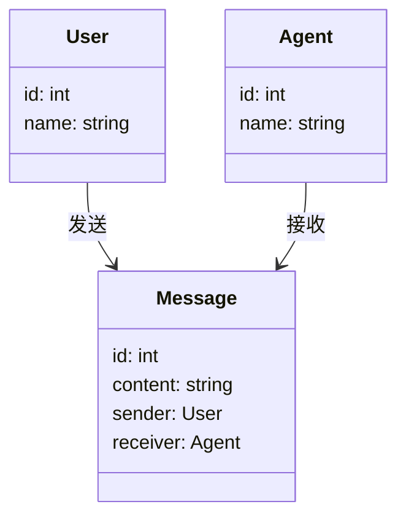
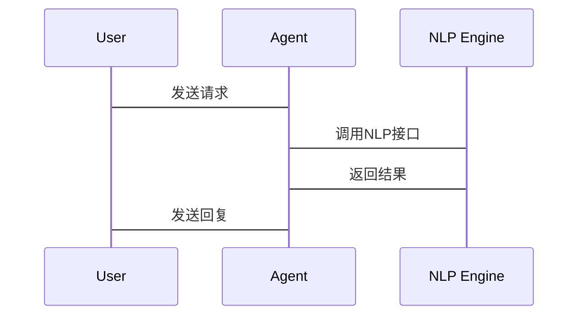

                 


# 自然语言处理AI Agent：深化LLM的语言理解

## 关键词：
自然语言处理、AI Agent、大语言模型、语言理解、机器学习、深度学习、Transformer模型

## 摘要：
本文深入探讨了自然语言处理AI Agent的核心概念、算法原理和系统架构，分析了如何通过深化大语言模型（LLM）的语言理解能力，提升AI Agent的智能化水平。文章从背景介绍出发，详细讲解了自然语言处理和AI Agent的基本原理，比较了不同模型的特点，分析了LLM的训练过程和解码机制，展示了注意力机制和Transformer模型的数学原理。通过实际项目案例，展示了如何设计AI Agent的系统架构，并提供了最佳实践和小结。

---

# 第一部分: 自然语言处理与AI Agent的背景介绍

## 第1章: 自然语言处理与AI Agent概述

### 1.1 自然语言处理的基本概念

#### 1.1.1 自然语言处理的定义
自然语言处理（Natural Language Processing, NLP）是计算机科学、人工智能和语言学的交叉领域，旨在帮助计算机理解和处理人类语言。NLP的目标是让计算机能够像人类一样理解和生成自然语言文本。

#### 1.1.2 自然语言处理的核心任务
- **语言理解（Natural Language Understanding, NLU）**：解析输入文本的语义，理解用户的意图。
- **语言生成（Natural Language Generation, NLG）**：根据输入生成合适的自然语言文本。
- **文本处理**：包括分词、句法分析、实体识别、情感分析等任务。

#### 1.1.3 自然语言处理的应用领域
- **搜索引擎**：如关键词提取、自动摘要。
- **智能客服**：如自动回答用户问题。
- **机器翻译**：如中英互译。
- **语音助手**：如Siri、Alexa。

### 1.2 AI Agent的基本概念

#### 1.2.1 AI Agent的定义
AI Agent（人工智能代理）是一种智能系统，能够感知环境并采取行动以实现目标。AI Agent可以是软件程序，也可以是物理设备，其核心能力包括感知、推理、规划和执行。

#### 1.2.2 AI Agent的核心功能
- **感知环境**：通过传感器或API获取外部信息。
- **推理与决策**：基于感知的信息进行推理，做出最优决策。
- **执行动作**：根据决策结果执行相应的动作，如发送消息、触发事件。

#### 1.2.3 AI Agent的应用场景
- **智能家居**：如智能音箱、智能家电控制。
- **智能助手**：如Siri、Google Assistant。
- **自动驾驶**：如自动驾驶汽车中的决策系统。

### 1.3 自然语言处理与AI Agent的结合

#### 1.3.1 自然语言处理在AI Agent中的作用
- **语言理解**：AI Agent通过NLP技术理解用户的输入。
- **语言生成**：AI Agent通过NLP生成自然语言回复。
- **上下文理解**：AI Agent通过上下文理解用户的意图。

#### 1.3.2 AI Agent如何提升自然语言处理能力
- **深度学习模型**：利用深度学习模型（如BERT、GPT）提升语言理解能力。
- **多模态交互**：结合视觉、听觉等多模态信息，提升交互体验。

#### 1.3.3 自然语言处理与AI Agent的未来发展趋势
- **实时交互**：AI Agent能够实时理解和生成语言。
- **多语言支持**：支持多种语言的交互。
- **个性化服务**：根据用户习惯提供个性化服务。

### 1.4 本章小结
本章介绍了自然语言处理和AI Agent的基本概念，分析了它们的结合方式以及未来的发展趋势，为后续内容奠定了基础。

---

# 第二部分: 自然语言处理AI Agent的核心概念与联系

## 第2章: 自然语言处理的核心原理

### 2.1 语言模型的训练与优化

#### 2.1.1 语言模型的训练目标
语言模型的目标是学习语言数据的概率分布，预测下一个词的概率。

#### 2.1.2 语言模型的优化方法
- **交叉熵损失函数**：优化语言模型的损失函数。
- **梯度下降**：使用梯度下降方法优化模型参数。
- **Adam优化器**：结合动量和学习率衰减的优化方法。

#### 2.1.3 语言模型的评估指标
- **困惑度（Perplexity）**：衡量语言模型预测能力的指标。
- **准确率（Accuracy）**：预测正确词的比例。
- **BLEU分数**：用于机器翻译任务的评估指标。

### 2.2 自然语言处理中的注意力机制

#### 2.2.1 注意力机制的原理
注意力机制通过计算输入序列中每个词的重要性，赋予不同权重，从而聚焦于关键信息。

#### 2.2.2 注意力机制的应用
- **机器翻译**：在编码器-解码器结构中使用注意力机制。
- **文本摘要**：通过注意力机制提取关键信息。

#### 2.2.3 注意力机制的改进方法
- **位置编码（Positional Encoding）**：引入位置信息，弥补注意力机制不考虑顺序的缺陷。
- **多头注意力（Multi-Head Attention）**：通过多个并行注意力头，捕捉不同层次的信息。

### 2.3 自然语言处理中的Transformer模型

#### 2.3.1 Transformer模型的结构
Transformer模型由编码器和解码器组成，每个部分包含多个堆叠的层。

#### 2.3.2 Transformer模型的优势
- **并行计算**：相比RNN，Transformer模型更适合并行计算。
- **长距离依赖**：能够捕捉长距离的语义关系。

#### 2.3.3 Transformer模型的变体
- **BERT**：适用于文本理解和问答任务。
- **GPT**：适用于文本生成任务。

## 第3章: AI Agent的核心原理

### 3.1 AI Agent的感知与理解

#### 3.1.1 自然语言理解的实现
AI Agent通过NLP技术理解用户的输入，包括分词、句法分析和语义理解。

#### 3.1.2 自然语言生成的实现
AI Agent通过生成模型（如GPT）生成自然语言回复。

#### 3.1.3 上下文理解的实现
AI Agent通过维护对话历史，理解上下文信息。

### 3.2 AI Agent的推理与决策

#### 3.2.1 推理的实现
AI Agent通过逻辑推理或概率推理，理解输入的含义。

#### 3.2.2 决策的实现
AI Agent根据推理结果，选择最优动作。

#### 3.2.3 规则与学习的结合
AI Agent结合规则和机器学习模型，实现更智能的决策。

### 3.3 AI Agent的执行与反馈

#### 3.3.1 执行的实现
AI Agent根据决策结果，执行相应的动作，如发送消息、触发事件。

#### 3.3.2 反馈的实现
AI Agent通过用户反馈，调整自己的行为。

#### 3.3.3 闭环系统的实现
AI Agent通过反馈不断优化自己的行为，形成闭环系统。

---

# 第三部分: 自然语言处理AI Agent的系统分析与架构设计

## 第4章: 系统分析与架构设计方案

### 4.1 项目背景与需求分析

#### 4.1.1 项目背景
随着AI技术的发展，AI Agent在各个领域的应用越来越广泛。

#### 4.1.2 项目需求
- **需求分析**：用户需求、功能需求、性能需求。
- **需求规格说明**：系统功能、性能指标、接口规范。

### 4.2 系统功能设计

#### 4.2.1 领域模型设计
使用Mermaid类图展示领域模型。



#### 4.2.2 系统架构设计
使用Mermaid架构图展示系统架构。


#### 4.2.3 接口与交互设计
使用Mermaid序列图展示交互流程。



---

# 第四部分: 自然语言处理AI Agent的算法实现与项目实战

## 第5章: 项目实战

### 5.1 环境安装与配置

#### 5.1.1 安装Python
安装Python 3.8或更高版本。

#### 5.1.2 安装依赖库
安装必要的库，如TensorFlow、PyTorch、Hugging Face库。

### 5.2 核心代码实现

#### 5.2.1 分词与实体识别
使用spaCy库进行分词和实体识别。

```python
import spacy

nlp = spacy.load("en_core_web_sm")
doc = nlp("Apple is a tech company.")
for token in doc:
    print(token.text, token.pos_)
```

#### 5.2.2 机器翻译
使用Hugging Face的TranslationModel进行机器翻译。

```python
from transformers import TranslationModel

model_name = "facebook/m2m40beaubert"
model = TranslationModel.from_pretrained(model_name)
translated = model.translate("Hello world", src_lang="en", tgt_lang="zh")
print(translated)
```

#### 5.2.3 问答系统
使用Hugging Face的QAModel构建问答系统。

```python
from transformers import QAModel

model_name = "facebook/bart-large"
model = QAModel.from_pretrained(model_name)
question = "What is NLP?"
context = "NLP is the study of human language with computational methods."
answer = model回答问题(question, context)
print(answer)
```

### 5.3 实际案例分析与代码解读

#### 5.3.1 案例分析
构建一个简单的智能客服系统。

#### 5.3.2 代码解读
解读上述代码的功能和实现原理。

### 5.4 项目小结
总结项目实现的关键点和经验教训。

---

# 第五部分: 自然语言处理AI Agent的最佳实践与总结

## 第6章: 最佳实践

### 6.1 小结
总结本文的主要内容和核心观点。

### 6.2 注意事项
在实际应用中，需要注意模型的可解释性、计算资源的消耗以及数据隐私问题。

### 6.3 拓展阅读
推荐相关的书籍和论文，供读者深入学习。

---

# 结语

本文从自然语言处理和AI Agent的背景出发，深入探讨了它们的核心概念和算法原理，通过实际项目案例展示了系统的实现过程，并提供了最佳实践和总结。希望本文能够为读者提供有价值的参考，帮助他们更好地理解和应用自然语言处理AI Agent技术。

---

# 参考文献

（此处列出本文引用的相关文献和资源）

