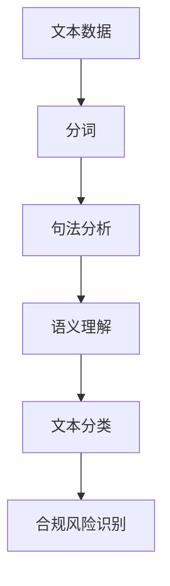
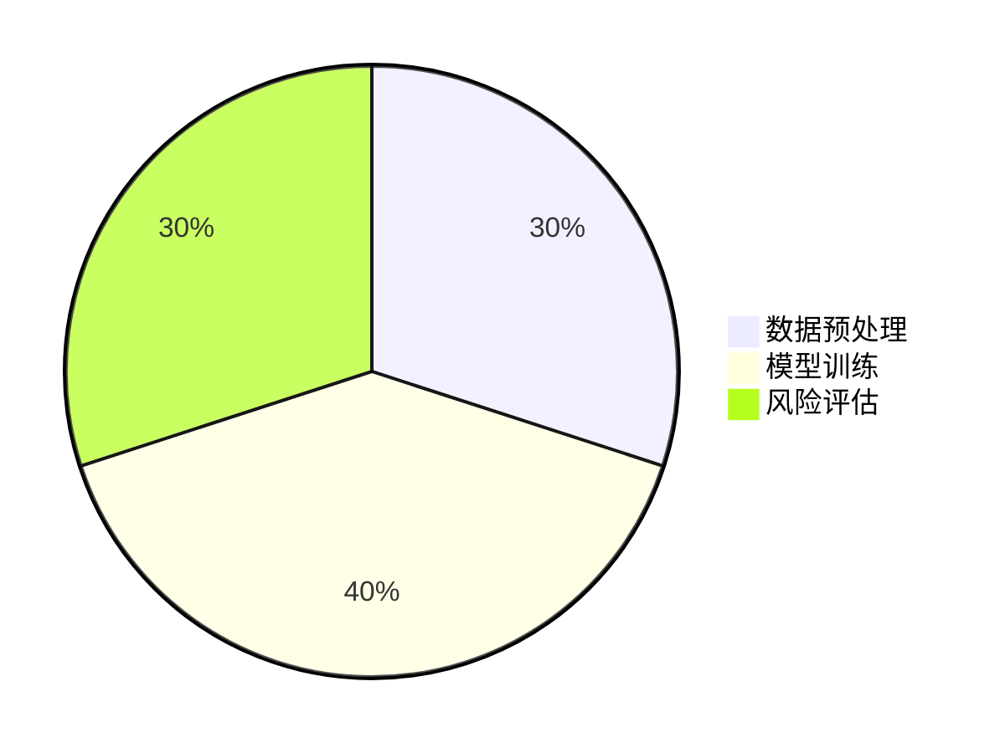

                 


# 自然语言处理在合规风险管理中的应用

> 关键词：自然语言处理，合规风险管理，文本分类，序列标注，机器学习

> 摘要：本文探讨了自然语言处理（NLP）在合规风险管理中的应用，分析了NLP技术如何帮助识别、分类和管理合规风险。文章从背景介绍、核心概念、算法原理、系统架构到项目实战，详细阐述了NLP在合规风险管理中的应用价值和实现方法。

---

## 第一部分：背景介绍

### 第1章：合规风险管理概述

#### 1.1 合规管理的基本概念
合规管理是指企业或组织在经营活动中遵循相关法律法规、行业标准和内部政策的管理过程。合规风险管理的核心在于识别、评估和应对潜在的合规风险，以确保组织的合法性和稳健性。

#### 1.2 自然语言处理的基本概念
自然语言处理（NLP）是人工智能领域的核心技术，旨在让计算机能够理解、解析和生成人类语言。NLP技术包括分词、句法分析、语义理解、文本分类和序列标注等。

#### 1.3 合规风险管理中的NLP应用价值
在合规风险管理中，大量涉及文本数据，例如合同、政策文件、监管报告等。传统的合规管理依赖人工审查，效率低且易出错。NLP技术可以通过自动化处理文本数据，提高合规审查的效率和准确性。

---

## 第二部分：核心概念与联系

### 第2章：自然语言处理技术在合规风险管理中的应用原理

#### 2.1 自然语言处理技术的核心要素
自然语言处理技术主要包括以下核心要素：
1. **分词**：将连续的文本分割成有意义的词语或短语。
2. **句法分析**：分析句子的语法结构，识别主语、谓语等成分。
3. **语义理解**：理解文本的语义含义，提取关键词和实体。

#### 2.2 合规风险管理中的NLP技术应用
NLP技术在合规风险管理中的主要应用包括：
1. **文本分类**：将合规文本分为合规或不合规类别。
2. **实体识别**：识别文本中的关键实体，如人名、机构名、日期等。
3. **关系抽取**：提取文本中的实体间关系，如“某公司违反了某法规”。

#### 2.3 NLP技术在合规风险管理中的流程图



---

## 第三部分：算法原理讲解

### 第3章：文本分类算法

#### 3.1 支持向量机（SVM）
支持向量机是一种常用的文本分类算法，通过构建超平面将数据分为两类。在合规风险管理中，SVM可用于将文本分为合规与不合规两类。

**数学公式**：
$$ \text{SVM的目标是最小化} \frac{1}{2} \omega^2 + C \sum_{i=1}^n \xi_i $$
其中，$\omega$是权重向量，$C$是惩罚系数，$\xi_i$是松弛变量。

#### 3.2 长短期记忆网络（LSTM）
LSTM是一种深度学习模型，特别适用于处理长文本序列。在合规风险管理中，LSTM可用于识别文本中的风险模式。

**数学公式**：
$$ f(t) = \text{ LSTM}(x_t, f(t-1)) $$
其中，$x_t$是输入向量，$f(t-1)$是前一时刻的状态。

### 第4章：序列标注算法

#### 4.1 条件随机场（CRF）
条件随机场是一种概率图模型，常用于序列标注任务。在合规风险管理中，CRF可用于识别文本中的关键词和实体。

**数学公式**：
$$ P(y|x) = \frac{1}{Z(x)} \exp\left(\sum_{i=1}^n \sum_{k} U_k(y_{i-1}, y_i, x_i)\right) $$
其中，$Z(x)$是归一化因子，$U_k$是势函数。

#### 4.2 LSTM-CRF模型
LSTM-CRF模型结合了LSTM和CRF的优势，能够处理长文本序列的序列标注任务。

**数学公式**：
$$ P(y|x) = \text{CRF}(f(x)) $$
其中，$f(x)$是LSTM提取的特征。

---

## 第四部分：系统分析与架构设计方案

### 第5章：系统架构设计

#### 5.1 系统功能设计
合规风险管理系统的功能模块包括：
1. **数据预处理**：文本清洗、分词、句法分析。
2. **模型训练**：文本分类、实体识别、关系抽取。
3. **风险评估**：基于模型输出结果，生成合规风险报告。

#### 5.2 系统架构图



#### 5.3 系统接口设计
系统接口包括：
1. **输入接口**：接收合规文本数据。
2. **输出接口**：输出合规风险评估结果。

---

## 第五部分：项目实战

### 第6章：项目实现

#### 6.1 环境配置
项目所需环境包括Python 3.8及以上版本，安装库如`scikit-learn`、`spaCy`、`keras`等。

#### 6.2 核心代码实现
以下是文本分类的Python代码示例：

```python
from sklearn.feature_extraction.text import TfidfVectorizer
from sklearn.svm import SVC

# 数据预处理
texts = ["违反规定的行为", "符合要求的文本"]
labels = [1, 0]

# 特征提取
vectorizer = TfidfVectorizer()
X = vectorizer.fit_transform(texts)

# 模型训练
model = SVC()
model.fit(X, labels)

# 模型预测
test_text = ["存在合规风险"]
test_X = vectorizer.transform([test_text])
print(model.predict(test_X))
```

#### 6.3 实际案例分析
以金融行业为例，分析如何利用NLP技术识别合规风险。例如，通过文本分类识别违规的金融交易报告。

---

## 第六部分：总结与展望

### 第7章：总结与展望

#### 7.1 总结
本文详细探讨了自然语言处理在合规风险管理中的应用，分析了NLP技术如何帮助识别、分类和管理合规风险。

#### 7.2 展望
未来，随着NLP技术的不断发展，合规风险管理将更加智能化和自动化。深度学习模型如BERT、GPT等将在合规风险管理中发挥更大的作用。

---

### 最佳实践 Tips
1. 在实际项目中，建议结合业务需求选择合适的NLP算法。
2. 数据预处理是NLP任务的关键，需要仔细清洗和标注数据。
3. 模型训练时，建议使用交叉验证优化模型性能。

---

通过本文的分析，读者可以深入了解自然语言处理在合规风险管理中的应用，掌握相关技术的核心原理和实现方法，为实际应用提供参考。

