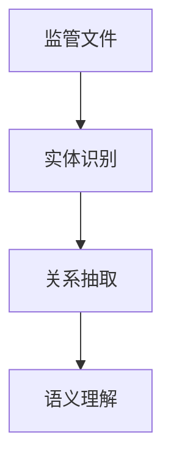
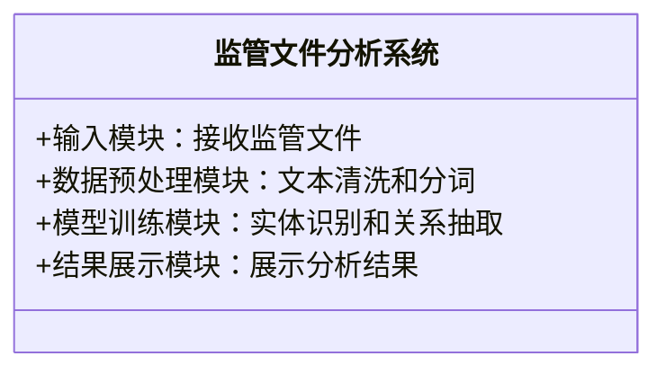

                 


# 自然语言处理在监管文件分析中的应用

## 关键词：自然语言处理，监管文件分析，文本挖掘，实体识别，深度学习

## 摘要：  
自然语言处理（NLP）技术在监管文件分析中发挥着越来越重要的作用。监管文件通常包含大量复杂的文本信息，需要通过先进的NLP技术进行高效分析和理解。本文从监管文件分析的基本概念出发，深入探讨了NLP在其中的应用，详细分析了核心算法的原理、数学模型以及系统架构设计。最后，通过实际案例展示了NLP在监管文件分析中的具体应用和价值。

---

## 第一部分：背景介绍

### 第1章：监管文件分析的重要性

#### 1.1 监管文件的特点与挑战
- 监管文件的类型包括法律合同、金融报告、医疗文档等。
- 文件内容通常复杂且格式多样，包含大量专业术语和结构化数据。
- 分析难点包括文本的非结构化、信息抽取的准确性以及处理效率的问题。

#### 1.2 自然语言处理的核心概念
- NLP技术包括分词、实体识别、句法分析、语义理解等。
- NLP在监管文件分析中的应用需要结合文本挖掘和模式识别技术。

#### 1.3 问题背景与问题解决
- 监管文件分析的典型问题包括信息抽取、文本分类、情感分析等。
- NLP技术通过自动化处理和理解文本，帮助解决监管文件分析中的效率和准确性问题。

---

## 第二部分：核心概念与联系

### 第2章：监管文件分析中的NLP技术

#### 2.1 核心概念与原理
- 分词技术用于将监管文件中的文本分解成词语，便于后续处理。
- 实体识别技术用于提取监管文件中的关键实体，如人名、组织名、日期等。
- 句法分析和语义理解帮助理解文本的结构和含义，为信息抽取提供支持。

#### 2.2 核心概念对比表
| 监管文件类型 | 特点 | 分析难点 |
|--------------|------|----------|
| 法律合同      | 文本长、术语多 | 信息抽取准确率低 |
| 金融报告      | 数据多、结构复杂 | 实体识别难度大 |
| 医疗文档      | 专业术语多、隐私保护严格 | 文本理解难度高 |

#### 2.3 ER实体关系图


---

## 第三部分：算法原理讲解

### 第3章：主流NLP算法及其在监管文件分析中的应用

#### 3.1 基于规则的NLP算法
- 正则表达式在监管文件中的应用：通过预定义规则匹配特定模式。
  ```python
  import re
  pattern = r'\b[A-Z]{3,}\b'  # 匹配专有名词
  matches = re.findall(pattern, text)
  ```

#### 3.2 统计学习算法
- 朴素贝叶斯在文本分类中的应用：
  ```python
  from sklearn.naive_bayes import MultinomialNB
  model = MultinomialNB().fit(X_train, y_train)
  ```

#### 3.3 深度学习算法
- Transformer模型在文本生成中的应用：
  ```python
  import tensorflow as tf
  model = tf.keras.models.load_model('transformer_model.h5')
  ```

---

## 第四部分：数学模型与公式

### 第4章：NLP算法的数学基础

#### 4.1 词嵌入模型
- 词向量表示的数学模型：
  $$ \text{词向量} = W_{word} \cdot \text{词索引} $$
- Word2Vec的训练目标函数：
  $$ \text{损失函数} = -\log(\text{概率}) $$

#### 4.2 注意力机制
- 注意力权重计算：
  $$ \alpha_i = \frac{\exp(e_i)}{\sum_{j}\exp(e_j)} $$
- 注意力加权和：
  $$ \text{输出} = \sum_{i}\alpha_i x_i $$

---

## 第五部分：系统分析与架构设计

### 第5章：监管文件分析系统的架构

#### 5.1 问题场景介绍
- 监管文件分析系统需要处理大量文本数据，提取关键信息。
- 系统架构需要考虑数据预处理、模型训练和结果展示。

#### 5.2 系统功能设计


#### 5.3 系统架构设计


---

## 第六部分：项目实战

### 第6章：智能合同审查系统的实现

#### 6.1 环境安装
- 安装Python和相关库：
  ```bash
  pip install numpy scikit-learn tensorflow
  ```

#### 6.2 核心代码实现
- 实体识别代码示例：
  ```python
  from sklearn.feature_extraction.text import TfidfVectorizer
  from sklearn.svm import SVC

  vectorizer = TfidfVectorizer()
  X = vectorizer.fit_transform(texts)
  model = SVC().fit(X, labels)
  ```

#### 6.3 实际案例分析
- 智能合同审查系统的功能包括合同条款提取、风险评估和自动提醒。

---

## 第七部分：总结与展望

### 7.1 最佳实践 tips
- 数据预处理是关键，确保数据质量和一致性。
- 模型调优可以提高准确率，建议使用交叉验证。

### 7.2 小结
- 自然语言处理在监管文件分析中具有重要价值。
- 通过结合传统算法和深度学习技术，可以进一步提升分析效率和准确性。

### 7.3 注意事项
- 注意数据隐私和合规性，确保符合相关法律法规。
- 在实际应用中，建议结合业务需求进行模型优化。

### 7.4 拓展阅读
- 推荐阅读《自然语言处理实战》和《深度学习入门》。

---

通过以上步骤，您可以全面了解自然语言处理在监管文件分析中的应用，掌握核心算法和系统设计方法。希望这篇文章对您有所帮助！

