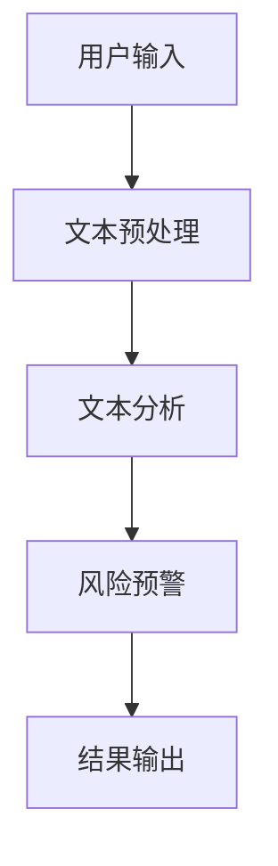
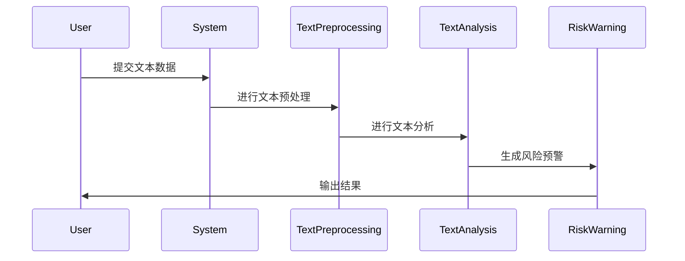

                 


# 自然语言处理在金融AI应用中的最佳实践

> 关键词：自然语言处理，金融AI，文本分析，深度学习，机器学习

> 摘要：自然语言处理（NLP）作为人工智能领域的重要分支，正在深刻改变金融行业的运作方式。本文将系统地探讨自然语言处理在金融AI中的应用，从核心概念到算法原理，再到实际项目实战，旨在为读者提供一套完整的最佳实践指南。通过分析金融文本、智能客服和风险控制等核心场景，结合深度学习和预训练模型，本文将详细讲解自然语言处理在金融中的具体应用和未来发展方向。

---

## 第1章: 自然语言处理与金融AI的概述

### 1.1 自然语言处理的基本概念

#### 1.1.1 自然语言处理的定义
自然语言处理（Natural Language Processing, NLP）是人工智能（AI）的一个分支，旨在让计算机能够理解、解析和生成人类语言。NLP的目标是通过计算机程序来模拟人类对语言的处理能力，使其能够执行诸如翻译、问答、文本摘要等任务。

#### 1.1.2 自然语言处理的核心技术
自然语言处理的核心技术包括：
1. **分词（Tokenization）**：将连续的文本分割成有意义的词语或符号。
2. **词性标注（Part-of-Speech Tagging）**：识别每个词语的词性，如名词、动词、形容词等。
3. **句法分析（Syntactic Parsing）**：分析句子的语法结构，确定词语之间的关系。
4. **实体识别（Named Entity Recognition,NER）**：识别文本中的专有名词，如人名、地名、组织名等。
5. **情感分析（Sentiment Analysis）**：判断文本中的情感倾向，如正面、负面或中性。

#### 1.1.3 自然语言处理与人工智能的关系
自然语言处理是人工智能的重要组成部分，它依赖于机器学习（Machine Learning）和深度学习（Deep Learning）技术。人工智能通过自然语言处理能够实现对人类语言的智能理解，而自然语言处理则为人工智能提供了处理和分析语言数据的能力。

### 1.2 金融AI的基本概念

#### 1.2.1 人工智能在金融领域的应用
人工智能在金融领域的应用非常广泛，包括：
1. **金融预测**：利用历史数据预测股票价格、汇率走势等。
2. **风险控制**：通过分析客户数据评估信用风险。
3. **智能客服**：提供24/7的客户支持服务。
4. **欺诈检测**：识别异常交易行为。

#### 1.2.2 金融AI的核心技术
金融AI的核心技术包括：
1. **机器学习**：用于模式识别和预测。
2. **自然语言处理**：用于分析文本数据。
3. **大数据处理**：处理海量金融数据。

#### 1.2.3 自然语言处理与金融AI的结合
自然语言处理在金融AI中的应用主要体现在：
1. **文本分析**：对金融新闻、财务报表等文本进行分析。
2. **智能对话**：实现智能客服和金融助手。
3. **风险预警**：通过分析新闻和社交媒体数据，预测市场风险。

### 1.3 自然语言处理在金融AI中的应用前景

#### 1.3.1 金融领域的自然语言处理需求
金融领域对自然语言处理的需求主要集中在：
1. **文本分析**：对财务报表、市场报告等文本进行分析。
2. **实时监控**：实时监控市场动态和舆情。
3. **个性化服务**：为用户提供个性化的投资建议。

#### 1.3.2 自然语言处理在金融AI中的优势
1. **高效性**：自然语言处理可以快速处理大量文本数据。
2. **准确性**：通过深度学习模型，可以提高文本分析的准确性。
3. **智能化**：自然语言处理能够实现智能化的对话和预测。

#### 1.3.3 未来发展趋势与挑战
1. **趋势**：随着预训练模型（如BERT、GPT）的发展，自然语言处理在金融领域的应用将更加广泛。
2. **挑战**：金融文本的复杂性和领域特定的术语是自然语言处理的主要挑战。

---

## 第2章: 自然语言处理的核心概念与技术

### 2.1 自然语言处理的关键技术

#### 2.1.1 分词技术
分词是自然语言处理的第一步，其目的是将连续的字符分割成有意义的词语。例如，将“金融市场分析”分割成“金融”、“市场”、“分析”。

#### 2.1.2 词性标注
词性标注是对每个词语进行词性分类的过程。例如，“金融”是名词，“市场”也是名词。

#### 2.1.3 句法分析
句法分析是分析句子的语法结构，确定词语之间的关系。例如，“金融分析”中的“金融”是名词，修饰“分析”。

#### 2.1.4 实体识别
实体识别是识别文本中的专有名词，如人名、地名、组织名等。例如，在“苹果公司发布新的财报”，“苹果公司”是组织名。

#### 2.1.5 情感分析
情感分析是判断文本中的情感倾向。例如，在“我对这家公司的前景非常乐观”，“乐观”表示正面情感。

#### 2.1.6 文本摘要
文本摘要是对文本内容的简短总结。例如，将“苹果公司发布了新的财报，收入增长10%”总结为“苹果公司收入增长10%”。

#### 2.1.7 机器翻译
机器翻译是将一种语言的文本转换成另一种语言。例如，将“Hello”翻译成“你好”。

### 2.2 金融领域的自然语言处理特点

#### 2.2.1 金融文本的特殊性
金融文本具有专业性和复杂性，通常包含大量的专业术语和复杂的句式结构。例如，“买方”、“卖方”、“市盈率”等术语。

#### 2.2.2 金融术语的处理难点
金融术语的处理难点在于其专业性和模糊性。例如，“流动性”可以有不同的解释，具体含义需要结合上下文来判断。

#### 2.2.3 金融场景下的语义理解
在金融场景下，语义理解需要考虑上下文和领域知识。例如，“买方”在不同的交易场景中可能有不同的含义。

### 2.3 自然语言处理的核心算法

#### 2.3.1 传统算法（如SVM、朴素贝叶斯）
1. **朴素贝叶斯分类（Naive Bayes）**：
   - 基于概率论的分类方法。
   - 假设特征之间相互独立。
   - 常用于文本分类任务，如情感分析。

   ```python
   from sklearn.naive_bayes import MultinomialNB
   model = MultinomialNB()
   model.fit(X_train, y_train)
   ```

2. **支持向量机（SVM）**：
   - 基于几何的方法，将数据映射到高维空间，然后找到一个超平面将数据分为两类。
   - 常用于文本分类和回归任务。

3. **K近邻算法（KNN）**：
   - 基于距离的分类方法。
   - 找出训练集中与新样本最接近的K个样本，然后根据这些样本的类别进行投票。

#### 2.3.2 深度学习算法（如RNN、LSTM、BERT）

1. **循环神经网络（RNN）**：
   - 基于序列数据的循环结构。
   - 适合处理时间序列数据和变长序列。

   ```python
   import tensorflow as tf
   model = tf.keras.Sequential([
       tf.keras.layers.SimpleRNN(64, input_shape=(None, 1)),
       tf.keras.layers.Dense(10, activation='softmax')
   ])
   ```

2. **长短期记忆网络（LSTM）**：
   - RNN的一种变体，用于捕捉长距离依赖关系。
   - 通过记忆单元（Memory Cell）和门控机制（Gate）来处理长序列。

   ```python
   import tensorflow as tf
   model = tf.keras.Sequential([
       tf.keras.layers.LSTM(64, input_shape=(None, 1)),
       tf.keras.layers.Dense(10, activation='softmax')
   ])
   ```

3. **BERT模型**：
   - 基于预训练的Transformer模型。
   - 在自然语言理解任务中表现出色。

   ```python
   import transformers
   model = transformers.BertForSequenceClassification.from_pretrained('bert-base-uncased')
   ```

---

## 第3章: 自然语言处理在金融应用中的核心场景

### 3.1 金融文本分析

#### 3.1.1 财务报表分析
财务报表分析是自然语言处理在金融领域的重要应用之一。通过分析财务报表文本，可以提取关键指标，如收入、利润、负债等。

#### 3.1.2 金融新闻分析
金融新闻分析是通过分析新闻标题和正文，判断市场情绪和趋势。例如，分析新闻标题“美联储加息”可能对股市产生负面影响。

#### 3.1.3 股票市场预测
股票市场预测是通过分析历史数据和市场新闻，预测股票价格的变化趋势。

### 3.2 金融客服与对话系统

#### 3.2.1 智能客服的基本原理
智能客服通过自然语言处理技术，理解用户的问题并提供相应的答案。例如，用户询问“如何购买股票”，系统可以提供详细的购买流程。

#### 3.2.2 对话系统的实现技术
对话系统的实现技术包括意图识别（Intent Recognition）和实体识别（NER）。意图识别用于理解用户的主要需求，实体识别用于提取关键信息。

#### 3.2.3 金融对话系统的特殊性
金融对话系统的特殊性在于其需要处理大量的专业术语和复杂的问题。例如，用户可能询问“什么是期权”，系统需要准确解释期权的概念。

### 3.3 金融风险控制

#### 3.3.1 风险评估中的自然语言处理
风险评估是通过分析客户的信用历史、财务报表等文本数据，评估客户的信用风险。

#### 3.3.2 信用评分的自然语言处理方法
信用评分是通过分析客户的信用报告、财务报表等文本数据，计算客户的信用评分。

#### 3.3.3 风险预警的自然语言处理应用
风险预警是通过分析市场新闻、社交媒体数据等，预测潜在的市场风险。

---

## 第4章: 自然语言处理的算法原理与数学模型

### 4.1 传统自然语言处理算法

#### 4.1.1 朴素贝叶斯分类
朴素贝叶斯分类是一种基于概率论的分类方法。其核心思想是，对于给定的训练样本，计算每个类别的先验概率和条件概率，然后根据这些概率计算每个样本属于各个类别的后验概率，选择后验概率最大的类别作为结果。

#### 4.1.2 支持向量机（SVM）
支持向量机是一种基于几何的分类方法。其核心思想是将数据映射到高维空间，然后找到一个超平面将数据分为两类。

#### 4.1.3 K近邻算法（KNN）
K近邻算法是一种基于距离的分类方法。其核心思想是，对于新样本，找到训练集中与之最接近的K个样本，然后根据这些样本的类别进行投票。

### 4.2 深度学习算法

#### 4.2.1 循环神经网络（RNN）
循环神经网络是一种基于序列数据的循环结构。其核心思想是，通过循环结构捕捉序列数据中的时序信息。

#### 4.2.2 长短期记忆网络（LSTM）
长短期记忆网络是RNN的一种变体，用于捕捉长距离依赖关系。其核心思想是，通过记忆单元和门控机制，保存长期信息。

#### 4.2.3 变量长度的序列处理
在金融文本分析中，序列长度可能不同。例如，分析一条新闻和分析一篇长篇文章的长度可能不同。循环神经网络和长短期记忆网络都可以处理变长序列。

### 4.3 预训练模型的数学原理

#### 4.3.1 BERT模型的数学原理
BERT模型基于Transformer架构，通过自注意力机制捕捉文本中的语义关系。其核心思想是，通过上下文信息生成词向量。

#### 4.3.2 GPT模型的数学原理
GPT模型基于生成式预训练，通过自回归的方式生成文本。其核心思想是，通过上下文信息生成下一个词。

#### 4.3.3 模型的训练与推理
自然语言处理模型的训练通常采用反向传播算法，通过最小化损失函数来更新模型参数。推理时，通过输入文本生成输出结果。

---

## 第5章: 系统分析与架构设计方案

### 5.1 问题场景介绍
本章将设计一个完整的金融自然语言处理系统，涵盖从数据输入到结果输出的整个流程。

### 5.2 项目介绍
项目名称：金融自然语言处理系统。

### 5.3 系统功能设计
系统功能包括：
1. **文本预处理**：包括分词、词性标注、实体识别等。
2. **文本分析**：包括情感分析、主题分析等。
3. **风险预警**：通过分析文本数据，预测潜在风险。

### 5.4 系统架构设计



### 5.5 系统接口设计
系统接口包括：
1. **输入接口**：接收文本数据。
2. **输出接口**：输出分析结果。

### 5.6 系统交互设计



---

## 第6章: 项目实战

### 6.1 环境安装

```bash
pip install numpy pandas scikit-learn transformers
```

### 6.2 核心实现

#### 6.2.1 情感分析

```python
from transformers import pipeline

sentiment_pipeline = pipeline("sentiment-analysis")
result = sentiment_pipeline("The company's revenue increased by 10%.")
print(result)
```

#### 6.2.2 实体识别

```python
from transformers import pipeline

ner_pipeline = pipeline("ner")
result = ner_pipeline("Apple is a leading technology company.")
print(result)
```

### 6.3 案例分析
以分析一条金融新闻为例：

```python
text = "The Federal Reserve cut interest rates by 0.5 percentage points."
result = sentiment_pipeline(text)
print(result)  # 输出情感倾向
```

---

## 第7章: 最佳实践与案例分析

### 7.1 最佳实践

1. **数据预处理**：在处理金融文本时，需要对文本进行清洗和标准化处理。
2. **模型选择**：根据具体任务选择合适的模型，如情感分析选择BERT，实体识别选择LSTM。
3. **结果验证**：通过交叉验证和评估指标（如准确率、召回率）验证模型性能。

### 7.2 案例分析
以金融新闻分析为例，通过自然语言处理技术分析新闻标题和正文，判断市场情绪，辅助投资决策。

### 7.3 小结
自然语言处理在金融AI中的应用前景广阔，通过不断优化算法和模型，可以进一步提高金融分析的准确性和效率。

---

## 第8章: 注意事项与拓展阅读

### 8.1 注意事项
1. **数据隐私**：在处理金融数据时，需要遵守相关法律法规，保护用户隐私。
2. **模型解释性**：在金融领域，模型的解释性非常重要，需要能够清晰地解释模型的决策过程。
3. **模型更新**：金融市场变化迅速，需要定期更新模型，保持模型的准确性和有效性。

### 8.2 拓展阅读
1. **《Deep Learning for NLP》**：深入理解深度学习在自然语言处理中的应用。
2. **《金融风险管理》**：了解金融风险管理的基本理论和方法。

---

## 附录

### 附录A: 术语表
列出本文中涉及的专业术语及其定义。

### 附录B: 参考文献
列出本文中引用的文献和资料。

### 附录C: 源代码
提供本文中涉及的源代码和实现细节。

---

通过以上步骤，我们可以系统地完成《自然语言处理在金融AI应用中的最佳实践》这篇文章的撰写，为读者提供一套完整的自然语言处理在金融领域的实践指南。

