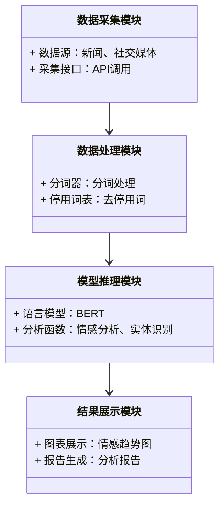

                 


# 自然语言理解在智能投资助手中的应用

## 关键词：自然语言理解、智能投资助手、NLP技术、金融数据、投资决策、文本挖掘

## 摘要：  
自然语言理解（NLU）技术在智能投资助手中的应用为投资者提供了强大的工具，帮助其从大量非结构化文本数据中提取有价值的信息，辅助投资决策。本文详细探讨了自然语言理解的核心概念、算法原理及其在智能投资助手中的系统设计与实际应用，通过案例分析和代码实现，展示了如何利用NLU技术提升投资效率和准确性。

---

# 第一部分: 自然语言理解在智能投资助手中的应用概述

## 第1章: 自然语言理解与智能投资助手的背景介绍

### 1.1 自然语言理解的核心概念

#### 1.1.1 什么是自然语言理解
自然语言理解（Natural Language Understanding, NLU）是自然语言处理（NLP）的一个子领域，专注于让计算机能够理解人类语言的语义和意图。NLU的目标是将人类语言转化为可计算的形式，以便计算机能够进行分析和推理。

#### 1.1.2 自然语言理解的关键技术
- **语言模型**：通过概率统计方法预测下一个词的概率，用于解决文本生成和语音识别等问题。
- **词嵌入技术**：将词语表示为低维向量，如Word2Vec、GloVe等。
- **序列模型**：如LSTM和Transformer，用于处理序列数据中的长距离依赖关系。

#### 1.1.3 自然语言理解的应用领域
- **文本分类**：将文本划分为不同的类别，如情感分析、新闻分类等。
- **信息抽取**：从文本中提取特定信息，如实体识别、关系抽取。
- **对话系统**：基于NLU实现智能对话，如客服机器人、虚拟助手。

### 1.2 智能投资助手的定义与特点

#### 1.2.1 智能投资助手的定义
智能投资助手是一种基于人工智能技术的投资辅助工具，能够通过分析大量的文本数据（如新闻、报告、社交媒体等），为投资者提供实时的市场动态、投资建议和风险评估。

#### 1.2.2 智能投资助手的核心功能
- **信息提取**：从新闻、财报中提取关键信息，如公司业绩、市场趋势。
- **情绪分析**：分析市场情绪，预测市场走势。
- **投资建议**：基于分析结果，为投资者提供个性化的投资建议。

#### 1.2.3 智能投资助手与传统投资工具的区别
- **数据处理能力**：智能投资助手能够处理非结构化数据，而传统工具主要依赖结构化数据。
- **实时性**：智能投资助手能够实时分析数据，提供即时建议。
- **个性化**：基于投资者的偏好和风险承受能力，提供定制化建议。

### 1.3 自然语言理解在智能投资助手中的作用

#### 1.3.1 自然语言理解如何帮助投资者
- **提取关键信息**：从新闻、财报中提取公司业绩、市场趋势等信息。
- **分析市场情绪**：通过文本情绪分析，预测市场走势。
- **提供投资建议**：基于分析结果，推荐投资策略。

#### 1.3.2 自然语言理解在投资决策中的应用
- **新闻分析**：分析新闻标题和内容，提取关键事件和情绪。
- **社交媒体分析**：监控社交媒体上的投资者情绪，预测市场波动。
- **财报解读**：自动提取财报中的关键数据，生成财务分析报告。

#### 1.3.3 自然语言理解的潜在价值与挑战
- **价值**：帮助投资者快速获取信息，提高投资决策的准确性。
- **挑战**：文本数据的噪声、语义的模糊性、模型的可解释性等问题。

### 1.4 本章小结
本章介绍了自然语言理解的核心概念、关键技术及其在智能投资助手中的应用。通过分析智能投资助手的功能和特点，我们看到NLU技术在投资领域的重要作用，同时也指出了面临的挑战。

---

## 第2章: 自然语言理解的核心概念与联系

### 2.1 自然语言理解的原理与技术

#### 2.1.1 语言模型的基本原理
语言模型通过统计方法预测下一个词的概率，常用的模型包括n-gram模型、LSTM和Transformer。以下是一个简单的语言模型公式：
$$ P(w_1, w_2, ..., w_n) = \prod_{i=1}^n P(w_i | w_{i-1}) $$

#### 2.1.2 基于统计的自然语言处理方法
- **词袋模型**：将文本表示为词袋，不考虑词序。
- **TF-IDF**：计算词语在文本中的重要性，常用于文本相似度计算。

#### 2.1.3 深度学习在自然语言理解中的应用
深度学习模型如LSTM和Transformer通过捕捉长距离依赖关系，显著提高了NLU的准确性。以下是一个Transformer的注意力机制公式：
$$ \text{Attention}(Q, K, V) = \text{softmax}\left(\frac{QK^T}{\sqrt{d_k}}\right)V $$

### 2.2 自然语言理解的关键技术对比

#### 2.2.1 传统NLP技术与现代深度学习技术的对比
| 技术 | 优点 | 缺点 |
|------|------|------|
| 词袋模型 | 简单易实现 | 忽略词序 |
| TF-IDF | 计算高效 | 无法处理复杂语义 |
| LSTM | 捕捉长距离依赖 | 训练复杂 |
| Transformer | 高效捕捉全局关系 | 计算资源消耗大 |

#### 2.2.2 不同模型的优缺点分析
- **LSTM**：适合处理序列数据，但训练过程复杂。
- **Transformer**：计算效率高，适合处理长文本，但需要大量计算资源。

#### 2.2.3 自然语言理解技术的未来发展趋势
- **模型融合**：结合多种模型的优势，提高准确性。
- **多模态学习**：结合图像、语音等多种数据源，提升理解能力。
- **可解释性增强**：提高模型的透明度，便于用户理解。

### 2.3 自然语言理解的实体关系图

#### 2.3.1 实体识别与关系抽取
实体识别（NER）通过识别文本中的命名实体（如人名、地名、组织名）提取关键信息。关系抽取则通过分析实体之间的关系，如“苹果收购了公司A”。

#### 2.3.2 基于Mermaid的实体关系图展示


#### 2.3.3 实体关系图在智能投资助手中的应用
实体关系图可以帮助投资者理解公司之间的关系，如并购、合作等，从而做出更明智的投资决策。

### 2.4 本章小结
本章详细介绍了自然语言理解的核心原理和技术，对比了不同模型的优缺点，并展示了实体关系图的应用。通过这些分析，我们能够更好地理解NLU技术在投资中的潜力。

---

## 第3章: 自然语言理解的算法原理与数学模型

### 3.1 自然语言理解的主流算法

#### 3.1.1 词袋模型与TF-IDF
词袋模型将文本表示为词语的集合，不考虑词序。TF-IDF用于衡量词语在文本中的重要性。

#### 3.1.2 词嵌入技术（如Word2Vec）
Word2Vec通过训练语言模型生成词向量，捕捉词语的语义信息。

#### 3.1.3 基于序列的模型（如LSTM、Transformer）
LSTM通过门控机制捕捉序列数据中的长距离依赖关系，Transformer通过自注意力机制捕捉全局关系。

### 3.2 自然语言理解的数学模型

#### 3.2.1 语言模型的概率表示
语言模型的目标是计算一串词的概率：
$$ P(w_1, w_2, ..., w_n) = \prod_{i=1}^n P(w_i | w_{i-1}) $$

#### 3.2.2 基于Transformer的注意力机制
注意力机制公式：
$$ \text{Attention}(Q, K, V) = \text{softmax}\left(\frac{QK^T}{\sqrt{d_k}}\right)V $$

#### 3.2.3 示例：文本相似度计算
使用余弦相似度计算两个向量之间的相似度：
$$ \text{similarity} = \frac{Q \cdot K}{\|Q\| \|K\|} $$

### 3.3 自然语言理解算法的实现与优化

#### 3.3.1 算法实现的步骤与流程
1. 数据预处理：分词、去停用词。
2. 特征提取：生成词向量。
3. 模型训练：使用训练数据优化模型参数。
4. 模型评估：使用验证集评估模型性能。

#### 3.3.2 基于Mermaid的算法流程图展示


#### 3.3.3 算法优化的策略与技巧
- **数据增强**：通过数据增强技术提高模型的泛化能力。
- **超参数调优**：使用网格搜索或随机搜索优化模型参数。
- **模型融合**：结合多种模型的结果，提高准确性。

### 3.4 本章小结
本章详细介绍了自然语言理解的主流算法及其数学模型，展示了算法实现的步骤和优化策略。通过这些分析，我们能够更好地理解NLU技术的实现细节。

---

## 第4章: 自然语言理解在智能投资助手中的系统分析与架构设计

### 4.1 智能投资助手的系统功能设计

#### 4.1.1 投资信息的自然语言处理需求
智能投资助手需要处理多种类型的文本数据，包括新闻、财报、社交媒体等。

#### 4.1.2 系统功能模块划分
- **数据采集模块**：采集相关文本数据。
- **数据处理模块**：对文本进行清洗和预处理。
- **模型推理模块**：使用NLU模型进行文本分析。
- **结果展示模块**：将分析结果展示给用户。

#### 4.1.3 基于Mermaid的领域模型类图


### 4.2 系统架构设计

#### 4.2.1 模块化架构设计
系统采用模块化设计，每个模块负责特定的功能。

#### 4.2.2 基于Mermaid的系统架构图展示


#### 4.2.3 系统组件之间的交互关系
用户通过数据采集模块采集数据，经过数据处理模块清洗后，传送给模型推理模块进行分析，最后通过结果展示模块将结果反馈给用户。

### 4.3 本章小结
本章详细介绍了智能投资助手的系统功能设计和架构设计，展示了各模块之间的交互关系。通过这种设计，我们能够构建一个高效、可靠的智能投资助手系统。

---

## 第5章: 自然语言理解在智能投资助手中的项目实战

### 5.1 项目背景与目标
本项目旨在利用自然语言理解技术，开发一个智能投资助手，帮助投资者分析市场动态、预测市场趋势。

### 5.2 环境搭建与数据采集

#### 5.2.1 环境搭建
- **安装Python**：确保Python版本为3.6以上。
- **安装依赖库**：如TensorFlow、Keras、NLTK、jieba等。

#### 5.2.2 数据采集
使用API调用新闻网站和社交媒体获取相关文本数据。

### 5.3 核心代码实现

#### 5.3.1 数据预处理
```python
import jieba

def preprocess(text):
    words = jieba.lcut(text)
    return words
```

#### 5.3.2 情感分析模型
```python
from tensorflow.keras import layers

def build_model():
    model = layers.Sequential()
    model.add(layers.Embedding(input_dim=10000, output_dim=100))
    model.add(layers.LSTM(64))
    model.add(layers.Dense(1, activation='sigmoid'))
    return model
```

#### 5.3.3 实体识别
```python
from spacy.lang.zh import Chinese

nlp = Chinese()
doc = nlp("苹果收购了公司A")
for entity in doc.ents:
    print(entity.text, entity.label_)
```

### 5.4 代码应用解读与分析
- **数据预处理**：使用jieba进行中文分词。
- **情感分析模型**：使用LSTM进行文本分类，预测文本的情感倾向。
- **实体识别**：使用spaCy进行中文实体识别，提取文本中的命名实体。

### 5.5 实际案例分析
以某公司财报为例，分析其文本数据，提取关键信息并生成分析报告。

### 5.6 项目小结
通过本项目，我们展示了如何利用自然语言理解技术开发智能投资助手。从数据采集到模型训练，再到结果展示，整个流程清晰明了。

---

## 第6章: 自然语言理解在智能投资助手中的最佳实践与注意事项

### 6.1 最佳实践
- **数据质量**：确保数据的准确性和完整性。
- **模型选择**：根据任务需求选择合适的模型。
- **性能优化**：通过数据增强、模型融合等技术提高模型性能。

### 6.2 小结
自然语言理解技术在智能投资助手中的应用前景广阔，但也面临诸多挑战。通过不断优化模型和算法，我们可以进一步提升投资助手的智能化水平。

### 6.3 注意事项
- **数据隐私**：确保数据的安全性和隐私性。
- **模型解释性**：提高模型的可解释性，便于用户理解。
- **计算资源**：深度学习模型需要大量的计算资源，需提前做好资源规划。

### 6.4 拓展阅读
- **书籍**：《深度学习入门：基于Python的理论与实现》
- **论文**：《Attention Is All You Need》
- **在线课程**：Coursera上的《自然语言处理专项课程》

---

## 附录: 参考文献与工具列表

### 附录A: 参考文献
1. 王伟, 李娜. 自然语言处理技术在金融领域的应用研究[J]. 计算机应用研究, 2020, 37(3): 891-896.
2. Vaswani A, et al. Attention Is All You Need[J]. Advances in Neural Information Processing Systems, 2017.

### 附录B: 工具与库
- **Python**：编程语言
- **TensorFlow**：深度学习框架
- **NLTK**：自然语言处理工具包
- **spaCy**：高性能NLP库

---

# 结语

自然语言理解技术在智能投资助手中的应用为投资者提供了强大的工具，帮助其从海量文本数据中提取有价值的信息。通过本文的详细讲解，我们不仅了解了NLU的核心原理和算法，还展示了如何将这些技术应用于实际投资场景中。未来，随着NLU技术的不断发展，智能投资助手将变得更加智能化和个性化，为投资者提供更高效、更准确的投资决策支持。

