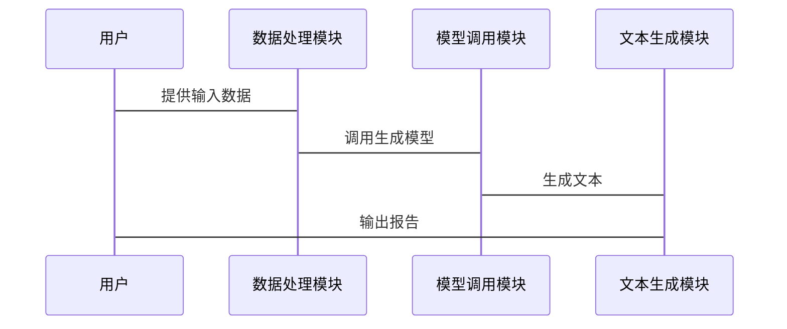

                 

# 第5章: 自然语言生成技术的系统分析与架构设计

## 5.1 系统功能设计

### 5.1.1 数据输入模块
自然语言生成系统需要接收多源异构数据，包括实时市场数据、公司财报、行业分析报告、新闻资讯等。数据输入模块负责对这些数据进行清洗、预处理和结构化，确保数据的准确性和完整性。例如，将非结构化的新闻文本转化为结构化的事件信息，将财报数据转化为关键财务指标。

### 5.1.2 模型选择与调用模块
系统需要根据具体的金融场景和报告类型，选择合适的自然语言生成模型。例如，在生成财务分析报告时，可能选择基于Transformer的模型；在生成市场预测报告时，可能选择集成模型。模型选择模块需要考虑生成报告的准确性和效率。

### 5.1.3 文本生成与输出模块
文本生成模块负责将处理后的数据输入生成模型，输出自然流畅的金融报告。输出格式可以根据需求进行定制，例如生成PDF报告、HTML格式报告或直接输出文本内容。

## 5.2 系统架构设计

### 5.2.1 分层架构设计
系统采用分层架构，包括数据层、应用层、业务逻辑层和表现层。数据层负责数据的存储和管理；应用层负责数据处理和模型调用；业务逻辑层负责生成报告；表现层负责报告的展示和输出。

### 5.2.2 微服务架构设计
为了提高系统的扩展性和维护性，采用微服务架构。将系统划分为多个独立的服务模块，例如数据处理服务、模型服务、生成服务等。各个服务之间通过API进行通信，确保系统的高效性和灵活性。

### 5.2.3 可扩展性设计
系统设计时充分考虑可扩展性，支持多种模型的动态加载和切换。例如，可以根据不同的报告类型和数据特点，动态选择最优的生成模型，确保系统的灵活性和高效性。

## 5.3 系统接口设计

### 5.3.1 数据接口
系统需要与多种数据源进行交互，包括数据库、API接口和文件输入。数据接口负责接收和处理不同类型的数据，确保数据的准确性和一致性。

### 5.3.2 模型接口
系统需要与多种自然语言生成模型进行交互，例如开源模型和商业模型。模型接口负责调用不同的生成模型，获取生成文本。

### 5.3.3 用户接口
系统需要提供友好的用户界面，支持用户输入需求、选择报告类型和查看生成报告。用户接口可以根据不同的用户角色和需求进行定制。

## 5.4 系统交互设计

### 5.4.1 系统流程
系统交互流程包括用户需求输入、数据处理、模型调用、文本生成和报告输出。整个流程需要高效且透明，确保用户能够及时获得生成的报告。

### 5.4.2 交互流程图

## 5.5 系统优化策略

### 5.5.1 模型优化
为了提高生成报告的质量，可以通过数据增强、模型调优和后处理优化等方法提升生成模型的性能。例如，使用对抗训练提高生成文本的流畅性，采用语言模型的温度和重复率参数控制生成结果的多样性和独特性。

### 5.5.2 性能优化
通过优化系统架构和算法实现，提高系统的运行效率。例如，采用分布式计算加速模型训练和推理，使用缓存技术减少重复计算，优化数据存储和传输效率。

### 5.5.3 安全与合规优化
为了确保系统的安全性和合规性，需要采取数据加密、访问控制和隐私保护等措施。同时，需要遵守金融行业的相关法规和标准，确保生成报告的准确性和合法性。

## 5.6 本章小结

---

# 第6章: 自然语言生成技术在金融报告中的实际应用案例分析

## 6.1 应用场景分析

### 6.1.1 财务分析报告生成
自然语言生成技术可以用于生成财务分析报告，包括公司财务状况分析、财务预测和投资建议等内容。例如，利用生成模型分析公司财报，自动生成财务分析报告，帮助投资者做出决策。

### 6.1.2 市场预测报告生成
自然语言生成技术可以用于生成市场预测报告，包括市场趋势分析、行业动态和市场预测等内容。例如，结合市场数据和新闻资讯，生成实时市场分析报告，为投资者提供参考。

### 6.1.3 风险评估报告生成
自然语言生成技术可以用于生成风险评估报告，包括风险识别、风险量化和风险应对策略等内容。例如，分析公司财务数据和市场信息，生成风险评估报告，帮助企业和投资者规避风险。

## 6.2 实际应用案例

### 6.2.1 案例一: 财务分析报告生成
某金融机构利用自然语言生成技术，开发了一款智能财务分析工具，能够自动生成财务分析报告。系统通过输入公司财报数据，调用自然语言生成模型，生成详细的财务分析报告，包括收入分析、利润分析和财务比率分析等内容。

### 6.2.2 案例二: 市场预测报告生成
某投资公司利用自然语言生成技术，开发了一款市场预测工具，能够自动生成市场预测报告。系统通过输入市场数据和新闻资讯，调用自然语言生成模型，生成实时市场分析报告，包括市场趋势、行业动态和投资建议等内容。

### 6.2.3 案例三: 风险评估报告生成
某银行利用自然语言生成技术，开发了一款风险评估系统，能够自动生成风险评估报告。系统通过输入客户数据和市场信息，调用自然语言生成模型，生成风险评估报告，包括客户信用风险、市场风险和操作风险等内容。

## 6.3 案例分析与经验总结

### 6.3.1 案例分析
通过对上述案例的分析，可以看出自然语言生成技术在金融报告中的应用具有高效性、准确性和灵活性的特点。系统可以根据不同的需求和场景，动态调整生成模型和生成策略，满足多样化的报告生成需求。

### 6.3.2 经验总结
在实际应用中，需要注意以下几点：
1. 数据质量：生成报告的质量依赖于输入数据的准确性和完整性，因此需要对数据进行严格的清洗和预处理。
2. 模型选择：不同场景和需求需要选择不同的生成模型，因此需要对模型进行充分的测试和评估。
3. 生成控制：为了确保生成报告的准确性和专业性，需要对生成过程进行严格的控制和优化，例如通过温度参数和重复率参数控制生成结果的多样性和独特性。

## 6.4 本章小结

---

# 第7章: 自然语言生成技术的未来发展趋势与挑战

## 7.1 未来发展趋势

### 7.1.1 多模态生成技术
未来的自然语言生成技术将更加注重多模态生成，即结合图像、音频、视频等多种信息源，生成更加丰富和多样化的报告内容。例如，生成包含图表和图像的金融报告，提高报告的可视化效果和信息传达效率。

### 7.1.2 自适应生成技术
未来的自然语言生成技术将更加注重自适应性，能够根据不同的用户需求和场景，动态调整生成策略和生成模型。例如，根据用户的个性化需求，生成定制化的金融报告，满足不同用户的需求。

### 7.1.3 可解释性生成技术
未来的自然语言生成技术将更加注重可解释性，能够清晰地解释生成报告的逻辑和依据。例如，生成报告时，系统能够提供生成内容的推理过程和数据来源，增强报告的可信度和专业性。

## 7.2 当前挑战

### 7.2.1 数据隐私与安全
自然语言生成技术在金融领域的应用需要处理大量敏感数据，如何确保数据的安全性和隐私性是一个重要的挑战。例如，如何在生成报告时保护用户的隐私信息，防止数据泄露和滥用。

### 7.2.2 模型可解释性
自然语言生成技术的黑箱特性使得生成结果的可解释性成为一个重要的挑战。例如，生成报告时，用户需要了解生成内容的依据和逻辑，以便进行验证和评估。

### 7.2.3 技术与业务结合
自然语言生成技术需要与金融业务深度融合，才能真正发挥其价值。例如，如何将生成技术与具体的金融业务场景相结合，实现业务价值的最大化。

## 7.3 未来展望

### 7.3.1 技术进步
随着深度学习和人工智能技术的不断发展，自然语言生成技术将更加智能化和高效化。例如，基于大语言模型的生成技术将更加成熟，生成内容的质量和多样性将进一步提高。

### 7.3.2 应用拓展
随着自然语言生成技术的不断发展，其在金融领域的应用将更加广泛和深入。例如，生成技术将不仅用于报告生成，还将应用于金融咨询、投资决策和风险管理等领域。

### 7.3.3 伦理与法律
随着自然语言生成技术的广泛应用，相关的伦理和法律问题也将逐渐浮现。例如，生成内容的版权问题、生成结果的法律责任等，需要社会各界共同关注和解决。

## 7.4 本章小结

---

# 第8章: 总结与展望

## 8.1 核心内容总结

### 8.1.1 自然语言生成技术的定义与特点
自然语言生成技术是一种基于人工智能的文本生成技术，能够自动生成自然流畅的文本内容。其核心特点包括自动化、智能化和个性化。

### 8.1.2 自然语言生成技术在金融报告中的应用
自然语言生成技术可以应用于财务分析报告、市场预测报告和风险评估报告等金融报告的生成，帮助金融机构和投资者提高工作效率和决策能力。

### 8.1.3 系统设计与优化策略
为了确保生成报告的质量和效率，需要进行系统的架构设计和优化策略，包括分层架构设计、微服务架构设计和可扩展性设计等。

## 8.2 未来展望

### 8.2.1 技术进步
未来的自然语言生成技术将更加智能化和高效化，基于大语言模型的生成技术将更加成熟，生成内容的质量和多样性将进一步提高。

### 8.2.2 应用拓展
自然语言生成技术在金融领域的应用将更加广泛和深入，不仅用于报告生成，还将应用于金融咨询、投资决策和风险管理等领域。

### 8.2.3 伦理与法律
随着自然语言生成技术的广泛应用，相关的伦理和法律问题也需要社会各界共同关注和解决，例如生成内容的版权问题和法律责任等。

## 8.3 最佳实践 tips

### 8.3.1 数据处理
在自然语言生成系统中，数据处理是生成报告的关键步骤。建议对输入数据进行严格的清洗和预处理，确保数据的准确性和完整性。

### 8.3.2 模型选择
在选择自然语言生成模型时，需要根据具体的金融场景和报告类型进行充分的测试和评估，选择最优的生成模型。

### 8.3.3 生成控制
为了确保生成报告的准确性和专业性，需要对生成过程进行严格的控制和优化，例如通过温度参数和重复率参数控制生成结果的多样性和独特性。

## 8.4 本章小结

---

通过以上章节的内容，我们可以看到自然语言生成技术在金融报告写作中的应用具有广阔的发展前景和重要的实际价值。随着技术的不断进步和应用的不断拓展，自然语言生成技术将成为金融领域不可或缺的重要工具，为金融机构和投资者提供更加高效、准确和专业的服务。

