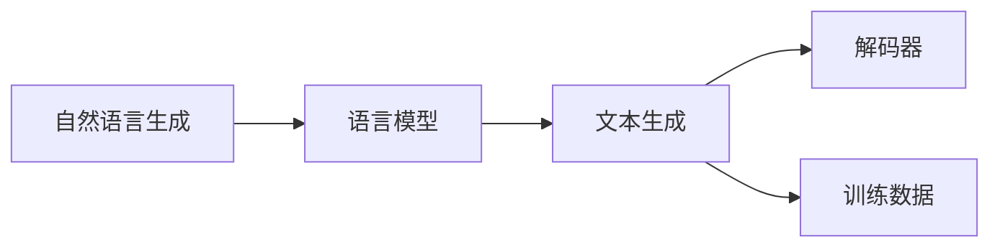
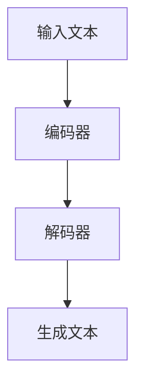

                 


# 自然语言生成：提升AI Agent的表达能力

## 关键词：自然语言生成、AI Agent、NLP、深度学习、文本生成、Transformer、GPT、BERT、数学模型、系统架构

## 摘要：  
自然语言生成（NLG）是人工智能领域的重要技术，用于赋予AI Agent自然流畅的表达能力。本文从基础概念到高级算法，系统讲解NLG的核心原理、应用场景、算法模型、数学公式、系统架构设计及实战案例。通过深入分析，帮助读者掌握提升AI Agent表达能力的关键技术。

---

# 第1章: 自然语言生成的背景与概念

## 1.1 自然语言生成的基本概念

### 1.1.1 自然语言生成的定义  
自然语言生成（NLG）是自然语言处理（NLP）的子领域，旨在使计算机能够生成符合人类语言习惯的文本或语音输出。通过算法和模型，NLG将结构化的数据转化为自然流畅的语言表达。

### 1.1.2 自然语言生成的核心问题  
- **语义理解**：如何将结构化数据转化为有意义的语义表达。  
- **语法生成**：生成符合语法和语境的文本。  
- **语用生成**：确保生成的文本在实际场景中适用且有说服力。  

### 1.1.3 自然语言生成的应用场景  
- **对话系统**：如智能客服、虚拟助手。  
- **机器翻译**：将源语言翻译为目标语言。  
- **文本摘要**：将长文本压缩为简洁的摘要。  
- **内容生成**：如新闻报道、营销文案的自动生成。  

---

## 1.2 自然语言生成的技术发展

### 1.2.1 自然语言生成的历史演变  
- **规则驱动阶段**：基于语法和语义规则生成文本，适用于简单场景。  
- **统计模型阶段**：利用概率模型（如n-gram）生成文本，考虑上下文信息。  
- **深度学习阶段**：引入神经网络（如RNN、Transformer）实现更复杂的生成任务。  

### 1.2.2 从规则驱动到数据驱动的转变  
- 规则驱动方法依赖人工编写规则，灵活性差。  
- 数据驱动方法通过大量数据训练模型，能够捕捉复杂的语言模式。  

### 1.2.3 当前主流技术的现状  
- **深度学习主导**：Transformer、BERT、GPT等模型成为主流。  
- **多模态生成**：结合图像、语音等多模态信息生成更自然的语言。  

---

## 1.3 自然语言生成的应用领域

### 1.3.1 机器翻译  
- 使用神经机器翻译模型（如Transformer）实现高质量的翻译。  

### 1.3.2 聊天机器人  
- 通过生成模型实现自然的对话交互。  

### 1.3.3 文本摘要与扩写  
- 使用生成模型生成摘要或扩展内容。  

---

## 1.4 自然语言生成的挑战与未来方向

### 1.4.1 技术上的主要挑战  
- **生成的可控性**：如何控制生成内容的风格、长度和准确性。  
- **可解释性**：生成结果的决策过程难以解释。  
- **多语言支持**：跨语言生成的难度较高。  

### 1.4.2 应用中的伦理问题  
- **虚假信息**：生成的文本可能被滥用，传播错误信息。  
- **隐私问题**：处理敏感数据时的隐私保护。  

### 1.4.3 未来技术发展的趋势  
- **更高效的模型**：如更大参数量的模型（如GPT-4）。  
- **多模态生成**：结合视觉、语音等信息的生成。  
- **可解释性增强**：使生成过程更透明和可解释。  

---

## 1.5 本章小结  
本章介绍了自然语言生成的基本概念、技术发展和应用场景，强调了其在AI Agent中的重要性，并指出了当前的技术挑战和未来发展方向。

---

# 第2章: 自然语言生成的核心概念与联系

## 2.1 自然语言生成的核心原理

### 2.1.1 生成模型的类型  
- **基于规则的模型**：通过预定义的规则生成文本。  
- **基于统计的模型**：利用概率模型生成文本。  
- **基于深度学习的模型**：如RNN、LSTM、Transformer。  

### 2.1.2 文本生成的基本流程  
1. **输入处理**：将输入数据（如结构化数据或关键词）转化为模型可处理的形式。  
2. **生成过程**：模型根据输入生成候选文本。  
3. **优化与调整**：对生成的文本进行润色和优化。  

### 2.1.3 模型的输入输出关系  
- 输入：结构化数据或文本片段。  
- 输出：自然流畅的文本输出。  

---

## 2.2 自然语言生成的关键技术

### 2.2.1 语言模型的概念  
- 语言模型通过概率分布预测下一个词，为生成提供语义和语法支持。  

### 2.2.2 解码器的作用  
- 解码器将输入的向量转换为自然语言文本，常用解码器包括贪心解码、束搜索解码。  

### 2.2.3 模型的训练与优化  
- 使用大规模数据训练模型，优化生成质量。  

---

## 2.3 自然语言生成与其他NLP任务的关系

### 2.3.1 与文本分类的区别  
- 文本分类是将文本分为不同类别，而NLG是生成新的文本内容。  

### 2.3.2 与信息抽取的联系  
- 信息抽取从文本中提取结构化信息，NLG则将结构化信息转化为自然语言。  

### 2.3.3 与对话系统的整合  
- 对话系统结合NLG生成自然的回复。  

---

## 2.4 自然语言生成的实体关系图



---

## 2.5 本章小结  
本章详细讲解了自然语言生成的核心原理、关键技术及其与其他NLP任务的关系，通过Mermaid图展示了概念之间的联系。

---

# 第3章: 自然语言生成的算法原理

## 3.1 基于Transformer的生成模型

### 3.1.1 Transformer的基本结构  
- **编码器**：将输入文本转化为上下文表示。  
- **解码器**：根据编码器的输出生成目标文本。  

### 3.1.2 自注意力机制的原理  
- 自注意力机制允许模型关注输入中的重要部分，提升生成质量。  

### 3.1.3 解码器端的生成过程  
- 解码器逐步生成每个词，依赖于之前的生成结果。  

---

## 3.2 GPT系列模型的原理

### 3.2.1 GPT模型的结构  
- GPT通过自回归方式生成文本，利用上下文信息预测下一个词。  

### 3.2.2 自回归生成方式  
- 模型逐词生成，依赖于之前的生成结果。  

### 3.2.3 模型的训练目标  
- 最小化生成文本的交叉熵损失。  

---

## 3.3 BERT与生成任务的结合

### 3.3.1 BERT的基本特点  
- BERT通过预训练任务学习语言表示，适用于多种NLP任务。  

### 3.3.2 生成任务的微调策略  
- 对BERT进行微调，使其适应生成任务。  

### 3.3.3 BERT在生成任务中的优势  
- 提供强大的上下文理解能力。  

---

## 3.4 自然语言生成的算法流程图



---

## 3.5 本章小结  
本章详细讲解了基于Transformer和GPT的生成模型，以及BERT在生成任务中的应用，通过流程图展示了生成过程。

---

# 第4章: 自然语言生成的数学模型与公式

## 4.1 语言模型的数学表达

### 4.1.1 语言模型的目标  
- 最小化生成文本的条件概率。  

### 4.1.2 交叉熵损失函数  
$$ \text{损失} = -\frac{1}{N}\sum_{i=1}^{N} \log P(w_i) $$  

---

## 4.2 基于Transformer的注意力机制

### 4.2.1 注意力机制的公式  
$$ \text{Attention}(Q, K, V) = \text{softmax}\left(\frac{QK^T}{\sqrt{d_k}}\right)V $$  

---

## 4.3 生成模型的训练目标

### 4.3.1 生成模型的训练目标  
$$ \min \text{损失} = \min \left(-\sum_{i=1}^{N} \log P(w_i|x)\right) $$  

---

## 4.4 本章小结  
本章通过数学公式详细讲解了语言模型和注意力机制的原理，为理解生成模型的数学基础提供了支撑。

---

# 第5章: 自然语言生成的系统分析与架构设计

## 5.1 系统功能设计

### 5.1.1 需求分析  
- 输入处理：接受结构化数据或文本片段。  
- 生成过程：模型生成自然语言文本。  
- 输出优化：对生成结果进行润色和调整。  

### 5.1.2 功能模块划分  
- 输入模块：处理输入数据。  
- 处理器模块：执行生成任务。  
- 输出模块：输出生成的文本。  

---

## 5.2 系统架构设计


---

## 5.3 系统接口设计

### 5.3.1 输入接口  
- 支持结构化数据和文本输入。  

### 5.3.2 输出接口  
- 提供生成文本的API接口。  

---

## 5.4 系统交互流程

### 5.4.1 交互流程图  


---

## 5.5 本章小结  
本章分析了自然语言生成系统的功能设计、架构设计和交互流程，为实际项目提供了参考。

---

# 第6章: 自然语言生成的项目实战

## 6.1 环境安装

### 6.1.1 安装Python和依赖库  
- 使用Anaconda安装环境：`conda create -n nlg python=3.8`  
- 安装TensorFlow和Keras：`pip install tensorflow keras`  

---

## 6.2 系统核心实现源代码

### 6.2.1 基于Keras的生成模型实现

```python
import tensorflow as tf
from tensorflow.keras.layers import Input, Dense, LSTM, Dropout
from tensorflow.keras.models import Model

# 定义模型
input_layer = Input(shape=(max_len,))
lstm_layer = LSTM(128)(input_layer)
dense_layer = Dense(vocab_size, activation='softmax')(lstm_layer)

model = Model(inputs=input_layer, outputs=dense_layer)
model.compile(loss='sparse_categorical_crossentropy', optimizer='adam')
```

### 6.2.2 训练与评估

```python
# 训练模型
model.fit(x_train, y_train, epochs=10, batch_size=32)

# 生成文本
def generate_text(model, tokenizer, seed_text, max_length=10):
    for _ in range(max_length):
        tokenized = tokenizer.text_to_sequence(seed_text)
        probabilities = model.predict(tf.keras.preprocessing.sequence.pad_sequences([tokenized], padding='post'))
        sampled = np.random.choice(vocab_size, p=probabilities[0])
        seed_text += ' ' + tokenizer.index_to_word[sampled]
    return seed_text
```

---

## 6.3 实际案例分析

### 6.3.1 案例背景  
- 使用IMDB数据集训练文本生成模型。  

### 6.3.2 案例分析  
- 使用LSTM模型生成电影评论。  

### 6.3.3 案例结果  
- 生成的评论应与训练数据风格一致。  

---

## 6.4 本章小结  
本章通过实际项目案例，详细讲解了自然语言生成系统的实现过程，包括环境搭建、模型训练和生成演示。

---

# 第7章: 自然语言生成的最佳实践与未来展望

## 7.1 学习总结

### 7.1.1 核心知识点回顾  
- 自然语言生成的基本概念、算法原理和系统架构。  

### 7.1.2 实践中的注意事项  
- 数据质量对生成效果的影响。  
- 模型的调参和优化。  

---

## 7.2 最佳实践 tips

### 7.2.1 数据处理  
- 使用高质量、多样化的数据进行训练。  

### 7.2.2 模型选择  
- 根据任务需求选择合适的生成模型。  

### 7.2.3 生成结果优化  
- 引入人工校验或后处理机制，提升生成质量。  

---

## 7.3 未来展望

### 7.3.1 技术发展  
- 更大的模型参数和更复杂的架构。  

### 7.3.2 应用场景扩展  
- 多模态生成、跨语言生成。  

### 7.3.3 伦理与安全  
- 加强生成内容的可解释性和真实性验证。  

---

## 7.4 本章小结  
本章总结了学习自然语言生成的核心知识点，并提出了实践中的注意事项和未来的发展方向。

---

# 结语

自然语言生成是一项具有挑战性的技术，但其在AI Agent中的应用前景广阔。通过不断的技术进步和实践积累，我们能够开发出更加智能、自然的AI系统，为人类带来更多的便利和创新。

--- 

# 参考文献

（此处列出相关的书籍、论文和技术文档）

