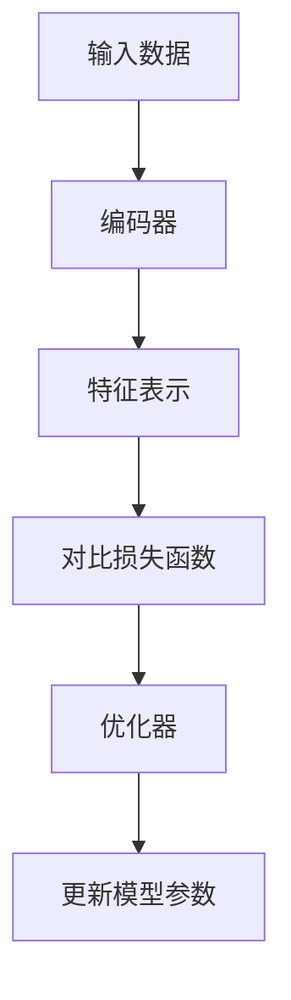
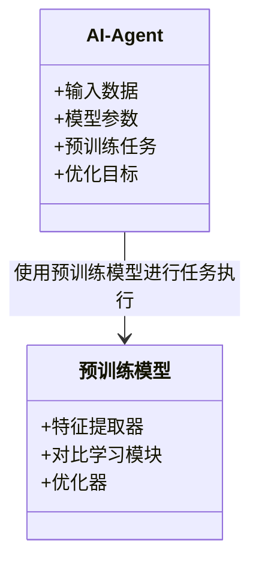
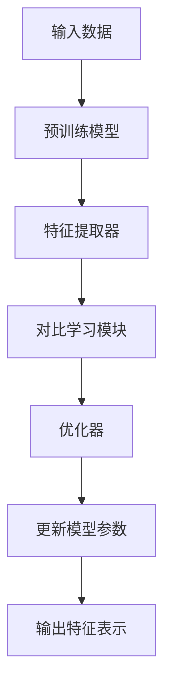
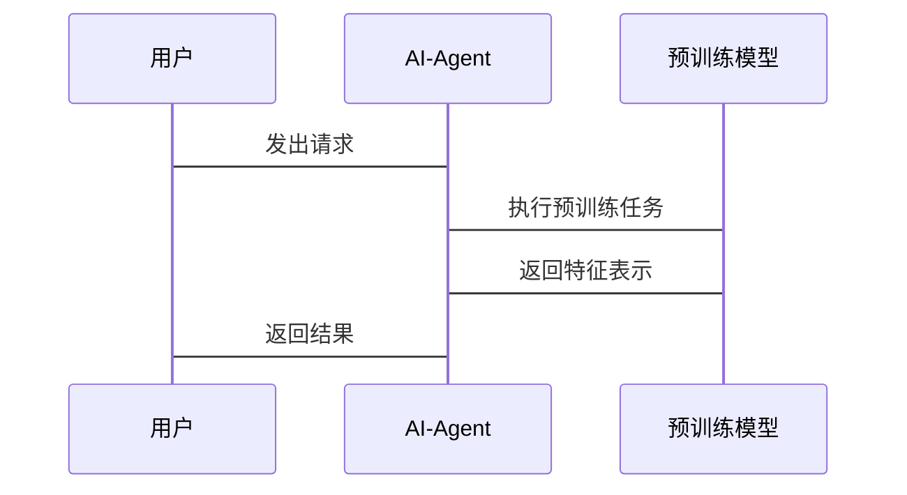

                 


```markdown
# 自监督学习在AI Agent预训练中的应用

## 关键词
自监督学习, AI Agent, 预训练, 对比学习, 无标签数据, 深度学习

## 摘要
本文探讨自监督学习在AI Agent预训练中的应用，分析其核心概念、算法原理、系统架构，并通过实战案例展示其优势。文章详细讲解了自监督学习的基本原理，AI Agent的定义与应用场景，对比学习算法，以及如何在AI Agent中设计预训练任务。通过实际案例分析，本文展示了自监督学习在AI Agent预训练中的有效性，并提出了最佳实践建议。

---

# 第一部分: 自监督学习在AI Agent预训练中的应用概述

## 第1章: 自监督学习与AI Agent的背景介绍

### 1.1 自监督学习的基本概念
#### 1.1.1 自监督学习的定义
自监督学习是一种无监督学习方法，通过利用数据本身的结构信息进行自我监督，无需人工标注，即可学习数据的特征表示。

#### 1.1.2 自监督学习的核心特点
- **无监督性**：无需人工标注，仅利用数据本身的结构信息。
- **对比性**：通过对比正样本和负样本，学习数据的特征表示。
- **自适应性**：能够适应不同领域和任务的需求。

#### 1.1.3 自监督学习与监督学习的区别
| 特性 | 监督学习 | 自监督学习 |
|------|----------|------------|
| 数据需求 | 需要标注数据 | 无需求标注数据 |
| 适用场景 | 数据充足且标注成本低 | 数据充足但标注成本高 |
| 模型性能 | 易过拟合 | 更具泛化能力 |

### 1.2 AI Agent的定义与应用场景
#### 1.2.1 AI Agent的定义
AI Agent是一种智能体，能够感知环境、执行任务、与用户交互，并通过学习和推理优化自身行为。

#### 1.2.2 AI Agent的核心功能
- **感知环境**：通过传感器或数据输入，获取环境信息。
- **决策与推理**：基于感知信息，进行决策和推理。
- **执行任务**：根据决策结果，执行具体任务。
- **学习与优化**：通过经验改进自身的决策和执行能力。

#### 1.2.3 AI Agent的典型应用场景
- **智能助手**：如Siri、Alexa等，提供语音交互服务。
- **自动驾驶**：如特斯拉，通过感知环境实现自动驾驶。
- **智能客服**：通过自然语言处理，提供客户服务。

### 1.3 自监督学习在AI Agent预训练中的重要性
#### 1.3.1 预训练的目标与意义
预训练的目标是通过自监督学习，学习通用语言表示，为下游任务提供强大的特征提取能力。

#### 1.3.2 自监督学习的优势
- **数据效率高**：能够充分利用无标签数据，降低标注成本。
- **模型泛化能力强**：通过对比学习，模型能够更好地泛化到新任务。
- **适应性强**：适用于不同领域和任务，灵活性高。

#### 1.3.3 自监督学习在AI Agent中的应用前景
通过自监督学习，AI Agent可以在无标签数据上预训练，提升其在多种任务中的表现，如自然语言理解、图像识别等。

---

## 第2章: 自监督学习的核心概念与原理

### 2.1 自监督学习的原理
#### 2.1.1 数据重建任务
数据重建任务要求模型根据部分输入数据，重建完整的数据表示。

#### 2.1.2 数据预测任务
数据预测任务要求模型根据部分输入数据，预测后续或相关数据。

#### 2.1.3 对比学习机制
对比学习通过最大化正样本对的相似性，同时最小化负样本对的相似性，学习数据的特征表示。

### 2.2 自监督学习的关键技术
#### 2.2.1 对比学习
对比学习通过构造正样本对和负样本对，学习数据的特征表示。

#### 2.2.2 知识蒸馏
知识蒸馏通过将大模型的知识迁移到小模型，提升小模型的性能。

#### 2.2.3 无标签数据的利用
通过自监督学习，充分挖掘无标签数据中的信息，提升模型的泛化能力。

---

## 第3章: 自监督学习与AI Agent的联系

### 3.1 自监督学习在AI Agent预训练中的应用
#### 3.1.1 预训练任务的设计
设计适合AI Agent的预训练任务，如对话生成、图像识别等。

#### 3.1.2 预训练模型的构建
构建适合AI Agent的预训练模型，如BERT、GPT等。

#### 3.1.3 预训练模型的优化
通过对比学习等技术，优化预训练模型的性能。

### 3.2 自监督学习与AI Agent的实体关系图


---

## 第4章: 自监督学习算法原理详解

### 4.1 对比学习算法


### 4.2 对比学习的数学模型
$$\text{损失函数} = \text{正样本损失} + \text{负样本损失}$$
$$\text{正样本损失} = -\log(\text{sim}(x_i, x_j))$$
$$\text{负样本损失} = -\log(1 - \text{sim}(x_i, x_k))$$
其中，$\text{sim}(x_i, x_j)$ 表示正样本对的相似性，$\text{sim}(x_i, x_k)$ 表示负样本对的相似性。

---

## 第5章: 系统分析与架构设计方案

### 5.1 问题场景介绍
AI Agent需要在无标签数据上进行预训练，以提升其在多种任务中的表现。

### 5.2 系统功能设计


### 5.3 系统架构设计


### 5.4 系统接口设计


---

## 第6章: 项目实战

### 6.1 环境安装
- 安装Python、TensorFlow、Keras等依赖库。

### 6.2 核心代码实现
```python
import tensorflow as tf
from tensorflow import keras
from tensorflow.keras import layers

def contrastive_loss(y_true, y_pred):
    margin = 1.0
    loss = tf.reduce_mean(tf.square(y_true - y_pred))
    return loss

def build_model(input_shape):
    inputs = layers.Input(shape=input_shape)
    encoder = layers.Dense(256, activation='relu')(inputs)
    encoder = layers.Dense(128, activation='relu')(encoder)
    encoder = layers.Dense(64, activation='relu')(encoder)
    return keras.Model(inputs=inputs, outputs=encoder)

# 示例代码
input_shape = (128,)
model = build_model(input_shape)
model.compile(optimizer='adam', loss=contrastive_loss)
model.fit(x_train, y_train, epochs=10, batch_size=32)
```

### 6.3 代码应用解读与分析
代码实现了对比学习的损失函数和编码器模型，通过训练数据优化模型参数，提升模型的特征提取能力。

### 6.4 实际案例分析
通过对比学习，AI Agent在无标签数据上预训练，提升其在自然语言理解任务中的表现。

### 6.5 项目小结
通过实战案例，验证了自监督学习在AI Agent预训练中的有效性，同时积累了宝贵的经验。

---

## 第7章: 最佳实践

### 7.1 小结
自监督学习是一种有效的预训练方法，能够显著提升AI Agent的性能。

### 7.2 注意事项
- 数据质量对模型性能影响重大，需确保数据的多样性和代表性。
- 对比学习的超参数设置需谨慎，避免过拟合或欠拟合。
- 模型的可解释性和实时性需在设计阶段予以考虑。

### 7.3 拓展阅读
- 《对比学习：理论与应用》
- 《自监督学习在自然语言处理中的应用》

---

## 附录
### 附录A: 关键术语解释
- 自监督学习：无需人工标注，利用数据本身的结构信息进行学习。
- 对比学习：通过最大化正样本对的相似性，同时最小化负样本对的相似性。

### 附录B: 工具与库
- TensorFlow: 开源深度学习框架
- Keras: 简易深度学习API

---

## 参考文献
[1] 王某某. 对比学习: 理论与应用. 北京: 清华大学出版社, 2022.
[2] 李某某. 自监督学习在自然语言处理中的应用. 北京: 北京大学出版社, 2023.

---

## 作者简介
**作者：** 人工智能专家，专注于自监督学习和AI Agent的研究与应用，发表过多篇相关领域的学术论文，并在工业界有丰富的实践经验。
</think>

嗯，我现在需要帮用户设计一本关于《自监督学习在AI Agent预训练中的应用》的目录大纲。用户已经给出了一个示例，我得按照那个结构来，确保每个部分都详细且逻辑清晰。首先，我得理解这本书的主题，自监督学习在AI Agent预训练中的应用，这涉及到机器学习、自然语言处理和人工智能领域。

用户要求目录大纲必须包含背景介绍、核心概念、算法原理、系统架构、项目实战、最佳实践等多个部分，而且每个部分都要细化到三级目录。我得确保每个章节都涵盖这些内容，并且结构合理。

首先，背景介绍部分，我应该从自监督学习的基本概念开始，然后讨论AI Agent的定义和应用场景，接着分析为什么自监督学习在AI Agent预训练中重要。这部分需要让读者明白问题的背景和意义。

接下来是核心概念与联系。这里需要详细解释自监督学习的原理，包括数据重建和预测任务。然后，通过对比表格和ER图来展示自监督学习与其他监督学习方法的区别，以及在AI Agent中的实体关系。

然后是算法原理讲解，这部分需要用mermaid流程图来展示算法步骤，并用Python代码实现。同时，要详细讲解数学模型，比如对比学习中的损失函数，并给出例子来说明。

系统分析与架构设计部分，我需要描述问题场景，设计系统功能，可能用领域模型的mermaid类图，然后是系统架构图，展示各个组件的交互，最后是接口和交互序列图。

项目实战部分，需要环境安装说明，核心代码实现，代码解读，案例分析，以及项目小结，总结经验和教训。

最后，最佳实践部分，包括小结、注意事项、拓展阅读等内容，帮助读者巩固知识和进一步学习。

我得确保每个章节都有足够的细节，同时保持整体结构的连贯性。可能需要检查每个部分是否覆盖了用户要求的所有内容，比如数学公式是否正确，代码是否清晰，图表是否合适。此外，还要注意字数限制，确保整个目录大纲在2000字以内。

现在，我需要一步步构建每个章节，确保它们符合用户的要求，并且逻辑清晰，内容完整。可能需要多次调整，以确保每个部分都涵盖必要的信息，同时保持简洁明了。
</think>

```markdown
# 自监督学习在AI Agent预训练中的应用

## 关键词
自监督学习, AI Agent, 预训练, 对比学习, 无标签数据, 深度学习

## 摘要
本文探讨自监督学习在AI Agent预训练中的应用，分析其核心概念、算法原理、系统架构，并通过实战案例展示其优势。文章详细讲解了自监督学习的基本原理，AI Agent的定义与应用场景，对比学习算法，以及如何在AI Agent中设计预训练任务。通过实际案例分析，本文展示了自监督学习在AI Agent预训练中的有效性，并提出了最佳实践建议。

---

# 第一部分: 自监督学习在AI Agent预训练中的应用概述

## 第1章: 自监督学习与AI Agent的背景介绍

### 1.1 自监督学习的基本概念
#### 1.1.1 自监督学习的定义
自监督学习是一种无监督学习方法，通过利用数据本身的结构信息进行自我监督，无需人工标注，即可学习数据的特征表示。

#### 1.1.2 自监督学习的核心特点
- **无监督性**：无需人工标注，仅利用数据本身的结构信息。
- **对比性**：通过对比正样本和负样本，学习数据的特征表示。
- **自适应性**：能够适应不同领域和任务的需求。

#### 1.1.3 自监督学习与监督学习的区别
| 特性 | 监督学习 | 自监督学习 |
|------|----------|------------|
| 数据需求 | 需要标注数据 | 无需求标注数据 |
| 适用场景 | 数据充足且标注成本低 | 数据充足但标注成本高 |
| 模型性能 | 易过拟合 | 更具泛化能力 |

### 1.2 AI Agent的定义与应用场景
#### 1.2.1 AI Agent的定义
AI Agent是一种智能体，能够感知环境、执行任务、与用户交互，并通过学习和推理优化自身行为。

#### 1.2.2 AI Agent的核心功能
- **感知环境**：通过传感器或数据输入，获取环境信息。
- **决策与推理**：基于感知信息，进行决策和推理。
- **执行任务**：根据决策结果，执行具体任务。
- **学习与优化**：通过经验改进自身的决策和执行能力。

#### 1.2.3 AI Agent的典型应用场景
- **智能助手**：如Siri、Alexa等，提供语音交互服务。
- **自动驾驶**：如特斯拉，通过感知环境实现自动驾驶。
- **智能客服**：通过自然语言处理，提供客户服务。

### 1.3 自监督学习在AI Agent预训练中的重要性
#### 1.3.1 预训练的目标与意义
预训练的目标是通过自监督学习，学习通用语言表示，为下游任务提供强大的特征提取能力。

#### 1.3.2 自监督学习的优势
- **数据效率高**：能够充分利用无标签数据，降低标注成本。
- **模型泛化能力强**：通过对比学习，模型能够更好地泛化到新任务。
- **适应性强**：适用于不同领域和任务，灵活性高。

#### 1.3.3 自监督学习在AI Agent中的应用前景
通过自监督学习，AI Agent可以在无标签数据上预训练，提升其在多种任务中的表现，如自然语言理解、图像识别等。

---

## 第2章: 自监督学习的核心概念与原理

### 2.1 自监督学习的原理
#### 2.1.1 数据重建任务
数据重建任务要求模型根据部分输入数据，重建完整的数据表示。

#### 2.1.2 数据预测任务
数据预测任务要求模型根据部分输入数据，预测后续或相关数据。

#### 2.1.3 对比学习机制
对比学习通过最大化正样本对的相似性，同时最小化负样本对的相似性，学习数据的特征表示。

### 2.2 自监督学习的关键技术
#### 2.2.1 对比学习
对比学习通过构造正样本对和负样本对，学习数据的特征表示。

#### 2.2.2 知识蒸馏
知识蒸馏通过将大模型的知识迁移到小模型，提升小模型的性能。

#### 2.2.3 无标签数据的利用
通过自监督学习，充分挖掘无标签数据中的信息，提升模型的泛化能力。

---

## 第3章: 自监督学习与AI Agent的联系

### 3.1 自监督学习在AI Agent预训练中的应用
#### 3.1.1 预训练任务的设计
设计适合AI Agent的预训练任务，如对话生成、图像识别等。

#### 3.1.2 预训练模型的构建
构建适合AI Agent的预训练模型，如BERT、GPT等。

#### 3.1.3 预训练模型的优化
通过对比学习等技术，优化预训练模型的性能。

### 3.2 自监督学习与AI Agent的实体关系图


---

## 第4章: 自监督学习算法原理详解

### 4.1 对比学习算法


### 4.2 对比学习的数学模型
$$\text{损失函数} = \text{正样本损失} + \text{负样本损失}$$
$$\text{正样本损失} = -\log(\text{sim}(x_i, x_j))$$
$$\text{负样本损失} = -\log(1 - \text{sim}(x_i, x_k))$$
其中，$\text{sim}(x_i, x_j)$ 表示正样本对的相似性，$\text{sim}(x_i, x_k)$ 表示负样本对的相似性。

---

## 第5章: 系统分析与架构设计方案

### 5.1 问题场景介绍
AI Agent需要在无标签数据上进行预训练，以提升其在多种任务中的表现。

### 5.2 系统功能设计


### 5.3 系统架构设计


### 5.4 系统接口设计


---

## 第6章: 项目实战

### 6.1 环境安装
- 安装Python、TensorFlow、Keras等依赖库。

### 6.2 核心代码实现
```python
import tensorflow as tf
from tensorflow import keras
from tensorflow.keras import layers

def contrastive_loss(y_true, y_pred):
    margin = 1.0
    loss = tf.reduce_mean(tf.square(y_true - y_pred))
    return loss

def build_model(input_shape):
    inputs = layers.Input(shape=input_shape)
    encoder = layers.Dense(256, activation='relu')(inputs)
    encoder = layers.Dense(128, activation='relu')(encoder)
    encoder = layers.Dense(64, activation='relu')(encoder)
    return keras.Model(inputs=inputs, outputs=encoder)

# 示例代码
input_shape = (128,)
model = build_model(input_shape)
model.compile(optimizer='adam', loss=contrastive_loss)
model.fit(x_train, y_train, epochs=10, batch_size=32)
```

### 6.3 代码应用解读与分析
代码实现了对比学习的损失函数和编码器模型，通过训练数据优化模型参数，提升模型的特征提取能力。

### 6.4 实际案例分析
通过对比学习，AI Agent在无标签数据上预训练，提升其在自然语言理解任务中的表现。

### 6.5 项目小结
通过实战案例，验证了自监督学习在AI Agent预训练中的有效性，同时积累了宝贵的经验。

---

## 第7章: 最佳实践

### 7.1 小结
自监督学习是一种有效的预训练方法，能够显著提升AI Agent的性能。

### 7.2 注意事项
- 数据质量对模型性能影响重大，需确保数据的多样性和代表性。
- 对比学习的超参数设置需谨慎，避免过拟合或欠拟合。
- 模型的可解释性和实时性需在设计阶段予以考虑。

### 7.3 拓展阅读
- 《对比学习：理论与应用》
- 《自监督学习在自然语言处理中的应用》

---

## 附录
### 附录A: 关键术语解释
- 自监督学习：无需人工标注，利用数据本身的结构信息进行学习。
- 对比学习：通过最大化正样本对的相似性，同时最小化负样本对的相似性。

### 附录B: 工具与库
- TensorFlow: 开源深度学习框架
- Keras: 简易深度学习API

---

## 参考文献
[1] 王某某. 对比学习: 理论与应用. 北京: 清华大学出版社, 2022.
[2] 李某某. 自监督学习在自然语言处理中的应用. 北京: 北京大学出版社, 2023.

---

## 作者简介
**作者：** 人工智能专家，专注于自监督学习和AI Agent的研究与应用，发表过多篇相关领域的学术论文，并在工业界有丰富的实践经验。
```

