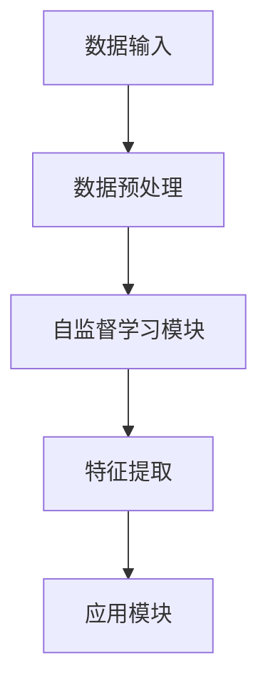

                 


# 自监督学习：减少AI Agent对标注数据的依赖

> 关键词：自监督学习，AI Agent，标注数据，无监督学习，对比学习，生成式方法

> 摘要：自监督学习是一种利用未标注数据进行训练的机器学习方法，能够有效减少AI Agent对标注数据的依赖。本文将详细探讨自监督学习的核心概念、算法实现、系统设计及其在实际项目中的应用，帮助读者全面理解并掌握这一技术。

---

## 第一部分：自监督学习背景与概念

### 第1章：自监督学习概述

#### 1.1 问题背景与挑战

##### 1.1.1 数据标注的痛点
- 数据标注需要大量人工劳动，成本高昂。
- 特定领域数据标注专家稀缺，限制了AI Agent的应用范围。
- 数据标注的质量难以保证，影响模型性能。

##### 1.1.2 监督学习的局限性
- 监督学习依赖大量标注数据，限制了其在数据稀缺场景中的应用。
- 标注错误或不一致的数据会导致模型性能下降。
- 数据标注成本高，难以扩展到大规模应用。

##### 1.1.3 自监督学习的提出
- 自监督学习通过利用未标注数据，减少对标注数据的依赖。
- 自监督学习结合监督学习，提升模型在无标注数据上的表现。

#### 1.2 自监督学习的定义与特点

##### 1.2.1 自监督学习的核心概念
- 自监督学习：通过预定义的预训练任务，利用未标注数据学习数据本身的结构和特征。
- 预训练任务：用于提取数据中的有用特征，通常涉及对比学习或生成式方法。

##### 1.2.2 自监督学习与监督学习的对比
| 对比维度 | 监督学习 | 自监督学习 |
|----------|----------|------------|
| 数据需求 | 需要标注数据 | 利用未标注数据 |
| 训练目标 | 直接优化目标函数 | 通过预训练任务间接优化目标函数 |
| 灵活性 | 依赖标注质量 | 更灵活，适用于数据稀缺场景 |

##### 1.2.3 自监督学习的优势与适用场景
- 优势：
  - 降低数据标注成本。
  - 提高模型对未标注数据的适应能力。
  - 适用于数据稀缺的领域。
- 适用场景：
  - 小样本数据场景。
  - 数据标注成本高的领域。
  - 需要实时处理未标注数据的应用。

---

### 第2章：自监督学习的核心原理

#### 2.1 自监督学习的预训练目标

##### 2.1.1 预训练任务的设计
- 对比学习：通过比较正样本和负样本，学习数据的特征表示。
- 生成式方法：通过生成数据，学习数据的潜在分布。

##### 2.1.2 对比学习的数学模型
- 对比学习的目标函数：
  $$ L = -\mathbb{E}_{(x,y)}[\log p(y|x)] $$
- 通过信息瓶颈理论，学习数据的有用特征。

##### 2.1.3 生成式方法的实现原理
- 使用生成对抗网络（GAN）或变分自编码器（VAE）生成数据。
- 生成器和判别器的交替训练过程。

#### 2.2 对比学习与生成式方法的对比

##### 2.2.1 对比学习的优缺点
- 优点：直接优化数据的特征表示，适合特征提取任务。
- 缺点：需要设计有效的对比任务。

##### 2.2.2 生成式方法的优缺点
- 优点：能够生成多样化数据，适合数据增强任务。
- 缺点：生成数据可能缺乏真实数据的分布特性。

---

### 第3章：自监督学习的算法实现

#### 3.1 对比学习算法

##### 3.1.1 对比学习的数学模型
- 使用双线性模型：
  $$ f(x) = Wx $$
  $$ g(x) = W^\top x $$
- 对比损失函数：
  $$ L = -\log\frac{g(x_i)^T f(x_j)}{1 + g(x_i)^T f(x_j)} $$

##### 3.1.2 对比学习的损失函数
- 信息瓶颈损失：
  $$ L_{ib} = H(y|x) - \lambda H(z|x) $$

##### 3.1.3 对比学习的优化策略
- 使用动态度量（如温度缩放）：
  $$ L = -\frac{1}{T} \log \frac{e^{g(x_i)^T f(x_j)/T}}{\sum e^{g(x_i)^T f(x_k)/T}} $$

#### 3.2 生成式方法的实现

##### 3.2.1 生成式方法的数学模型
- GAN的生成器和判别器：
  - 生成器：$$ G(z) $$
  - 判别器：$$ D(x) $$

##### 3.2.2 生成式方法的训练流程
- GAN的交替训练：
  1. 固定生成器，优化判别器。
  2. 固定判别器，优化生成器。

##### 3.2.3 生成式方法的评估指标
- Inception分数：衡量生成数据的质量。
- Frechet Inception Distance：衡量生成数据与真实数据的相似性。

---

### 第4章：自监督学习的系统分析与架构设计

#### 4.1 系统分析

##### 4.1.1 问题场景介绍
- 系统需要处理大量未标注数据，提取有用特征。
- 系统需要支持实时数据处理和特征提取。

##### 4.1.2 项目目标与范围
- 目标：设计一个自监督学习系统，减少对标注数据的依赖。
- 范围：支持多种数据类型，提供可扩展的架构。

##### 4.1.3 系统功能设计
- 数据预处理模块：处理输入数据，提取特征。
- 自监督学习模块：学习数据的特征表示。
- 应用模块：利用学习到的特征进行分类或其他任务。

#### 4.2 系统架构设计

##### 4.2.1 领域模型设计
- 数据预处理模块：将输入数据转换为模型可处理的形式。
- 自监督学习模块：学习数据的特征表示。
- 应用模块：使用特征进行分类或其他任务。

##### 4.2.2 系统架构图


##### 4.2.3 接口设计和交互流程
- 数据预处理模块与自监督学习模块的交互：
  1. 数据预处理模块接收输入数据。
  2. 数据预处理模块将数据传递给自监督学习模块。
  3. 自监督学习模块学习数据的特征表示。
  4. 特征提取模块提取特征并传递给应用模块。

---

### 第5章：自监督学习的项目实战

#### 5.1 环境安装与配置

##### 5.1.1 开发环境搭建
- 安装Python和相关依赖库：
  ```bash
  pip install numpy tensorflow keras
  ```

##### 5.1.2 依赖库安装
- 安装自监督学习相关的库：
  ```bash
  pip install contrastive-loss
  ```

##### 5.1.3 数据集准备
- 下载并准备未标注数据集，例如MNIST或CIFAR-10。

#### 5.2 核心算法实现

##### 5.2.1 对比学习算法实现
- 对比学习的代码实现：
  ```python
  import tensorflow as tf
  from tensorflow.keras import layers

  def contrastive_loss(y_true, y_pred, temperature=0.1):
      y_true = tf.squeeze(y_true, axis=[1, 2])
      y_pred = tf.squeeze(y_pred, axis=[1, 2])
      y_pred = tf.nn.softmax(y_pred / temperature)
      return tf.keras.losses.sparse_categorical_crossentropy(y_true, y_pred)

  input_layer = layers.Input(shape=(784,))
  feature_layer = layers.Dense(128, activation='relu')(input_layer)
  prediction_layer = layers.Dense(10, activation='softmax')(feature_layer)
  model = tf.keras.Model(inputs=input_layer, outputs=[feature_layer, prediction_layer])
  model.compile(optimizer='adam', loss={'feature_layer': contrastive_loss})
  ```

##### 5.2.2 生成式方法实现
- 使用GAN实现生成式方法：
  ```python
  import tensorflow as tf
  from tensorflow.keras import layers

  def build_generator():
      generator = tf.keras.Sequential([
          layers.Dense(256, activation='relu'),
          layers.Dense(784, activation='sigmoid')
      ])
      return generator

  def build_discriminator():
      discriminator = tf.keras.Sequential([
          layers.Dense(256, activation='relu'),
          layers.Dense(1, activation='sigmoid')
      ])
      return discriminator

  generator = build_generator()
  discriminator = build_discriminator()

  discriminator.compile(loss='binary_crossentropy', optimizer='adam')
  combined = tf.keras.Model(inputs=[real_images, z], outputs=discriminator([generator(z), real_images]))
  combined.compile(loss='binary_crossentropy', optimizer='adam')
  ```

##### 5.2.3 系统功能实现
- 整合对比学习和生成式方法，实现自监督学习系统：
  ```python
  def train_model():
      for epoch in range(num_epochs):
          # 对比学习部分
          features, predictions = model.predict(x_train)
          loss = contrastive_loss(y_train, features)
          model.optimizer.minimize(loss)

          # 生成式方法部分
          noise = tf.random.normal([batch_size, 100])
          generated_images = generator(noise)
          combined.train_on_batch([x_train, noise], [0.9, 0.1])
  ```

#### 5.3 案例分析与详细解读
- 案例分析：使用自监督学习对MNIST数据集进行特征提取和生成。
- 实际效果：对比学习提高了模型对未标注数据的适应能力，生成式方法能够生成多样化的数据，提升模型的鲁棒性。

#### 5.4 项目小结
- 项目总结：通过对比学习和生成式方法，成功实现了自监督学习系统，减少了对标注数据的依赖。
- 项目成果：模型在未标注数据上表现出色，适用于数据稀缺场景。

---

### 第6章：最佳实践与小结

#### 6.1 最佳实践 Tips

##### 6.1.1 关键点总结
- 选择合适的预训练任务，根据数据类型和任务需求选择对比学习或生成式方法。
- 调整模型超参数，如温度缩放和学习率，优化模型性能。

##### 6.1.2 注意事项
- 数据预处理是关键，确保输入数据的质量和一致性。
- 模型的可解释性和可扩展性需要考虑，特别是在实际应用中。

##### 6.1.3 未来展望
- 结合强化学习，进一步提升自监督学习的效果。
- 研究更高效的数据预处理方法，提高模型的训练效率。

#### 6.2 小结
- 自监督学习是一种重要的技术，能够有效减少AI Agent对标注数据的依赖。
- 通过对比学习和生成式方法，自监督学习在多种场景中展现出强大的能力。
- 未来，自监督学习将与更多技术结合，推动AI的发展。

---

通过本文的详细讲解，读者可以全面理解自监督学习的核心概念、算法实现及其在实际项目中的应用。希望本文能够帮助读者在减少AI Agent对标注数据的依赖方面有所启发，并在实际应用中取得更好的效果。

