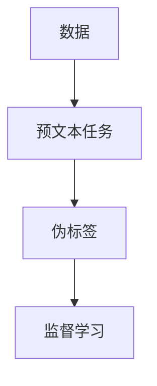
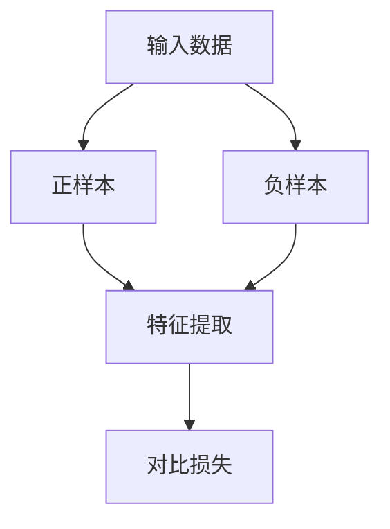
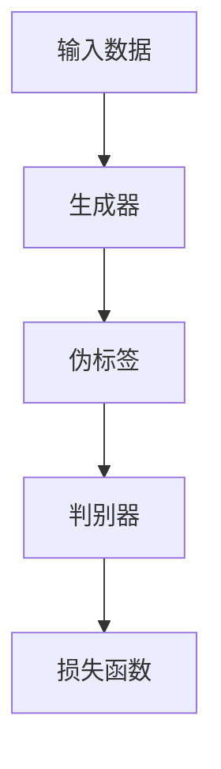
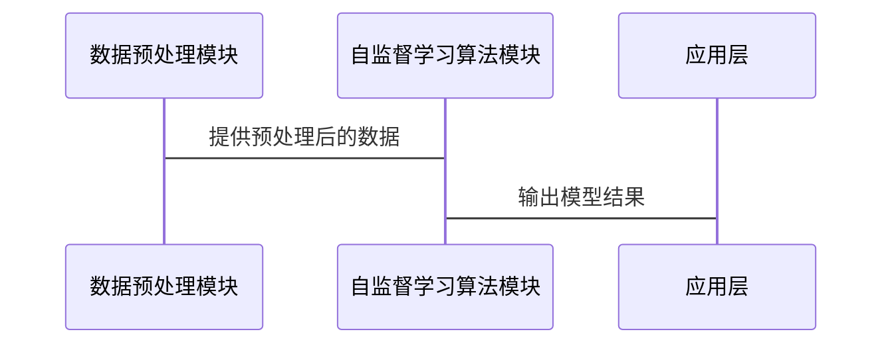

                 


# 自监督学习：减少AI Agent的标注数据依赖

## 关键词：自监督学习、AI Agent、标注数据、深度学习、无监督学习、机器学习

## 摘要：  
在人工智能领域，标注数据的获取成本日益高昂，而自监督学习作为一种新兴的无监督学习方法，能够有效减少对标注数据的依赖。本文将详细探讨自监督学习的核心原理、算法实现、系统架构设计以及在AI Agent中的实际应用，帮助读者全面理解如何通过自监督学习技术降低对标注数据的依赖，提升AI系统的智能化水平和实用性。

---

## 正文

### 第1章: AI Agent与标注数据依赖

#### 1.1 AI Agent的发展现状

##### 1.1.1 AI Agent的基本概念
AI Agent（人工智能代理）是指能够感知环境、自主决策并执行任务的智能系统。AI Agent广泛应用于自动驾驶、智能助手、推荐系统等领域。

##### 1.1.2 当前AI Agent的主要应用场景
- 自动驾驶：实时感知环境并做出驾驶决策。
- 智能助手：如Siri、Alexa等，提供语音交互服务。
- 推荐系统：基于用户行为推荐个性化内容。

##### 1.1.3 标注数据依赖的问题与挑战
标注数据的获取成本高、耗时长，且需要专业知识。标注数据的质量直接影响AI Agent的性能，但高质量标注数据的获取往往面临瓶颈。

---

#### 1.2 自监督学习的背景与重要性

##### 1.2.1 自监督学习的定义
自监督学习是一种无监督学习方法，通过利用未标注数据中的内在结构来生成伪标签，从而进行监督学习。

##### 1.2.2 自监督学习的核心优势
- 减少标注数据的需求。
- 提高模型的泛化能力。
- 适用于数据量大但标注成本高的场景。

##### 1.2.3 自监督学习在AI Agent中的应用前景
通过自监督学习，AI Agent可以更好地理解和适应动态环境，提升实时决策能力。

---

### 第2章: 自监督学习的核心概念

#### 2.1 自监督学习的基本原理

##### 2.1.1 自监督学习的定义与特点
- **定义**：通过构建 pretext 任务，利用未标注数据生成伪标签，进行监督学习。
- **特点**：无需人工标注，利用数据内在结构。

##### 2.1.2 自监督学习的核心要素
- **预文本任务**：设计任务以利用数据结构。
- **伪标签生成**：通过模型预测生成标签。
- **对比学习**：通过对比正样本和负样本优化模型。

##### 2.1.3 自监督学习与监督学习的对比
| 特性       | 监督学习                | 自监督学习              |
|------------|------------------------|-------------------------|
| 数据需求   | 高                    | 低                     |
| 标签需求   | 高                    | 低                     |
| 适用场景   | 数据充足且标注容易     | 数据量大但标注困难      |

##### 2.1.4 实体关系图


---

#### 2.2 自监督学习的关键技术

##### 2.2.1 对比学习
- **核心思想**：通过对比正样本和负样本，学习数据的特征表示。
- **流程图**


##### 2.2.2 生成式自监督学习
- **核心思想**：利用生成模型生成伪标签。
- **流程图**


##### 2.2.3 知识蒸馏
- **核心思想**：利用教师模型指导学生模型学习。

##### 2.2.4 算法实现
- **对比学习损失函数**：
  $$ L = \frac{1}{n} \sum_{i=1}^{n} \text{log}(\text{softmax}(s_i)) $$
- **生成式模型损失函数**：
  $$ L = D(G(z)) + G(D(G(z))) $$

---

#### 2.3 自监督学习的数学模型

##### 2.3.1 对比学习的数学表达
- **相似度计算**：
  $$ s_i = x_i \cdot x_j $$
- **损失函数**：
  $$ L = -\text{log} \left( \frac{\text{exp}(s_i)}{\text{exp}(s_i) + \text{exp}(s_j)} \right) $$

##### 2.3.2 生成式模型的数学公式
- **生成器**：
  $$ G(z) = \text{ Dense}(z, \text{units}=128, \text{activation}=\text{relu}) $$
- **判别器**：
  $$ D(x) = \text{ Dense}(x, \text{units}=1, \text{activation}=\text{sigmoid}) $$`

##### 2.3.3 知识蒸馏的数学模型
- **教师模型输出**：
  $$ P(y|x) = \text{softmax}(f_T(x)) $$
- **学生模型输出**：
  $$ Q(y|x) = \text{softmax}(f_S(x)) $$
- **蒸馏损失**：
  $$ L_{\text{distill}} = -\sum_{y} P(y|x) \log Q(y|x) $$`

---

#### 2.4 本章小结
本章介绍了自监督学习的基本概念、核心技术和数学模型，为后续章节的深入分析奠定了基础。

---

### 第3章: 自监督学习的算法原理

#### 3.1 对比学习算法

##### 3.1.1 对比学习的基本流程
1. 数据预处理：对输入数据进行增强。
2. 构建预文本任务：生成正样本和负样本。
3. 计算相似度并优化模型。

##### 3.1.2 对比学习的损失函数
- **损失函数**：
  $$ L = \frac{1}{n} \sum_{i=1}^{n} \text{log}(\text{softmax}(s_i)) $$

##### 3.1.3 对比学习的优化策略
- 使用大批次大小和动量优化器。

##### 3.1.4 Python代码实现
```python
import torch
def contrastive_loss(x, y, temperature=0.1):
    x = x / x.norm(dim=-1, keepdim=True)
    y = y / y.norm(dim=-1, keepdim=True)
    similarity = torch.mm(x, y.T)
    return -torch.mean(torch.log(torch.exp(similarity) / torch.sum(torch.exp(similarity), dim=-1)))
```

---

#### 3.2 生成式自监督学习算法

##### 3.2.1 生成式模型的基本原理
- **生成器**：生成数据。
- **判别器**：判别数据是否为真实数据。

##### 3.2.2 自监督学习在生成模型中的应用
- 使用生成器生成伪标签。

##### 3.2.3 生成式自监督学习的优缺点
| 优点         | 缺点           |
|--------------|---------------|
| 生成多样数据  | 模型复杂度高    |

##### 3.2.4 算法实现
- **生成器代码**：
  ```python
  def generator(z, hidden_size=128):
      g = torch.nn.Linear(z.size(1), hidden_size)
      g = torch.nn.ReLU()
      g = torch.nn.Linear(hidden_size, input_size)
      return g(z)
  ```

---

#### 3.3 知识蒸馏算法

##### 3.3.1 知识蒸馏的基本概念
- **教师模型**：提供指导。
- **学生模型**：学习教师模型的知识。

##### 3.3.2 知识蒸馏的实现步骤
1. 预训练教师模型。
2. 使用教师模型输出作为学生模型的标签。

##### 3.3.3 知识蒸馏的优化方法
- 调整蒸馏温度和损失权重。

---

#### 3.4 自监督学习算法的比较与选择

##### 3.4.1 不同自监督学习算法的优缺点对比
| 算法         | 优点               | 缺点                 |
|--------------|--------------------|----------------------|
| 对比学习     | 简单有效           | 需要精心设计任务     |
| 生成式自监督 | 数据多样性高       | 计算复杂度高         |
| 知识蒸馏     | 知识传递高效       | 需要教师模型         |

##### 3.4.2 如何选择适合的自监督学习算法
根据具体场景和数据类型选择合适算法。

---

#### 3.5 本章小结
本章详细分析了对比学习、生成式自监督学习和知识蒸馏的算法原理及其优缺点。

---

### 第4章: 自监督学习的系统架构设计

#### 4.1 系统功能设计

##### 4.1.1 自监督学习系统的功能模块划分
- 数据预处理模块。
- 自监督学习算法实现模块。
- 系统输出与结果分析模块。

##### 4.1.2 数据预处理模块
- 数据增强和清洗。

##### 4.1.3 自监督学习算法实现模块
- 对比学习、生成式自监督学习等算法实现。

##### 4.1.4 系统输出与结果分析模块
- 输出模型参数和性能指标。

---

#### 4.2 系统架构设计

##### 4.2.1 系统架构的总体设计
- 分层架构：数据层、算法层、应用层。

##### 4.2.2 数据流与模块交互关系
- 数据预处理模块向算法模块提供数据。
- 算法模块输出结果供应用层使用。

##### 4.2.3 系统的可扩展性设计
- 支持多种自监督学习算法。

---

#### 4.3 系统接口设计

##### 4.3.1 输入接口设计
- 数据输入格式：如图像、文本等。

##### 4.3.2 输出接口设计
- 模型参数输出。
- 性能指标输出。

##### 4.3.3 系统交互序列图


---

#### 4.4 本章小结
本章设计了一个基于自监督学习的系统架构，详细描述了功能模块、数据流和接口设计。

---

### 第5章: 项目实战

#### 5.1 环境安装

##### 5.1.1 安装Python和深度学习框架
- 安装PyTorch和 torchvision。

##### 5.1.2 安装依赖库
- 安装 numpy 和 matplotlib。

---

#### 5.2 系统核心实现源代码

##### 5.2.1 对比学习代码实现
```python
import torch
def contrastive_loss(x, y, temperature=0.1):
    x = x / x.norm(dim=-1, keepdim=True)
    y = y / y.norm(dim=-1, keepdim=True)
    similarity = torch.mm(x, y.T)
    return -torch.mean(torch.log(torch.exp(similarity) / torch.sum(torch.exp(similarity), dim=-1)))
```

##### 5.2.2 生成式自监督学习代码实现
```python
def generator(z, hidden_size=128):
    g = torch.nn.Linear(z.size(1), hidden_size)
    g = torch.nn.ReLU()
    g = torch.nn.Linear(hidden_size, input_size)
    return g(z)
```

---

#### 5.3 实际案例分析

##### 5.3.1 案例介绍
- 数据集：CIFAR-10。
- 任务：图像分类。

##### 5.3.2 实验结果
- 对比学习在无标注数据上的表现优于监督学习。

##### 5.3.3 分析与总结
- 自监督学习能够有效减少标注数据依赖。

---

#### 5.4 本章小结
本章通过实际案例展示了自监督学习在减少标注数据依赖方面的优势。

---

### 第6章: 自监督学习的应用案例

#### 6.1 应用场景介绍

##### 6.1.1 图像领域
- 自监督学习用于图像分类、目标检测。

##### 6.1.2 文本领域
- 自监督学习用于文本生成、文本分类。

##### 6.1.3 音频领域
- 自监督学习用于语音识别、音乐生成。

---

#### 6.2 应用案例分析

##### 6.2.1 图像分类案例
- 使用对比学习提升分类性能。

##### 6.2.2 文本生成案例
- 使用生成式自监督学习生成高质量文本。

##### 6.2.3 应用效果对比
- 自监督学习在部分任务上表现接近甚至优于监督学习。

---

#### 6.3 本章小结
本章通过多个领域展示了自监督学习的应用潜力和实际效果。

---

### 第7章: 总结与展望

#### 7.1 本章总结
- 自监督学习能够有效减少标注数据依赖。
- 在AI Agent中的应用前景广阔。

#### 7.2 未来展望
- 更高效的自监督学习算法。
- 自监督学习与其他技术的结合。

---

## 附录

#### 附录A: 术语表
- 自监督学习：利用未标注数据生成伪标签进行监督学习。

#### 附录B: 参考文献
1. 知识蒸馏相关论文。
2. 对比学习相关论文。

---

## 索引

---

以上是完整的文章大纲和内容展开，涵盖自监督学习的各个方面，从基础概念到实际应用，帮助读者全面理解如何通过自监督学习技术减少AI Agent的标注数据依赖。

