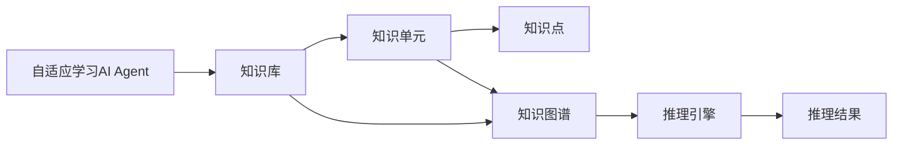
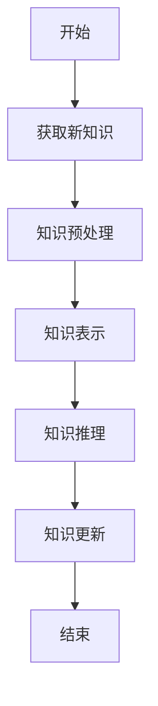
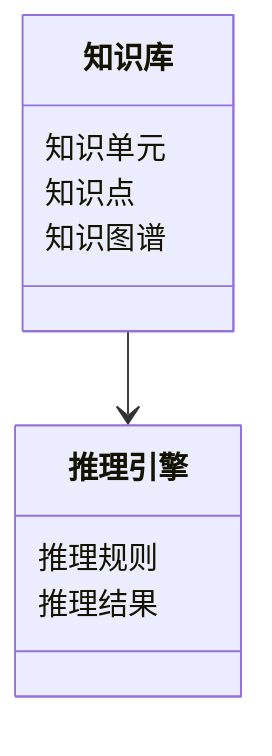
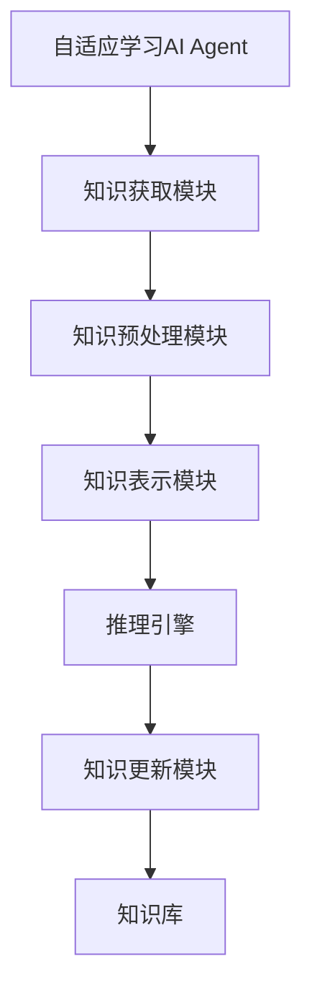
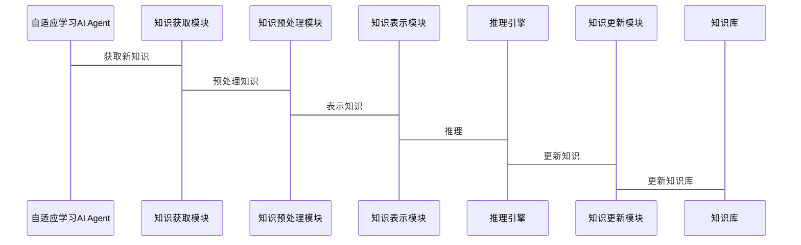

                 


# 自适应学习AI Agent：LLM的动态知识结构调整

> 关键词：自适应学习AI Agent，动态知识结构，LLM，人工智能，知识图谱

> 摘要：本文深入探讨了自适应学习AI Agent的动态知识结构调整方法，结合大型语言模型（LLM）的特点，分析了其在动态环境中的适应性学习机制。文章从背景、概念、算法原理、系统架构到项目实战，全面阐述了自适应学习AI Agent的核心理论与实践应用。

---

## 第一部分：自适应学习AI Agent的背景与核心概念

### 第1章：自适应学习AI Agent的背景与问题背景

#### 1.1 问题背景与问题描述

自适应学习AI Agent是一种能够根据环境变化动态调整知识结构的智能体。传统的AI Agent在面对复杂、动态的环境时，往往难以实时更新和调整其知识库，导致其适应性有限。随着人工智能技术的快速发展，尤其是在自然语言处理领域，如何让AI Agent具备持续学习和自适应的能力，成为一个重要的研究方向。

**问题背景：**
- **动态环境中的知识更新**：AI Agent需要在不断变化的环境中实时更新知识，以应对新的挑战和任务。
- **知识的碎片化与整合**：在实际应用中，知识可能来源于多种渠道，呈现碎片化状态，如何有效地整合这些知识并形成结构化的知识图谱是关键。
- **模型的可解释性与鲁棒性**：自适应学习的过程需要确保模型的可解释性和鲁棒性，避免因为知识的频繁调整导致模型性能下降或产生错误。

**问题描述：**
自适应学习AI Agent的核心问题在于如何实现知识的动态调整和优化。这需要结合大型语言模型（LLM）的特点，设计一种高效的动态知识结构调整方法，使得AI Agent能够实时更新知识库，适应环境的变化，并保持高精度和高效率。

#### 1.2 问题解决与边界

**自适应学习AI Agent的目标：**
- 实现实时的知识更新和动态调整。
- 提高AI Agent在复杂环境中的适应性和灵活性。
- 优化知识的表示和存储方式，以支持高效的查询和推理。

**问题解决的边界与外延：**
- **边界**：专注于动态知识结构的调整，不涉及外部传感器或其他感知设备。
- **外延**：涉及知识的获取、存储、推理和应用等多个方面。

#### 1.3 核心概念与关键问题

**核心概念：**
- **自适应学习**：AI Agent能够根据环境变化自动调整其知识结构。
- **动态知识结构**：知识库的结构能够根据新的信息实时调整。
- **LLM**：大型语言模型在自适应学习中的应用。

**关键问题：**
- 如何高效地更新和调整知识结构。
- 如何保证知识的准确性和一致性。
- 如何优化知识的表示和存储方式。

---

### 第2章：自适应学习AI Agent的核心概念与联系

#### 2.1 核心概念原理

**自适应学习的基本原理：**
自适应学习AI Agent通过持续学习和更新知识库，以应对环境的变化。其核心在于动态知识结构的调整，这涉及到知识的获取、存储、推理和应用。

**动态知识结构的构建机制：**
- **知识获取**：通过多种渠道获取新知识，包括文本、图像、视频等。
- **知识存储**：将获取的知识进行结构化存储，形成知识图谱。
- **知识推理**：基于知识图谱进行推理，生成新的知识。
- **知识更新**：根据推理结果，动态调整知识结构。

**LLM在自适应学习中的角色：**
大型语言模型（LLM）在自适应学习中扮演着关键角色。LLM不仅能够处理大规模的文本数据，还能够通过对比学习和强化学习等方法，实现知识的动态更新和优化。

#### 2.2 核心概念属性特征对比

**对比表格展示：**

| **属性**       | **传统知识库**          | **动态知识结构**         |
|-----------------|-------------------------|--------------------------|
| 知识更新频率    | 低或固定               | 高，实时更新             |
| 知识表示方式    | 静态，结构化            | 动态，结构化              |
| 适应性          | 低，固定结构             | 高，动态调整              |
| 维护成本        | 高，需要人工干预         | 低，自动化维护            |

**关键属性的详细说明：**
- **知识更新频率**：动态知识结构能够实时更新，而传统知识库通常需要手动更新。
- **知识表示方式**：动态知识结构采用结构化的表示方式，能够根据新知识自动调整。
- **适应性**：动态知识结构更具适应性，能够应对环境的变化。
- **维护成本**：动态知识结构通过自动化的方式维护，降低了维护成本。

#### 2.3 ER实体关系图

**实体关系图展示：**



**关系图的详细解读：**
- 自适应学习AI Agent通过与知识库交互，获取所需的知识单元。
- 知识单元由多个知识点组成，并形成知识图谱。
- 知识图谱通过推理引擎进行推理，生成推理结果。

---

### 第3章：自适应学习AI Agent的算法原理

#### 3.1 算法原理概述

**对比学习机制：**
对比学习是一种通过比较不同数据点的相似性来学习特征的方法。在自适应学习中，对比学习用于识别新知识与现有知识之间的差异，并动态调整知识结构。

**强化学习的应用：**
强化学习通过奖励机制，引导AI Agent做出最优决策。在自适应学习中，强化学习用于优化知识更新的策略，确保知识结构的高效调整。

**动态调整策略：**
动态调整策略是自适应学习的核心，它通过对比学习和强化学习的结合，实现知识结构的实时更新和优化。

#### 3.2 算法流程图

**流程图展示：**



**流程图的详细解读：**
- 开始于获取新知识，经过预处理和表示后，进入知识推理阶段。
- 推理结果用于更新知识结构，最终完成知识的动态调整。

#### 3.3 算法数学模型

**对比学习的数学公式：**
$$ \text{相似度}(x_i, x_j) = \frac{x_i \cdot x_j}{\|x_i\| \|x_j\|} $$

**强化学习的数学公式：**
$$ Q(s, a) = r + \gamma \max_a Q(s', a') $$

**动态调整的数学公式：**
$$ \Delta w = \alpha (y - y_{\text{预测}}) \cdot x $$

#### 3.4 示例与详细说明

**对比学习的示例：**
假设我们有两个知识点，$x_1$和$x_2$，计算它们的相似度：
$$ \text{相似度}(x_1, x_2) = \frac{x_1 \cdot x_2}{\|x_1\| \|x_2\|} $$

**强化学习的示例：**
在状态$s$下，选择动作$a$，得到奖励$r$，并进入状态$s'$：
$$ Q(s, a) = r + \gamma \max_a Q(s', a') $$

---

### 第4章：自适应学习AI Agent的系统架构设计

#### 4.1 问题场景介绍

**场景描述：**
在动态环境中，AI Agent需要实时更新知识库，以应对新的任务和挑战。

**场景分析：**
分析动态环境中的知识更新需求，识别关键问题和挑战。

#### 4.2 系统功能设计

**领域模型mermaid类图：**



**功能模块的详细说明：**
- 知识库：存储知识单元、知识点和知识图谱。
- 推理引擎：基于知识图谱进行推理，生成推理结果。

#### 4.3 系统架构设计

**系统架构mermaid图：**



**架构图的详细解读：**
- 自适应学习AI Agent通过知识获取模块获取新知识，经过预处理和表示后，进入推理引擎。
- 推理结果用于更新知识库，完成知识的动态调整。

#### 4.4 系统接口设计

**接口定义：**
- 获取新知识接口：`get_newKnowledge()`
- 知识预处理接口：`preprocessKnowledge()`
- 知识表示接口：`representKnowledge()`
- 推理接口：`inference()`
- 知识更新接口：`updateKnowledge()`

**接口交互流程：**
1. 自适应学习AI Agent调用获取新知识接口，获取新知识。
2. 知识预处理模块对新知识进行预处理。
3. 知识表示模块将预处理后的知识表示为结构化的形式。
4. 推理引擎基于知识图谱进行推理，生成推理结果。
5. 知识更新模块根据推理结果，动态调整知识结构。

#### 4.5 系统交互设计

**序列图展示：**



**序列图的详细解读：**
- 自适应学习AI Agent首先调用知识获取模块获取新知识。
- 知识获取模块将新知识传递给知识预处理模块进行预处理。
- 预处理后的知识传递给知识表示模块，表示为结构化的形式。
- 知识表示模块将结构化的知识传递给推理引擎进行推理。
- 推理引擎根据推理结果，调用知识更新模块更新知识库。

---

## 第五部分：自适应学习AI Agent的项目实战

### 第5章：自适应学习AI Agent的项目实战

#### 5.1 环境安装与配置

**开发环境要求：**
- Python 3.8及以上版本
- 安装必要的库：numpy、pandas、scikit-learn、transformers

**工具安装与配置：**
1. 安装Python环境。
2. 安装必要的库：
   ```bash
   pip install numpy pandas scikit-learn transformers
   ```

#### 5.2 系统核心实现源代码

**代码实现：**
```python
import numpy as np
from sklearn.metrics.pairwise import cosine_similarity

def contrastive_learning(x, y):
    similarity = cosine_similarity(x, y)
    return similarity

def reinforcement_learning(Q, r, gamma):
    return r + gamma * np.max(Q)

def dynamic_adjustment(w, x, y, alpha):
    delta_w = alpha * (y - predict(w, x)) * x
    return w + delta_w

# 示例代码
x = np.array([1, 2, 3])
y = np.array([4, 5, 6])
alpha = 0.1

# 对比学习
similarity = contrastive_learning(x, y)
print(similarity)

# 强化学习
Q = np.random.rand(3, 3)
r = 1
gamma = 0.9
new_Q = reinforcement_learning(Q, r, gamma)
print(new_Q)

# 动态调整
w = np.random.rand(3, 3)
new_w = dynamic_adjustment(w, x, y, alpha)
print(new_w)
```

**代码应用解读：**
- 对比学习函数：计算两个向量之间的余弦相似度。
- 强化学习函数：根据奖励和Q值更新策略。
- 动态调整函数：根据误差调整权重。

#### 5.3 代码实现与应用解读

**代码实现：**
如上所示，代码实现了对比学习、强化学习和动态调整的核心算法。

**代码应用解读：**
- 对比学习用于计算知识单元之间的相似度。
- 强化学习用于优化知识更新的策略。
- 动态调整用于更新知识结构。

#### 5.4 实际案例分析与详细讲解

**案例分析：**
假设我们有一个动态知识库，包含多个知识点。当新的知识点加入时，我们需要动态调整知识结构。

**详细讲解：**
1. 获取新知识。
2. 预处理新知识。
3. 表示新知识。
4. 推理新知识与现有知识之间的关系。
5. 动态调整知识结构。

---

## 第六部分：最佳实践与总结

### 第6章：最佳实践与总结

#### 6.1 最佳实践 tips

- **定期更新知识库**：保持知识库的最新性。
- **优化知识表示**：采用高效的表示方法。
- **监控模型性能**：实时监控模型的性能，及时调整策略。

#### 6.2 小结

本文详细探讨了自适应学习AI Agent的动态知识结构调整方法，结合大型语言模型（LLM）的特点，分析了其在动态环境中的适应性学习机制。通过对比学习和强化学习的结合，实现知识结构的实时更新和优化。

#### 6.3 注意事项

- 确保知识的准确性和一致性。
- 优化知识的表示和存储方式。
- 监控模型的性能，及时调整策略。

#### 6.4 拓展阅读

- 《Large Language Models：The New AI Paradigm》
- 《Dynamic Knowledge Graph Construction for AI Agents》
- 《Adaptive Learning in AI Systems》

---

通过本文的详细阐述，读者可以全面理解自适应学习AI Agent的核心理论与实践应用，掌握其动态知识结构调整的方法，为实际应用提供理论支持和实践指导。

