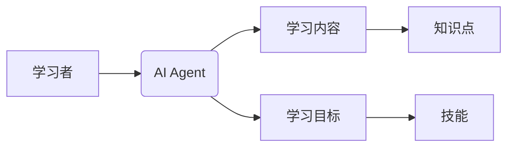
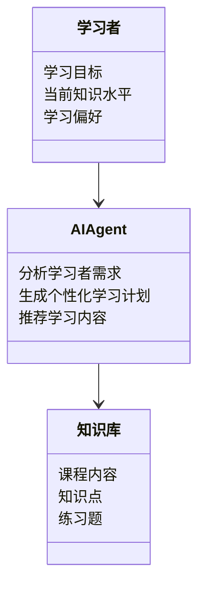
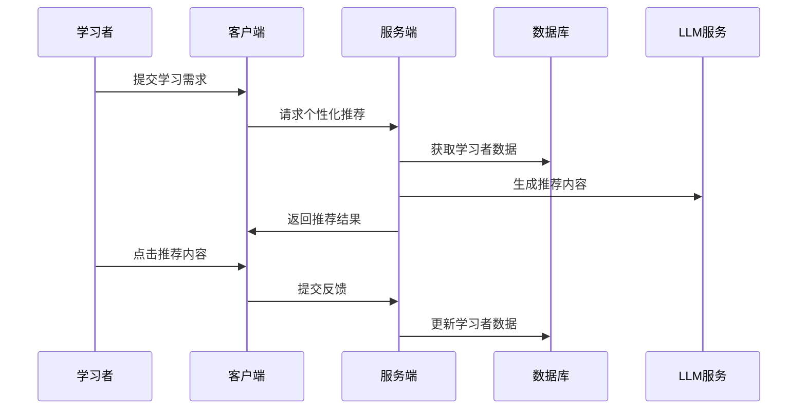

                 


# 自适应学习AI Agent：个性化的LLM教育系统

## 关键词：
自适应学习，AI Agent，LLM，教育系统，个性化学习

## 摘要：
本文探讨了自适应学习AI Agent在教育系统中的应用，结合大语言模型（LLM）技术，构建个性化的学习体验。文章从背景、核心概念、算法原理、系统架构到项目实战，全面解析如何通过AI技术实现智能化教育。

---

# 第一部分: 自适应学习AI Agent背景与核心概念

## 第1章: 自适应学习AI Agent概述

### 1.1 问题背景与问题描述
#### 1.1.1 当前教育系统的主要挑战
- 传统教育模式：基于统一的教学计划，难以满足个性化学习需求。
- 学生差异性：学习者的能力、兴趣和学习风格各不相同。
- 教学效率：教师难以兼顾不同学生的学习进度。

#### 1.1.2 学习者个性化需求的多样性
- 不同学生的学习目标不同。
- 学习节奏差异显著。
- 学习偏好（视觉、听觉、动觉）多样化。

#### 1.1.3 传统教育模式的局限性
- 缺乏实时反馈。
- 个性化支持不足。
- 教学资源利用率低。

### 1.2 问题解决与边界定义
#### 1.2.1 自适应学习AI Agent的提出
- 定义：AI Agent通过分析学习者的行为和需求，动态调整学习计划和内容。
- 目标：提供个性化的学习体验，提升学习效率和效果。

#### 1.2.2 边界与外延
- 系统边界：AI Agent仅负责学习内容推荐和学习路径优化。
- 外延：与外部知识库、教学平台和学习管理系统（LMS）对接。

#### 1.2.3 核心要素与组成结构
- 学习者模型：包括学习者的能力、兴趣和学习风格。
- 知识库：结构化的学习内容和知识点。
- AI推理引擎：基于LLM的推理和推荐算法。

### 1.3 核心概念与联系
#### 1.3.1 自适应学习AI Agent的原理
- 数据驱动：通过收集学习者的行为数据，分析学习者的需求。
- AI驱动：利用LLM进行内容生成和推荐。
- 个性化驱动：根据分析结果动态调整学习计划。

#### 1.3.2 核心概念对比表
| 概念         | 传统教育模式 | 自适应学习AI Agent |
|--------------|--------------|---------------------|
| 教学计划     | 固定         | 动态调整             |
| 学习节奏     | 统一         | 个性化             |
| 教学资源利用率 | 低           | 高                 |

#### 1.3.3 实体关系图


---

# 第二部分: 自适应学习AI Agent的核心算法

## 第2章: 自适应学习AI Agent的核心算法

### 2.1 算法原理与流程
#### 2.1.1 自适应学习算法的总体流程
1. 数据收集：收集学习者的行为数据（如学习时间、答题情况）。
2. 数据分析：分析学习者的学习需求和偏好。
3. 内容生成：基于LLM生成个性化学习内容。
4. 推荐与优化：动态调整学习计划。

#### 2.1.2 基于LLM的自适应推荐算法
- LLM输入：学习者的学习目标和当前知识水平。
- LLM输出：推荐的学习内容和学习路径。

#### 2.1.3 用户行为分析算法
- 分析学习者的行为数据，识别学习瓶颈。

### 2.2 算法实现代码示例
#### 2.2.1 环境安装
```bash
pip install transformers
pip install scikit-learn
```

#### 2.2.2 核心算法代码
```python
def analyze_input(user_input):
    # 示例：简单分析用户输入
    return user_input.lower()

def llm_inference(user_intent, knowledge_base):
    # 示例：基于LLM的内容生成
    return "推荐的学习内容：{}".format(user_intent)

def adaptive_learning_algorithm(user_input, knowledge_base):
    user_intent = analyze_input(user_input)
    response = llm_inference(user_intent, knowledge_base)
    return response

# 示例调用
user_input = "我想学Python编程"
knowledge_base = "Python编程基础"
print(adaptive_learning_algorithm(user_input, knowledge_base))
```

### 2.3 数学模型与公式
#### 2.3.1 用户行为建模公式
$$ P(user\_action | state) = \frac{e^{-d}}{Z} $$

其中：
- $d$ 表示当前状态的距离。
- $Z$ 是归一化常数。

---

# 第三部分: 系统分析与架构设计

## 第3章: 系统分析与架构设计方案

### 3.1 问题场景介绍
- 学习者：学生或自学者。
- 教学平台：提供课程内容和学习工具。
- AI Agent：负责个性化推荐和学习路径优化。

### 3.2 系统功能设计
#### 3.2.1 领域模型


#### 3.2.2 系统架构设计


### 3.3 系统接口设计
- API接口：
  - `/api/v1/analytics`：接收学习者行为数据。
  - `/api/v1/recommend`：返回推荐内容。
  - `/api/v1/planner`：生成学习计划。

### 3.4 系统交互流程


---

# 第四部分: 项目实战

## 第4章: 项目实战

### 4.1 环境安装
```bash
pip install transformers
pip install fastapi
pip install uvicorn
```

### 4.2 核心代码实现
```python
from fastapi import FastAPI
from transformers import AutoTokenizer, AutoModelForCausalLM

app = FastAPI()

model_name = "gpt2"
tokenizer = AutoTokenizer.from_pretrained(model_name)
model = AutoModelForCausalLM.from_pretrained(model_name)

@app.post("/api/v1/recommend")
async def recommend(user_input: str):
    user_intent = analyze_input(user_input)
    response = llm_inference(user_intent, knowledge_base)
    return {"result": response}

if __name__ == "__main__":
    uvicorn.run(app, host="0.0.0.0", port=8000)
```

### 4.3 案例分析与解读
- 案例1：学习者A希望提升编程能力。
  - AI Agent分析后，推荐Python基础课程。
- 案例2：学习者B对数学感兴趣。
  - AI Agent推荐相关的数学练习题和在线资源。

### 4.4 项目小结
- 成功的关键：AI Agent与知识库的有效结合。
- 改进方向：优化推荐算法，增加多模态支持。

---

# 第五部分: 最佳实践

## 第5章: 最佳实践

### 5.1 小结
- 自适应学习AI Agent的核心价值在于个性化推荐和动态调整。
- 技术实现的关键点是数据驱动和AI驱动的结合。

### 5.2 注意事项
- 数据隐私保护：确保学习者数据的安全性。
- 系统稳定性：保证推荐算法的实时性和准确性。

### 5.3 拓展阅读
- 《生成式人工智能：原理与应用》
- 《机器学习实战：基于Scikit-learn和TensorFlow》

---

# 结语

通过本文的系统介绍，读者可以全面了解自适应学习AI Agent在教育系统中的应用。从理论到实践，从算法到架构，我们展示了如何利用AI技术构建个性化的学习体验。未来，随着AI和教育技术的不断发展，自适应学习系统将更加智能化和个性化。

