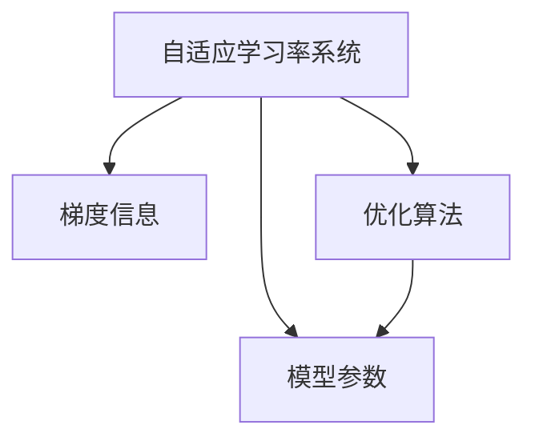

                 


# 自适应学习率：优化AI Agent的训练过程

> 关键词：自适应学习率，AI Agent，优化算法，Adam，AdaGrad，RMSProp

> 摘要：本文探讨了自适应学习率在AI Agent训练中的应用，分析了传统学习率的局限性，介绍了自适应学习率的核心概念与实现方式，并通过实例展示了如何在实际项目中应用这些算法来优化训练过程。

---

# 第1章: 自适应学习率的背景与问题背景

## 1.1 自适应学习率的基本概念

### 1.1.1 传统学习率的局限性
在AI Agent的训练过程中，学习率（learning rate）是一个关键的超参数，决定了模型参数更新的步幅。传统学习率是固定的，这意味着在训练的整个过程中，模型参数的更新步幅不变。然而，这种方法存在明显的局限性：

- **收敛速度慢**：在复杂的优化问题中，固定学习率可能需要多次迭代才能收敛，尤其是在不同参数梯度差异较大的情况下。
- **训练不稳定**：在某些情况下，固定学习率可能导致模型在某些参数上更新过快，导致训练过程不稳定，甚至发散。

### 1.1.2 自适应学习率的核心思想
自适应学习率的核心思想是根据训练过程中的梯度信息动态调整学习率。这种方法能够根据每个参数的梯度情况，自动调整更新步幅，从而加速收敛并提高训练稳定性。

### 1.1.3 自适应学习率的定义与边界
自适应学习率是一种动态调整学习率的优化方法，其核心在于利用梯度信息或模型状态来调整每个参数的更新步幅。自适应学习率的边界包括但不限于：
- **动态调整范围**：根据梯度的统计信息动态调整学习率。
- **收敛保证**：确保在动态调整过程中，模型参数能够收敛到全局最优或局部最优。
- **适应性**：能够适应不同任务和数据分布的变化。

## 1.2 问题背景与挑战

### 1.2.1 AI Agent训练中的常见问题
AI Agent的训练通常涉及复杂的优化问题，例如：
- **多目标优化**：需要在多个目标之间找到平衡。
- **非线性动态**：模型可能需要处理复杂的动态关系。
- **高维参数空间**：模型参数数量庞大，可能导致优化困难。

### 1.2.2 学习率在训练中的重要性
学习率直接影响模型参数的更新速度和方向。选择合适的学习率是训练成功的关键，但固定学习率往往难以应对复杂场景中的梯度变化。

### 1.2.3 自适应学习率的必要性
通过动态调整学习率，自适应学习率能够更好地适应训练过程中的梯度变化，从而提高训练效率和稳定性。

## 1.3 自适应学习率的核心要素

### 1.3.1 学习率动态调整的机制
自适应学习率通过动态调整学习率来优化参数更新。常见的机制包括基于梯度的自适应方法和基于时间的自适应方法。

### 1.3.2 自适应学习率的实现方式
自适应学习率的实现方式多种多样，包括基于梯度的自适应方法（如Adam优化器）和基于模型的自适应方法。

### 1.3.3 自适应学习率与其他优化方法的关系
自适应学习率是一种优化方法，与其他优化方法（如随机梯度下降、批量梯度下降）相结合，能够进一步提高训练效果。

## 1.4 本章小结
本章介绍了自适应学习率的基本概念、问题背景和核心要素，为后续章节的分析奠定了基础。

---

# 第2章: 自适应学习率的核心概念与原理

## 2.1 自适应学习率的原理

### 2.1.1 自适应学习率的基本原理
自适应学习率通过动态调整每个参数的学习率，使得模型在训练过程中能够更有效地探索参数空间。

### 2.1.2 自适应学习率的核心算法
自适应学习率的核心算法包括Adam、AdaGrad和RMSProp等优化算法。这些算法通过维护梯度的统计信息，动态调整学习率。

### 2.1.3 自适应学习率的数学模型
自适应学习率的数学模型通常涉及对梯度的统计和调整，例如平均梯度、方差梯度等。

## 2.2 自适应学习率与传统学习率的对比

### 2.2.1 传统学习率的优缺点
- **优点**：简单易实现，计算效率高。
- **缺点**：收敛速度慢，训练不稳定。

### 2.2.2 自适应学习率的优势
- **优势**：能够动态调整学习率，提高收敛速度和训练稳定性。

### 2.2.3 两种学习率的对比分析
通过对比分析，可以发现自适应学习率在复杂优化问题中具有明显优势。

## 2.3 自适应学习率的实现方式

### 2.3.1 基于梯度的自适应方法
基于梯度的自适应方法通过维护梯度的统计信息，动态调整学习率。

### 2.3.2 基于时间的自适应方法
基于时间的自适应方法通过训练时间动态调整学习率。

### 2.3.3 基于模型的自适应方法
基于模型的自适应方法利用模型结构信息动态调整学习率。

## 2.4 本章小结
本章详细介绍了自适应学习率的核心原理和实现方式，为后续章节的分析提供了理论基础。

---

# 第3章: 自适应学习率的算法原理与数学模型

## 3.1 自适应学习率的核心算法

### 3.1.1 Adam优化器的原理
Adam优化器结合了梯度的均值和方差，动态调整学习率。

### 3.1.2 AdaGrad算法的实现
AdaGrad算法通过维护梯度的平方和，动态调整学习率。

### 3.1.3 RMSProp算法的机制
RMSProp算法通过维护梯度的平方平均，动态调整学习率。

## 3.2 自适应学习率的数学模型

### 3.2.1 Adam优化器的数学公式
$$ \text{Adam} = \beta_1 \cdot g_t + (1-\beta_1) \cdot g_t $$

### 3.2.2 AdaGrad的数学公式
$$ \theta_{t+1} = \theta_t - \frac{\eta}{\sqrt{\sum_{i=1}^t g_i^2}} \cdot g_t $$

### 3.2.3 RMSProp的数学公式
$$ \rho_t = \rho \cdot \rho_{t-1} + (1-\rho) \cdot g_t^2 $$
$$ \theta_{t+1} = \theta_t - \frac{\eta}{\sqrt{\rho_t + \epsilon}} \cdot g_t $$

## 3.3 自适应学习率的算法实现

### 3.3.1 Python代码实现
```python
def adaptive_learning_rate_optimizer(params, learning_rate, beta=0.99, epsilon=1e-8):
    # 实现自适应学习率优化器
    pass
```

## 3.4 本章小结
本章通过数学公式和代码实现，详细介绍了自适应学习率的核心算法及其数学模型。

---

# 第4章: 自适应学习率的系统分析与架构设计

## 4.1 系统功能设计

### 4.1.1 自适应学习率的核心功能
自适应学习率系统的核心功能包括动态调整学习率、优化模型参数等。

### 4.1.2 系统的输入输出设计
- **输入**：模型参数、梯度信息等。
- **输出**：调整后的学习率和优化后的模型参数。

### 4.1.3 系统功能流程
自适应学习率系统通过动态调整学习率，优化模型参数，实现高效的训练过程。

## 4.2 系统架构设计

### 4.2.1 系统架构图


### 4.2.2 系统模块划分
- **模型参数模块**：负责管理模型参数。
- **梯度计算模块**：负责计算梯度信息。
- **优化算法模块**：负责动态调整学习率并优化模型参数。

### 4.2.3 模块交互设计
模块之间通过传递数据进行交互，例如模型参数传递给优化算法模块，梯度信息传递给学习率调整模块。

## 4.3 系统接口设计

### 4.3.1 输入接口
- **模型参数接口**：接收模型参数。
- **梯度信息接口**：接收梯度信息。

### 4.3.2 输出接口
- **优化后的模型参数接口**：输出优化后的模型参数。
- **学习率调整接口**：输出调整后的学习率。

## 4.4 本章小结
本章通过系统架构设计，详细介绍了自适应学习率系统的功能设计和模块交互。

---

# 第5章: 自适应学习率的项目实战

## 5.1 环境安装

### 5.1.1 安装Python
安装Python 3.8或更高版本。

### 5.1.2 安装深度学习框架
安装TensorFlow或PyTorch等深度学习框架。

### 5.1.3 安装其他依赖
安装所需的依赖库，例如numpy、scipy等。

## 5.2 系统核心实现

### 5.2.1 自适应学习率优化器实现
```python
def adaptive_learning_rate_optimizer(params, learning_rate, beta=0.99, epsilon=1e-8):
    # 实现自适应学习率优化器
    pass
```

### 5.2.2 训练过程实现
```python
def train_model(model, optimizer, criterion, train_loader, epochs=100):
    # 实现模型训练过程
    pass
```

## 5.3 案例分析与效果展示

### 5.3.1 案例分析
通过具体案例分析，展示自适应学习率在训练过程中的效果。

### 5.3.2 效果展示
展示模型在使用自适应学习率前后的训练曲线和性能对比。

## 5.4 本章小结
本章通过实际项目案例，展示了自适应学习率在训练过程中的应用和效果。

---

# 第6章: 总结与展望

## 6.1 本章总结
总结全文，强调自适应学习率在AI Agent训练中的重要性。

## 6.2 改进建议
提出改进建议，例如结合更多优化方法，进一步提高自适应学习率的效果。

## 6.3 注意事项
提醒读者在实际应用中需要注意的问题，例如参数选择、模型稳定性等。

## 6.4 拓展阅读
推荐相关的拓展阅读资料，帮助读者深入理解自适应学习率的相关知识。

## 6.5 本章小结
本章总结了全文内容，并展望了未来的研究方向。

---

# 结语

通过本文的详细分析，读者可以全面了解自适应学习率在优化AI Agent训练过程中的重要作用。从理论到实践，自适应学习率能够显著提高训练效率和模型性能。未来的研究可以进一步探索更高效的自适应学习率算法，为AI Agent的发展提供更多可能性。

