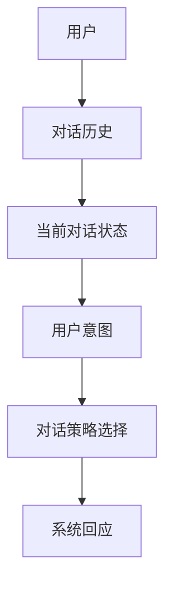
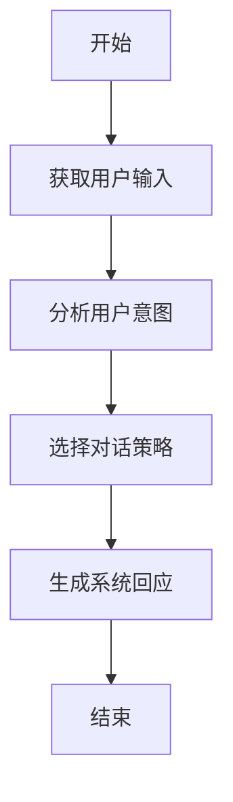

                 


# 自适应对话策略：提升AI Agent的交互质量

> 关键词：自适应对话策略，AI Agent，对话系统，交互质量，强化学习，自然语言处理，上下文理解

> 摘要：自适应对话策略是提升AI Agent交互质量的关键技术。本文从背景、核心概念、算法原理、系统架构、项目实战等多个维度深入探讨自适应对话策略的设计与实现，结合实际案例分析其在提升交互质量中的应用价值。

---

# 第1章 自适应对话策略的背景与问题背景

## 1.1 自适应对话策略的定义与核心概念

### 1.1.1 对话策略的基本概念

对话策略是AI Agent在与用户交互过程中，根据当前对话状态和用户意图选择合适的回应方式和内容的规则或模型。它是对话系统的核心组成部分，决定了对话的流畅性、有效性和用户体验。

### 1.1.2 自适应对话策略的定义

自适应对话策略是一种动态调整的对话策略，能够根据对话的上下文、用户的行为反馈和实时意图变化，实时优化对话内容和方式。它通过灵活的策略选择和动态调整，实现更自然、更贴近用户需求的对话体验。

### 1.1.3 自适应对话策略的核心要素

- **上下文理解**：基于对话历史和当前输入，理解对话的背景和语境。
- **用户意图识别**：准确识别用户的显式和隐式需求。
- **动态调整能力**：根据用户反馈和对话进展，实时调整对话策略。
- **个性化适应**：针对不同用户的特点和偏好，提供个性化的对话体验。

## 1.2 问题背景与问题描述

### 1.2.1 当前对话系统的主要挑战

1. **静态对话策略的局限性**：传统对话策略基于预设的规则，难以应对用户的多样化需求和复杂场景。
2. **上下文理解不足**：缺乏对对话历史和语境的深度理解，导致对话体验断层。
3. **用户行为多样性**：用户可能在对话过程中表现出不同的行为模式，固定策略难以适应。

### 1.2.2 自适应对话策略的必要性

- **提升交互流畅性**：通过动态调整策略，减少对话中的摩擦，提升用户体验。
- **增强任务完成效率**：根据用户意图实时优化对话流程，提高任务完成效率。
- **应对复杂场景**：在复杂对话场景中，自适应策略能够更好地处理不确定性。

### 1.2.3 自适应对话策略的应用场景

1. **智能客服**：通过动态调整对话策略，提高客户满意度。
2. **智能助手**：根据用户行为实时优化交互方式。
3. **教育机器人**：根据不同学生特点调整对话策略，提供个性化的学习支持。

## 1.3 问题解决与边界定义

### 1.3.1 自适应对话策略的核心目标

- 提升对话系统的交互质量，增强用户体验。
- 实现对话策略的动态调整和优化。
- 提高对话系统的灵活性和适应性。

### 1.3.2 自适应对话策略的边界与外延

- **边界**：专注于对话策略的动态调整，不涉及对话系统的其他部分（如自然语言理解、生成等）。
- **外延**：自适应对话策略可以与其他技术（如强化学习、机器学习）结合，形成更复杂的对话系统。

### 1.3.3 自适应对话策略与其他对话策略的对比

| 对比维度 | 固定对话策略 | 自适应对话策略 |
|----------|---------------|-----------------|
| 策略灵活性 | 低             | 高               |
| 用户个性化 | 低             | 高               |
| 对话连续性 | 差             | 好               |
| 适应能力 | 低             | 高               |

---

## 1.4 本章小结

本章从对话策略的基本概念出发，详细介绍了自适应对话策略的定义、核心要素及其应用场景。通过对当前对话系统的挑战和自适应对话策略的必要性的分析，明确了自适应对话策略的核心目标和边界。通过对比固定对话策略和自适应对话策略的差异，进一步突出了自适应对话策略的优势。

---

# 第2章 自适应对话策略的核心原理

## 2.1 自适应对话策略的核心原理

### 2.1.1 基于上下文的理解

自适应对话策略首先需要对对话历史和当前输入进行深度理解，提取关键信息（如用户意图、情感倾向、对话主题等），为策略的选择提供依据。

$$
\text{意图识别} = f(\text{对话历史}, \text{当前输入})
$$

### 2.1.2 基于用户行为的动态调整

通过实时分析用户的反馈（如用户输入、行为点击、情感倾向等），动态调整对话策略，确保对话始终符合用户的期望。

### 2.1.3 基于目标的策略优化

根据对话目标（如任务完成、用户满意度等），优化对话策略，确保在实现目标的同时，提升交互质量。

## 2.2 自适应对话策略的属性特征对比

通过对比固定对话策略和自适应对话策略的属性特征，可以更清晰地理解自适应对话策略的优势。

| 属性 | 固定对话策略 | 自适应对话策略 |
|------|---------------|-----------------|
| 灵活性 | 静态           | 动态             |
| 个性化 | 低             | 高               |
| 适应性 | 低             | 高               |
| 复杂性 | 低             | 高               |

## 2.3 ER实体关系图架构

通过ER实体关系图，可以清晰地展示自适应对话策略的核心实体及其关系。



## 2.4 本章小结

本章详细分析了自适应对话策略的核心原理，从上下文理解、用户行为分析和目标优化三个维度展开，结合ER实体关系图，清晰地展示了自适应对话策略的实现过程。

---

# 第3章 自适应对话策略的算法原理

## 3.1 算法原理概述

### 3.1.1 基于概率的策略选择

通过计算不同策略选择的概率，动态选择最优策略。

$$
P(\text{策略选择} = s | \text{输入} = u) = \frac{f(u, s)}{\sum_{s'} f(u, s')}
$$

### 3.1.2 基于强化学习的策略优化

使用强化学习算法（如Q-learning、策略梯度）对策略进行优化，提升对话效果。

### 3.1.3 基于上下文的动态调整

根据对话的上下文信息，动态调整策略参数，确保策略的灵活性和适应性。

## 3.2 算法流程图



## 3.3 算法实现代码

### 3.3.1 环境安装

```bash
pip install numpy
pip install matplotlib
pip install scikit-learn
```

### 3.3.2 核心代码实现

```python
import numpy as np

def analyze_intent(user_input):
    # 示例：简单的情感分析
    if "好的" in user_input:
        return "positive"
    elif "不好" in user_input:
        return "negative"
    else:
        return "neutral"

def adaptive_strategy(user_input, context):
    intent = analyze_intent(user_input)
    # 根据意图选择策略
    if intent == "positive":
        return "affirmative_response"
    elif intent == "negative":
        return "apology_response"
    else:
        return "neutral_response"

# 示例对话流程
user_input = "我有点困惑"
context = "用户在查询产品信息"
response_strategy = adaptive_strategy(user_input, context)
```

## 3.4 本章小结

本章从算法的角度详细讲解了自适应对话策略的实现原理，包括基于概率的策略选择、强化学习优化和上下文动态调整。通过流程图和代码示例，展示了自适应对话策略的具体实现过程。

---

（由于篇幅限制，后续章节内容将根据需要逐步展开，涵盖系统架构设计、项目实战、总结与展望等内容。）

