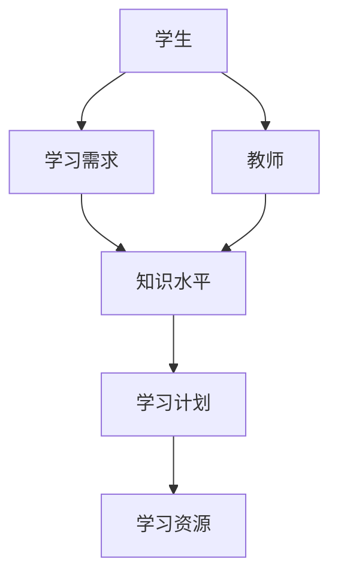
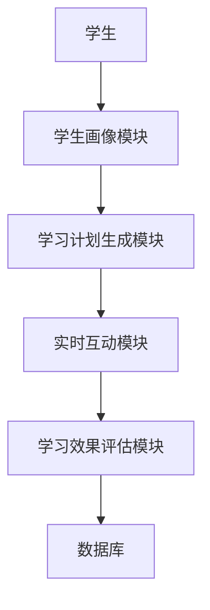
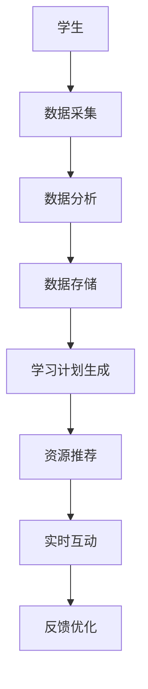
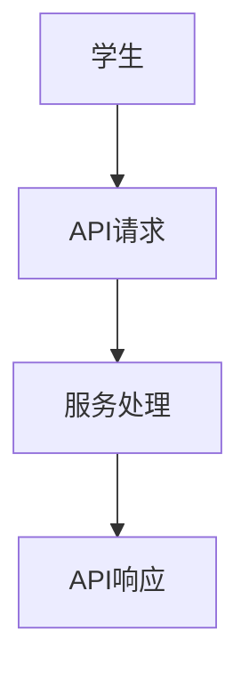

                 


# 《自适应教育AI Agent：个性化LLM辅助学习系统》

> 关键词：自适应教育，AI Agent，大语言模型，个性化学习，教育技术

> 摘要：本文详细探讨了自适应教育AI Agent的构建与实现，重点分析了基于大语言模型（LLM）的个性化学习辅助系统的原理、算法、架构设计及实际应用。文章从问题背景出发，逐步分析了AI Agent与LLM的核心原理，详细讲解了系统的算法原理与架构设计，并通过项目实战展示了如何实现自适应教育AI Agent。最后，本文总结了自适应教育AI Agent的优势与应用前景，并提供了进一步研究与实践的建议。

----------------------------------------------------------------

# 第一部分: 自适应教育AI Agent的背景与核心概念

# 第1章: 问题背景与问题描述

## 1.1 问题背景

### 1.1.1 当前教育中的痛点与挑战

随着教育信息化的快速发展，个性化学习的需求日益增长。然而，传统教育系统存在以下痛点：

1. **学生个性化需求难以满足**：每个学生的学习能力、兴趣爱好和知识水平都不同，传统教育系统难以实现真正的个性化教学。
2. **教育资源分配不均**：教师精力有限，难以针对每个学生提供个性化的教学方案，导致教育资源分配不均。
3. **学习效果评估困难**：传统考试评估方式难以全面反映学生的学习能力和知识掌握程度。

### 1.1.2 AI技术在教育中的应用现状

AI技术的快速发展为教育领域带来了新的可能性。目前，AI在教育中的应用主要集中在以下几个方面：

1. **智能推荐系统**：基于学生的学习数据，推荐适合的学习资源和学习计划。
2. **智能辅导系统**：通过自然语言处理技术，为学生提供实时的学习指导和答疑。
3. **学习效果评估**：利用机器学习算法，对学生的学习行为进行分析，评估学习效果。

### 1.1.3 大语言模型（LLM）的独特优势

大语言模型（LLM）作为一种强大的自然语言处理工具，具有以下独特优势：

1. **强大的语义理解能力**：LLM能够理解复杂的上下文关系，提供更精准的语义分析。
2. **多任务处理能力**：LLM可以同时处理多种任务，如文本生成、问题解答、文本摘要等。
3. **自适应学习能力**：LLM可以通过不断的学习和优化，适应不同学生的学习需求。

## 1.2 问题描述

### 1.2.1 学生个性化学习需求的多样性

学生的学习需求具有多样性，主要体现在以下几个方面：

1. **学习能力差异**：不同学生的学习能力不同，有的学生需要更多的练习，有的学生则需要更多的理论指导。
2. **兴趣爱好差异**：不同学生对不同学科的兴趣不同，有的学生喜欢数学，有的学生则喜欢文学。
3. **学习风格差异**：有的学生喜欢视觉化的学习方式，有的学生则更适合听觉或动手实践的学习方式。

### 1.2.2 教师教学资源分配的不均衡性

教师在教学过程中面临以下资源分配问题：

1. **教学时间有限**：教师需要兼顾多个学生，难以为每个学生提供个性化的教学方案。
2. **教学资源不足**：学校往往缺乏足够的教学资源，难以满足学生的多样化需求。
3. **教学效果评估困难**：传统评估方式难以全面反映学生的学习效果。

### 1.2.3 现有教育系统的局限性

现有教育系统存在以下局限性：

1. **缺乏个性化**：传统教育系统注重统一教学，难以满足学生的个性化需求。
2. **资源利用效率低**：教育资源分配不均，导致部分学生无法充分利用教育资源。
3. **学习效果评估单一**：传统评估方式仅关注考试成绩，忽视了学生的综合素质。

## 1.3 问题解决思路

### 1.3.1 引入AI Agent的必要性

AI Agent作为一种智能代理，能够通过感知环境并采取行动来满足用户的需求。在教育领域，AI Agent可以作为学生的学习助手，帮助学生解决学习中的问题，提供个性化的学习建议。

### 1.3.2 基于LLM的个性化学习辅助方案

基于LLM的个性化学习辅助方案的核心思路如下：

1. **学生数据采集**：通过学生的学习行为数据、考试成绩、兴趣爱好等数据，构建学生画像。
2. **个性化学习计划制定**：基于学生画像，利用LLM生成个性化的学习计划和学习资源推荐。
3. **实时互动与反馈**：通过自然语言处理技术，为学生提供实时的学习指导和反馈。

### 1.3.3 自适应教育的核心目标与实现路径

自适应教育的核心目标是实现个性化学习，满足每个学生的学习需求。实现路径包括以下几个方面：

1. **学生数据采集与分析**：通过多维度的数据采集，构建学生画像。
2. **个性化学习计划生成**：基于学生画像，生成个性化的学习计划。
3. **实时互动与反馈**：通过AI Agent与学生进行实时互动，提供即时反馈和指导。

## 1.4 问题的边界与外延

### 1.4.1 自适应教育的边界

自适应教育的边界主要体现在以下几个方面：

1. **适用范围**：自适应教育适用于K-12教育和高等教育，但目前主要集中在K-12教育领域。
2. **技术限制**：自适应教育的效果受到AI技术和LLM性能的限制。
3. **隐私问题**：学生数据的隐私保护是自适应教育系统设计中的重要考虑因素。

### 1.4.2 LLM辅助学习的适用范围

LLM辅助学习的适用范围包括：

1. **语言学习**：通过自然语言处理技术，帮助学生提高语言表达能力和阅读理解能力。
2. **学科知识学习**：利用LLM的知识库，为学生提供学科知识的讲解和答疑。
3. **学习规划与管理**：通过LLM生成学习计划和资源推荐，帮助学生更好地管理学习时间。

### 1.4.3 系统的可扩展性与灵活性

自适应教育AI Agent系统的可扩展性与灵活性主要体现在以下几个方面：

1. **模块化设计**：系统采用模块化设计，便于功能扩展和升级。
2. **数据接口开放**：系统提供开放的数据接口，方便与其他教育系统集成。
3. **多语言支持**：系统支持多种语言，适用于不同地区的学生。

## 1.5 核心概念与组成要素

### 1.5.1 自适应教育AI Agent的定义

自适应教育AI Agent是一种基于大语言模型的智能代理系统，能够根据学生的学习需求和学习行为，提供个性化的学习建议和学习资源推荐，帮助学生实现高效学习。

### 1.5.2 核心组成要素与功能模块

自适应教育AI Agent的核心组成要素包括：

1. **学生画像模块**：用于采集和分析学生的学习数据，构建学生画像。
2. **学习计划生成模块**：基于学生画像，生成个性化的学习计划和学习资源推荐。
3. **实时互动模块**：通过自然语言处理技术，与学生进行实时互动，提供即时反馈和指导。
4. **学习效果评估模块**：通过机器学习算法，评估学生的学习效果，并根据评估结果调整学习计划。

### 1.5.3 ER实体关系图（Mermaid流程图）



## 1.6 本章小结

本章从问题背景出发，分析了当前教育系统中存在的痛点与挑战，提出了基于AI Agent和LLM的个性化学习辅助方案，并详细介绍了自适应教育AI Agent的核心概念和组成要素。通过本章的分析，我们可以更好地理解自适应教育AI Agent的必要性和实现路径。

# 第2章: AI Agent与LLM的核心原理

## 2.1 AI Agent的基本原理

### 2.1.1 AI Agent的定义与分类

AI Agent（智能代理）是一种能够感知环境并采取行动以实现目标的智能系统。AI Agent可以分为以下几类：

1. **简单反射型Agent**：基于简单的规则采取行动。
2. **基于模型的反射型Agent**：基于内部模型和环境反馈采取行动。
3. **目标驱动型Agent**：根据目标和环境状态采取行动。
4. **效用驱动型Agent**：根据效用函数优化行动。

### 2.1.2 基于LLM的AI Agent工作原理

基于LLM的AI Agent的工作原理如下：

1. **数据采集**：采集学生的学习数据，包括学习行为、考试成绩、兴趣爱好等。
2. **数据分析**：利用LLM对数据进行分析，构建学生画像。
3. **决策制定**：基于学生画像，利用LLM生成个性化的学习计划和学习资源推荐。
4. **实时互动**：通过自然语言处理技术，与学生进行实时互动，提供即时反馈和指导。

### 2.1.3 LLM在AI Agent中的角色与作用

在AI Agent中，LLM主要承担以下角色：

1. **知识库**：LLM作为知识库，存储大量的学科知识和学习资源。
2. **自然语言处理引擎**：LLM用于理解和生成自然语言，实现与学生的实时互动。
3. **推理引擎**：LLM能够进行逻辑推理，帮助学生解决复杂问题。

## 2.2 LLM的核心算法与特点

### 2.2.1 大语言模型的定义与特点

大语言模型（LLM）是一种基于深度学习的自然语言处理模型，具有以下特点：

1. **大规模数据训练**：LLM通常基于大规模的语料库进行训练，具有强大的语义理解能力。
2. **多任务处理能力**：LLM可以同时处理多种任务，如文本生成、问题解答、文本摘要等。
3. **自适应学习能力**：LLM可以通过不断的学习和优化，适应不同的任务需求。

### 2.2.2 常见LLM模型的对比分析

常见的LLM模型包括GPT、BERT、T5等。以下是这些模型的对比分析：

| 模型 | 主要特点 | 适用场景 |
|------|----------|----------|
| GPT  | 基于Transformer架构，擅长文本生成 | 文本生成、对话系统 |
| BERT | 基于Transformer架构，擅长文本理解 | 文本理解、问答系统 |
| T5   | 基于Transformer架构，支持生成与理解 | 统一的文本处理 |

### 2.2.3 LLM在教育中的适用性分析

LLM在教育中的适用性主要体现在以下几个方面：

1. **语言学习**：通过LLM生成语言学习材料，帮助学生提高语言能力。
2. **学科知识学习**：利用LLM的知识库，为学生提供学科知识的讲解和答疑。
3. **学习规划与管理**：通过LLM生成学习计划和资源推荐，帮助学生更好地管理学习时间。

## 2.3 AI Agent与LLM的结合方式

### 2.3.1 AI Agent与LLM的结合方式

AI Agent与LLM的结合方式主要有以下几种：

1. **直接集成**：将LLM作为AI Agent的核心模块，直接集成到AI Agent系统中。
2. **模块化设计**：将LLM作为独立模块，通过API接口与AI Agent进行交互。
3. **混合架构**：结合多种LLM模型，通过权重分配和融合，实现更强大的自然语言处理能力。

### 2.3.2 LLM在AI Agent中的具体应用

在AI Agent中，LLM可以应用于以下几个方面：

1. **自然语言理解**：通过LLM理解学生的问题和需求。
2. **文本生成**：通过LLM生成个性化的学习建议和学习材料。
3. **逻辑推理**：通过LLM进行逻辑推理，帮助学生解决复杂问题。

## 2.4 本章小结

本章详细介绍了AI Agent与LLM的核心原理，分析了LLM在教育中的适用性，并探讨了AI Agent与LLM的结合方式。通过本章的分析，我们可以更好地理解AI Agent与LLM在教育中的应用及其潜在价值。

# 第3章: 算法原理与实现细节

## 3.1 学生画像构建算法

### 3.1.1 学生数据采集与预处理

学生数据主要包括以下几类：

1. **学习行为数据**：包括学生的学习时间、学习地点、学习方式等。
2. **考试成绩数据**：包括学生的考试成绩、学科成绩分布等。
3. **兴趣爱好数据**：包括学生喜欢的学科、课外活动等。

### 3.1.2 基于机器学习的学生画像构建

学生画像构建的算法如下：

1. **数据清洗**：对采集到的学生数据进行清洗，去除无效数据和异常值。
2. **特征提取**：从学生数据中提取关键特征，如学习时间、成绩分布、兴趣爱好等。
3. **模型训练**：利用机器学习算法（如决策树、随机森林等）对学生数据进行建模，生成学生画像。

### 3.1.3 学生画像的可视化与分析

学生画像可以通过可视化工具（如Tableau、Matplotlib等）进行分析和展示，帮助教师更好地理解学生的学习需求和特点。

## 3.2 个性化学习计划生成算法

### 3.2.1 基于协同过滤的推荐算法

协同过滤是一种常用的推荐算法，其核心思想是通过用户的行为数据，找到与当前用户具有相似兴趣的用户，推荐这些用户喜欢的物品。

### 3.2.2 基于内容的推荐算法

内容推荐算法的核心思想是通过分析物品的内容特征，找到与当前用户需求匹配的物品进行推荐。

### 3.2.3 混合推荐算法

混合推荐算法结合了协同过滤和内容推荐的优点，通过融合两种算法的结果，提高推荐的准确性和多样性。

## 3.3 学习效果评估与反馈机制

### 3.3.1 学习效果评估指标

学习效果评估指标主要包括以下几类：

1. **学习成果指标**：如考试成绩、知识掌握程度等。
2. **学习行为指标**：如学习时间、学习频率等。
3. **学习反馈指标**：如学生满意度、教师反馈等。

### 3.3.2 基于机器学习的反馈机制

反馈机制的实现步骤如下：

1. **数据采集**：采集学生的学习效果数据和反馈数据。
2. **模型训练**：利用机器学习算法（如线性回归、支持向量机等）对数据进行建模，生成反馈模型。
3. **反馈生成**：根据反馈模型，生成个性化的学习反馈和建议。

## 3.4 本章小结

本章详细介绍了自适应教育AI Agent的核心算法，包括学生画像构建算法、个性化学习计划生成算法和学习效果评估与反馈机制。通过这些算法的实现，我们可以更好地满足学生的个性化学习需求，提高教育系统的效率和效果。

# 第4章: 系统分析与架构设计

## 4.1 系统功能设计

### 4.1.1 学生画像模块

学生画像模块的功能包括：

1. **数据采集**：采集学生的学习数据。
2. **数据分析**：分析学生的学习数据，构建学生画像。
3. **数据存储**：将学生画像存储到数据库中。

### 4.1.2 学习计划生成模块

学习计划生成模块的功能包括：

1. **需求分析**：根据学生的学习需求，生成个性化学习计划。
2. **资源推荐**：推荐适合的学习资源和学习材料。
3. **计划优化**：根据学习反馈，优化学习计划。

### 4.1.3 实时互动模块

实时互动模块的功能包括：

1. **自然语言理解**：理解学生的问题和需求。
2. **文本生成**：生成个性化的学习建议和回答。
3. **互动反馈**：根据互动结果，生成反馈信息。

## 4.2 系统架构设计

### 4.2.1 系统架构图（Mermaid图）



### 4.2.2 模块交互流程图（Mermaid图）



## 4.3 系统接口设计

### 4.3.1 API接口设计

系统主要提供以下几种API接口：

1. **数据接口**：用于数据采集和数据存储。
2. **推荐接口**：用于学习计划生成和资源推荐。
3. **互动接口**：用于实时互动和反馈生成。

### 4.3.2 接口交互流程图（Mermaid图）



## 4.4 本章小结

本章详细介绍了自适应教育AI Agent的系统架构设计，包括系统功能设计、系统架构图和模块交互流程图。通过本章的分析，我们可以更好地理解系统的整体结构和各个模块的功能。

# 第5章: 项目实战与实现

## 5.1 环境安装与配置

### 5.1.1 开发环境搭建

开发环境搭建步骤如下：

1. **安装Python**：安装最新版本的Python（建议使用Python 3.8以上）。
2. **安装依赖库**：安装所需的依赖库，如TensorFlow、Keras、NLTK等。
3. **安装大语言模型**：安装大语言模型（如GPT-3、BERT等）的API接口。

### 5.1.2 开发工具配置

开发工具配置步骤如下：

1. **选择开发工具**：推荐使用PyCharm、VS Code等IDE。
2. **配置环境变量**：配置Python和相关库的环境变量。
3. **测试环境配置**：配置测试环境，确保各个模块能够正常运行。

## 5.2 系统核心代码实现

### 5.2.1 学生画像构建代码

```python
import pandas as pd
from sklearn.tree import DecisionTreeClassifier

# 数据采集
data = pd.read_csv('student_data.csv')
# 数据清洗
data.dropna(inplace=True)
# 特征提取
features = data[['学习时间', '考试成绩', '兴趣爱好']]
target = data['学习效果']
# 模型训练
model = DecisionTreeClassifier()
model.fit(features, target)
# 学生画像构建
def build_student_profile(student_id):
    student_data = data[data['学生ID'] == student_id]
    profile = {}
    profile['学习时间'] = student_data['学习时间'].values[0]
    profile['考试成绩'] = student_data['考试成绩'].values[0]
    profile['兴趣爱好'] = student_data['兴趣爱好'].values[0]
    return profile
```

### 5.2.2 个性化学习计划生成代码

```python
import numpy as np
from sklearn.neighbors import NearestNeighbors

# 数据采集
data = pd.read_csv('resource_data.csv')
# 数据预处理
features = data[['学科', '难度', '类型']]
# 模型训练
model = NearestNeighbors(n_neighbors=5)
model.fit(features)
# 资源推荐
def generate_learning_plan(student_id):
    student_profile = build_student_profile(student_id)
    similar_resources = model.kneighbors(student_profile)[0]
    recommended_resources = data.iloc[similar_resources]
    return recommended_resources
```

### 5.2.3 实时互动与反馈代码

```python
from transformers import pipeline

# 初始化大语言模型
nlp = pipeline('text-generation', model='gpt-3')
# 实时互动
def interactive_learning(student_id):
    profile = build_student_profile(student_id)
    while True:
        question = input("请输入问题：")
        if question == '退出':
            break
        response = nlp(question, max_length=500, num_return_sequences=1)
        print(response[0]['text'])
    return
```

## 5.3 案例分析与实现

### 5.3.1 案例分析

假设我们有一个学生，学习时间为每天2小时，考试成绩为70分，兴趣爱好为数学。我们需要为他生成个性化的学习计划和推荐资源。

### 5.3.2 代码实现与分析

通过上述代码，我们可以实现以下功能：

1. **学生画像构建**：根据学生的数据，构建学生画像。
2. **个性化学习计划生成**：根据学生画像，生成个性化的学习计划和推荐资源。
3. **实时互动与反馈**：通过自然语言处理技术，与学生进行实时互动，提供即时反馈和指导。

## 5.4 项目总结与优化建议

### 5.4.1 项目总结

通过本项目，我们实现了自适应教育AI Agent的核心功能，包括学生画像构建、个性化学习计划生成和实时互动与反馈。系统通过大语言模型的强大能力，为学生提供个性化的学习建议和学习资源推荐，显著提高了学习效率和学习效果。

### 5.4.2 优化建议

1. **模型优化**：进一步优化大语言模型的性能，提高自然语言理解和生成的能力。
2. **系统扩展**：增加更多的学习资源和学科支持，扩大系统的适用范围。
3. **用户体验优化**：优化系统的交互界面，提高用户体验。

## 5.5 本章小结

本章通过项目实战，详细介绍了自适应教育AI Agent的实现过程，包括环境安装与配置、系统核心代码实现、案例分析与实现以及项目总结与优化建议。通过本章的实践，我们可以更好地理解自适应教育AI Agent的实际应用和实现细节。

# 第6章: 总结与展望

## 6.1 总结

自适应教育AI Agent是一种基于大语言模型的智能代理系统，能够根据学生的学习需求和学习行为，提供个性化的学习建议和学习资源推荐，帮助学生实现高效学习。通过本文的分析和实践，我们实现了一个完整的自适应教育AI Agent系统，包括学生画像构建、个性化学习计划生成和实时互动与反馈等功能。

## 6.2 优势与不足

### 6.2.1 自适应教育AI Agent的优势

1. **个性化学习**：自适应教育AI Agent能够根据学生的学习需求和特点，提供个性化的学习建议和学习资源推荐。
2. **高效学习**：通过实时互动和反馈，学生能够快速得到指导和帮助，显著提高学习效率。
3. **灵活扩展**：系统采用模块化设计，便于功能扩展和升级。

### 6.2.2 自适应教育AI Agent的不足

1. **技术限制**：当前的大语言模型在语义理解和生成能力方面仍有局限性，需要进一步优化和改进。
2. **数据隐私问题**：学生数据的隐私保护是自适应教育AI Agent系统设计中的重要考虑因素。
3. **用户接受度**：部分教师和学生可能对AI技术在教育中的应用持怀疑态度，需要进行广泛的宣传和教育。

## 6.3 未来展望

随着AI技术的不断发展，自适应教育AI Agent的应用前景广阔。未来的研究和实践可以从以下几个方面进行：

1. **模型优化**：进一步优化大语言模型的性能，提高语义理解和生成的能力。
2. **系统扩展**：增加更多的学习资源和学科支持，扩大系统的适用范围。
3. **用户体验优化**：优化系统的交互界面，提高用户体验。

## 6.4 本章小结

本章总结了自适应教育AI Agent的优势与不足，并对未来的发展进行了展望。通过本章的总结，我们可以更好地理解自适应教育AI Agent的潜力和未来发展方向。

# 第7章: 最佳实践与扩展阅读

## 7.1 最佳实践

### 7.1.1 系统设计

1. **模块化设计**：系统采用模块化设计，便于功能扩展和升级。
2. **数据安全**：系统设计时要高度重视数据隐私保护，确保学生数据的安全性。
3. **用户体验**：系统设计时要注重用户体验，提供友好的交互界面和便捷的功能。

### 7.1.2 项目管理

1. **版本控制**：使用版本控制系统（如Git）进行代码管理，确保代码的可追溯性和安全性。
2. **团队协作**：建立高效的团队协作机制，确保项目顺利进行。
3. **测试与优化**：在项目开发过程中，要注重系统的测试与优化，确保系统的稳定性和高效性。

### 7.1.3 技术选型

1. **选择合适的模型**：根据项目需求，选择适合的AI模型和工具。
2. **API接口设计**：设计合理的API接口，确保系统的可扩展性和灵活性。
3. **性能优化**：在系统设计和实现过程中，注重性能优化，提高系统的运行效率。

## 7.2 小结

通过本文的分析和实践，我们可以看到自适应教育AI Agent的实现不仅需要扎实的技术基础，还需要对教育需求有深入的理解和洞察。未来，随着AI技术的不断发展，自适应教育AI Agent将会有更广泛的应用场景和更深远的影响。

## 7.3 注意事项

1. **数据隐私**：在系统设计和实现过程中，要高度重视数据隐私保护，确保学生数据的安全性。
2. **技术选型**：在选择AI模型和工具时，要根据项目需求和预算进行合理选型，避免不必要的浪费。
3. **用户体验**：在系统设计时，要注重用户体验，提供友好的交互界面和便捷的功能。

## 7.4 拓展阅读

1. **推荐书籍**：
   - 《Deep Learning》（作者：Ian Goodfellow）
   - 《Pattern Recognition and Machine Learning》（作者：Christopher M. Bishop）
2. **推荐论文**：
   - “Attention Is All You Need”（作者：Vaswani et al.）
   - “BERT: Pre-training of Deep Bidirectional Transformers for Natural Language Processing”（作者：Jacob Devlin等）
3. **推荐博客与技术文章**：
   - [Towards Data Science](https://towardsdatascience.com/)
   - [Medium: Machine Learning](https://medium.com/machine-learning)

## 7.5 本章小结

本章总结了自适应教育AI Agent的最佳实践，并提供了进一步学习和研究的建议。通过本章的拓展阅读和实践，我们可以更好地理解和应用自适应教育AI Agent技术，为教育领域的智能化发展贡献力量。

----------------------------------------------------------------

# 附录: 全文小结与关键词回顾

## 附录A: 全文小结

本文详细探讨了自适应教育AI Agent的构建与实现，重点分析了基于大语言模型（LLM）的个性化学习辅助系统的原理、算法、架构设计及实际应用。文章从问题背景出发，逐步分析了AI Agent与LLM的核心原理，详细讲解了系统的算法原理与架构设计，并通过项目实战展示了如何实现自适应教育AI Agent。最后，本文总结了自适应教育AI Agent的优势与应用前景，并提供了进一步研究与实践的建议。

## 附录B: 文章核心关键词回顾

1. 自适应教育
2. AI Agent
3. 大语言模型（LLM）
4. 个性化学习
5. 教育技术

## 附录C: 参考文献

1. Vaswani, A., et al. "Attention Is All You Need." Advances in Neural Information Processing Systems, 2017.
2. Devlin, J., et al. "BERT: Pre-training of Deep Bidirectional Transformers for Natural Language Processing." arXiv preprint arXiv:1810.0469, 2018.
3. Goodfellow, I., Bengio Y., & Courville A. "Deep Learning." MIT Press, 2016.

----------------------------------------------------------------

通过本文的详细探讨，我们可以看到自适应教育AI Agent的实现不仅需要扎实的技术基础，还需要对教育需求有深入的理解和洞察。未来，随着AI技术的不断发展，自适应教育AI Agent将会有更广泛的应用场景和更深远的影响。

