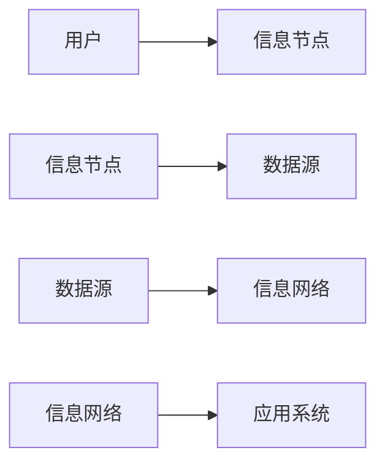
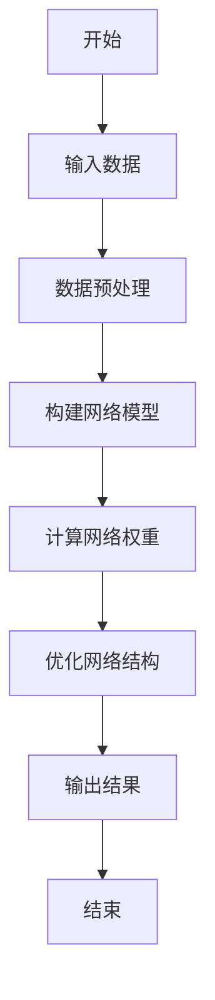
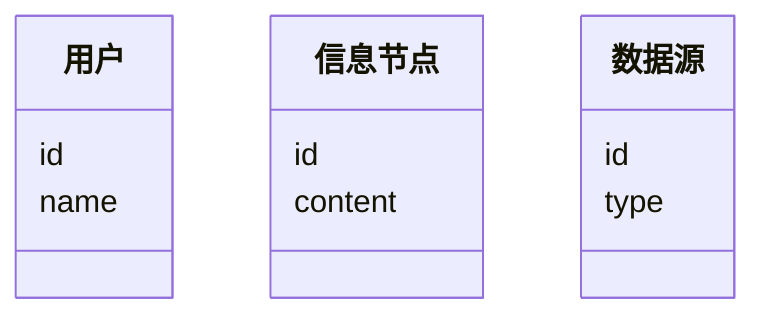
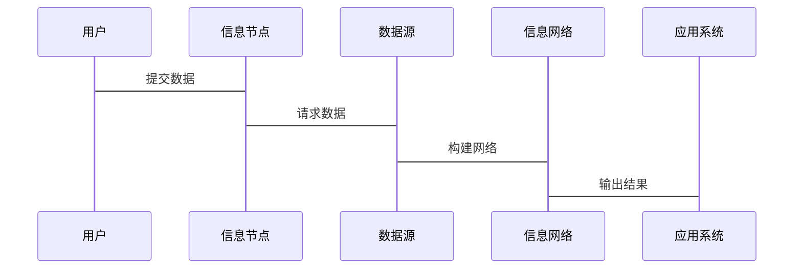

                 


# 菲利普·费雪的信息网络构建方法

## 关键词：
信息网络构建，网络算法，系统架构设计，信息网络优化，数据源构建

## 摘要：
本文详细探讨了菲利普·费雪的信息网络构建方法，从背景到核心概念，从算法原理到系统架构设计，再到项目实战和总结，全面解析信息网络构建的各个方面。文章内容丰富，结构清晰，旨在为读者提供一个系统的信息网络构建方法论。

---

# 第一部分: 背景介绍与核心概念

## 第1章: 信息网络构建的背景与核心概念

### 1.1 信息网络的定义与背景
#### 1.1.1 信息网络的基本概念
信息网络是一种通过节点和边表示信息连接关系的结构，广泛应用于数据分析、人工智能和大数据等领域。

#### 1.1.2 信息网络的发展历程
从早期的图论到现代的深度学习，信息网络经历了从简单到复杂的演变。

#### 1.1.3 信息网络在现代信息技术中的地位
信息网络是连接数据源、算法和应用系统的桥梁，是现代信息技术的核心组成部分。

### 1.2 信息网络构建的核心问题
#### 1.2.1 信息网络构建的主要挑战
包括数据冗余、信息孤岛和网络优化等问题。

#### 1.2.2 信息网络构建的目标与意义
构建高效、可靠的信息网络，提升数据处理和分析能力。

#### 1.2.3 信息网络构建的关键要素
包括节点、边、权重和算法等。

### 1.3 信息网络构建的边界与外延
#### 1.3.1 信息网络的边界定义
明确信息网络的起点和终点。

#### 1.3.2 信息网络的外延范围
信息网络与其他相关领域的交叉部分。

#### 1.3.3 信息网络与其他相关领域的区别
与数据源、算法和应用系统的区别。

---

## 第2章: 核心概念与联系

### 2.1 核心概念原理
#### 2.1.1 信息网络的基本原理
节点表示信息，边表示关系。

#### 2.1.2 信息网络的构建方法
基于数据源构建节点和边。

#### 2.1.3 信息网络的优化策略
通过算法优化网络结构。

### 2.2 核心概念属性对比表
| 概念 | 属性 |
|------|------|
| 节点 | 标识符、权重 |
| 边 | 类型、权重 |
| 网络 | 连通性、度分布 |

### 2.3 ER实体关系图架构


---

## 第3章: 算法原理讲解

### 3.1 算法原理概述
#### 3.1.1 信息网络构建的基本算法
包括图论算法和深度学习算法。

#### 3.1.2 算法的数学模型
$$
网络权重 = \sum_{i=1}^{n} w_i \cdot x_i
$$

#### 3.1.3 算法的优化方法
包括贪心算法和动态规划。

### 3.2 算法流程图


### 3.3 算法实现代码
```python
def build_information_network(data):
    # 数据预处理
    preprocessed_data = preprocess(data)
    # 构建网络模型
    network_model = create_network_model(preprocessed_data)
    # 计算网络权重
    network_weights = calculate_weights(network_model)
    # 优化网络结构
    optimized_network = optimize(network_model, network_weights)
    return optimized_network
```

---

## 第4章: 系统分析与架构设计

### 4.1 问题场景介绍
构建一个高效的信息网络，解决数据孤岛问题。

### 4.2 系统功能设计
#### 4.2.1 领域模型


#### 4.2.2 系统架构设计


#### 4.2.3 接口设计
包括数据输入接口和结果输出接口。

#### 4.2.4 交互序列图


---

## 第5章: 项目实战

### 5.1 环境安装
安装Python和相关库（如networkx、numpy）。

### 5.2 核心代码实现
```python
import networkx as nx

def create_network_model(data):
    G = nx.Graph()
    for node in data['nodes']:
        G.add_node(node['id'])
    for edge in data['edges']:
        G.add_edge(edge['source'], edge['target'], weight=edge['weight'])
    return G
```

### 5.3 代码应用解读
解释代码的功能和实现细节。

### 5.4 案例分析
通过具体案例分析信息网络构建的应用场景。

### 5.5 项目小结
总结项目成果和经验教训。

---

## 第6章: 总结与拓展

### 6.1 最佳实践 tips
包括数据预处理和算法优化的建议。

### 6.2 小结
信息网络构建的关键点和未来发展方向。

### 6.3 注意事项
包括数据质量和算法选择的注意事项。

### 6.4 拓展阅读
推荐相关书籍和论文。

---

# 结语

通过本文的详细讲解，读者可以系统地理解菲利普·费雪的信息网络构建方法，掌握从理论到实践的全过程。希望本文能为信息网络的研究和应用提供有价值的参考。

