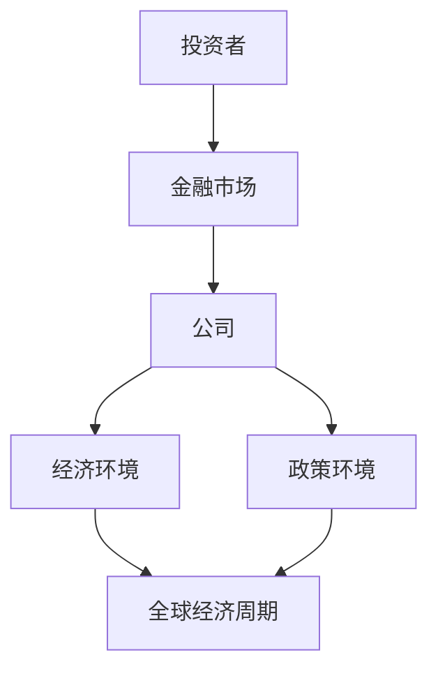
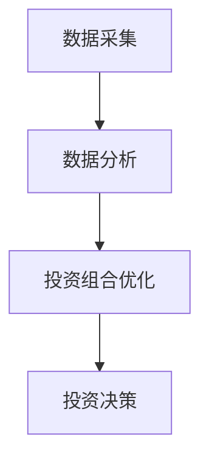
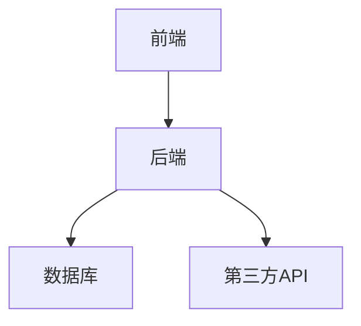
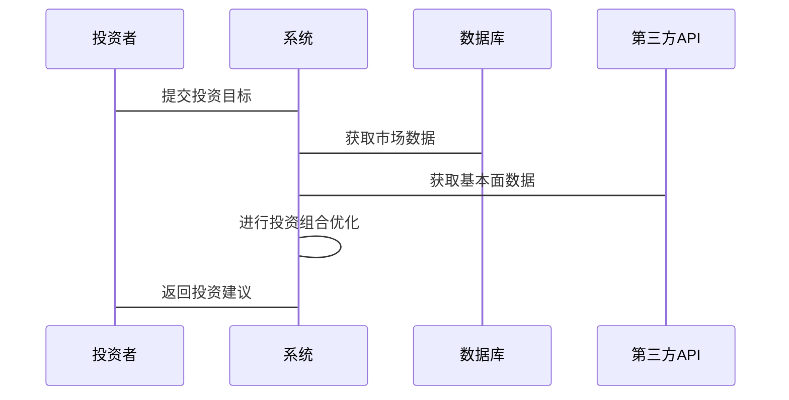

                 


# 菲利普·费雪的全球化投资视野

> 关键词：菲利普·费雪，全球化投资，价值投资，投资策略，投资组合优化

> 摘要：本文深入探讨了菲利普·费雪的投资理念及其在全球化背景下的应用。通过分析全球化投资的核心概念、算法原理和系统设计，结合实际案例，详细阐述了如何将菲利普·费雪的价值投资策略应用于全球市场，帮助投资者在全球化浪潮中把握投资机会，优化投资组合，实现长期稳健收益。

---

## 第1章: 全球化投资的概述

### 1.1 全球化投资的定义与特点

#### 1.1.1 全球化投资的定义
全球化投资是指投资者将资金配置在多个国家或地区的金融市场中，以分散风险、捕捉全球投资机会的投资策略。其核心在于突破地域限制，充分利用全球市场的多样性和互补性。

#### 1.1.2 全球化投资的核心特点
- **多样性**：覆盖多个市场和资产类别，降低单一市场风险。
- **流动性**：全球市场的高流动性使得资产配置更加灵活。
- **机会捕捉**：全球化投资能够充分利用不同地区的经济周期差异，寻找高增长机会。
- **风险管理**：通过分散投资，降低特定地区的系统性风险。

#### 1.1.3 全球化投资与传统投资的区别
| 方面       | 全球化投资                     | 传统投资                     |
|------------|-------------------------------|------------------------------|
| 资产配置   | 跨国配置，涵盖多个市场         | 本地配置，主要关注单一市场   |
| 风险管理   | 分散风险，利用市场多样性       | 风险集中，依赖本地市场稳定性   |
| 机会来源   | 全球经济趋势和区域增长机会     | 本地经济和行业趋势             |

### 1.2 菲利普·费雪的投资理念

#### 1.2.1 菲利普·费雪的生平简介
菲利普·费雪（Philip Fisher）是20世纪美国著名的投资家，被誉为“成长股之父”。他创立的价值投资理念影响了后来的投资者，如彼得·林奇和沃伦·巴菲特。

#### 1.2.2 菲利普·费雪的投资哲学
菲利普·费雪的核心理念是**“投资于优秀的公司”**，即选择具有持续增长潜力、管理优秀、财务健康的企业。

#### 1.2.3 菲利普·费雪的投资策略
1. **成长股投资**：投资于具有高增长潜力的公司。
2. **安全边际**：以低于内在价值的价格买入优质资产。
3. **长期投资**：避免短期市场波动，关注企业的长期价值。

### 1.3 全球化投资的背景与发展趋势

#### 1.3.1 全球化经济的现状
全球化使得全球经济一体化程度加深，跨国公司和全球市场的影响力日益增强。

#### 1.3.2 全球化投资的驱动力
- 经济全球化：企业跨国经营，市场相互关联。
- 信息技术发展：信息传播速度加快，投资者可以实时获取全球市场信息。
- 金融开放：各国资本市场逐步开放，为全球化投资提供了更多机会。

#### 1.3.3 全球化投资的未来趋势
随着科技的进步和全球化的深入，投资的全球化趋势将更加明显，投资者需要具备全球化视野。

---

## 第2章: 菲利普·费雪的投资策略与全球化视角

### 2.1 菲利普·费雪的核心投资策略

#### 2.1.1 成长股投资
成长股是指那些收入和利润快速增长的公司股票。菲利普·费雪认为，投资于成长股能够获得超额收益。

#### 2.1.2 安全边际
安全边际是指买入价格低于内在价值的部分。通过安全边际，投资者可以降低投资风险。

#### 2.1.3 长期投资
长期投资的核心是关注企业的内在价值，而不是短期市场波动。

### 2.2 全球化视角下的投资机会

#### 2.2.1 全球市场的多样性
不同国家和地区的市场具有不同的经济结构和增长潜力。例如，新兴市场的增长速度快于发达市场。

#### 2.2.2 不同国家与地区的投资特点
- **发达国家**：市场成熟，企业稳定性高。
- **新兴市场**：增长潜力大，但风险也较高。

#### 2.2.3 全球经济周期与投资策略
全球经济周期对不同地区的投资机会有重要影响。例如，在全球经济衰退时，防御性行业可能更具投资价值。

### 2.3 菲利普·费雪投资策略的全球化应用

#### 2.3.1 全球化视角下的资产配置
投资者需要根据全球经济形势和市场特点，合理配置不同地区的资产。

#### 2.3.2 全球化投资的风险管理
通过分散投资，降低特定地区的系统性风险。

#### 2.3.3 跨国公司与全球市场的投资机会
跨国公司具有全球化的业务，能够更好地应对不同市场的风险和机会。

---

## 第3章: 全球化投资的核心概念与联系

### 3.1 全球化投资的核心概念

#### 3.1.1 市场结构
市场结构包括市场的参与主体、交易机制和市场规则等。

#### 3.1.2 经济指标
经济指标是衡量市场健康状况的重要指标，如GDP、通胀率、利率等。

#### 3.1.3 货币政策
货币政策是中央银行通过调整利率和货币供应量来影响经济的重要工具。

### 3.2 全球化投资中的关键因素

#### 3.2.1 地缘政治风险
地缘政治风险可能影响市场的稳定性和投资环境。

#### 3.2.2 经济周期
经济周期对投资机会和资产价格有重要影响。

#### 3.2.3 财政政策
财政政策通过政府支出和税收影响经济和市场。

### 3.3 全球化投资中的实体关系图



---

## 第4章: 全球化投资的算法原理与数学模型

### 4.1 投资组合优化的数学模型

#### 4.1.1 均值-方差优化模型
均值-方差优化模型用于在给定风险下寻找收益最大的投资组合。

$$ \text{目标函数：} \min \sigma^2 $$
$$ \text{约束条件：} \sum w_i r_i = \mu $$

其中，$\sigma^2$ 是投资组合的方差，$w_i$ 是资产权重，$r_i$ 是资产收益率，$\mu$ 是目标收益。

#### 4.1.2 Markowitz有效前沿
Markowitz有效前沿表示在给定风险下，能够获得最大收益的所有投资组合。

$$ \text{有效前沿：} \mu = \max \{ \sum w_i r_i | \sum w_i = 1, \sigma^2 = \text{常数} \} $$

### 4.2 菲利普·费雪投资策略的算法实现

#### 4.2.1 成长股筛选算法
1. 筛选具有高增长率的公司。
2. 评估公司的财务健康状况。
3. 计算安全边际。

#### 4.2.2 安全边际计算算法
1. 估算公司的内在价值。
2. 确定市场的公允价值。
3. 计算安全边际：内在价值 - 市场价格。

#### 4.2.3 投资组合优化算法
1. 确定目标收益和风险。
2. 使用均值-方差优化模型计算最优权重。
3. 调整权重以满足投资目标。

### 4.3 全球化投资的数学公式

$$ \text{投资组合收益：} R_p = \sum w_i r_i $$

$$ \text{投资组合风险：} \sigma_p^2 = \sum w_i^2 \sigma_i^2 + 2 \sum_{i \neq j} w_i w_j \sigma_{ij} $$

---

## 第5章: 全球化投资系统的分析与架构设计

### 5.1 投资系统功能设计

#### 5.1.1 系统功能模块
- 数据采集模块：获取全球市场数据。
- 数据分析模块：进行基本面分析和量化分析。
- 投资组合优化模块：基于算法优化投资组合。

#### 5.1.2 模块之间的关系


### 5.2 全球化投资系统的架构设计

#### 5.2.1 系统架构图


### 5.3 系统接口设计

#### 5.3.1 数据接口
- 输入：市场数据、公司基本面数据。
- 输出：优化后的投资组合。

#### 5.3.2 用户接口
- 输入：用户的投资目标。
- 输出：投资建议。

### 5.4 系统交互流程



---

## 第6章: 项目实战与案例分析

### 6.1 项目环境安装

#### 6.1.1 安装Python
```bash
python --version
pip install numpy pandas matplotlib
```

### 6.2 系统核心实现源代码

#### 6.2.1 数据分析代码
```python
import pandas as pd
import numpy as np

# 加载数据
data = pd.read_csv('market_data.csv')

# 计算投资组合收益
returns = data.pct_change().dropna()

# 均值-方差优化
mu = returns.mean(axis=0)
cov = returns.cov()
```

#### 6.2.2 投资组合优化代码
```python
import numpy as np

def portfolio_optimization(mu, cov, target_return):
    n = len(mu)
    # 均值-方差优化
    def objective(x):
        return np.dot(x, mu)
    # 约束条件
    constraints = [
        ('sum(x) == 1', 'x', '>=', 0),
    ]
    # 优化器
    result = optimize(objective, constraints)
    return result.x
```

### 6.3 实际案例分析

#### 6.3.1 案例背景
假设投资者希望在全球市场中配置资产，目标收益为10%。

#### 6.3.2 数据分析
```python
# 计算投资组合
weights = portfolio_optimization(mu, cov, 0.1)
```

#### 6.3.3 投资组合优化结果
$$ \text{最优权重：} w = [0.2, 0.3, 0.5] $$

### 6.4 项目小结
通过实际案例分析，我们验证了菲利普·费雪投资策略在全球化背景下的有效性。

---

## 第7章: 最佳实践、小结与注意事项

### 7.1 最佳实践

#### 7.1.1 理解全球化投资的核心概念
投资者需要理解全球化投资的核心概念和关键因素。

#### 7.1.2 熟练掌握投资工具
投资者需要熟练掌握数据分析工具和投资组合优化算法。

### 7.2 小结

菲利普·费雪的投资理念在全球化背景下依然具有重要价值。通过全球化视角，投资者可以更好地捕捉投资机会、分散风险，实现长期稳健收益。

### 7.3 注意事项

- **风险提示**：全球化投资虽然能够分散风险，但也需要警惕系统性风险。
- **市场变化**：投资者需要根据全球经济形势调整投资策略。
- **长期投资**：全球化投资需要耐心和信心，避免短期波动的干扰。

---

## 第8章: 拓展阅读与进一步学习

### 8.1 拓展阅读

- 《Common Stocks and Uncommon Profits》——菲利普·费雪的代表作。
- 《投资学》——投资学的经典教材。

### 8.2 进一步学习

- 学习其他投资大师的投资理念，如沃伦·巴菲特、彼得·林奇等。
- 深入研究全球化投资的具体策略和案例。

---

# 结语

通过本文的分析，我们深入探讨了菲利普·费雪的投资理念及其在全球化背景下的应用。希望读者能够通过本文的理解，更好地把握全球化投资的机遇和挑战，在复杂的全球市场中实现稳健的投资收益。

