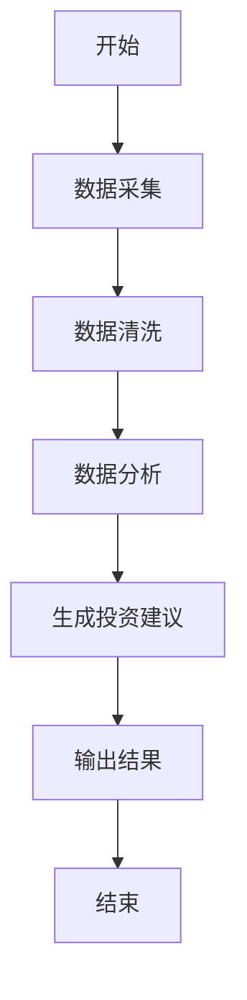

                 


# 菲利普·费雪的创新企业投资准则

> 关键词：菲利普·费雪、创新企业投资、成长股、深入研究、投资策略、风险管理

> 摘要：菲利普·费雪是价值投资领域的先驱，他的投资准则以深入研究和长期持有成长股为核心。本文将详细分析费雪的投资理念，包括成长股的定义、投资策略、风险管理等方面，并通过实际案例和系统分析，帮助读者全面理解他的投资智慧。

---

## 第1章: 投资的基本概念

### 1.1 投资的定义与重要性

#### 1.1.1 投资的定义
投资是指将资金投入到某个项目或企业中，以期在未来获得更高的收益。投资的核心目标是通过资产配置和风险管理，实现财富的保值与增值。

#### 1.1.2 投资的重要性
在现代社会，投资已成为个人和机构实现财务增长的重要手段。通过科学的投资策略，投资者可以在不确定的市场中找到稳定的投资回报。

#### 1.1.3 菲利普·费雪的背景介绍
菲利普·费雪（Philip Fisher）是20世纪著名的投资家，被誉为“成长股投资之父”。他提出的投资准则不仅影响了无数投资者，也为现代投资理论奠定了基础。

---

### 1.2 菲利普·费雪投资准则的核心理念

#### 1.2.1 费雪投资准则的起源
费雪的投资理念源于他对市场的深入研究和对企业的长期观察。他主张选择具有强大竞争优势和持续增长潜力的企业进行投资。

#### 1.2.2 费雪投资准则的核心思想
费雪的核心思想是“投资于成长股”，即选择那些具有持续盈利能力、良好管理和巨大市场潜力的企业。他强调，投资的关键在于对企业进行深入研究，而非短期市场波动。

#### 1.2.3 费雪投资准则的现代应用
尽管费雪的投资理念提出于几十年前，但其核心思想在现代投资中依然具有重要的指导意义。尤其是在科技和互联网时代，成长股的投资策略更加重要。

---

## 第2章: 费雪投资准则的核心概念

### 2.1 成长股的定义与特征

#### 2.1.1 成长股的定义
成长股是指那些具有较高成长性和盈利能力的企业股票。这类企业通常处于快速发展的阶段，具有较高的市场占有率和持续增长的收入。

#### 2.1.2 成长股的特征
- 高成长性：收入和利润持续增长。
- 强大竞争优势：在市场中具有独特的优势。
- 良好管理团队：管理层具有战略眼光和执行力。

#### 2.1.3 成长股与价值股的区别
- 成长股注重未来增长潜力，价值股注重当前价值低估。
- 成长股的风险较高，但回报潜力也更大。

---

### 2.2 费雪的“烟屁股”理论

#### 2.2.1 理论的提出背景
费雪的“烟屁股”理论源于他对企业的深入研究。他认为，投资者应该像寻找烟屁股一样，找到那些被市场忽视但具有巨大潜力的企业。

#### 2.2.2 理论的核心内容
- 企业具有强大的市场地位。
- 企业具有良好的财务状况。
- 企业具有持续的增长潜力。

#### 2.2.3 理论的实际应用
通过对企业基本面的分析，找到那些被市场低估的成长股，进行长期投资。

---

### 2.3 费雪投资准则的数学模型

#### 2.3.1 投资回报的计算公式
$$ \text{投资回报} = \frac{\text{最终价值} - \text{初始价值}}{\text{初始价值}} \times 100\% $$

#### 2.3.2 投资风险的评估模型
$$ \text{风险} = \text{标准差} \times \text{投资期限}^{0.5} $$

#### 2.3.3 投资组合的优化公式
$$ \text{最优投资组合} = \argmin_w \left( \sigma^2 \right) \text{ subject to } \mathbb{E}[r] \geq \text{目标收益} $$

---

## 第3章: 费雪投资准则的系统分析

### 3.1 投资系统的构成要素

#### 3.1.1 投资目标
- 财富增长
- 风险控制
- 投资期限

#### 3.1.2 投资策略
- 成长股投资
- 价值投资
- 对冲策略

#### 3.1.3 投资工具
- 股票
- 债券
- 基金

---

### 3.2 投资系统的架构设计

#### 3.2.1 系统功能模块划分
- 数据采集模块
- 数据分析模块
- 投资决策模块

#### 3.2.2 系统模块之间的关系
- 数据采集模块向数据分析模块提供企业基本面数据。
- 数据分析模块根据数据生成投资建议。
- 投资决策模块根据建议生成最终投资策略。

#### 3.2.3 系统的输入输出设计
- 输入：企业财务数据、市场数据
- 输出：投资组合建议、风险评估报告

---

### 3.3 投资系统的实现方案

#### 3.3.1 系统实现的技术选型
- 数据分析工具：Python（Pandas、NumPy）
- 可视化工具：Matplotlib、Seaborn
- 投资组合优化工具：PyPortfolioOpt

#### 3.3.2 系统实现的流程图


#### 3.3.3 系统实现的注意事项
- 数据的实时性
- 系统的可扩展性
- 系统的稳定性

---

## 第4章: 费雪投资准则的项目实战

### 4.1 项目背景介绍

#### 4.1.1 项目目标
通过分析某成长型企业，验证费雪投资准则的有效性。

#### 4.1.2 项目范围
选择一家具有高成长潜力的科技企业进行分析。

#### 4.1.3 项目需求
- 企业基本面分析
- 市场地位评估
- 投资回报预测

---

### 4.2 项目核心实现

#### 4.2.1 投资组合的构建
- 选择具有高成长性的企业股票
- 分析企业的财务状况
- 评估企业的竞争优势

#### 4.2.2 投资组合的优化
- 使用数学模型优化投资组合
- 通过分散投资降低风险
- 定期调整投资组合

#### 4.2.3 投资组合的风险控制
- 设置止损点
- 定期跟踪企业财务状况
- 监控市场风险

---

### 4.3 项目应用解读

#### 4.3.1 项目实现的代码解读
```python
import pandas as pd
import numpy as np

# 假设data是企业财务数据
data = pd.DataFrame({
    '收入': [100, 200, 300],
    '利润': [20, 40, 60],
    '增长率': [0.2, 0.3, 0.4]
})

# 计算投资回报
return_series = data['利润'] / data['收入']
mean_return = return_series.mean()
std_return = return_series.std()

print(f"平均回报率: {mean_return}")
print(f"回报率标准差: {std_return}")
```

#### 4.3.2 项目实现的流程解读
1. 数据采集：收集企业的财务数据。
2. 数据分析：计算投资回报率和风险。
3. 投资决策：根据分析结果构建投资组合。

#### 4.3.3 项目实现的案例分析
通过分析某科技企业，我们发现其收入和利润均保持高速增长，具备较高的成长性。因此，我们建议投资者长期持有该股票，以获得较高的投资回报。

---

## 第5章: 费雪投资准则的最佳实践

### 5.1 投资策略的优化技巧

#### 5.1.1 投资组合的优化方法
- 使用数学模型优化投资组合
- 通过分散投资降低风险
- 定期调整投资组合

#### 5.1.2 投资风险的控制技巧
- 设置止损点
- 定期跟踪企业财务状况
- 监控市场风险

#### 5.1.3 投资回报的提升策略
- 选择具有高成长性的企业
- 长期持有优质股票
- 定期再平衡投资组合

---

### 5.2 投资过程中的注意事项

#### 5.2.1 投资前的准备工作
- 制定投资目标
- 研究市场和企业
- 制定投资计划

#### 5.2.2 投资中的风险控制
- 定期评估投资组合
- 及时调整投资策略
- 监控市场风险

#### 5.2.3 投资后的跟踪与调整
- 定期评估投资结果
- 调整投资策略
- 学习市场变化

---

### 5.3 投资领域的拓展阅读

#### 5.3.1 相关书籍推荐
- 《巴菲特和费雪的投资思想》
- 《价值投资实战指南》

#### 5.3.2 相关研究报告
- 《成长股投资策略分析》
- 《费雪投资准则的现代应用》

#### 5.3.3 相关投资论坛
- 知识分子投资俱乐部
- 价值投资论坛

---

## 第6章: 总结与展望

### 6.1 本章小结
菲利普·费雪的投资准则以深入研究和长期持有成长股为核心，为我们提供了科学的投资方法。通过本文的分析，我们可以更好地理解他的投资理念，并将其应用于实际投资中。

### 6.2 未来展望
随着市场的不断发展，费雪的投资准则仍具有重要的指导意义。未来，我们可以进一步研究其在新兴行业中的应用，探索更多投资机会。

---

通过本文的系统分析和实际案例，我们不仅了解了菲利普·费雪的投资准则，还掌握了如何在实际投资中应用这些准则。希望本文能为投资者提供有价值的参考，帮助他们在复杂多变的市场中找到成功的投资策略。

