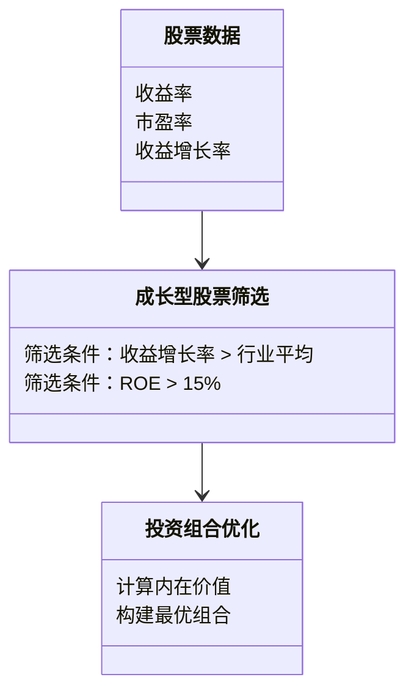

                 


# 菲利普·费雪的成长型股票投资策略

---

## 关键词  
菲利普·费雪, 成长型股票, 投资策略, 安全边际, 股票估值, 投资组合

---

## 摘要  
菲利普·费雪是价值投资领域的先驱者之一，他提出的成长型股票投资策略深刻影响了现代投资理念。本文将从费雪的成长型投资理念出发，详细分析其核心要素、数学模型、系统架构以及实际应用，帮助读者全面理解并掌握这一经典投资策略。  

---

# 第一部分: 菲利普·费雪的成长型股票投资策略概述

## 第1章: 成长型投资的定义与背景

### 1.1 成长型投资的定义  
成长型投资是一种长期投资策略，旨在通过投资于具有持续增长潜力的公司，实现资本的长期增值。与价值投资不同，成长型投资更关注公司的未来盈利能力，而非当前的市场估值。

#### 1.1.1 成长型投资的核心概念  
- 成长型投资的核心在于选择那些能够持续增长的公司。  
- 投资者需要关注公司的成长性指标，如收益增长率、营业利润率等。  

#### 1.1.2 成长型投资与价值投资的区别  
- 价值投资：寻找市场低估的公司，以低于内在价值的价格买入。  
- 成长型投资：寻找具有高增长潜力的公司，即使当前价格较高。  

#### 1.1.3 菲利普·费雪的成长型投资策略的起源  
菲利普·费雪是成长型投资的鼻祖，他在20世纪提出了“卓越企业”的概念，强调投资于那些具有强大竞争优势和持续增长能力的公司。

---

### 1.2 菲利普·费雪的投资理念  
菲利普·费雪的核心理念是：  
- **长期投资**：买入并持有优质股票，避免频繁交易。  
- **选择卓越企业**：投资于那些具有强大管理层、良好财务状况和高成长潜力的公司。  
- **安全边际**：确保买入价格低于公司的内在价值，以降低投资风险。  

---

### 1.3 成长型投资的适用场景  
- **高增长行业**：如科技、互联网、生物技术等行业的公司。  
- **经济周期的上升阶段**：成长型股票在经济繁荣期表现较好。  
- **长期投资者**：适合那些能够耐心等待投资成果的投资者。  

---

## 第2章: 菲利普·费雪策略的核心要素

### 2.1 公司质量的评估标准  
菲利普·费雪提出了“卓越企业”的概念，具体包括以下标准：  
- **管理层质量**：选择那些诚实、有能力的管理层。  
- **财务健康状况**：公司应具有稳定的盈利能力、低债务和健康的现金流。  
- **竞争优势**：公司应具备独特的竞争优势，如专利、品牌或技术壁垒。  

#### 2.1.1 费雪对管理层的信任与考察  
- 费雪认为，管理层的质量是决定公司能否持续成长的关键因素。  
- 投资者应通过公司财报、管理层 biography 等渠道，深入考察管理层的能力和诚信。  

#### 2.1.2 费雪对财务健康状况的要求  
- 公司应具有稳定的盈利能力，ROE（净资产收益率）应高于行业平均水平。  
- 公司的债务水平应合理，避免过度依赖债务融资。  

---

### 2.2 成长性的衡量指标  
成长型投资的核心在于选择具有高增长潜力的公司，因此需要关注以下指标：  
- **收益增长率**：公司过去几年的净利润增长率。  
- **营业利润率**：衡量公司盈利能力的强弱。  
- **ROE（净资产收益率）**：反映公司利用股东资金的效率。  

#### 2.2.1 费雪对收益增长率的关注  
- 费雪认为，收益增长率是衡量公司成长性的核心指标。  
- 通常，费雪会选择那些过去5年收益增长率超过行业平均水平的公司。  

---

### 2.3 投资安全边际的构建  
投资安全边际是费雪策略的重要组成部分，旨在降低投资风险。  
- **安全边际的定义**：买入价格低于公司内在价值的部分，即 $ \text{安全边际} = \text{内在价值} - \text{市场价格} $。  
- **安全边际的作用**：即使市场波动导致股价下跌，投资者仍能避免损失。  

---

## 第3章: 菲利普·费雪策略的数学模型与公式  

### 3.1 成长型股票的估值模型  
费雪提出了一个简单的估值公式：  
$$ \text{内在价值} = \frac{\text{当前收益} \times (1 + \text{收益增长率})}{\text{市盈率}} $$  
其中，收益增长率是影响内在价值的关键因素。  

#### 3.1.1 费雪估值公式的应用  
- 假设某公司当前收益为 $100万，收益增长率为 $10\%$，市盈率为 $15$，则其内在价值为：  
$$ V = \frac{100 \times (1 + 0.1)}{15} = 7.33 $$  

---

### 3.2 投资组合的优化模型  
为了实现投资组合的最优配置，费雪提出了以下方法：  
- **收益最大化**：选择具有高收益增长率的公司。  
- **风险控制**：通过分散投资降低组合风险。  

#### 3.2.1 费雪投资组合的数学表达式  
$$ R = \sum w_i \times r_i $$  
其中，$R$ 为投资组合的预期收益率，$w_i$ 为各股票的权重，$r_i$ 为各股票的预期收益率。  

---

## 第4章: 系统分析与架构设计方案  

### 4.1 项目介绍  
为了实现费雪策略的自动化，我们可以开发一个基于Python的投资分析系统，用于筛选成长型股票并构建投资组合。  

### 4.2 系统功能设计  
- **数据采集**：从金融数据库获取股票数据。  
- **成长性评估**：计算收益增长率、ROE等指标。  
- **估值模型**：根据费雪公式计算内在价值。  
- **投资组合优化**：基于数学模型构建最优组合。  

#### 4.2.1 领域模型（Mermaid 类图）  


---

## 第5章: 项目实战  

### 5.1 环境安装  
- 需要安装 Python、Pandas、NumPy、Matplotlib 等库。  

### 5.2 核心代码实现  
```python
import pandas as pd
import numpy as np

# 定义费雪成长型股票筛选函数
def fisher_growth_strategy(stock_data):
    # 筛选条件：收益增长率 > 行业平均
    growth_rate = stock_data['净利润增长率']
    industry_avg = growth_rate.mean()
    filtered = stock_data[growth_rate > industry_avg]
    
    # 计算内在价值
    current_profit = filtered['净利润']
    growth_rate = filtered['净利润增长率']
    pe_ratio = filtered['市盈率']
    intrinsic_value = current_profit * (1 + growth_rate) / pe_ratio
    
    return intrinsic_value

# 示例数据
stock_data = pd.DataFrame({
    '净利润': [100, 200, 150],
    '净利润增长率': [0.1, 0.05, 0.15],
    '市盈率': [15, 20, 10]
})

# 调用函数
intrinsic_value = fisher_growth_strategy(stock_data)
print("内在价值：", intrinsic_value)
```

---

## 第6章: 总结与展望  

### 6.1 本章小结  
菲利普·费雪的成长型投资策略强调选择具有高成长潜力的公司，并注重安全边际的构建。通过本文的分析，读者可以深入了解这一策略的核心要素和实际应用。  

### 6.2 投资注意事项  
- **风险控制**：即使成长型股票具有高增长潜力，也需要关注市场波动和公司基本面的变化。  
- **分散投资**：避免将所有资金投入到少数股票中，以降低风险。  

### 6.3 拓展阅读  
- 《The Intelligent Investor》（本杰明·格雷厄姆）：了解价值投资的基本原理。  
- 《成长股投资策略》（菲利普·费雪）：深入学习成长型投资的细节。  

---

通过本文的系统讲解，读者可以掌握菲利普·费雪的成长型股票投资策略，并将其应用于实际投资中。希望本文能为投资者提供有价值的参考和启发。

