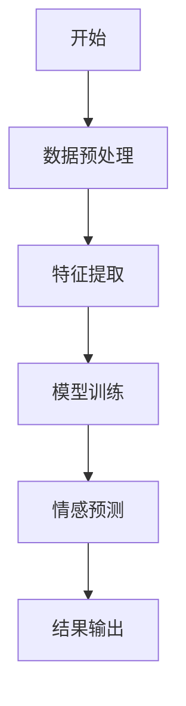
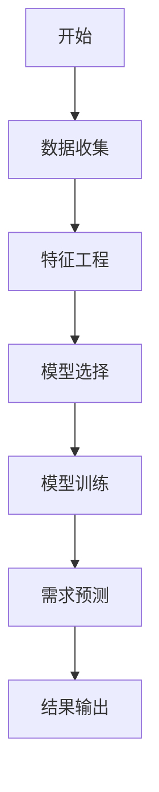
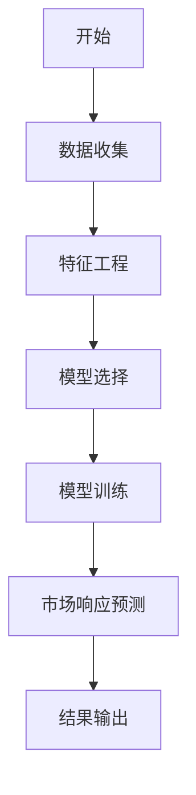
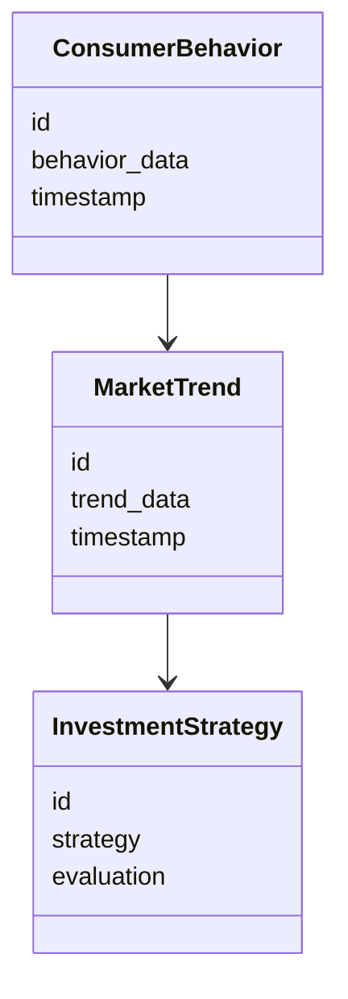
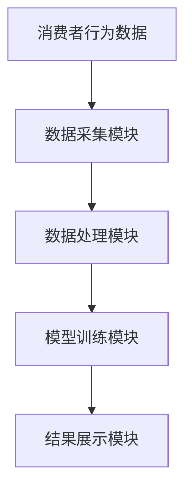
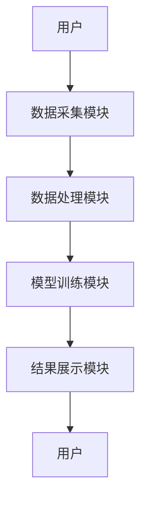

                 


# 菲利普·费雪的消费者行为研究在投资中的应用

> 关键词：菲利普·费雪，消费者行为，投资，价值投资，市场分析，行为驱动，投资策略

> 摘要：菲利普·费雪是价值投资领域的先驱，他提出的消费者行为研究方法为投资决策提供了全新的视角。本文通过系统性地分析消费者行为的核心概念、算法原理、系统架构及实际应用，探讨如何将消费者行为研究应用于投资领域，从而帮助投资者做出更加科学和精准的决策。

---

## 第一部分: 背景介绍

### 第1章: 消费者行为研究的定义与重要性

#### 1.1 消费者行为研究的定义
消费者行为研究是通过对消费者在市场中的决策过程、购买行为和消费习惯进行系统性分析，揭示消费者需求、动机和行为模式的科学。它涵盖了消费者在选择产品或服务时的理性与感性因素，包括心理、社会和文化等多方面的影响。

#### 1.2 消费者行为研究在投资中的重要性
在投资领域，消费者行为研究可以帮助投资者更好地理解市场的供需关系、行业趋势和企业的核心竞争力。通过分析消费者的偏好和行为模式，投资者可以更准确地预测市场走势，评估企业的长期价值，从而制定更加有效的投资策略。

#### 1.3 消费者行为研究与传统投资分析的区别
传统的投资分析主要依赖于财务数据、行业趋势和技术指标，而消费者行为研究则更加关注消费者的需求变化和行为模式。两者结合可以为投资者提供更加全面的分析视角。

---

### 第2章: 菲利普·费雪的消费者行为研究方法

#### 2.1 菲利普·费雪的消费者行为研究框架
菲利普·费雪提出了一套基于消费者行为研究的投资方法，主要包括以下几个步骤：
1. **消费者需求分析**：研究消费者对产品或服务的实际需求，包括功能性需求和情感需求。
2. **消费者决策模型**：构建消费者在购买决策中的心理和行为模型，分析影响消费者选择的关键因素。
3. **市场趋势预测**：通过消费者行为数据预测行业和市场的未来发展趋势。

#### 2.2 消费者行为研究的核心要素
菲利普·费雪的消费者行为研究方法强调以下几个核心要素：
- **需求驱动**：分析消费者的需求如何驱动市场和企业的增长。
- **行为预测**：通过消费者行为数据预测未来的市场变化。
- **价值评估**：结合消费者行为分析，评估企业的长期价值。

---

## 第二部分: 消费者行为研究的核心概念与联系

### 第3章: 消费者行为的核心概念与属性特征

#### 3.1 消费者行为的核心概念
消费者行为的核心概念包括以下几点：
- **需求与动机**：消费者购买产品或服务的根本原因是什么？
- **决策过程**：消费者在购买过程中经历了哪些阶段？
- **外部影响因素**：社会、文化和经济因素如何影响消费者行为？

#### 3.2 消费者行为的驱动因素对比

| 驱动因素 | 理性因素 | 感性因素 |
|----------|----------|----------|
| 需求     | 功能性需求 | 情感需求 |
| 选择     | 价格、质量 | 品牌、口碑 |
| 购买行为 | 理性决策 | 情感驱动 |

#### 3.3 消费者行为与投资的关系
通过消费者行为研究，投资者可以更好地理解市场的需求变化，预测行业的未来发展趋势，并评估企业的长期价值。

---

## 第三部分: 算法原理讲解

### 第4章: 消费者行为分析算法原理

#### 4.1 情感分析算法
情感分析算法用于分析消费者对产品或服务的情感倾向。常见的算法包括基于词袋模型的朴素贝叶斯算法和基于深度学习的LSTM模型。

##### 4.1.1 情感分析算法流程图（Mermaid）



##### 4.1.2 情感分析算法实现代码
```python
from sklearn.feature_extraction.text import TfidfVectorizer
from sklearn.naive_bayes import MultinomialNB

# 数据预处理
text_data = [...]  # 消费者评论数据
labels = [...]      # 情感标签（正面/负面）

# 特征提取
vectorizer = TfidfVectorizer()
X = vectorizer.fit_transform(text_data)

# 模型训练
model = MultinomialNB()
model.fit(X, labels)

# 情感预测
test_text = ["这是一个很好的产品"]
test_X = vectorizer.transform([test_text])
predicted_label = model.predict(test_X)
print(predicted_label)
```

#### 4.2 需求预测算法
需求预测算法基于历史销售数据和消费者行为数据，预测未来的市场需求。

##### 4.2.1 需求预测算法流程图（Mermaid）



##### 4.2.2 需求预测算法实现代码
```python
import pandas as pd
from sklearn.linear_model import LinearRegression

# 数据加载
data = pd.read_csv('consumer_behavior.csv')
X = data[['price', 'advertisement', 'consumer_affinity']]
y = data['demand']

# 模型训练
model = LinearRegression()
model.fit(X, y)

# 预测需求
new_data = pd.DataFrame({'price': [100], 'advertisement': [5], 'consumer_affinity': [0.8]})
predicted_demand = model.predict(new_data)
print(predicted_demand)
```

#### 4.3 市场响应模型
市场响应模型用于分析消费者行为对市场波动的响应。

##### 4.3.1 市场响应模型流程图（Mermaid）



##### 4.3.2 市场响应模型实现代码
```python
import numpy as np
from sklearn.tree import DecisionTreeRegressor

# 数据加载
data = pd.read_csv('market_response.csv')
X = data[['consumer_behavior', 'market_trend', 'economic_indicator']]
y = data['market_response']

# 模型训练
model = DecisionTreeRegressor()
model.fit(X, y)

# 市场响应预测
new_data = pd.DataFrame({'consumer_behavior': [0.7], 'market_trend': [1.5], 'economic_indicator': [2.3]})
predicted_response = model.predict(new_data)
print(predicted_response)
```

---

## 第四部分: 系统分析与架构设计

### 第5章: 系统功能设计与架构

#### 5.1 系统功能设计
- **数据采集模块**：收集消费者行为数据，包括评论、评分和购买记录。
- **数据处理模块**：对数据进行清洗和特征提取。
- **模型训练模块**：基于机器学习算法训练消费者行为分析模型。
- **结果展示模块**：将分析结果以可视化形式展示。

#### 5.2 系统架构设计

##### 5.2.1 领域模型类图（Mermaid）



##### 5.2.2 系统架构图（Mermaid）



#### 5.3 接口设计与交互流程图
- **接口设计**：定义RESTful API接口，用于数据的上传和模型的调用。
- **交互流程图**（Mermaid）



---

## 第五部分: 项目实战

### 第6章: 项目实现与案例分析

#### 6.1 环境安装与配置
- 安装Python和相关库（如scikit-learn、pandas、numpy）。
- 安装Mermaid和相关工具。

#### 6.2 核心代码实现
```python
# 消费者行为分析代码
import pandas as pd
from sklearn.ensemble import RandomForestClassifier

# 数据加载
data = pd.read_csv('consumer_behavior.csv')
X = data[['age', 'income', 'gender']]
y = data['purchase_intent']

# 模型训练
model = RandomForestClassifier()
model.fit(X, y)

# 预测消费者行为
new_data = pd.DataFrame({'age': [30], 'income': [50000], 'gender': ['M']})
predicted_intent = model.predict(new_data)
print(predicted_intent)
```

#### 6.3 案例分析与总结
通过一个实际案例，分析消费者行为数据如何影响投资决策。例如，分析某行业的消费者偏好变化，预测市场趋势，并制定相应的投资策略。

---

## 第六部分: 最佳实践与总结

### 第7章: 投资策略与注意事项

#### 7.1 投资策略建议
- **长期关注消费者行为**：消费者行为的变化往往预示着市场的长期趋势。
- **数据驱动决策**：利用消费者行为数据制定科学的投资策略。
- **持续学习与适应**：市场和消费者行为在不断变化，投资者需要持续学习和调整策略。

#### 7.2 注意事项
- **数据质量**：确保消费者行为数据的准确性和完整性。
- **模型局限性**：消费者行为模型无法完全预测市场的不确定性。
- **数据隐私**：在分析消费者行为数据时，需要注意数据隐私和合规性。

#### 7.3 小结
通过将菲利普·费雪的消费者行为研究方法应用于投资领域，投资者可以更好地理解市场和消费者需求，制定更加科学和精准的投资策略。然而，投资者也需要注意到数据隐私和模型局限性，合理结合其他分析方法，以实现最优的投资决策。

---

## 总结
菲利普·费雪的消费者行为研究为投资领域提供了全新的视角和方法。通过系统性地分析消费者行为的核心概念、算法原理、系统架构和实际应用，投资者可以更好地理解市场趋势和消费者需求，制定更加科学的投资策略。希望本文能够为投资者提供有价值的参考和启发。

