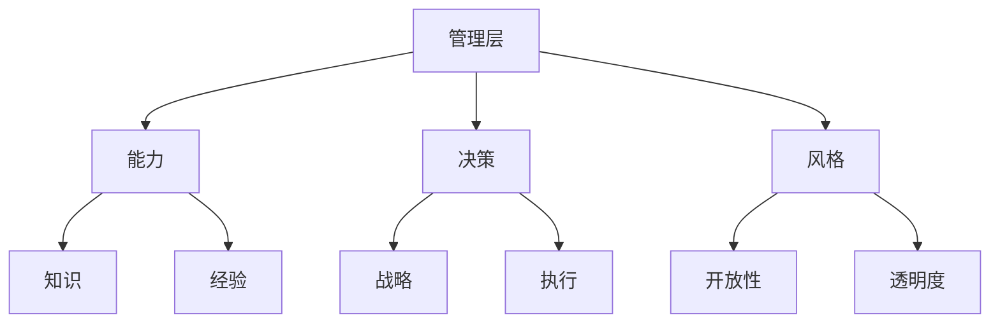
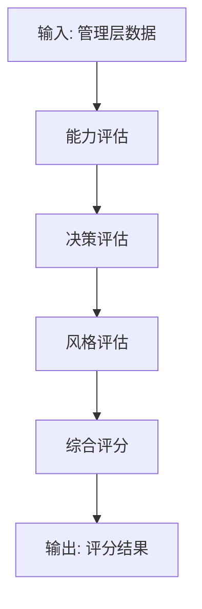
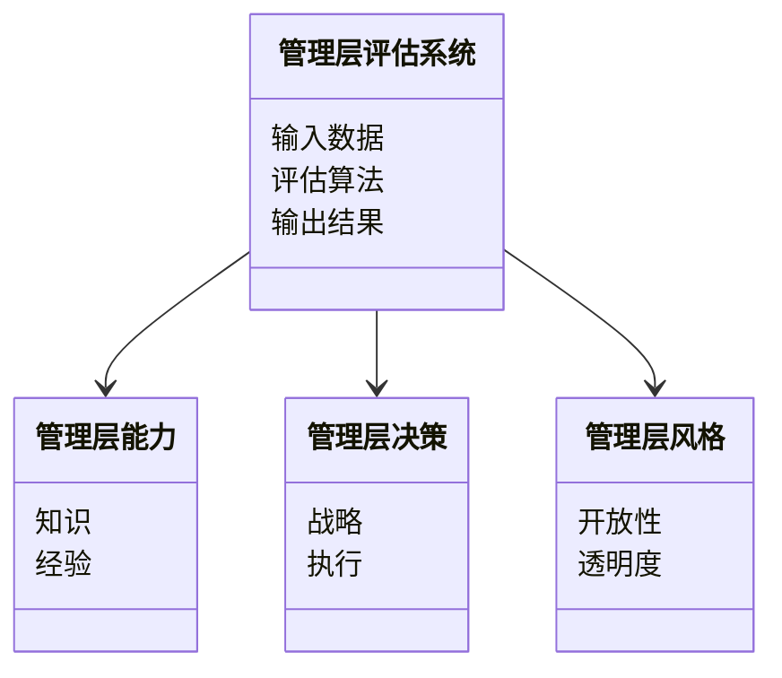

                 


# 菲利普·费雪的管理层质量评估标准

> 关键词：菲利普·费雪，管理层质量评估，投资哲学，管理能力，决策风格，价值投资

> 摘要：菲利普·费雪是价值投资领域的先驱，他提出的管理层质量评估标准在投资决策中具有重要地位。本文详细分析了菲利普·费雪的管理层质量评估标准，包括其核心概念、评估方法、数学模型、系统架构及实际应用案例，帮助投资者更好地理解和应用这一标准。

---

## 第一部分: 背景介绍

### 第1章: 背景介绍

#### 1.1 管理层质量评估的重要性
##### 1.1.1 什么是管理层质量评估
- 管理层质量评估是指对一个组织的管理层在能力、决策和风格等方面的综合评价。
- 通过评估管理层的质量，投资者可以更好地判断公司的长期发展潜力。

##### 1.1.2 管理层质量评估的意义
- 投资者需要评估管理层的能力和决策，以判断公司是否具备长期增长潜力。
- 管理层质量是公司价值的重要组成部分，影响公司的市场表现和投资回报。

##### 1.1.3 菲利普·费雪的管理思想背景
- 菲利普·费雪是价值投资的先驱，强调长期投资和管理层的重要性。
- 他认为，优秀的管理层是公司成功的关键因素。

#### 1.2 菲利普·费雪的管理理念
##### 1.2.1 菲利普·费雪的生平简介
- 菲利普·费雪（Philip Fisher）是20世纪的投资大师，被誉为“成长股之父”。
- 他提出了“成长股投资”理论，强调选择具有强大管理层和成长潜力的公司。

##### 1.2.2 菲利普·费雪的投资哲学
- 费雪认为，投资的本质是寻找具有持续增长潜力的公司。
- 他强调管理层的质量，认为优秀的管理层能够为公司创造长期价值。

##### 1.2.3 费雪评估标准的核心思想
- 费雪提出的管理层质量评估标准，旨在帮助投资者识别具有优秀管理层的公司。
- 他关注管理层的能力、决策和风格，认为这些因素共同决定了公司的长期表现。

---

## 第二部分: 核心概念与评估标准

### 第2章: 管理层质量评估的核心概念

#### 2.1 核心概念与定义
##### 2.1.1 管理层的定义
- 管理层是指负责公司战略制定和执行的高级管理人员，包括CEO、 CFO、COO等。

##### 2.1.2 管理层质量的定义
- 管理层质量是指管理层在能力、决策和风格等方面的综合表现。

##### 2.1.3 费雪评估标准的定义
- 费雪提出的管理层质量评估标准，包括能力、决策和风格三个维度。

#### 2.2 核心概念的属性特征对比
##### 2.2.1 管理层能力的特征对比
| 特征 | 能力强 | 能力弱 |
|------|--------|--------|
| 战略制定 | 高效 | 低效 |
| 执行能力 | 强 | 弱 |

##### 2.2.2 管理层决策的特征对比
| 特征 | 决策优 | 决策劣 |
|------|--------|--------|
| 战略决策 | 高瞻远瞩 | 短视 |
| 执行决策 | 准确 | 错误 |

##### 2.2.3 管理层风格的特征对比
| 特征 | 风格好 | 风格差 |
|------|--------|--------|
| 开放性 | 高 | 低 |
| 透明度 | 高 | 低 |

#### 2.3 ER实体关系图


---

## 第三部分: 评估标准的算法与模型

### 第3章: 评估标准的算法原理

#### 3.1 算法原理概述
##### 3.1.1 管理层质量评估的输入
- 管理层能力评分（A）
- 管理层决策评分（D）
- 管理层风格评分（S）

##### 3.1.2 算法的处理过程
- 综合评分 = （能力评分 + 决策评分 + 风格评分） / 3

##### 3.1.3 算法的输出结果
- 综合评分

#### 3.2 算法流程图


#### 3.3 算法实现代码
```python
def fisher_management_score(ability, decision, style):
    score = (ability + decision + style) / 3
    return score

# 示例输入
ability = 85
decision = 75
style = 90

# 计算评分
score = fisher_management_score(ability, decision, style)
print("管理层质量评分为:", score)
```

### 第4章: 数学模型与公式

#### 4.1 管理层质量评分公式
$$ \text{管理层质量评分} = \frac{A + D + S}{3} $$

其中：
- $A$ 表示管理层能力评分
- $D$ 表示管理层决策评分
- $S$ 表示管理层风格评分

#### 4.2 示例计算
$$ A = 85, D = 75, S = 90 $$
$$ \text{管理层质量评分} = \frac{85 + 75 + 90}{3} = 80 $$

---

## 第四部分: 系统分析与架构设计

### 第5章: 系统分析与架构设计

#### 5.1 问题场景介绍
- 投资者需要评估多个公司的管理层质量，以便做出投资决策。
- 通过系统化的评估标准，投资者可以快速筛选出具有优秀管理层的公司。

#### 5.2 系统功能设计
##### 5.2.1 领域模型（Mermaid类图）


#### 5.3 系统架构设计
##### 5.3.1 系统架构图（Mermaid架构图）


#### 5.4 系统接口设计
- 输入接口：接收管理层能力、决策和风格的评分。
- 输出接口：返回综合评分。

#### 5.5 系统交互设计（Mermaid序列图）
```mermaid
sequenceDiagram
    Client -> 管理层评估系统: 提供能力、决策和风格评分
    管理层评估系统 -> 计算综合评分
    管理层评估系统 -> Client: 返回综合评分
```

---

## 第五部分: 项目实战

### 第6章: 项目实战

#### 6.1 环境安装
- 安装Python和相关库（如numpy、pandas）。
- 安装Mermaid和系统设计工具。

#### 6.2 系统核心实现源代码
```python
class ManagementEvaluator:
    def __init__(self):
        self.abilities = []
        self.decisions = []
        self.styles = []

    def add_company(self, ability, decision, style):
        self.abilities.append(ability)
        self.decisions.append(decision)
        self.styles.append(style)

    def calculate_score(self):
        scores = []
        for a, d, s in zip(self.abilities, self.decisions, self.styles):
            score = (a + d + s) / 3
            scores.append(score)
        return scores

# 示例使用
evaluator = ManagementEvaluator()
evaluator.add_company(85, 75, 90)
evaluator.add_company(90, 80, 85)
scores = evaluator.calculate_score()
print("各公司的评分结果为:", scores)
```

#### 6.3 代码应用解读与分析
- 该代码定义了一个`ManagementEvaluator`类，用于评估多个公司的管理层质量。
- 使用`add_company`方法添加公司的能力、决策和风格评分。
- 使用`calculate_score`方法计算每个公司的综合评分。

#### 6.4 实际案例分析
- 案例：评估两家公司的管理层质量。
  - 公司A：能力85，决策75，风格90 → 综合评分80
  - 公司B：能力90，决策80，风格85 → 综合评分85
- 结论：公司B的管理层质量优于公司A。

#### 6.5 项目小结
- 通过系统化的评估方法，投资者可以快速筛选出具有优秀管理层的公司。
- 费雪的管理层质量评估标准为投资决策提供了重要参考。

---

## 第六部分: 最佳实践与总结

### 第7章: 最佳实践与总结

#### 7.1 最佳实践
- 投资者应定期评估公司管理层的质量，以确保投资决策的准确性。
- 结合其他评估指标（如财务指标、市场表现）进行综合分析。

#### 7.2 小结
- 菲利普·费雪的管理层质量评估标准为投资者提供了重要的参考。
- 通过系统化的评估方法，投资者可以更好地识别具有优秀管理层的公司。

#### 7.3 注意事项
- 管理层质量评估只是投资决策的一部分，需结合其他因素进行综合分析。
- 投资者应持续关注管理层的变化，以及时调整投资策略。

#### 7.4 拓展阅读
- 《投资中最简单的事》——菲利普·费雪
- 《价值投资入门》——格雷厄姆

---

## 附录

### 附录A: 术语表
- 管理层能力：包括知识和经验。
- 管理层决策：包括战略和执行。
- 管理层风格：包括开放性和透明度。

### 附录B: 参考文献
- 菲利普·费雪的相关著作。
- 其他相关的投资哲学书籍。

---

# 结语

菲利普·费雪的管理层质量评估标准为投资者提供了一种系统化的评估方法，帮助他们识别具有优秀管理层的公司。通过本文的详细分析和实际案例，读者可以更好地理解和应用这一标准，做出更明智的投资决策。

