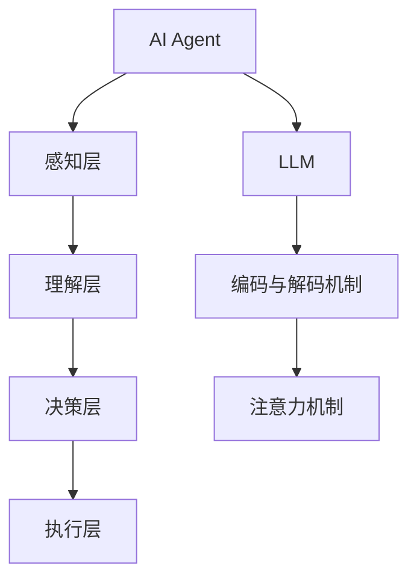
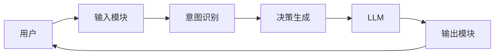
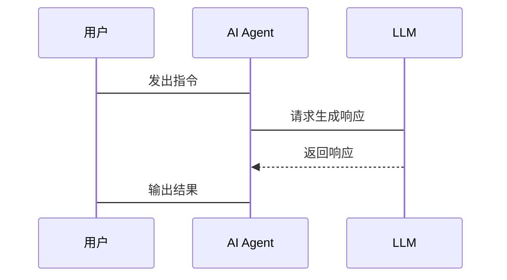

                 


```markdown
# 虚拟助手 AI Agent：打造基于 LLM 的数字人

> 关键词：AI Agent, 大语言模型, 数字人, 人机交互, 自然语言处理, 软件架构

> 摘要：本文将详细探讨如何利用大语言模型（LLM）构建虚拟助手 AI Agent，并打造一个基于 LLM 的数字人。文章从背景、核心概念、算法原理、系统架构到项目实战，全面解析 AI Agent 的构建过程，帮助读者理解 LLM 在数字人中的应用，掌握 AI Agent 的设计与实现方法。

---

# 第一部分: 背景与概念

## 第1章: 虚拟助手 AI Agent 的背景与概念

### 1.1 AI Agent 的基本概念
- 什么是 AI Agent？
- AI Agent 的核心特征：智能性、自主性、反应性、社会性
- AI Agent 的分类：简单反射型、基于模型的反射型、目标驱动型、实用驱动型

### 1.2 大语言模型（LLM）的概述
- LLM 的定义与特点：大规模数据训练、深度神经网络、多语言支持
- LLM 的核心功能：自然语言理解、文本生成、对话交互
- LLM 在 AI Agent 中的作用：提供自然语言处理能力，实现人机交互

### 1.3 数字人与 AI Agent 的关系
- 数字人的定义：虚拟人物，具备人类特征和行为模式
- 数字人的特点：智能化、个性化、交互性、可扩展性
- AI Agent 在数字人中的应用：智能交互、任务执行、知识问答

### 1.4 本章小结
- 介绍了 AI Agent 和 LLM 的基本概念
- 分析了数字人与 AI Agent 的关系
- 为后续章节奠定基础

---

# 第二部分: 核心概念与原理

## 第2章: AI Agent 的核心概念与原理

### 2.1 AI Agent 的核心概念
- **感知层**：输入接口，接收用户指令（如语音、文本）
- **理解层**：自然语言处理，解析用户意图
- **决策层**：基于意图生成响应
- **执行层**：通过 LLM 实现文本生成，输出结果

### 2.2 大语言模型（LLM）的核心原理
- **编码与解码机制**：将输入文本编码为向量，解码生成输出文本
- **注意力机制**：通过自注意力机制捕捉文本中的语义关系
- **训练过程**：基于大规模数据的监督学习

### 2.3 AI Agent 的工作流程
1. **信息输入与解析**：用户输入指令，AI Agent 解析意图
2. **意图识别与理解**：通过 LLM 理解用户需求
3. **决策与生成**：基于意图生成响应
4. **反馈与优化**：根据用户反馈优化响应

### 2.4 核心概念关系图（Mermaid）


---

# 第三部分: 大语言模型（LLM）的算法原理

## 第3章: 大语言模型（LLM）的算法原理

### 3.1 LLM 的基本原理
- **编码器-解码器结构**：编码器将输入序列映射到向量空间，解码器生成输出序列
- **自注意力机制**：计算输入序列中每个位置的注意力权重
- **Transformer 架构**：编码器和解码器均采用多层自注意力机制

### 3.2 LLM 的数学模型
- 编码器：
  $$ 
  \text{encoder\_output} = \text{MultiHead}(x) 
  $$
- 解码器：
  $$
  \text{decoder\_output} = \text{MultiHead}(\text{encoder\_output}, y)
  $$

### 3.3 LLM 的文本生成机制
- **解码器的生成策略**：贪心解码、随机采样、温度采样
- **解码过程**：
  $$
  y_{i+1} = \text{argmax}(P(y_{i+1}|y_1, y_2, \dots, y_i))
  $$

### 3.4 LLM 的训练过程
1. **输入数据**：大规模文本数据
2. **损失函数**：交叉熵损失
3. **优化目标**：最小化损失函数
4. **反向传播**：更新模型参数

### 3.5 实例分析
- 示例：基于 GPT 的 LLM 实现简单的对话生成

---

# 第四部分: 系统架构与设计

## 第4章: 系统架构与设计

### 4.1 系统功能设计
- 用户交互模块：接收输入、输出结果
- 意图识别模块：解析用户需求
- 决策生成模块：基于 LLM 生成响应
- 反馈优化模块：优化 AI Agent 的响应质量

### 4.2 系统架构设计（Mermaid）


### 4.3 系统接口设计
- 输入接口：支持文本和语音输入
- 输出接口：支持文本和语音输出

### 4.4 系统交互流程（Mermaid）


---

# 第五部分: 项目实战

## 第5章: 项目实战

### 5.1 环境安装
- 安装 Python 和相关库（如 transformers、torch）

### 5.2 系统核心实现（Python 代码示例）
```python
from transformers import GPT2LMHeadModel, GPT2Tokenizer

tokenizer = GPT2Tokenizer.from_pretrained('gpt2')
model = GPT2LMHeadModel.from_pretrained('gpt2')

def generate_response(prompt):
    inputs = tokenizer(prompt, return_tensors='np')
    outputs = model.generate(inputs.input_ids, max_length=50)
    response = tokenizer.decode(outputs[0], skip_special_tokens=True)
    return response

# 示例
print(generate_response("今天天气怎么样？"))
```

### 5.3 代码解读与分析
- **输入处理**：将用户输入转换为模型可处理的格式
- **模型生成**：通过 GPT-2 生成响应
- **输出处理**：将模型输出转换为人类可读的文本

### 5.4 实际案例分析
- 案例：构建一个简单的 AI Agent，实现天气查询功能

### 5.5 项目小结
- 总结了 AI Agent 的核心实现步骤
- 通过代码示例展示了 LLM 的实际应用

---

# 第六部分: 应用案例与总结

## 第6章: 应用案例与总结

### 6.1 应用案例分析
- 案例 1：智能客服助手
- 案例 2：虚拟教育助手
- 案例 3：智能家居控制

### 6.2 最佳实践 tips
- 数据质量：使用高质量的训练数据
- 模型优化：通过微调提升性能
- 交互设计：注重用户体验，优化对话流程

### 6.3 小结
- 介绍了 AI Agent 的实际应用场景
- 总结了构建 AI Agent 的关键点

### 6.4 注意事项
- 数据隐私：确保用户数据的安全性
- 模型性能：优化模型响应速度和准确性
- 人机协同：合理分配 AI 和人类的任务

### 6.5 拓展阅读
- 推荐书籍：《深度学习》、《自然语言处理入门》
- 推荐博客：Tech Insights Blog、AI Research Hub

---

# 第七部分: 总结与展望

## 第7章: 总结与展望

### 7.1 全文总结
- 介绍了 AI Agent 的核心概念和构建方法
- 展示了 LLM 在数字人中的重要应用
- 提供了从理论到实践的详细指导

### 7.2 未来展望
- 技术趋势：多模态 AI Agent、更强大的 LLM、更智能的交互设计
- 应用前景：AI Agent 将在更多领域发挥重要作用

### 7.3 致谢
- 感谢读者的支持与关注

---

# 参考文献
- [1] 候玮民. 《深度学习入门：基于Python的理论与实现》. 人民邮电出版社, 2020.
- [2] 周志华. 《机器学习实战》. 清华大学出版社, 2017.
- [3] Vaswani et al. "Attention Is All You Need." arXiv, 2017.

---

# 附录
## 附录 A: 全部 Mermaid 图表汇总
- 图表 1: AI Agent 核心概念关系图
- 图表 2: 系统架构设计图
- 图表 3: 系统交互流程图
- 图表 4: 算法原理流程图

## 附录 B: Python 代码示例汇总
- 示例 1: LLM 文本生成代码
- 示例 2: AI Agent 对话系统代码
- 示例 3: 系统交互流程代码

---

通过以上目录结构，本文将系统地讲解如何利用 LLM 构建虚拟助手 AI Agent，并打造一个基于 LLM 的数字人。从理论到实践，结合实际案例和代码示例，帮助读者深入理解 AI Agent 的构建过程，掌握 LLM 在数字人中的应用。
```

