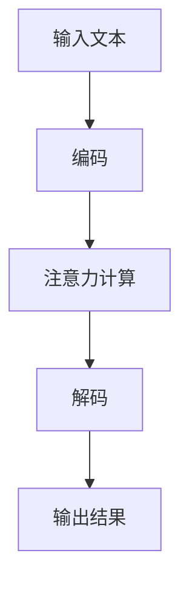
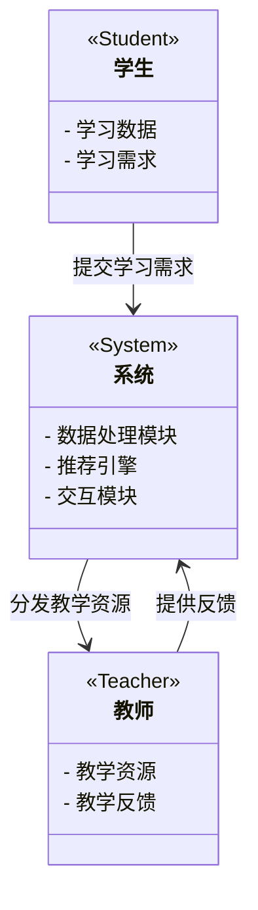

                 


# 目录大纲：《虚拟教师 AI Agent：LLM 驱动的个性化教育系统》

---

## 第一部分：虚拟教师 AI Agent 的背景与概念

### 第1章：背景介绍

#### 1.1 问题背景

- 1.1.1 传统教育模式的局限性
  - 班级规模限制
  - 教师资源分配不均
  - 学生个性化需求难以满足

- 1.1.2 人工智能在教育中的应用潜力
  - AI 在教育中的现状
  - LLM 的优势与独特性

- 1.1.3 虚拟教师 AI Agent 的概念提出
  - 定义与目标
  - 技术基础与实现路径

#### 1.2 问题描述

- 1.2.1 学生个性化学习需求
  - 学习风格差异
  - 知识掌握程度不一

- 1.2.2 教师资源分配的挑战
  - 教师工作量过大
  - 资源分配不均

- 1.2.3 当前教育技术的局限性
  - 系统智能化不足
  - 个性化支持缺乏

#### 1.3 问题解决与边界

- 1.3.1 虚拟教师 AI Agent 的解决方案
  - 提供个性化学习支持
  - 自动化教学资源管理

- 1.3.2 系统的边界与外延
  - 适用场景与限制
  - 与其他教育技术的协同

#### 1.4 核心概念与组成

- 1.4.1 核心概念
  - AI Agent 的定义与特征
  - LLM 的核心作用

- 1.4.2 系统组成
  - 学生数据采集模块
  - 个性化推荐引擎
  - 教学交互模块

---

## 第二部分：虚拟教师 AI Agent 的核心概念与联系

### 第2章：虚拟教师 AI Agent 的核心原理

#### 2.1 核心概念原理

- 2.1.1 AI Agent 的基本原理
  - 代理的定义与分类
  - 基于LLM 的代理实现

- 2.1.2 LLM 的核心机制
  - 大模型的训练与推理
  - 智能对话生成的原理

#### 2.2 核心概念对比分析

- 2.2.1 AI Agent 与传统教育软件的对比
  - 功能对比
  - 技术实现差异

- 2.2.2 不同 LLM 模型的性能对比
  - 参数规模
  - 对话质量

#### 2.3 ER 实体关系图

```mermaid
er
actor: 学生
actor: 教师
actor: 系统

学生 --> 学习需求
教师 --> 教学资源
系统 --> 个性化推荐
```

---

## 第三部分：虚拟教师 AI Agent 的算法原理

### 第3章：LLM 的算法原理

#### 3.1 算法原理概述

- 3.1.1 转换器模型的工作原理
  - 输入处理
  - 注意力机制
  - 输出生成

#### 3.2 注意力机制的数学模型

$$
\text{Attention}(Q, K, V) = \text{softmax}\left(\frac{QK^T}{\sqrt{d_k}}\right)V
$$

- 3.3 模型训练流程
  - 数据预处理
  - 模型训练
  - 超参数调优

#### 3.4 推理过程



---

## 第四部分：虚拟教师 AI Agent 的系统分析与架构设计

### 第4章：系统分析与架构设计

#### 4.1 系统架构概述

- 4.1.1 问题场景介绍
  - 学生学习过程中的问题
  - 教师教学中的挑战

- 4.1.2 系统功能设计
  - 数据采集与处理
  - 个性化推荐
  - 交互与反馈

#### 4.2 系统架构设计



---

## 第五部分：虚拟教师 AI Agent 的项目实战

### 第5章：项目实战

#### 5.1 环境安装

- 安装 Python
- 安装必要的库（如 transformers、numpy）

#### 5.2 核心功能实现

```python
from transformers import AutoTokenizer, AutoModelForCausalLM

tokenizer = AutoTokenizer.from_pretrained("gpt2")
model = AutoModelForCausalLM.from_pretrained("gpt2")

def generate_response(prompt):
    inputs = tokenizer(prompt, return_tensors="pt")
    outputs = model.generate(inputs.input_ids, max_length=50)
    response = tokenizer.decode(outputs[0], skip_special_tokens=True)
    return response
```

#### 5.3 代码解读与分析

- 代码实现细节
- 系统性能优化

#### 5.4 实际案例分析

- 案例一：学生 A 的学习情况
- 案例二：学生 B 的学习情况
- 对比分析

---

## 第六部分：虚拟教师 AI Agent 的应用与展望

### 第6章：应用案例与未来展望

#### 6.1 应用案例分析

- 案例一：K-12 教育中的应用
- 案例二：高等教育中的应用
- 案例三：职业教育中的应用

#### 6.2 未来展望

- 技术进步对系统的影响
- 教育模式的变革
- 用户需求的变化

---

## 第七部分：总结与最佳实践

### 第7章：总结与最佳实践

#### 7.1 小结

- 本书的核心内容回顾
- 关键点总结

#### 7.2 注意事项

- 使用中的常见问题
- 系统维护与优化

#### 7.3 拓展阅读

- 推荐的书籍与资源
- 进一步学习的方向

---

## 参考文献

（此处列出相关的技术文献、书籍和在线资源）

---

### 关键词：
- 虚拟教师
- AI Agent
- LLM
- 个性化教育系统
- 教育技术

---

### 摘要：
本书系统地介绍了虚拟教师 AI Agent 的概念、核心原理、算法实现、系统架构以及实际应用。通过结合大语言模型（LLM）的技术优势，本书详细探讨了如何构建一个智能化、个性化的教育系统，以解决传统教育模式中的诸多挑战。从理论到实践，本书为教育技术的研究者和实践者提供了全面的指导和参考。

