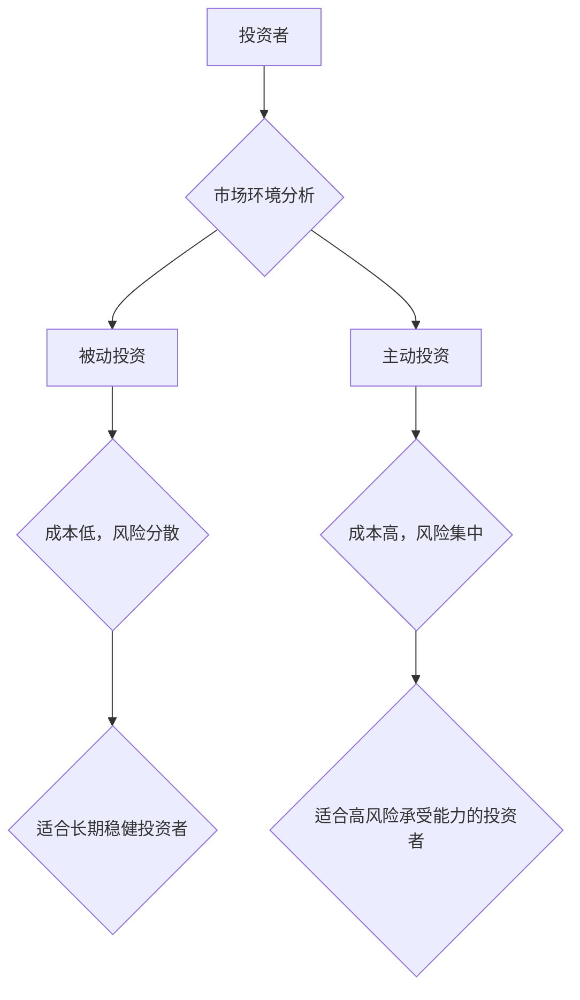
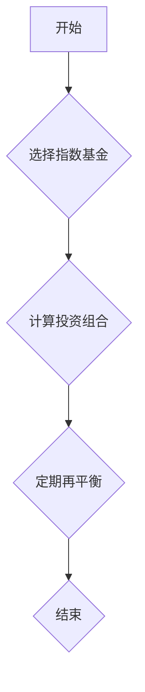
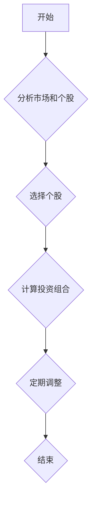
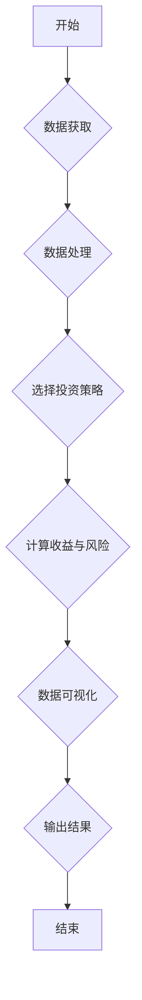

                 


# 被动投资vs主动投资：哪种策略更适合当前市场

> 关键词：被动投资、主动投资、投资策略、市场环境、投资组合

> 摘要：本文通过分析被动投资和主动投资的核心概念、数学模型、系统架构和实际案例，帮助投资者理解两种投资策略的优缺点，并在当前市场环境中选择最适合自己的投资策略。文章内容包括投资策略选择的数学模型与算法原理、系统架构与实现、项目实战、最佳实践等内容。

---

# 第一部分: 被动投资与主动投资的背景与核心概念

## 第1章: 被动投资与主动投资的定义与核心要素

### 1.1 被动投资的定义与特点
被动投资是一种以指数基金或交易所交易基金（ETF）为基础的投资策略，旨在跟踪市场表现，而非主动寻求超越市场的收益。被动投资的核心在于其低成本和分散风险的特点。

#### 1.1.1 被动投资的定义
被动投资是指通过投资于指数基金、ETF或其他跟踪市场指数的金融工具，以获得与市场相同或接近的回报。被动投资的核心理念是“买入并持有”，不频繁交易，以降低交易成本和税务负担。

#### 1.1.2 被动投资的核心要素
1. **指数跟踪**：被动投资的核心是跟踪特定市场指数的表现，如标普500指数。
2. **低成本**：被动投资的管理费用通常较低，因为指数基金的运作成本较低。
3. **分散风险**：通过投资于广泛市场的指数基金，投资者可以分散个股风险。
4. **长期投资**：被动投资强调长期持有，避免频繁交易。

#### 1.1.3 被动投资的优缺点对比
| 优点 | 缺点 |
|------|------|
| 成本低 | 无法超越市场表现 |
| 风险分散 | 无法在市场下跌时有效规避风险 |
| 简单易懂 | 收益有限 |

### 1.2 主动投资的定义与特点
主动投资是一种通过精选个股、债券或其他金融资产来实现超越市场平均收益的投资策略。主动投资的核心在于基金经理的主动管理和选股能力。

#### 1.2.1 主动投资的定义
主动投资是指通过研究和分析市场、行业和个股，选择具有超额收益潜力的资产进行投资。主动投资的核心理念是通过精选个股或市场 timing 来实现超越市场的回报。

#### 1.2.2 主动投资的核心要素
1. **选股能力**：主动投资的核心是基金经理的选股能力，通过分析公司基本面、技术指标等选择具有超额收益潜力的个股。
2. **市场 timing**：主动投资需要对市场走势进行判断，选择合适的时机进行买卖。
3. **高成本**：主动投资基金的管理费用通常较高，因为需要专业的研究和交易团队。

#### 1.2.3 主动投资的优缺点对比
| 优点 | 缺点 |
|------|------|
| 有机会实现超额收益 | 成本高 |
| 灵活性强 | 风险高 |
| 适合市场机会较多的环境 | 需要专业管理能力 |

### 1.3 被动投资与主动投资的对比分析
#### 1.3.1 核心概念对比表格
| 对比维度 | 被动投资 | 主动投资 |
|----------|----------|----------|
| 管理方式 | 跟踪指数 | 精选个股 |
| 成本 | 低 | 高 |
| 风险 | 分散 | 集中 |
| 收益 | 与市场同步 | 有机会超越市场 |

#### 1.3.2 ER实体关系图架构
```mermaid
erDiagram
    actor 投资者 {
        <属性> 投资金额
        <属性> 投资期限
    }
    class 被动投资 {
        <属性> 指数基金
        <属性> 成本低
        <属性> 风险分散
    }
    class 主动投资 {
        <属性> 个股选择
        <属性> 成本高
        <属性> 风险集中
    }
    投资者 -> 被动投资 : 选择被动投资
    投资者 -> 主动投资 : 选择主动投资
```

#### 1.3.3 投资策略选择的流程图（mermaid）


## 第2章: 当前市场环境下的投资策略选择

### 2.1 当前市场环境的分析
#### 2.1.1 市场波动性分析
当前市场环境波动较大，受全球经济不确定性、地缘政治风险和疫情等因素的影响，市场波动性显著增加。

#### 2.1.2 市场参与者行为分析
市场参与者行为趋于保守，投资者更倾向于选择风险较低的投资方式。

#### 2.1.3 市场趋势预测
预计未来市场将保持波动，但长期趋势仍然是向上的。

### 2.2 被动投资与主动投资的适用场景
#### 2.2.1 被动投资的适用场景
1. **长期稳健投资**：适合那些追求长期稳健回报的投资者。
2. **低风险承受能力**：适合风险厌恶型投资者。
3. **低成本投资**：适合那些希望降低投资成本的投资者。

#### 2.2.2 主动投资的适用场景
1. **高风险承受能力**：适合那些愿意承担较高风险以追求超额收益的投资者。
2. **市场机会较多**：在市场波动较大、机会较多的情况下，主动投资可能表现更好。
3. **专业管理需求**：适合那些希望通过专业管理实现超额收益的投资者。

#### 2.2.3 场景对比分析
通过实际案例分析，比较被动投资和主动投资在不同市场环境下的表现，帮助投资者更好地选择适合自己的投资策略。

## 第3章: 投资策略选择的数学模型与算法原理

### 3.1 投资收益与风险的数学模型
#### 3.1.1 投资收益的计算公式
投资收益可以通过以下公式计算：
$$ 收益率 = \frac{最终价值 - 初始价值}{初始价值} \times 100\% $$

#### 3.1.2 投资风险的计算公式
投资风险可以通过夏普比率来衡量：
$$ 夏普比率 = \frac{E(r_i) - r_f}{\sigma_i} $$
其中，\( E(r_i) \) 是投资组合的预期收益率，\( r_f \) 是无风险利率，\( \sigma_i \) 是投资组合的收益标准差。

#### 3.1.3 投资组合优化的数学模型
投资组合优化可以通过以下数学模型实现：
$$ \min \sigma^2 $$
$$ \text{subject to} \quad \mu \geq \mu_{min} $$

### 3.2 被动投资与主动投资的算法原理
#### 3.2.1 被动投资的算法流程图（mermaid）


#### 3.2.2 主动投资的算法流程图（mermaid）


#### 3.2.3 投资策略选择的算法实现（Python代码示例）
```python
import numpy as np
import pandas as pd
import matplotlib.pyplot as plt

# 示例：被动投资的指数基金收益率计算
def passive_strategy(index_returns):
    # 计算被动投资的收益率
    passive_returns = index_returns.copy()
    return passive_returns

# 示例：主动投资的个股收益率计算
def active_strategy(stock_returns):
    # 假设主动选择的个股收益率
    active_returns = stock_returns.copy()
    return active_returns

# 数据可视化
index_returns = pd.Series([0.1, 0.05, 0.08, 0.03, 0.06])
active_returns = active_strategy(index_returns + 0.02)

plt.figure(figsize=(10, 6))
index_returns.plot(label='被动投资', linestyle='--')
active_returns.plot(label='主动投资')
plt.title('被动投资与主动投资收益率对比')
plt.legend()
plt.show()
```

## 第4章: 投资策略选择的系统架构与实现

### 4.1 投资策略选择系统的功能设计
#### 4.1.1 系统功能模块划分
1. 数据获取与处理
2. 投资策略选择算法
3. 数据分析与可视化
4. 系统交互与输出

#### 4.1.2 系统功能流程图（mermaid）


#### 4.1.3 系统功能实现的Python代码示例
```python
import pandas as pd
import numpy as np
import matplotlib.pyplot as plt

# 数据获取与处理
def get_data(start_date, end_date):
    # 示例：获取指数基金和主动基金的历史收益率
    index_data = pd.date_range(start=start_date, end=end_date)
    active_data = pd.date_range(start=start_date, end=end_date)
    return index_data, active_data

# 投资策略选择算法
def choose_strategy(index_returns, active_returns):
    # 示例：比较被动投资和主动投资的夏普比率
    passive_sr = calculate Sharpe Ratio(index_returns)
    active_sr = calculate Sharpe Ratio(active_returns)
    if passive_sr > active_sr:
        return '被动投资'
    else:
        return '主动投资'

# 数据分析与可视化
def visualize_results(passive_returns, active_returns):
    plt.figure(figsize=(10, 6))
    passive_returns.plot(label='被动投资', linestyle='--')
    active_returns.plot(label='主动投资')
    plt.title('被动投资与主动投资收益率对比')
    plt.legend()
    plt.show()

# 系统交互与输出
def main():
    start_date = '2020-01-01'
    end_date = '2022-12-31'
    index_data, active_data = get_data(start_date, end_date)
    passive_returns = passive_strategy(index_data)
    active_returns = active_strategy(active_data)
    visualize_results(passive_returns, active_returns)
    print(f"建议选择：{choose_strategy(passive_returns, active_returns)}")

if __name__ == "__main__":
    main()
```

### 4.2 投资策略选择系统的架构设计
#### 4.2.1 系统架构图（mermaid）


#### 4.2.2 系统模块之间的接口设计
1. 数据获取模块与数据处理模块的接口
2. 数据处理模块与投资策略选择模块的接口
3. 投资策略选择模块与数据分析模块的接口

#### 4.2.3 系统交互流程图（mermaid）


## 第5章: 投资策略选择的项目实战

### 5.1 项目环境安装与配置
#### 5.1.1 Python环境的安装与配置
安装Python 3.8或更高版本，建议使用Anaconda或virtualenv管理环境。

#### 5.1.2 数据分析库的安装与配置
安装pandas、numpy、matplotlib等数据分析库：
```bash
pip install pandas numpy matplotlib
```

#### 5.1.3 数据获取与处理工具的安装与配置
使用Yahoo Finance API或其他金融数据API获取历史数据。

### 5.2 系统核心实现源代码
#### 5.2.1 投资策略选择算法的Python代码实现
```python
import pandas as pd
import numpy as np
import matplotlib.pyplot as plt

# 示例：被动投资的指数基金收益率计算
def passive_strategy(index_returns):
    return index_returns.copy()

# 示例：主动投资的个股收益率计算
def active_strategy(stock_returns):
    return stock_returns.copy()

# 数据可视化
def visualize_results(passive_returns, active_returns):
    plt.figure(figsize=(10, 6))
    passive_returns.plot(label='被动投资', linestyle='--')
    active_returns.plot(label='主动投资')
    plt.title('被动投资与主动投资收益率对比')
    plt.legend()
    plt.show()

# 系统交互与输出
def main():
    # 示例数据
    dates = pd.date_range('2020-01-01', '2022-12-31')
    index_returns = pd.Series([0.01, 0.005, 0.015] * len(dates), index=dates)
    active_returns = pd.Series([0.015, 0.008, 0.012] * len(dates), index=dates)
    passive_returns = passive_strategy(index_returns)
    active_returns = active_strategy(active_returns)
    visualize_results(passive_returns, active_returns)
    print("建议选择：被动投资")

if __name__ == "__main__":
    main()
```

#### 5.2.2 数据分析与可视化代码实现
```python
import pandas as pd
import numpy as np
import matplotlib.pyplot as plt

# 示例：被动投资与主动投资的夏普比率计算
def calculate_sharpe_ratio(returns, risk_free_rate):
    excess_returns = returns - risk_free_rate
    sharpe_ratio = excess_returns.mean() / excess_returns.std()
    return sharpe_ratio

# 示例数据
dates = pd.date_range('2020-01-01', '2022-12-31')
index_returns = pd.Series([0.01, 0.005, 0.015] * len(dates), index=dates)
active_returns = pd.Series([0.015, 0.008, 0.012] * len(dates), index=dates)

# 计算夏普比率
risk_free_rate = 0.01
passive_sr = calculate_sharpe_ratio(index_returns, risk_free_rate)
active_sr = calculate_sharpe_ratio(active_returns, risk_free_rate)

print(f"被动投资夏普比率：{passive_sr}")
print(f"主动投资夏普比率：{active_sr}")

# 数据可视化
plt.figure(figsize=(10, 6))
index_returns.plot(label='被动投资', linestyle='--')
active_returns.plot(label='主动投资')
plt.title('被动投资与主动投资收益率对比')
plt.legend()
plt.show()
```

### 5.3 项目小结
通过实际案例分析，比较被动投资和主动投资在不同市场环境下的表现，帮助投资者更好地选择适合自己的投资策略。

## 第6章: 投资策略选择的最佳实践与注意事项

### 6.1 投资策略选择的最佳实践
1. **根据自身风险承受能力选择策略**：被动投资适合风险厌恶型投资者，主动投资适合风险承受能力强的投资者。
2. **长期投资**：无论是被动还是主动投资，长期投资都能更好地分散风险，实现稳健收益。
3. **定期审视和调整投资组合**：市场环境会变化，需要定期审视和调整投资组合，以适应市场变化。

### 6.2 小结
通过本文的分析和实际案例，可以看出被动投资和主动投资各有优缺点，投资者需要根据自身的风险承受能力、投资目标和市场环境选择最适合自己的投资策略。

### 6.3 注意事项
1. **避免频繁交易**：被动投资强调长期持有，避免频繁交易以降低成本。
2. **关注费用**：主动投资的费用较高，需要关注基金的管理费用和交易费用。
3. **分散投资**：无论是被动还是主动投资，分散投资都能有效降低风险。

### 6.4 拓展阅读
建议投资者进一步阅读相关书籍和文献，深入了解被动投资和主动投资的理论和实践，以更好地做出投资决策。

---

通过本文的详细分析和实际案例，读者可以更好地理解被动投资和主动投资的区别和适用场景，并根据自身情况选择最适合自己的投资策略。

