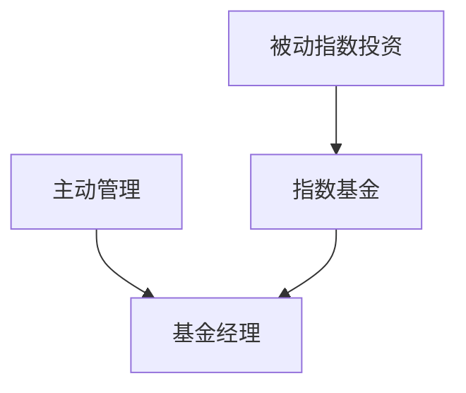
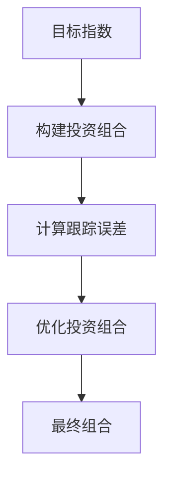
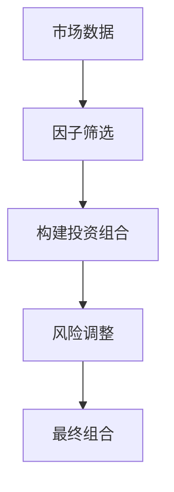
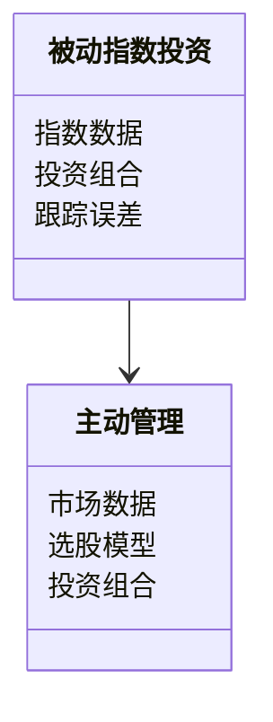
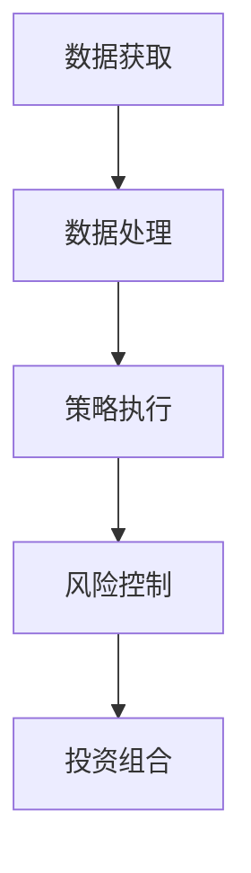

                 


# 被动指数投资 vs 主动管理：哪种更适合当前市场环境

## 关键词

- 被动指数投资
- 主动管理
- 投资策略
- 市场环境
- 优缺点对比

## 摘要

在当前金融市场环境下，被动指数投资和主动管理两种策略各有优劣。被动指数投资以低成本和分散风险著称，而主动管理则试图通过精选个股获取超额收益。本文将深入分析两者的核心概念、算法原理、系统架构，并通过实际案例对比，探讨在不同市场环境下哪种策略更具优势。

---

# 第一部分：被动指数投资与主动管理的背景介绍

## 第1章：被动指数投资与主动管理概述

### 1.1 被动指数投资的定义与特点

#### 1.1.1 被动投资的基本概念

被动投资是一种以指数基金为代表的长期投资策略，旨在复制特定市场指数的表现。其核心理念是“买入并持有”，通过分散投资降低风险。

#### 1.1.2 指数基金的运作机制

指数基金通过跟踪市场指数（如标普500）来构建投资组合，避免频繁交易，从而降低管理费用和交易成本。

#### 1.1.3 被动投资的成本优势

被动投资的管理费用较低，通常远低于主动管理型基金，适合长期投资。

### 1.2 主动管理的定义与特点

#### 1.2.1 主动投资的基本概念

主动投资通过基金经理的选股和市场时机选择，试图超越市场基准指数的表现。

#### 1.2.2 基金经理的角色与作用

基金经理负责分析市场趋势，精选个股，构建投资组合，追求超额收益。

#### 1.2.3 主动投资的风险与收益

主动管理可能带来更高的收益，但同时也伴随着较高的风险和费用。

### 1.3 被动与主动投资的对比

#### 1.3.1 投资目标的差异

被动投资追求与市场持平，而主动投资则寻求超越市场。

#### 1.3.2 风险与收益的权衡

被动投资风险较低，收益稳定；主动投资风险较高，但潜在收益更大。

---

## 第2章：被动与主动投资的核心概念对比

### 2.1 对比分析表格

| **对比维度** | **被动指数投资** | **主动管理** |
|--------------|------------------|--------------|
| 管理方式      | 跟踪指数          | 主动选股      |
| 成本          | 低               | 高           |
| 风险          | 分散             | 较高         |
| 收益          | 稳定             | 有机会超额   |

### 2.2 实体关系图



---

## 第3章：被动指数投资与主动管理的算法原理

### 3.1 被动指数投资的算法原理

#### 3.1.1 指数复制策略

通过最小化跟踪误差来复制目标指数的表现。

数学公式：
$$ \text{跟踪误差} = \text{基金收益} - \text{指数收益} $$

流程图：


### 3.2 主动管理的算法原理

#### 3.2.1 选股模型

使用多因子模型筛选股票。

数学公式：
$$ R_i = \alpha + \beta R_m + \sum \gamma_j F_j + \epsilon $$

流程图：


---

## 第4章：系统分析与架构设计

### 4.1 问题场景介绍

构建一个投资决策支持系统，帮助投资者选择被动或主动策略。

### 4.2 领域模型设计



### 4.3 系统架构设计



---

## 第5章：项目实战

### 5.1 环境安装

安装Python和相关库（pandas, numpy, yfinance）。

### 5.2 核心代码实现

#### 被动指数投资代码

```python
import pandas as pd
import yfinance as yf

# 下载指数数据
index_data = yf.download('^SP500', start='2020-01-01', end='2023-12-31')

# 计算指数收益
index_returns = index_data['Close'].pct_change().dropna()
```

#### 主动管理代码

```python
import pandas as pd
import yfinance as yf

# 下载多只股票数据
tickers = ['AAPL', 'MSFT', 'GOOGL']
data = yf.download(tickers, start='2020-01-01', end='2023-12-31')

# 计算个股收益
returns = data['Close'].pct_change().dropna().iloc[:, 0]
```

### 5.3 案例分析

分析指数基金与主动管理基金在不同市场环境下的表现。

---

## 第6章：最佳实践

### 6.1 选择策略的考虑因素

- 市场波动性
- 管理费用
- 投资期限

### 6.2 小结

在市场波动较大时，被动指数投资更具优势；而在市场机会较多时，主动管理可能表现更优。

### 6.3 注意事项

- 定期评估投资策略
- 考虑税收和交易成本
- 分散投资以降低风险

### 6.4 拓展阅读

建议阅读《指数投资策略》和《主动投资管理》相关书籍。

---

通过以上分析，我们可以看出，被动指数投资和主动管理各有优劣，投资者应根据自身需求和市场环境选择适合的策略。

