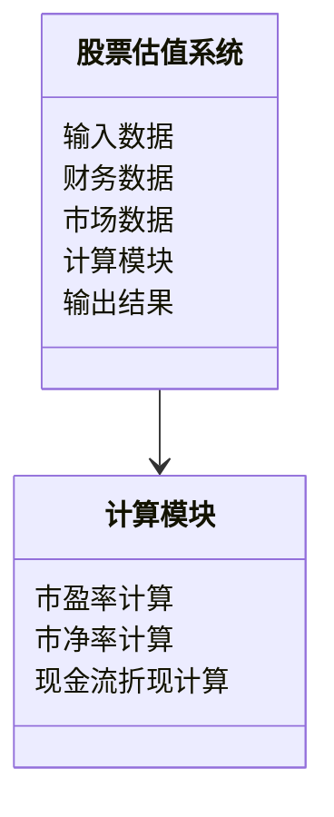
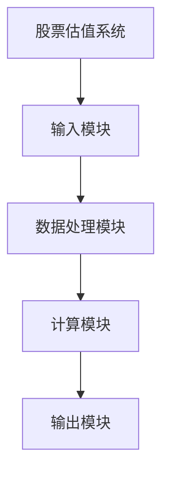

                 


# 西班牙股市估值：南欧经济体的投资机会

> 关键词：西班牙股市，股市估值，南欧经济，投资机会，市盈率，市净率，现金流折现模型

> 摘要：本文详细分析了西班牙股市的估值方法和投资机会，探讨了南欧经济对西班牙股市的影响，并通过实际案例展示了如何利用市盈率、市净率和现金流折现模型进行股市估值。

---

## 第一部分：西班牙股市估值的背景与现状

### 第1章：西班牙股市的现状与特点

#### 1.1 西班牙股市的背景介绍

##### 1.1.1 西班牙股市的发展历程
西班牙股市（Ibex 35）是西班牙最重要的股票指数，涵盖西班牙最具代表性的35家上市公司。自1991年创立以来，西班牙股市经历了多次经济波动，但整体呈现出稳定增长的趋势。

##### 1.1.2 西班牙股市的行业结构
西班牙股市主要涵盖金融、能源、工业和科技等行业。其中，金融行业占比较大，能源行业受国际油价影响显著，而科技行业则展现了较高的增长潜力。

##### 1.1.3 西班牙股市的竞争格局
西班牙股市的主要竞争对手包括其他欧洲股市，如德国的DAX指数和法国的CAC 40指数。这些市场的竞争促使西班牙股市不断优化自身的结构和监管体系。

#### 1.2 南欧经济的背景与特点

##### 1.2.1 南欧经济的整体情况
南欧经济包括西班牙、葡萄牙、意大利和希腊等国家。这些国家的经济受全球经济波动影响较大，但也具备较高的增长潜力。

##### 1.2.2 南欧经济的主要行业
南欧经济主要依赖于制造业、旅游业和农业。西班牙作为南欧的重要成员国，在这些行业中占据重要地位。

##### 1.2.3 南欧经济与西班牙股市的关系
南欧经济的波动直接影响西班牙股市的表现。例如，旅游业的兴衰会影响酒店和航空公司的股价。

#### 1.3 西班牙股市的主要影响因素

##### 1.3.1 经济周期的影响
经济周期对股市的影响是最显著的。在经济扩张期，股市通常表现良好；而在衰退期，股市则会下跌。

##### 1.3.2 政治环境的影响
西班牙的政治稳定性对股市有直接影响。政治动荡可能导致投资者信心下降，进而影响股市表现。

##### 1.3.3 国际市场的联动效应
作为欧洲的重要组成部分，西班牙股市与国际市场的联动效应显著。全球市场的波动会影响投资者对西班牙股市的预期。

---

### 第2章：西班牙股市估值的核心概念

#### 2.1 股市估值的基本定义

##### 2.1.1 股市估值的定义
股市估值是指通过对公司财务数据和市场情况进行分析，评估其股票的合理价格范围。

##### 2.1.2 股市估值的核心要素
股市估值的核心要素包括市盈率（PE）、市净率（PB）、股息率（Dividend Yield）和现金流折现模型（DCF）。

##### 2.1.3 股市估值的分类与特点
股市估值主要分为相对估值法和绝对估值法。相对估值法包括市盈率和市净率，而绝对估值法则包括现金流折现模型。

---

### 第3章：西班牙股市估值的核心算法原理

#### 3.1 市盈率（PE）模型的算法原理

##### 3.1.1 PE模型的定义与公式
$$PE = \frac{Price}{Earnings}$$
其中，Price为股票价格，Earnings为每股收益。

##### 3.1.2 PE模型的计算步骤
1. 收集目标公司的股价和每股收益数据。
2. 计算市盈率。
3. 与行业平均水平进行比较，判断股票是否被高估或低估。

##### 3.1.3 PE模型的优缺点
- 优点：简单易懂，数据容易获取。
- 缺点：受公司规模和行业特性的影响较大，且忽略了公司的财务杠杆和资本结构。

#### 3.2 市净率（PB）模型的算法原理

##### 3.2.1 PB模型的定义与公式
$$PB = \frac{Price}{Book\ Value}$$
其中，Price为股票价格，Book Value为每股账面价值。

##### 3.2.2 PB模型的计算步骤
1. 收集目标公司的股价和每股账面价值。
2. 计算市净率。
3. 与行业平均水平进行比较，判断股票是否被高估或低估。

##### 3.2.3 PB模型的优缺点
- 优点：适用于金融和房地产等资产密集型行业。
- 缺点：忽略了公司的盈利能力，且在公司亏损时可能无法适用。

#### 3.3 现金流折现模型（DCF）的算法原理

##### 3.3.1 DCF模型的定义与公式
$$DCF = \frac{CF_1 + CF_2 + \cdots + CF_n}{(1 + r)^n}$$
其中，CF为每年的现金流，r为折现率，n为现金流的时间跨度。

##### 3.3.2 DCF模型的计算步骤
1. 预测未来几年的现金流。
2. 选择合适的折现率。
3. 计算未来现金流的现值。
4. 计算目标公司的内在价值。

##### 3.3.3 DCF模型的优缺点
- 优点：考虑了公司的未来现金流，能够评估公司的内在价值。
- 缺点：预测现金流和折现率存在较大的主观性，计算复杂。

---

## 第4章：西班牙股市估值的系统分析与架构设计

### 4.1 系统功能设计

#### 4.1.1 股票估值系统
- 输入：目标公司的财务数据和市场数据。
- 输出：股票的估值结果。

#### 4.1.2 数据流分析
- 数据输入：财务报表、市场数据。
- 数据处理：计算市盈率、市净率和现金流折现值。
- 数据输出：估值结果。

### 4.2 系统架构设计

#### 4.2.1 类图设计


#### 4.2.2 架构图设计


---

## 第5章：西班牙股市估值的项目实战

### 5.1 环境安装

#### 5.1.1 Python环境
安装Python和必要的库（如Pandas、NumPy）。

#### 5.1.2 数据获取
使用Yahoo Finance API获取西班牙股市的数据。

### 5.2 核心实现

#### 5.2.1 市盈率模型
```python
import pandas as pd

def calculate_pe(price, earnings):
    return price / earnings

# 示例数据
data = {
    'Price': [100, 200, 300],
    'Earnings': [10, 20, 30]
}
df = pd.DataFrame(data)
pe = calculate_pe(df['Price'], df['Earnings'])
print(pe)
```

#### 5.2.2 市净率模型
```python
import pandas as pd

def calculate_pb(price, book_value):
    return price / book_value

data = {
    'Price': [100, 200, 300],
    'Book Value': [50, 100, 150]
}
df = pd.DataFrame(data)
pb = calculate_pb(df['Price'], df['Book Value'])
print(pb)
```

#### 5.2.3 现金流折现模型
```python
import pandas as pd

def calculate_dcf(cash_flows, discount_rate):
    n = len(cash_flows)
    return sum(cash_flows[i] / (1 + discount_rate) ** i for i in range(n))

# 示例数据
cash_flows = [100, 200, 300]
discount_rate = 0.1
dcf = calculate_dcf(cash_flows, discount_rate)
print(dcf)
```

### 5.3 案例分析

#### 5.3.1 股票选择
选择西班牙股市中的某家银行进行分析。

#### 5.3.2 数据分析
使用上述模型计算该银行的市盈率、市净率和现金流折现值。

#### 5.3.3 结果解读
根据计算结果，判断该银行股票是否被高估或低估。

### 5.4 项目小结

通过项目实战，我们掌握了西班牙股市估值的核心方法，并能够实际应用这些方法进行股票分析。

---

## 第6章：总结与展望

### 6.1 最佳实践

#### 6.1.1 估值方法的选择
根据公司的行业特性和财务数据选择合适的估值方法。

#### 6.1.2 数据来源的可靠性
确保数据来源可靠，避免因数据错误导致估值偏差。

#### 6.1.3 定期复盘
定期对投资组合进行复盘，及时调整投资策略。

### 6.2 小结

通过本文的学习，我们了解了西班牙股市估值的核心方法，并掌握了如何利用这些方法进行投资分析。

### 6.3 注意事项

- 投资有风险，入市需谨慎。
- 估值结果仅供参考，需结合实际情况进行判断。

### 6.4 拓展阅读

- 《投资学》
- 《股票估值方法》
- 《西班牙经济分析》

---

通过以上分析，我们可以看到西班牙股市估值是一个复杂但有趣的过程。掌握这些方法后，投资者可以更好地把握南欧经济体的投资机会。

