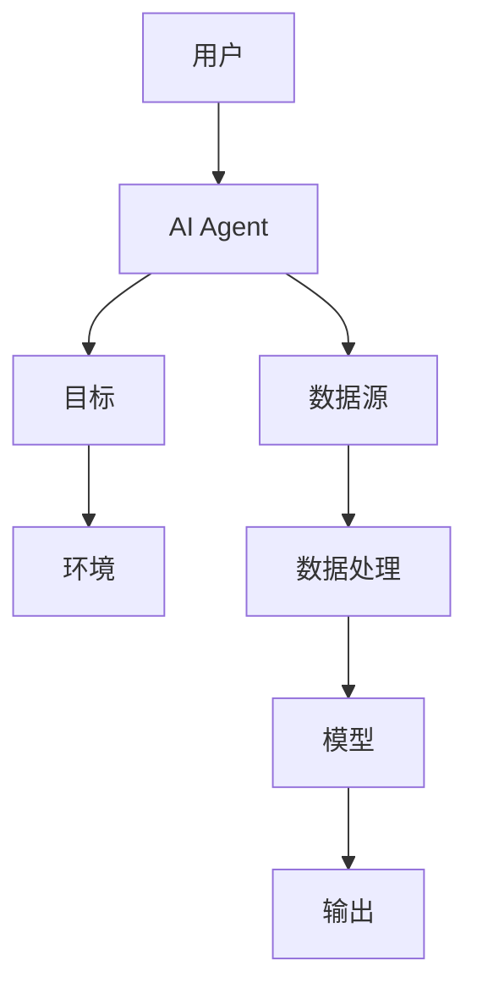
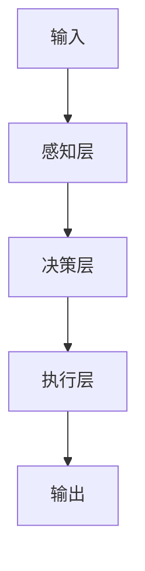
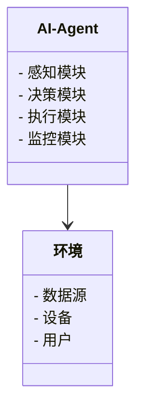
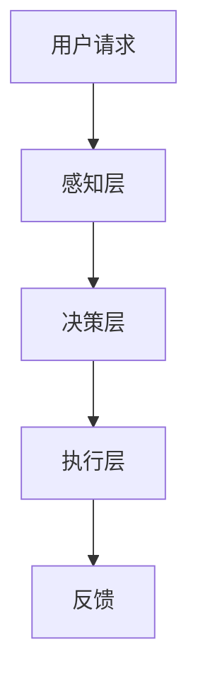
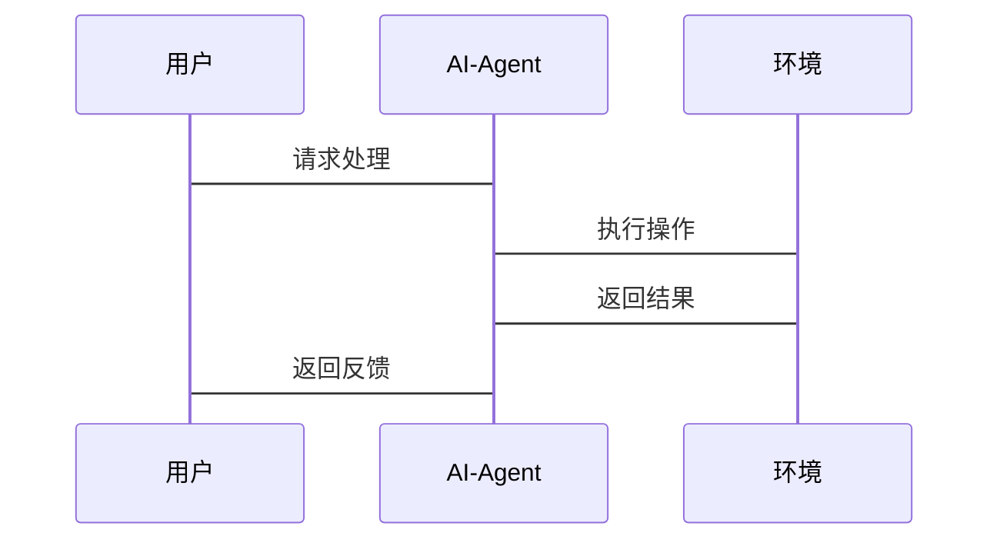

                 


# 规模化部署：将AI Agent推广到生产环境

> 关键词：AI Agent、规模化部署、生产环境、系统架构、算法原理、数学模型

> 摘要：本文深入探讨了将AI Agent推广到生产环境的规模化部署问题，从AI Agent的核心概念、算法原理、系统架构到实际项目部署，详细阐述了如何将AI Agent从实验室环境成功迁移到企业级生产环境。文章首先介绍了AI Agent的定义和应用背景，然后分析了AI Agent的核心概念与原理，详细讲解了AI Agent的算法原理和数学模型，接着从系统架构设计的角度，探讨了如何构建可扩展的AI Agent系统，最后通过实际项目部署案例，展示了如何将AI Agent推广到生产环境。本文内容详实，逻辑清晰，为企业级AI Agent的部署提供了理论依据和实践指导。

---

# 第一部分: AI Agent规模化部署的背景与概念

## 第1章: AI Agent概述

### 1.1 AI Agent的定义与核心概念

#### 1.1.1 AI Agent的定义
AI Agent（人工智能代理）是指能够感知环境、自主决策并执行任务的智能实体。它通过与环境的交互，实现特定目标。

#### 1.1.2 AI Agent的核心概念
- **感知层**：通过传感器或数据输入获取环境信息。
- **决策层**：基于感知信息进行推理和决策。
- **执行层**：根据决策执行具体操作。
- **监控与反馈层**：实时监控执行结果并进行反馈。

#### 1.1.3 AI Agent的分类与特点
- 分类：基于任务类型（如分类、预测、控制）和应用场景（如智能家居、自动驾驶、工业自动化）。
- 特点：智能性、自主性、适应性、可扩展性。

#### 1.1.4 AI Agent的边界与外延
AI Agent的边界包括感知、决策、执行和反馈，外延则涉及数据源、环境和用户。

### 1.2 AI Agent在生产环境中的应用背景

#### 1.2.1 企业级AI应用的需求
企业级AI应用需要高可用性、高扩展性和高可靠性。

#### 1.2.2 生产环境的特点与挑战
- 高可用性：系统必须24/7运行。
- 高扩展性：支持大量用户和请求。
- 高可靠性：确保数据安全和系统稳定性。
- 高性能：实时处理复杂任务。

#### 1.2.3 AI Agent在生产环境中的价值
- 提高效率：自动化处理复杂任务。
- 提升决策能力：基于实时数据进行优化决策。
- 实现智能化：通过AI技术实现自主优化。

#### 1.2.4 AI Agent规模化部署的必要性
- 企业数字化转型需求：AI Agent是实现智能化转型的核心技术。
- 市场竞争压力：快速部署AI Agent以保持竞争优势。
- 技术进步推动：AI技术的快速发展为规模化部署提供了技术基础。

### 1.3 本章小结

---

# 第二部分: AI Agent的核心概念与原理

## 第2章: AI Agent的核心概念与联系

### 2.1 AI Agent的核心概念原理

#### 2.1.1 感知层
AI Agent通过传感器或数据接口感知环境信息，如图像、语音、文本等。

#### 2.1.2 决策层
AI Agent基于感知信息进行推理和决策，可能使用机器学习模型或规则引擎。

#### 2.1.3 执行层
AI Agent根据决策结果执行具体操作，如发送指令、控制设备等。

#### 2.1.4 监控与反馈层
AI Agent实时监控执行结果，并根据反馈调整决策策略。

### 2.2 核心概念属性特征对比

| 概念 | 属性 | 特征 |
|------|------|------|
| 感知层 | 数据源 | 图像、语音、文本 |
| 决策层 | 算法 | 机器学习、规则引擎 |
| 执行层 | 接口 | API、设备控制 |
| 监控与反馈层 | 反馈机制 | 实时监控、日志记录 |

### 2.3 ER实体关系图架构



### 2.4 本章小结

---

# 第三部分: AI Agent的算法原理与数学模型

## 第3章: AI Agent的算法原理

### 3.1 AI Agent的算法概述

#### 3.1.1 机器学习算法
- 监督学习：基于标记数据进行训练，如线性回归、支持向量机。
- 无监督学习：基于无标记数据进行聚类，如K-means、层次聚类。
- 强化学习：通过与环境交互学习策略，如Q-learning、Deep Q-Network。

#### 3.1.2 自然语言处理算法
- 分词、句法分析、情感分析等任务。

#### 3.1.3 强化学习算法
- Q-learning、Deep Q-Network（DQN）。

#### 3.1.4 联合概率模型
- 贝叶斯网络、马尔可夫链。

### 3.2 算法原理的数学模型

#### 3.2.1 机器学习模型
$$f(x) = w \cdot x + b$$

#### 3.2.2 自然语言处理模型
$$P(w_1, w_2, ..., w_n) = \prod_{i=1}^{n} P(w_i | w_{i-1})$$

#### 3.2.3 强化学习模型
$$Q(s, a) = r + \gamma \max_{a'} Q(s', a')$$

#### 3.2.4 联合概率模型
$$P(X,Y) = P(Y|X)P(X)$$

### 3.3 算法原理的mermaid流程图



### 3.4 本章小结

---

# 第四部分: AI Agent的系统架构与设计

## 第4章: 系统架构设计

### 4.1 系统功能设计

#### 4.1.1 领域模型


#### 4.1.2 功能模块
- 感知模块：数据采集与预处理。
- 决策模块：模型推理与决策。
- 执行模块：指令执行与控制。
- 监控模块：实时监控与反馈。

### 4.2 系统架构设计

#### 4.2.1 分层架构


#### 4.2.2 微服务架构
- 感知服务：负责数据采集。
- 决策服务：负责模型推理。
- 执行服务：负责指令执行。
- 监控服务：负责实时监控。

### 4.3 系统接口设计

#### 4.3.1 API接口
- RESTful API：提供HTTP接口。
- RPC接口：提供远程过程调用。

#### 4.3.2 交互流程


### 4.4 本章小结

---

# 第五部分: AI Agent的项目实战

## 第5章: 项目实战

### 5.1 环境安装与配置

#### 5.1.1 环境需求
- 操作系统：Linux或Windows。
- 依赖库：Python、TensorFlow、PyTorch。
- 开发工具：IDE（如PyCharm）、版本控制系统（如Git）。

#### 5.1.2 安装步骤
```bash
pip install numpy
pip install tensorflow
pip install scikit-learn
```

### 5.2 系统核心实现

#### 5.2.1 感知模块实现
```python
def感知模块():
    # 数据采集
    data =采集数据()
    return 数据预处理(data)
```

#### 5.2.2 决策模块实现
```python
def决策模块():
    model = 加载模型()
    输入数据 = 获取输入()
    预测结果 = model预测(输入数据)
    return 预测结果
```

#### 5.2.3 执行模块实现
```python
def执行模块():
    指令 = 获取指令()
    执行指令()
```

### 5.3 案例分析与详细讲解

#### 5.3.1 案例介绍
- 项目名称：智能家居AI Agent。
- 项目目标：实现家庭设备的智能控制。

#### 5.3.2 实际应用
- 数据采集：温度、湿度、光照强度。
- 模型推理：基于当前环境数据，决策是否开启空调。
- 指令执行：向智能设备发送开启空调的指令。

### 5.4 本章小结

---

# 第六部分: AI Agent的总结与展望

## 第6章: 总结与展望

### 6.1 本章总结

### 6.2 注意事项

#### 6.2.1 系统稳定性
- 确保系统在高负载下的稳定性。

#### 6.2.2 数据安全
- 确保数据在传输和存储过程中的安全性。

#### 6.2.3 系统扩展性
- 设计时考虑未来的扩展性。

### 6.3 拓展阅读

#### 6.3.1 相关书籍
- 《机器学习实战》
- 《深入理解深度学习》

#### 6.3.2 相关技术博客
- Medium上的AI技术博客
- GitHub上的AI开源项目

### 6.4 本章小结

---

# 附录: AI Agent部署工具与框架

## 附录A: 常用AI框架

- TensorFlow
- PyTorch
- MXNet
- Scikit-learn

## 附录B: 云部署工具

- AWS Sagemaker
- Azure Machine Learning
- Google Cloud AI

## 附录C: 监控工具

- Prometheus
- Grafana
- ELK（Elasticsearch, Logstash, Kibana）

## 附录D: 开发工具

- VS Code
- PyCharm
- IntelliJ IDEA

## 附录E: 本附录小结

---

# 结束语

本文从AI Agent的核心概念、算法原理、系统架构到实际项目部署，全面探讨了将AI Agent推广到生产环境的规模化部署问题。希望本文能为读者提供有价值的理论依据和实践指导，帮助企业级AI Agent的部署提供参考。未来，随着AI技术的不断发展，AI Agent的部署和应用将更加广泛和深入。

